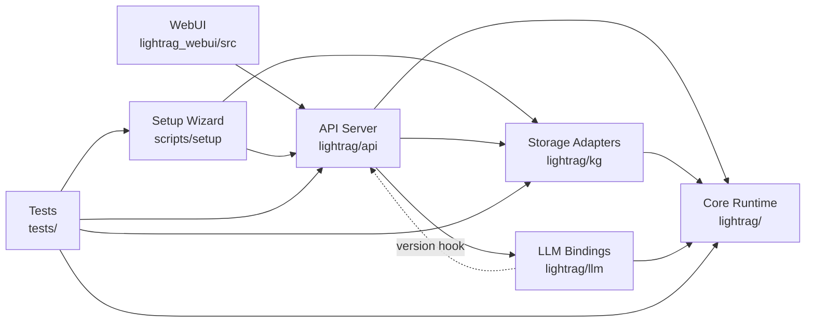
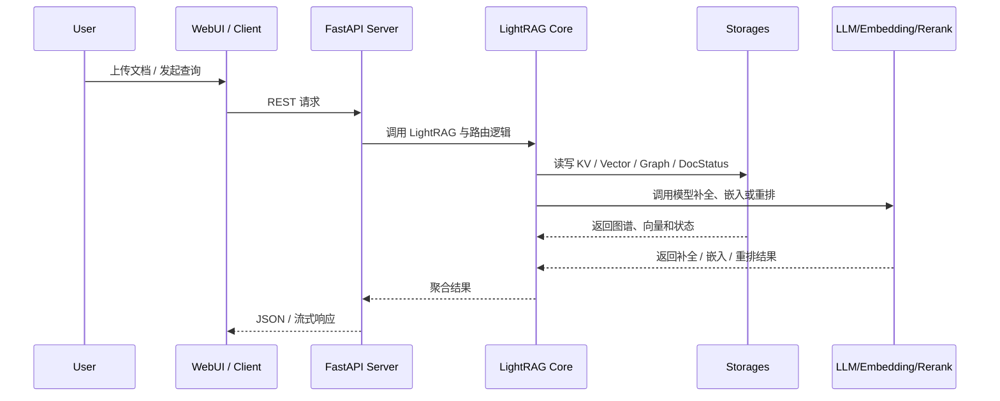

> generated_by: nexus-mapper v2
> verified_at: 2026-03-24
> provenance: Mixed evidence. AST-backed for Python/TypeScript imports and hub analysis; setup-wizard relations are inferred from `Makefile`, API README, file tree, and Git coupling because Bash only has module-level coverage.

# 系统依赖

## 高层依赖图

## 典型运行时序

## 关键证据

- `lightrag/api/lightrag_server.py` 影响半径显示其直接依赖：
  - `lightrag`
  - `lightrag.api.auth`
  - `lightrag.api.config`
  - `lightrag.api.routers.*`
  - `lightrag.api.utils_api`
  - `lightrag.kg.shared_storage`
  - `lightrag.llm.*`
  - `lightrag.rerank`
  - `lightrag.utils`
- `lightrag/lightrag.py` 直接依赖：
  - `lightrag.base`
  - `lightrag.constants`
  - `lightrag.kg.*`
  - `lightrag.namespace`
  - `lightrag.operate`
  - `lightrag.utils`
- `lightrag/api/run_with_gunicorn.py` 下游依赖 `lightrag/api/lightrag_server.py`，说明 Gunicorn 模式是服务启动包装层，而不是另一套独立 API。
- `lightrag/kg/__init__.py` 明确把 `NebulaGraphStorage` 注册进 graph storage 实现映射。
- `tests/test_nebula_graph_storage.py` 直接导入 `lightrag.kg.nebula_impl`，说明 Nebula 支持已进入受测范围。

## 层次判断

- 可以确信：
  - API 层依赖核心运行时、模型绑定和共享存储。
  - WebUI 通过 HTTP 依赖 API 暴露的文档、图谱、检索与状态接口。
  - 存储适配层通过核心抽象和命名空间接入运行时。
  - Gunicorn 启动面复用同一 API 应用工厂，而不是复制一套服务逻辑。
- 需要牢记的例外：
  - `lightrag/llm/openai.py`、`anthropic.py`、`ollama.py` 导入 `lightrag.api.__api_version__`。
  - 这意味着“LLM 绑定层完全独立于 API 层”的假设不成立。
- inferred from file tree/manual inspection：
  - `scripts/setup/` 与其他系统的关系主要通过 `.env`、`docker-compose.final.yml`、`LIGHTRAG_RUNTIME_TARGET` 和 `make env-*` 流程表达，而不是通过 Python import。

## 修改建议

- 改 `lightrag/api/lightrag_server.py` 前，先跑 `query_graph.py --impact lightrag/api/lightrag_server.py`，因为它同时连接路由、模型绑定、共享存储和应用启动。
- 改 `lightrag/lightrag.py` 前，至少同时检查 `tests/test_doc_status_chunk_preservation.py` 及所触达的存储实现。
- 改 `lightrag/kg/nebula_impl.py` 前，必须同步看 `tests/test_nebula_graph_storage.py`。
- 改 `scripts/setup/setup.sh` 前，不要只看脚本本体；需要连看 `Makefile`、`docs/InteractiveSetup.md` 与 `tests/test_interactive_setup_outputs.py`。
