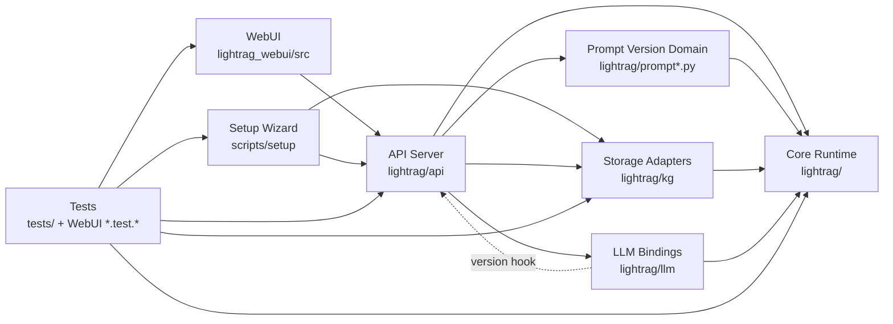
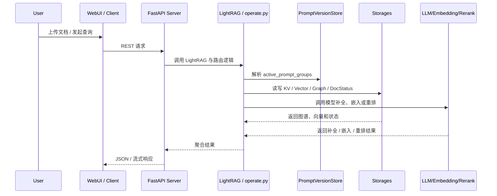
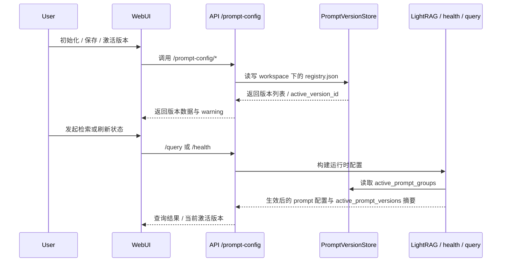

> generated_by: nexus-mapper v2
> verified_at: 2026-03-25
> provenance: AST-backed for Python/JavaScript/TypeScript/TSX/Bash; Bash files have module-only coverage, and WebUI internal import relations under `@/...` are supplemented by manual reading because current raw import edges treat those aliases as external.

# 系统依赖

## 高层依赖图

## 典型运行时序

## Prompt Version 管理时序

## 关键证据

- `lightrag/api/lightrag_server.py` 的影响半径现在明确包含 `lightrag.api.routers.prompt_config_routes`，说明 prompt 版本管理已经接入服务主入口。
- `lightrag/prompt_version_store.py` 的下游依赖目前是 `lightrag.lightrag`、`tests/test_prompt_config_routes.py`、`tests/test_prompt_version_store.py`；这说明它是核心运行时的直接依赖，而不是纯 API 辅助脚本。
- `lightrag/operate.py` 会先合并激活 retrieval 版本，再合并单次请求 `prompt_overrides`；因此“激活版本 > 默认模板，但 < request override”是当前真实生效顺序。
- `App.tsx`、`SiteHeader.tsx`、`PromptManagement.tsx`、`RetrievalTesting.tsx` 共同证明 prompt versioning 已经是可见的 WebUI 一级工作流，而不只是隐藏 API。

## 层次判断

- 可以确信：
  - API 层依赖核心运行时、prompt 版本域、模型绑定和共享存储。
  - 核心运行时现在承担 prompt 版本的读取与生效语义。
  - WebUI 通过 HTTP 依赖 API 暴露的文档、图谱、检索、状态以及 `/prompt-config/*` 接口。
  - Gunicorn 启动面仍然复用同一 API 应用工厂，而不是另一套服务实现。
- 需要牢记的例外：
  - `lightrag/llm/openai.py`、`anthropic.py`、`ollama.py` 仍导入 `lightrag.api.__api_version__`。
  - TS / TSX 中的 `@/` 别名导入不会被当前 `query_graph.py` 解析为内部边，所以前端内部依赖仍要用人工阅读兜底。
- inferred from file tree/manual inspection：
  - `scripts/setup/` 与其他系统的关系主要通过 `.env`、`docker-compose.final.yml`、`LIGHTRAG_RUNTIME_TARGET` 和 `make env-*` 流程表达，而不是通过 Python import。
  - `PromptManagement` 页面与检索页临时版本选择的组合关系主要来自 `App.tsx`、`SiteHeader.tsx`、`RetrievalTesting.tsx` 和相关组件的直接阅读。

## 修改建议

- 改 `lightrag/api/lightrag_server.py` 前，先跑 `query_graph.py --impact lightrag/api/lightrag_server.py`，因为它同时连接路由、模型绑定、共享存储、健康摘要和 prompt 版本接口。
- 改 prompt 版本化核心文件前，至少连看：`lightrag/prompt.py`、`lightrag/prompt_versions.py`、`lightrag/prompt_version_store.py`、`lightrag/lightrag.py`、`lightrag/operate.py`。
- 改 prompt 版本 API 前，至少同步检查：`tests/test_prompt_config_routes.py`、`tests/test_query_prompt_overrides_api.py`、`lightrag/api/README.md`、`lightrag/api/README-zh.md`。
- 改 WebUI prompt 管理或 retrieval 版本选择前，至少同步检查：`lightrag_webui/src/features/PromptManagement.tsx`、`lightrag_webui/src/components/prompt-management/`、`lightrag_webui/src/features/RetrievalTesting.tsx`、`lightrag_webui/src/stores/settings.ts` 及相关 Vitest 文件。
- 改 `scripts/setup/setup.sh` 前，不要只看脚本本体；需要连看 `Makefile`、`docs/InteractiveSetup.md` 与 `tests/test_interactive_setup_outputs.py`。
