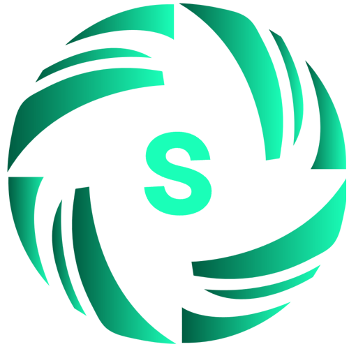

<div align="center">

<div style="margin: 20px 0;">
  
</div>

# 🚀 LightRAG: Retrieval-Augmented Generation yang Sederhana dan Cepat

<div align="center">
    <a href="https://trendshift.io/repositories/13043" target="_blank"></a>
</div>
<p>
</p>
<div align="center">
  <div style="width: 100%; height: 2px; margin: 20px 0; background: linear-gradient(90deg, transparent, #00d9ff, transparent);"></div>
</div>

<div align="center">
  <div style="background: linear-gradient(135deg, #667eea 0%, #764ba2 100%); border-radius: 15px; padding: 25px; text-align: center;">
    <p>
      <a href='https://github.com/HKUDS/LightRAG'></a>
      <a href='https://arxiv.org/abs/2410.05779'></a>
      <a href="https://github.com/HKUDS/LightRAG/stargazers"></a>
    </p>
    <p>
      
      <a href="https://pypi.org/project/lightrag-hku/"></a>
    </p>
    <p>
      <a href="https://discord.gg/yF2MmDJyGJ"></a>
      <a href="https://github.com/HKUDS/LightRAG/issues/285"></a>
    </p>
    <p>
      <a href="README-zh.md"></a>
      <a href="README.md"></a>
      <a href="README-ja.md"></a>
      <a href="README-id.md"></a>
    </p>
    <p>
      <a href="https://pepy.tech/projects/lightrag-hku"></a>
      <a href="https://hvtracker.net/agents/lightrag/"></a>
    </p>
  </div>
</div>

</div>

<div align="center" style="margin: 30px 0;">
  
</div>

<div align="center" style="margin: 30px 0;">
    
</div>

---

<div align="center">
  <table>
    <tr>
      <td style="vertical-align: middle;">
        
      </td>
      <td style="vertical-align: middle; padding-left: 12px;">
        <a href="https://litewrite.ai">
          
        </a>
      </td>
    </tr>
  </table>
</div>

---

## 🎉 Berita
- [2026.07]🎯[Fitur Baru]: Menambahkan fitur pengenalan **Smart Heading** untuk dokumen Word.
- [2026.05]🎯[Fitur Baru]: **Menggabungkan RagAnything ke dalam LightRAG**🎉. Parsing dan ekstraksi konten multimodal melalui layanan **MinerU / Docling**.
- [2026.05]🎯[Fitur Baru]: Memperkenalkan empat strategi text chunking yang dapat dipilih: `Fix`, `Recursive`, `Vector`, dan `Paragraph`.
- [2026.05]🎯[Fitur Baru]: Dukungan **konfigurasi LLM khusus per role**, dengan 4 role berbeda: EXTRACT, QUERY, KEYWORDS, dan VLM, masing-masing dengan pengaturan LLM independen.
- [2026.03]🎯[Fitur Baru]: Mengintegrasikan **OpenSearch** sebagai unified storage backend, dengan dukungan lengkap untuk keempat jenis storage LightRAG.
- [2026.03]🎯[Fitur Baru]: Memperkenalkan setup wizard. Mendukung deployment lokal untuk embedding, reranking, dan storage backend melalui Docker.
- [2025.11]🎯[Fitur Baru]: Mengintegrasikan **RAGAS untuk Evaluasi** dan **Langfuse untuk Tracing**. API diperbarui agar mengembalikan context hasil retrieval bersama hasil query untuk mendukung metrik context precision.
- [2025.10]🎯[Peningkatan Skalabilitas]: Menghilangkan bottleneck pemrosesan agar dapat mendukung **Dataset Berskala Besar secara Efisien**.
- [2025.09]🎯[Fitur Baru] Meningkatkan akurasi ekstraksi knowledge graph untuk **LLM Open Source** seperti Qwen3-30B-A3B.
- [2025.08]🎯[Fitur Baru] **Reranker** kini didukung, meningkatkan performa mixed query secara signifikan (ditetapkan sebagai mode query default).
- [2025.08]🎯[Fitur Baru] Menambahkan **Penghapusan Dokumen** dengan regenerasi KG otomatis untuk menjaga performa query tetap optimal.
- [2025.06]🎯[Rilis Baru] Tim kami merilis [RAG-Anything](https://github.com/HKUDS/RAG-Anything) — sistem **All-in-One Multimodal RAG** untuk memproses teks, gambar, tabel, dan persamaan secara mulus.
- [2025.06]🎯[Fitur Baru] LightRAG kini mendukung pengelolaan data multimodal secara menyeluruh melalui integrasi [RAG-Anything](https://github.com/HKUDS/RAG-Anything), memungkinkan parsing dokumen dan kemampuan RAG secara mulus pada beragam format termasuk PDF, gambar, dokumen Office, tabel, dan formula. Lihat [bagian multimodal](#peningkatan-kemampuan-multimodal) yang baru untuk detailnya.
- [2025.03]🎯[Fitur Baru] LightRAG kini mendukung fitur sitasi, sehingga atribusi sumber dapat dilakukan dengan benar dan keterlacakan dokumen menjadi lebih baik.
- [2025.02]🎯[Fitur Baru] Anda kini dapat menggunakan MongoDB sebagai solusi all-in-one storage untuk manajemen data terpadu.
- [2025.02]🎯[Rilis Baru] Tim kami merilis [VideoRAG](https://github.com/HKUDS/VideoRAG)-sistem RAG untuk memahami video dengan konteks yang sangat panjang
- [2025.01]🎯[Rilis Baru] Tim kami merilis [MiniRAG](https://github.com/HKUDS/MiniRAG), yang menyederhanakan RAG dengan model kecil.
- [2025.01]🎯Anda kini dapat menggunakan PostgreSQL sebagai solusi all-in-one storage untuk manajemen data.
- [2024.11]🎯[Sumber Baru] Panduan lengkap LightRAG kini tersedia di [LearnOpenCV](https://learnopencv.com/lightrag). — jelajahi tutorial mendalam dan best practice. Terima kasih banyak kepada penulis blog atas kontribusi yang sangat baik ini!
- [2024.11]🎯[Fitur Baru] Memperkenalkan LightRAG WebUI — antarmuka yang memungkinkan Anda memasukkan, melakukan query, dan memvisualisasikan pengetahuan LightRAG melalui dashboard berbasis web yang intuitif.
- [2024.11]🎯[Fitur Baru] Anda kini dapat [menggunakan Neo4J untuk Storage](https://github.com/HKUDS/LightRAG?tab=readme-ov-file#using-neo4j-for-storage)-sehingga mendukung graph database.
- [2024.10]🎯[Fitur Baru] Kami menambahkan tautan ke [Video Pengenalan LightRAG](https://youtu.be/oageL-1I0GE). — panduan singkat mengenai kemampuan LightRAG. Terima kasih kepada pembuatnya atas kontribusi yang sangat baik ini!
- [2024.10]🎯[Channel Baru] Kami telah membuat [channel Discord](https://discord.gg/yF2MmDJyGJ)!💬 Bergabunglah dengan komunitas kami untuk berbagi, berdiskusi, dan berkolaborasi! 🎉🎉

<details>
  <summary style="font-size: 1.4em; font-weight: bold; cursor: pointer; display: list-item;">
    Flowchart Algoritma
  </summary>


*Gambar 1: Flowchart Indexing LightRAG - Caption Gambar : [Sumber](https://learnopencv.com/lightrag/)*

*Gambar 2: Flowchart Retrieval dan Query LightRAG - Caption Gambar : [Sumber](https://learnopencv.com/lightrag/)*

</details>

## Instalasi

**💡 Menggunakan uv untuk Manajemen Package**: Proyek ini menggunakan [uv](https://docs.astral.sh/uv/) untuk manajemen package Python yang cepat dan andal. Instal uv terlebih dahulu: `curl -LsSf https://astral.sh/uv/install.sh | sh` (Unix/macOS) atau `powershell -c "irm https://astral.sh/uv/install.ps1 | iex"` (Windows)

> **Catatan**: Anda juga dapat menggunakan pip jika lebih nyaman, tetapi uv direkomendasikan untuk performa yang lebih baik dan manajemen dependency yang lebih andal.
>
> **📦 Deployment Offline**: Untuk environment offline atau air-gapped, lihat [Panduan Deployment Offline](./docs/OfflineDeployment.md) untuk petunjuk menginstal semua dependency dan file cache sebelumnya.

### Instal LightRAG Server

* Instal dari PyPI

```bash
### Install LightRAG Server as tool using uv (recommended)
uv tool install "lightrag-hku[api]"

### Or using pip
# python -m venv .venv
# source .venv/bin/activate  # Windows: .venv\Scripts\activate
# pip install "lightrag-hku[api]"

# Setup env file
# Obtain the env.example file by downloading it from the GitHub repository root
# or by copying it from a local source checkout.
cp env.example .env  # Update the .env with your LLM and embedding configurations
# Launch the server. It binds to all interfaces (0.0.0.0) by default.
# SECURITY: before exposing it on a network, configure authentication in .env
# (LIGHTRAG_API_KEY, or AUTH_ACCOUNTS together with TOKEN_SECRET), or bind to
# 127.0.0.1 for local-only access; without auth every endpoint is public.
# Note: the Ollama-compatible /api/* routes stay open by default for client
# compatibility; set WHITELIST_PATHS=/health to require auth on them too.
lightrag-server
```

* Instalasi dari Source

```bash
git clone https://github.com/HKUDS/LightRAG.git
cd LightRAG

# Bootstrap the development environment (recommended)
make dev
source .venv/bin/activate  # Activate the virtual environment (Linux/macOS)
# Or on Windows: .venv\Scripts\activate

# make dev installs the test toolchain plus the full offline stack
# (API, storage backends, and provider integrations), then builds the frontend.
# Run make env-base or copy env.example to .env before starting the server.

# Equivalent manual steps with uv
# Note: uv sync automatically creates a virtual environment in .venv/
uv sync --extra test --extra offline
source .venv/bin/activate  # Activate the virtual environment (Linux/macOS)
# Or on Windows: .venv\Scripts\activate

### Or using pip with virtual environment
# python -m venv .venv
# source .venv/bin/activate  # Windows: .venv\Scripts\activate
# pip install -e ".[test,offline]"

# Build front-end artifacts
cd lightrag_webui
bun install --frozen-lockfile
bun run build
cd ..

# setup env file
make env-base  # Or: cp env.example .env and update it manually
# Launch API-WebUI server
lightrag-server
```

* Menjalankan LightRAG Server dengan Docker Compose

```bash
git clone https://github.com/HKUDS/LightRAG.git
cd LightRAG
cp env.example .env  # Update the .env with your LLM and embedding configurations
# modify LLM and Embedding settings in .env
docker compose up
```

> Versi historis image Docker LightRAG dapat ditemukan di sini: [LightRAG Docker Images]( https://github.com/HKUDS/LightRAG/pkgs/container/lightrag)
>
> Image GHCR resmi yang dipublikasikan melalui GitHub Actions ditandatangani menggunakan Sigstore Cosign dengan GitHub OIDC. Lihat [docs/DockerDeployment.md](./docs/DockerDeployment.md#verify-official-ghcr-images-with-cosign) untuk perintah verifikasi.
>
> Pada Apple Silicon (macOS 26) tanpa Docker Desktop, Anda dapat menjalankan stack storage Postgres/Neo4j/Milvus yang sama pada runtime `container` native Apple — lihat [docs/AppleContainerSetup.md](./docs/AppleContainerSetup.md).

### Membuat File .env dengan Setup Tool

Alih-alih mengedit `env.example` secara manual, gunakan setup wizard interaktif untuk menghasilkan `.env` yang telah dikonfigurasi dan, jika diperlukan, `docker-compose.final.yml`:

```bash
make env-base           # Required first step: LLM, embedding, reranker
make env-storage        # Optional: storage backends and database services
make env-server         # Optional: server port, auth, and SSL
make env-base-rewrite   # Optional: force-regenerate wizard-managed compose services
make env-storage-rewrite # Optional: force-regenerate wizard-managed compose services
make env-security-check # Optional: audit the current .env for security risks
```

Untuk deskripsi lengkap setiap target, lihat [docs/InteractiveSetup.md](./docs/InteractiveSetup.md).

### Opsional: Model spaCy untuk docx smart_heading

Parameter engine `smart_heading` yang bersifat opt-in pada native docx parser menggunakan spaCy untuk heuristik kalimat/NER. Runtime spaCy sudah disertakan dalam extra `api` — hanya dua language model yang dipin (`zh_core_web_sm` / `en_core_web_sm` 3.8.0, wheel rilis GitHub yang tidak dipublikasikan di PyPI) yang memerlukan satu langkah tambahan:

```bash
lightrag-download-cache --spacy-install
```

Aktifkan smart_heading per file/rule (misalnya `LIGHTRAG_PARSER=docx:native(smart_heading=true)`), atau secara global di `.env`:

```bash
# .docx files routed to the native engine get smart_heading by default;
# opt a file back out with an explicit native(smart_heading=false) rule/hint.
DOCX_SMART_HEADING=true
```

Saat switch global aktif (atau rule `LIGHTRAG_PARSER` memuat `native(smart_heading=true)`), server akan memverifikasi model pada startup dan fail fast dengan panduan instalasi jika model belum tersedia. Deployment yang tidak pernah mengaktifkan smart_heading tidak memerlukan model tersebut. Image Docker utama sudah menyertakan model-model ini (image lite tidak); untuk host air-gapped, lihat [Panduan Deployment Offline](./docs/OfflineDeployment.md).

### Opsional: libcairo untuk SVG Rasterization (native md/textpack)

Native markdown/textpack parser merasterisasi gambar SVG tersemat menjadi PNG melalui `cairosvg`. `cairosvg` adalah binding cffi: `pip install cairosvg` (ditarik oleh extra `api`) selalu berhasil, tetapi rendering hanya berfungsi jika shared library native `libcairo` *juga* tersedia pada host — `pip`/`uv` tidak dapat menginstal system library. Tanpanya, rasterization akan gagal saat runtime dan SVG yang terdampak dilewati (bagian dokumen lainnya tidak terpengaruh); server mencatat warning saat startup agar kekurangan ini terlihat sebelum muncul sebagai warning per dokumen di kemudian hari.

Instal system package untuk platform Anda:

```bash
# Debian / Ubuntu (the official Docker image already includes this)
sudo apt-get install -y libcairo2

# RHEL / Fedora
sudo dnf install -y cairo

# macOS (Homebrew)
brew install cairo

# Windows: install the GTK3 runtime, which bundles libcairo-2.dll
```

Deployment yang tidak pernah memproses dokumen markdown/textpack dengan SVG tersemat dapat mengabaikan warning saat startup.

## Tentang LightRAG

### Framework RAG Berbasis Graph yang Ringan

LightRAG adalah framework knowledge-graph RAG yang ringan dan merupakan alternatif efisien untuk Microsoft GraphRAG. LightRAG menggunakan arsitektur dua lapis untuk mengelola knowledge graph (KG) dan vector embedding, sehingga menjembatani kesenjangan antara pendekatan RAG tradisional berbasis vector dan RAG berbasis graph. Dirancang untuk skalabilitas tinggi, LightRAG mengatasi tantangan utama dalam indexing dan retrieval graph berskala besar, termasuk computational overhead yang berat, waktu respons yang lambat, dan tingginya biaya incremental update. Sambil mendukung dataset besar, LightRAG tetap dapat memberikan kualitas RAG yang sangat tinggi, bahkan ketika dipasangkan dengan large language model (LLM) open source 30B.

### Fitur & Keunggulan

- **Pemahaman Kontekstual yang Mendalam:** Melalui indexing berstruktur graph, LightRAG menangkap ketergantungan semantik kompleks antarentitas, mengatasi keterbatasan context terfragmentasi yang umum pada metode retrieval tradisional berbasis chunk. Kualitas generation dan context awareness-nya sangat menonjol khususnya pada domain vertikal (misalnya hukum dan keuangan) yang membutuhkan pemahaman global atau logical reasoning.
- **Kelengkapan & Keragaman yang Luar Biasa:** Mekanisme retrieval dua tingkat LightRAG memungkinkannya mengintegrasikan fakta terperinci dan konsep abstrak secara bersamaan. Hal ini memungkinkan sistem mencapai performa yang sangat baik dalam kelengkapan dan keragaman hasil query, sehingga efektif untuk menangani query kompleks lintas dokumen.
- **Efisiensi Retrieval Ekstrem & Biaya Rendah:** LightRAG tidak bergantung pada community report yang tidak efisien atau multi-hop reasoning untuk query kompleks. Ini secara drastis mengurangi jumlah panggilan LLM yang diperlukan pada fase indexing maupun querying, sehingga menurunkan response latency dan biaya komputasi LLM secara signifikan.
- **Incremental Update & Selective Deletion:** LightRAG mengatasi tantangan dalam memperbarui dan menghapus konten secara selektif pada knowledge base berbasis graph, sehingga knowledge base tetap mutakhir dalam environment data yang dinamis. Ketika sebuah dokumen dihapus, sistem dapat menggunakan LLM cache yang dibuat saat indexing untuk dengan cepat membangun ulang entity dan relationship yang terdampak, sehingga efisiensi update meningkat secara signifikan.
- **Beragam Engine Parsing Dokumen:** Pipeline pemrosesan dokumen LightRAG mendukung MinerU, Docling, dan Native serta dapat diperluas dengan parser pihak ketiga. Engine Native LightRAG secara efisien mem-parsing gambar, tabel, dan formula pada dokumen Word dan Markdown, sehingga sangat cocok untuk dokumen yang kaya konten multimodal. Engine Native juga otomatis mendeteksi dan mengoreksi section heading pada dokumen Word, meningkatkan ekstraksi konten dari dokumen dengan outline yang tidak konsisten dan menjadi fondasi untuk text chunking yang memahami struktur bagian.
- **Beragam Strategi Text Chunking:** LightRAG mendukung empat strategi text chunking: `Fixed-length (F)`, `Recursive character (R)`, `Vector semantic (V)`, dan `Paragraph semantic (P)`. Strategi native LightRAG `Paragraph semantic (P)` **menyelaraskan batas chunk dengan batas semantik native dokumen**—heading, paragraf, dan tabel—sedekat mungkin. Hal ini mengurangi masalah seperti heading yang tidak cocok dengan konten atau hilangnya header row ketika tabel panjang dipecah.
- **Beragam Storage Backend:** KV, vector, dan graph store default LightRAG menggunakan database in-memory dengan persistensi file lokal, sehingga cocok untuk mengevaluasi proyek dengan cepat. LightRAG juga mendukung beragam storage backend yang umum digunakan untuk deployment production dengan dataset besar.

### Peningkatan Kemampuan Multimodal

Sistem RAG tradisional tidak memiliki cara efektif untuk memproses konten multimodal seperti gambar, formula, dan tabel dalam dokumen. Mulai v1.5, LightRAG mengintegrasikan pemrosesan multimodal secara mulus ke pipeline dokumen dan alur query. Melalui knowledge graph, LightRAG menghubungkan konten multimodal dengan body text dan dapat menggunakan informasi tersebut saat menjawab query untuk menghasilkan respons yang lebih akurat dan andal. Kemampuan ini dapat meningkatkan kualitas RAG secara signifikan pada dokumen yang kaya konten multimodal, seperti manual operasi dan paper akademik.

### LightRAG API Server

LightRAG server tidak hanya menyediakan UI berbasis web untuk mengeksplorasi fungsi LightRAG, tetapi juga REST API yang lengkap. Untuk informasi lebih lanjut mengenai LightRAG server, lihat [LightRAG Server](./docs/LightRAG-API-Server.md).


## Panduan Konfigurasi Utama

### Memilih Model LLM

LightRAG membutuhkan LLM/VLM dengan empat role berbeda selama workflow-nya. Anda sebaiknya mengonfigurasi model dengan kemampuan dan kecepatan berbeda untuk setiap role agar mendapatkan keseimbangan antara performa dan kecepatan pemrosesan. LightRAG memiliki kebutuhan kemampuan Large Language Model (LLM) yang lebih tinggi dibandingkan RAG tradisional karena LLM harus melakukan tugas ekstraksi entity-relation yang kompleks dari dokumen. Pada fase query, LLM perlu memproses volume informasi hasil retrieval yang besar, termasuk entity, relationship, dan text chunk. Hal ini mengharuskan model mampu menghasilkan respons berkualitas tinggi dalam context yang panjang dan noisy.

**Model yang direkomendasikan berdasarkan role:**

- **Extraction LLM (`EXTRACT`)**: Ekstraksi entity-relation dijalankan pada setiap text chunk, sehingga model mainstream yang cepat dan hemat biaya sudah cukup — model **non-thinking** (mode reasoning/thinking dinonaktifkan) sangat direkomendasikan untuk menghindari proses ekstraksi yang lambat dan mahal. Opsi hosted yang baik antara lain GPT-5.6-luna, Claude Haiku, atau Gemini-mini secara internasional, serta DeepSeek-V4-lite atau Kimi di China. Untuk deployment lokal, Qwen3-30B-A3B-Instruct merupakan minimum yang wajar.
- **Query LLM (`QUERY`)**: Model ini menulis jawaban akhir berdasarkan context hasil retrieval yang panjang dan noisy, sehingga sebaiknya *lebih kuat* daripada model extraction untuk memaksimalkan kualitas jawaban. Pilih model tier lebih tinggi dari keluarga yang sama; model yang mendukung thinking dapat digunakan di sini.
- **Keyword LLM (`KEYWORD`)**: Langkah ringan yang sensitif terhadap latency dan **harus** menggunakan model non-thinking agar query latency tetap rendah; model cepat yang setara dengan model extraction sudah cukup.
- **VLM (`VLM`)**: Model multimodal mainstream apa pun yang mendukung input gambar dapat digunakan. Untuk deployment lokal, pertimbangkan Qwen3.6-35B-A3B.

Dalam batas latency dan biaya yang dapat Anda terima, pilih model dengan skor tertinggi yang tersedia (berdasarkan benchmark/leaderboard publik). Untuk konfigurasi model lebih rinci, lihat [RoleSpecificLLMConfiguration.md](./docs/RoleSpecificLLMConfiguration.md)

### Memilih Mode Query

LightRAG mendukung lima mode query:

- **local**: Berfokus pada pencocokan presisi context lokal dan entity tertentu. Mode ini mengambil candidate entity beserta attribute yang terkait langsung dari knowledge graph. Cocok untuk Q&A yang menargetkan objek tertentu, konsep konkret, atau fakta detail, dengan dukungan context lokal yang sangat relevan dan terperinci.
- **global**: Berfokus pada tema makro, reasoning lintas dokumen, dan relationship mendalam antarentity. Mode ini mengambil chain relationship yang mencakup tema dan konsep luas. Cocok untuk query yang membutuhkan summarization dari beberapa context, trend analysis, atau pemahaman dependency semantik kompleks.
- **hybrid**: Menggabungkan hasil retrieval dari mode local dan global. Mode ini melakukan reasoning dan generation secara menyeluruh dengan secara bersamaan mengambil entity spesifik dan context relationship global.
- **naive**: Retrieval RAG tradisional berbasis text chunk. Mode ini tidak menggunakan knowledge graph dan mengandalkan vector similarity secara langsung untuk retrieval dari text chunk asli.
- **mix**: Mode dengan fitur lengkap yang menggabungkan hasil retrieval dari mode local, global, dan naive untuk memberikan hasil retrieval yang paling menyeluruh dan kaya.

Mode query default LightRAG adalah `mix`. Menggunakan mode `mix` umumnya menghasilkan hasil query yang paling ideal. Mode `mix` sedikit lebih lambat daripada `naive`, sementara mode query lainnya memiliki latency yang kurang lebih setara.

### Model Embedding

Saat memilih model Embedding, perhatikan kemampuan dukungan multilingual-nya. Karena kualitas retrieval LightRAG hanya memiliki ketergantungan terbatas pada model Embedding, disarankan memilih model berdimensi rendah dan cepat. Model embedding mainstream yang mutakhir dapat bekerja dengan baik; untuk deployment lokal, `BAAI/bge-m3` merupakan pilihan yang solid. Kami sangat merekomendasikan deployment model Embedding secara lokal untuk memperoleh performa terbaik.

**Catatan Penting**: Model Embedding harus ditentukan sebelum indexing dokumen, dan model yang sama harus digunakan pada fase query. Setelah dipilih, model embedding umumnya tidak dapat diubah. Jika diubah, Anda perlu melakukan re-embed terhadap seluruh text chunk, entity, dan relationship. LightRAG saat ini tidak menyediakan tool re-embedding. Beberapa storage backend (misalnya PostgreSQL) mengharuskan dimensi vector ditentukan saat membuat tabel untuk pertama kali, sehingga mengganti model Embedding memerlukan penghapusan tabel terkait vector agar LightRAG dapat membuatnya ulang.

### Mengaktifkan Reranking

Mengaktifkan opsi Rerank pada fase query dapat meningkatkan kualitas query secara signifikan. Namun, mengaktifkan Rerank biasanya menambahkan delay sekitar 1–2 detik. Untuk meminimalkan latency, sangat disarankan men-deploy model Rerank secara lokal. Reranker mainstream yang mutakhir dapat digunakan; untuk deployment lokal, `BAAI/bge-reranker-v2-m3` direkomendasikan. Untuk detail konfigurasi, lihat file `env.example`. Berbeda dengan model Embedding, model Rerank dapat diganti kapan saja selama fase query.

### Konfigurasi Pipeline Pemrosesan Dokumen

Konfigurasi pipeline default LightRAG belum memungkinkan sistem bekerja pada performa terbaiknya. Kualitas parsing dokumen sangat memengaruhi indexing dan querying dokumen. Karena itu, kami merekomendasikan konfigurasi pipeline yang mengaktifkan engine parsing MinerU dan fitur image analysis pada pipeline. Konfigurasi yang disarankan:

```
LIGHTRAG_PARSER=*:native-iteP,*:mineru-iteP,*:legacy-R

VLM_PROCESS_ENABLE=true
VLM_LLM_MODEL=<your_vlm_model_name>
```

Karena layanan MinerU berbasis cloud memiliki batasan penggunaan, ukuran file, dan jumlah halaman, disarankan menggunakan MinerU yang di-deploy secara lokal. Untuk detail konfigurasi pipeline pemrosesan file, lihat [FileProcessingPipeline.md](./docs/FileProcessingPipeline.md)

### Optimasi Concurrency untuk Pemrosesan File

Untuk pemrosesan dokumen berskala besar, Anda perlu meningkatkan concurrency. Environment variable utama yang berkaitan dengan pemrosesan file concurrent meliputi:

- **MAX_ASYNC_LLM**: Menentukan concurrency dasar untuk role LLM (`MAX_ASYNC` tetap menjadi alias deprecated). Saat pemrosesan file, nilai ini juga membatasi task ekstraksi entity/relation untuk chunk dalam satu dokumen; setiap fase entity-merge atau relation-merge dapat menjalankan hingga dua kali jumlah task ini.
- **EXTRACT_MAX_ASYNC_LLM**: Secara opsional meng-override batas role Extract untuk request LLM extraction dan merge-summary yang sebenarnya. Jika tidak diatur, nilainya mewarisi `MAX_ASYNC_LLM`; parameter ini tidak mengubah batas task pipeline di atas.
- **MAX_PARALLEL_INSERT**: Mengontrol jumlah maksimum file yang diproses secara paralel, bukan batas task chunk per dokumen atau graph-merge. Idealnya nilai ini sekitar 1/3 dari `MAX_ASYNC_LLM`.
- **MAX_PARALLEL_PARSE_MINERU**: Mengontrol jumlah file paralel yang diproses untuk parsing MinerU.
- **MAX_PARALLEL_PARSE_DOCLING**: Mengontrol jumlah file paralel yang diproses untuk parsing Docling.
- **EMBEDDING_FUNC_MAX_ASYNC**: Mengontrol concurrency maksimum untuk model embedding.
- **EMBEDDING_BATCH_NUM**: Mengontrol jumlah teks yang disertakan dalam setiap request model embedding (berapa banyak embedding per batch). Meningkatkan nilai ini dapat secara signifikan mengurangi jumlah API call ke model embedding dan mempercepat persistensi data pada embedding storage.

```
# Sample Configuration
MAX_ASYNC_LLM=8
MAX_PARALLEL_INSERT=3
EMBEDDING_FUNC_MAX_ASYNC=16
EMBEDDING_BATCH_NUM=32
```

### Memilih Backend Storage

LightRAG membutuhkan empat jenis backend storage:

- **KV_STORAGE**: Digunakan untuk menyimpan cache respons LLM, hasil text chunking, hasil ekstraksi entity-relation, dan sebagainya.
- **VECTOR_STORAGE**: Digunakan untuk menyimpan informasi vector untuk text chunk, entity, dan relationship.
- **GRAPH_STORAGE**: Digunakan untuk menyimpan knowledge graph.
- **DOC_STATUS_STORAGE**: Digunakan untuk menyimpan daftar dokumen.

Secara default, storage backend LightRAG adalah database in-memory yang dipersist ke file. Storage default ini hanya ditujukan untuk development dan debugging, serta tidak cocok untuk production. Pada environment production, jika Anda lebih memilih satu backend untuk menangani keempat jenis storage, Anda dapat memilih PostgreSQL, MongoDB, atau OpenSearch. Sebagai alternatif, Anda dapat memilih database khusus untuk vector atau graph storage, misalnya Milvus atau Qdrant untuk vector storage, serta Neo4j atau Memgraph untuk graph storage.

### Konfigurasi Penting Lainnya untuk Pemrosesan Dokumen

Pada tahap document insertion, Anda juga mungkin perlu menyesuaikan environment variable berikut sesuai kebutuhan:

- **SUMMARY_LANGUAGE**: Mengontrol bahasa yang digunakan LLM saat menghasilkan nama dan ringkasan entity-relation, misalnya `Chinese`, `English`.
- **ENTITY_EXTRACTION_USE_JSON**: Mengontrol apakah LLM menghasilkan ekstraksi entity-relation dalam format JSON. Format JSON biasanya memberikan hasil yang lebih stabil, tetapi menggunakan lebih banyak token dan dapat sedikit lebih lambat.
- **ENABLE_CONTENT_HEADINGS**: Mengontrol apakah informasi section heading dari sebuah text chunk dikirim ke LLM selama tahap query (aktif secara default, sehingga memberikan context lebih banyak kepada LLM).
- **FORCE_LLM_SUMMARY_ON_MERGE / MAX_SOURCE_IDS_PER_RELATION**: Mengontrol jumlah maksimum text chunk yang dapat dikaitkan dengan sebuah `entity/relation`.
- **SOURCE_IDS_LIMIT_METHOD**: Mengontrol apakah deskripsi entity/relation terus diperbarui setelah sebuah `entity/relation` melewati batas text chunk terkait (secara default update dihentikan, karena pada titik itu deskripsi entity-relation sudah cukup kaya dan update lanjutan hanya memberi sedikit nilai tambah; melewati update dapat sangat mempercepat pembangunan knowledge base).
- **MAX_FILE_PATHS**: Mengontrol jumlah maksimum source file yang dapat dikaitkan dengan sebuah `entity/relation`; setelah batas ini terlampaui, nama file baru tidak lagi ditulis ke vector storage.

### Mengatasi Timeout LLM saat Ekstraksi Entity-Relation

Timeout LLM selama ekstraksi entity-relation biasanya berasal dari salah satu dari tiga penyebab. Identifikasi penyebabnya, lalu terapkan solusi yang sesuai (parameter dapat digabungkan):

- **Model berjalan lambat.** Model yang berjalan di bawah ~50 token/detik mungkin tidak dapat menyelesaikan chunk yang berisi banyak entity dan relation sebelum request timeout. Tingkatkan timeout melalui `*_LLM_TIMEOUT` — baik global `LLM_TIMEOUT` maupun `EXTRACT_LLM_TIMEOUT` khusus role untuk fase extraction. Perhatikan bahwa execution timeout efektif adalah **dua kali** nilai yang dikonfigurasi, sehingga `EXTRACT_LLM_TIMEOUT=300` memungkinkan hingga **600 detik**.
- **Chunk menghasilkan terlalu banyak entity dan relation.** Chunk referensi/bibliografi, misalnya, dapat membuat model menghasilkan record dalam jumlah sangat besar yang tidak selesai tepat waktu. Batasi panjang output dengan `OPENAI_LLM_MAX_TOKENS` atau `OPENAI_LLM_MAX_COMPLETION_TOKENS` (nama parameter yang benar bergantung pada provider LLM — lihat `env.example`). Aturan ukuran yang berguna adalah `max_output_tokens < LLM_TIMEOUT × tokens_per_second` (misalnya `9000 < 240s × 50 tps`).
- **Model terjebak dalam output loop.** Beberapa model (terutama model Qwen yang di-deploy secara lokal) terkadang masuk ke endless-output loop pada teks tertentu. Jika terjadi sesekali, cukup proses ulang dokumen satu kali dan masalah biasanya terselesaikan.
- **Khusus referensi (strategi P chunking).** Saat menggunakan strategi paragraph-semantic (`P`) chunking (misalnya `LIGHTRAG_PARSER=...-iteP`), set `CHUNK_P_DROP_REFERENCES=true` untuk otomatis membuang block referensi yang cocok sebelum chunking. Ini mencegah referensi menghasilkan terlalu banyak entity dan relation bernilai rendah, salah satu penyebab umum timeout. Opsi ini juga dapat diaktifkan per file melalui filename hint `paper.[-P(drop_rf=true)].pdf`; parameter detection terkait (`CHUNK_P_REFERENCES_TAIL_N`, `CHUNK_P_REFERENCES_HEADINGS`) didokumentasikan di `env.example`.

### Konfigurasi Penting Lainnya untuk Query Dokumen

Pada tahap query dokumen, Anda juga mungkin perlu menyesuaikan environment variable berikut sesuai kebutuhan:
- **MAX_ENTITY_TOKENS / MAX_RELATION_TOKENS / MAX_TOTAL_TOKENS**: Mengontrol panjang token dari content hasil retrieval yang dikirim ke context LLM. Content hasil retrieval terdiri atas tiga bagian: `entities`, `relations`, dan `text chunks`. Panjang entity dan relation dapat dikontrol secara independen, sedangkan panjang text chunk ditentukan dengan mengurangi panjang entity dan relation dari panjang total.
- **ENABLE_CONTENT_HEADINGS**: Mengontrol apakah section heading tempat sebuah text chunk berada dikirim ke LLM; aktif secara default, sehingga memberi context lebih kaya kepada LLM dan meningkatkan kualitas jawaban.
- **ENABLE_LLM_CACHE**: Menentukan apakah hasil query di-cache. Aktif secara default; pertanyaan query, mode query, dan parameter model LLM yang identik akan mengembalikan hasil yang sama.
- **USER_PROMPT_PREFIX / USER_PROMPT_PREFIX_FILE**: Instruksi global yang ditambahkan di depan setiap `user_prompt` request (bagian "Additional Instructions" pada answer prompt), sehingga operator memiliki satu tempat untuk menyesuaikan output LLM. Nilai ini digabungkan secara verbatim, jadi akhiri nilainya sendiri dengan `\n\n`. Jika `user_prompt` request kosong, prefix itu sendiri menjadi instruksi yang dikirim ke LLM; hanya field API `disable_user_prompt_prefix` yang dapat menonaktifkannya, dan sebuah request tidak pernah dapat membaca atau menggantinya. Gunakan `USER_PROMPT_PREFIX_FILE` (nama file `.md`/`.txt` di bawah `PROMPT_DIR/user_prompt`) untuk teks panjang atau multi-paragraf, karena nilai `.env` harus tetap berada dalam satu baris.

### Entri WebUI dan Entri Bawaan

Server memasang dua entri WebUI dari satu build frontend. **`/webui`** adalah konsol admin: manajemen dokumen, eksplorasi knowledge graph, dan debugging query dengan panel parameter query lengkap. **`/workspace`** adalah entri khusus query untuk pengguna knowledge base sehari-hari: hanya antarmuka chat (tanpa manajemen dokumen, knowledge graph, sidebar parameter query, atau tautan dokumentasi API), dirancang untuk penggunaan mobile, dan menampilkan halaman selamat datang bagi pengunjung yang belum masuk.

- **LIGHTRAG_DEFAULT_UI**: Menentukan entri tujuan redirect root path `/` — `webui` (default) atau `workspace`. Variabel ini mengontrol **tepat satu** perilaku: redirect tersebut. Kedua entri tetap terpasang apa pun nilainya dan tetap dapat diakses melalui URL masing-masing; nilai lain menyebabkan startup gagal. Set ke `workspace` jika pengguna utama deployment adalah pengguna query, bukan administrator.
- **UI_TEMPLATES_DIR**: Menunjuk ke bundle multi-bahasa opsional yang mengganti halaman selamat datang, teks halaman login, tampilan kosong query, logo merek, dan baris hak cipta dengan konten Anda sendiri, tanpa membangun ulang WebUI. Lihat [UserDefinedUI.md](./docs/UserDefinedUI.md).
- **ENABLE_AI_CONTENT_NOTICE**: Memberi label AI-generated pada setiap jawaban yang **dihasilkan LLM** di kedua UI query (`/workspace` dan panel retrieval `/webui`); teks yang tidak ditulis model — jawaban standar saat tidak ada konteks dan output debug panel admin — tidak diberi label. Nonaktif secara default; ini hanya elemen UI dan tidak pernah masuk ke API response atau riwayat chat yang disimpan.

Dua hal yang perlu diketahui sebelum mengarahkan end user ke `/workspace`. Pertama, parameter query di sana **diwarisi, tidak dapat diedit**: setiap query menggunakan pengaturan yang disimpan `/webui` di **browser yang sama** (default frontend jika belum ada yang disimpan), yang merupakan local state per browser, bukan kebijakan server-wide. Kedua, menyembunyikan UI admin adalah pemisahan UX, **bukan** batas keamanan — API tetap melakukan otorisasi untuk setiap endpoint di sisi server. Untuk perilaku lengkap entri query, lihat [LightRAG-API-Server.md](./docs/LightRAG-API-Server.md#the-workspace-query-entry).

## Menggunakan LightRAG sebagai SDK

> ⚠️ **Untuk integrasi ke proyek Anda, kami sangat merekomendasikan menggunakan REST API yang disediakan LightRAG Server.** LightRAG SDK terutama ditujukan untuk aplikasi embedded atau kebutuhan riset akademik dan evaluasi.

### Instal LightRAG SDK

* Instal dari source code

```bash
cd LightRAG
# 注意: uv sync 会自动在 .venv/ 目录创建虚拟环境
uv sync
source .venv/bin/activate  # 激活虚拟环境 (Linux/macOS)
# Windows 系统: .venv\Scripts\activate

# 或: pip install -e .
```

* Instal dari PyPI

```bash
uv pip install lightrag-hku
# 或: pip install lightrag-hku
```

### Contoh Kode LightRAG SDK

Untuk mulai menggunakan core LightRAG, lihat contoh kode yang tersedia di folder `examples`. Selain itu, tersedia demonstrasi [video demo](https://www.youtube.com/watch?v=g21royNJ4fw) yang memandu proses setup lokal. Jika Anda sudah memiliki OpenAI API key, Anda dapat langsung menjalankan demo:

```bash
### you should run the demo code with project folder
cd LightRAG
### provide your API-KEY for OpenAI
export OPENAI_API_KEY="sk-...your_opeai_key..."
### download the demo document of "A Christmas Carol" by Charles Dickens
curl https://raw.githubusercontent.com/gusye1234/nano-graphrag/main/tests/mock_data.txt > ./book.txt
### run the demo code
python examples/lightrag_openai_demo.py
```

Untuk contoh implementasi streaming response, lihat `examples/lightrag_openai_compatible_demo.py`. Sebelum menjalankannya, pastikan Anda menyesuaikan konfigurasi LLM dan embedding pada contoh kode tersebut.

**Catatan 1**: Saat menjalankan program demo, perhatikan bahwa script pengujian yang berbeda dapat menggunakan model embedding yang berbeda. Jika Anda mengganti model embedding, Anda harus menghapus data directory (`./dickens`); jika tidak, program dapat mengalami error. Jika ingin mempertahankan LLM cache, Anda dapat menyimpan file `kv_store_llm_response_cache.json` saat membersihkan data directory.

**Catatan 2**: Hanya `lightrag_openai_demo.py` dan `lightrag_openai_compatible_demo.py` yang merupakan contoh kode yang didukung secara resmi. File contoh lainnya merupakan kontribusi komunitas yang belum melalui pengujian dan optimasi penuh.

### **Catatan Penggunaan SDK**

Untuk petunjuk terperinci mengenai penggunaan SDK, lihat **[docs/ProgramingWithCore.md](./docs/ProgramingWithCore.md)**. Beberapa fitur LightRAG tidak diekspos melalui REST API dan hanya dapat diakses melalui SDK. Fitur-fitur tersebut biasanya bersifat eksperimental dan mungkin tidak kompatibel dengan versi mendatang.

## Mereplikasi Temuan dalam Paper

LightRAG secara konsisten mengungguli NaiveRAG, RQ-RAG, HyDE, dan GraphRAG pada domain pertanian, computer science, hukum, dan campuran. Untuk metodologi evaluasi lengkap, prompt, dan langkah reproduksi, lihat **[docs/Reproduce.md](./docs/Reproduce.md)**.

**Tabel Performa Keseluruhan**

||**Agriculture**||**CS**||**Legal**||**Mix**||
|----------------------|---------------|------------|------|------------|---------|------------|-------|------------|
||NaiveRAG|**LightRAG**|NaiveRAG|**LightRAG**|NaiveRAG|**LightRAG**|NaiveRAG|**LightRAG**|
|**Comprehensiveness**|32.4%|**67.6%**|38.4%|**61.6%**|16.4%|**83.6%**|38.8%|**61.2%**|
|**Diversity**|23.6%|**76.4%**|38.0%|**62.0%**|13.6%|**86.4%**|32.4%|**67.6%**|
|**Empowerment**|32.4%|**67.6%**|38.8%|**61.2%**|16.4%|**83.6%**|42.8%|**57.2%**|
|**Overall**|32.4%|**67.6%**|38.8%|**61.2%**|15.2%|**84.8%**|40.0%|**60.0%**|
||RQ-RAG|**LightRAG**|RQ-RAG|**LightRAG**|RQ-RAG|**LightRAG**|RQ-RAG|**LightRAG**|
|**Comprehensiveness**|31.6%|**68.4%**|38.8%|**61.2%**|15.2%|**84.8%**|39.2%|**60.8%**|
|**Diversity**|29.2%|**70.8%**|39.2%|**60.8%**|11.6%|**88.4%**|30.8%|**69.2%**|
|**Empowerment**|31.6%|**68.4%**|36.4%|**63.6%**|15.2%|**84.8%**|42.4%|**57.6%**|
|**Overall**|32.4%|**67.6%**|38.0%|**62.0%**|14.4%|**85.6%**|40.0%|**60.0%**|
||HyDE|**LightRAG**|HyDE|**LightRAG**|HyDE|**LightRAG**|HyDE|**LightRAG**|
|**Comprehensiveness**|26.0%|**74.0%**|41.6%|**58.4%**|26.8%|**73.2%**|40.4%|**59.6%**|
|**Diversity**|24.0%|**76.0%**|38.8%|**61.2%**|20.0%|**80.0%**|32.4%|**67.6%**|
|**Empowerment**|25.2%|**74.8%**|40.8%|**59.2%**|26.0%|**74.0%**|46.0%|**54.0%**|
|**Overall**|24.8%|**75.2%**|41.6%|**58.4%**|26.4%|**73.6%**|42.4%|**57.6%**|
||GraphRAG|**LightRAG**|GraphRAG|**LightRAG**|GraphRAG|**LightRAG**|GraphRAG|**LightRAG**|
|**Comprehensiveness**|45.6%|**54.4%**|48.4%|**51.6%**|48.4%|**51.6%**|**50.4%**|49.6%|
|**Diversity**|22.8%|**77.2%**|40.8%|**59.2%**|26.4%|**73.6%**|36.0%|**64.0%**|
|**Empowerment**|41.2%|**58.8%**|45.2%|**54.8%**|43.6%|**56.4%**|**50.8%**|49.2%|
|**Overall**|45.2%|**54.8%**|48.0%|**52.0%**|47.2%|**52.8%**|**50.4%**|49.6%|


## 📚 Dokumentasi dan Tool

### Dokumentasi Referensi (`docs/`)

Entri yang ditandai 🇨🇳 juga menyediakan terjemahan bahasa Mandarin sebagai `*-zh.md` dalam folder yang sama.

**Deployment dan Setup**

| Dokumen | Cakupan |
|---|---|
| [InteractiveSetup.md](./docs/InteractiveSetup.md) | Setup wizard `make env-*`: menghasilkan `.env` dan `docker-compose.final.yml` yang dikelola wizard |
| [DockerDeployment.md](./docs/DockerDeployment.md) | Deployment Docker / Docker Compose, varian image, dan verifikasi Cosign untuk image GHCR resmi |
| [AppleContainerSetup.md](./docs/AppleContainerSetup.md) | Menjalankan stack storage Postgres / Neo4j / Milvus pada runtime `container` native Apple (Apple Silicon, tanpa Docker Desktop) |
| [OfflineDeployment.md](./docs/OfflineDeployment.md) | Instalasi air-gapped: menginstal dependency, tiktoken cache, dan model spaCy terlebih dahulu |
| [MultiSiteDeployment.md](./docs/MultiSiteDeployment.md) | Beberapa instance terisolasi di belakang satu reverse proxy, menggunakan satu build WebUI bersama (`LIGHTRAG_API_PREFIX`) |
| [FrontendBuildGuide.md](./docs/FrontendBuildGuide.md) | Cara WebUI dibangun dan didistribusikan (Bun / Node), serta skenario instalasi yang memerlukan build |

**Server dan API**

| Dokumen | Cakupan |
|---|---|
| [LightRAG-API-Server.md](./docs/LightRAG-API-Server.md) [🇨🇳](./docs/LightRAG-API-Server-zh.md) | Panduan server lengkap: startup, konfigurasi, autentikasi, REST endpoint, dan penggunaan WebUI |
| [UserDefinedUI.md](./docs/UserDefinedUI.md) [🇨🇳](./docs/UserDefinedUI-zh.md) | Mengganti welcome page, teks login page, user agreement, query empty state, copyright line, dan brand logo per bahasa (`UI_TEMPLATES_DIR`) |

**Pemrosesan Dokumen**

| Dokumen | Cakupan |
|---|---|
| [FileProcessingPipeline.md](./docs/FileProcessingPipeline.md) [🇨🇳](./docs/FileProcessingPipeline-zh.md) | Spesifikasi pipeline: aturan routing `LIGHTRAG_PARSER`, parameter per engine, analisis multimodal, siklus hidup status dokumen |
| [ParserServiceDeployment.md](./docs/ParserServiceDeployment.md) [🇨🇳](./docs/ParserServiceDeployment-zh.md) | Self-host layanan parsing eksternal MinerU dan docling-serve (Docker, GPU, model weights) |
| [ParagraphSemanticChunking.md](./docs/ParagraphSemanticChunking.md) [🇨🇳](./docs/ParagraphSemanticChunking-zh.md) | Strategi chunking `Paragraph semantic (P)`: batas yang memahami heading/paragraf/tabel, serta pembuangan referensi |
| [LightRAGSidecarFormat.md](./docs/LightRAGSidecarFormat.md) [🇨🇳](./docs/LightRAGSidecarFormat-zh.md) | Format interchange sidecar (`*.parsed/`) yang harus dihasilkan setiap parser engine yang mendukung multimodal |
| [ThirdPartyParser.md](./docs/ThirdPartyParser.md) [🇨🇳](./docs/ThirdPartyParser-zh.md) | Mengembangkan dan mendaftarkan parser engine Anda sendiri |
| [ParserDebugCLI.md](./docs/ParserDebugCLI.md) [🇨🇳](./docs/ParserDebugCLI-zh.md) | `python -m lightrag.parser.cli` — mem-parsing satu file secara offline dan memeriksa hasil tanpa server |

**Model dan Storage**

| Dokumen | Cakupan |
|---|---|
| [RoleSpecificLLMConfiguration.md](./docs/RoleSpecificLLMConfiguration.md) [🇨🇳](./docs/RoleSpecificLLMConfiguration-zh.md) | Konfigurasi LLM dan VLM per role (`EXTRACT` / `QUERY` / `KEYWORD` / `VLM`) |
| [LLMProviderOptions.md](./docs/LLMProviderOptions.md) | Referensi lengkap opsi generation provider (`OPENAI_LLM_*`, `OLLAMA_LLM_*`, `GEMINI_LLM_*`, `BEDROCK_LLM_*`, `*_EMBEDDING_*`) |
| [AsymmetricEmbedding.md](./docs/AsymmetricEmbedding.md) | Embedding asymmetric query/document (`EMBEDDING_ASYMMETRIC`) dan prefix per model |
| [MilvusConfigurationGuide.md](./docs/MilvusConfigurationGuide.md) | Tuning parameter index Milvus melalui `vector_db_storage_cls_kwargs` |

**SDK dan Development**

| Dokumen | Cakupan |
|---|---|
| [ProgramingWithCore.md](./docs/ProgramingWithCore.md) | Menggunakan LightRAG sebagai Python SDK, termasuk fitur yang tidak diekspos melalui REST |
| [Reproduce.md](./docs/Reproduce.md) | Mereproduksi hasil evaluasi yang dilaporkan dalam paper |
| [UV_LOCK_GUIDE.md](./docs/UV_LOCK_GUIDE.md) | Kapan dan bagaimana memperbarui `uv.lock` |

### Tool Pemeliharaan (`lightrag/tools/`)

Tool yang berinteraksi dengan storage membaca `.env` dan environment variable dengan cara yang sama seperti server, jadi jalankan dari root proyek dengan konfigurasi yang sama. Beberapa tool menulis ulang storage secara in-place — periksa panduan terkait untuk mengetahui apakah server (dan writer lainnya) harus dihentikan terlebih dahulu; `rebuild_vdb` mewajibkannya.

**`rebuild_vdb.py`** — `lightrag-rebuild-vdb` — [README_REBUILD_VDB.md](./lightrag/tools/README_REBUILD_VDB.md)

Menghapus dan membangun ulang seluruh vector storage dari sumber otoritatifnya (graph node/edge dan KV store `text_chunks`). Ini adalah jalur recovery setelah vector write gagal, dan setelah mengganti model atau dimensi embedding. Tool ini juga menyediakan pemeriksaan konsistensi read-only.

**`clean_llm_query_cache.py`** — `lightrag-clean-llmqc` — [README_CLEAN_LLM_QUERY_CACHE.md](./lightrag/tools/README_CLEAN_LLM_QUERY_CACHE.md)

Menghapus entri LLM cache mode query (`mix:*`, `hybrid:*`, `local:*`, `global:*`, `naive:*`) sambil mempertahankan extraction cache yang mahal.

**`migrate_llm_cache.py`** — `python -m lightrag.tools.migrate_llm_cache` — [README_MIGRATE_LLM_CACHE.md](./lightrag/tools/README_MIGRATE_LLM_CACHE.md)

Memigrasikan cache mode default (extraction, summary, analisis multimodal) antar-KV storage backend dengan tetap mempertahankan isolasi workspace.

**`kg_integrity_repair.py`** — `python -m lightrag.tools.kg_integrity_repair [--apply]` — [README_KG_INTEGRITY_REPAIR.md](./lightrag/tools/README_KG_INTEGRITY_REPAIR.md)

Mengaudit seluruh graph untuk kontribusi yang hilang dari recovery anchor `full_entities` / `full_relations`, melaporkan orphan yang tidak dapat dipulihkan, dan secara opsional memperbaiki anchor agar delete/retry dapat menemukannya kembali.

**`source_conflict_repair.py`** — `python -m lightrag.tools.source_conflict_repair list` / `... repair` — [README_SOURCE_CONFLICT_REPAIR.md](./lightrag/tools/README_SOURCE_CONFLICT_REPAIR.md)

Menampilkan dokumen yang mengklaim canonical source key yang sama, lalu menandai kandidat yang tidak dipilih operator sebagai duplikat. Tool ini tidak pernah memilih pemenang sendiri dan tidak pernah menghapus konten.

**`download_cache.py`** — `lightrag-download-cache [--spacy-install]` — [OfflineDeployment.md](./docs/OfflineDeployment.md)

Mengunduh terlebih dahulu encoding tiktoken dan model spaCy yang dipin untuk deployment offline serta parameter engine docx `smart_heading`.

**`hash_password.py`** — `lightrag-hash-password [--username USER]` — [LightRAG-API-Server.md](./docs/LightRAG-API-Server.md)

Menghasilkan nilai bcrypt yang siap ditempel ke `AUTH_ACCOUNTS`.

**`check_initialization.py`** — `python -m lightrag.tools.check_initialization --demo` — [ProgramingWithCore.md](./docs/ProgramingWithCore.md)

Diagnostik SDK: memverifikasi bahwa instance `LightRAG` telah terinisialisasi sepenuhnya, sehingga dapat mendeteksi kesalahan umum "lupa menjalankan `await rag.initialize_storages()`".

## 🔗 Proyek Terkait

*Ekosistem & Ekstensi*

<div align="center">
  <table>
    <tr>
      <td align="center">
        <a href="https://github.com/HKUDS/RAG-Anything">
          <div style="width: 100px; height: 100px; background: linear-gradient(135deg, rgba(0, 217, 255, 0.1) 0%, rgba(0, 217, 255, 0.05) 100%); border-radius: 15px; border: 1px solid rgba(0, 217, 255, 0.2); display: flex; align-items: center; justify-content: center; margin-bottom: 10px;">
            <span style="font-size: 32px;">📸</span>
          </div>
          <b>RAG-Anything</b><br>
          <sub>Multimodal RAG</sub>
        </a>
      </td>
      <td align="center">
        <a href="https://github.com/HKUDS/VideoRAG">
          <div style="width: 100px; height: 100px; background: linear-gradient(135deg, rgba(0, 217, 255, 0.1) 0%, rgba(0, 217, 255, 0.05) 100%); border-radius: 15px; border: 1px solid rgba(0, 217, 255, 0.2); display: flex; align-items: center; justify-content: center; margin-bottom: 10px;">
            <span style="font-size: 32px;">🎥</span>
          </div>
          <b>VideoRAG</b><br>
          <sub>Extreme Long-Context Video RAG</sub>
        </a>
      </td>
      <td align="center">
        <a href="https://github.com/HKUDS/MiniRAG">
          <div style="width: 100px; height: 100px; background: linear-gradient(135deg, rgba(0, 217, 255, 0.1) 0%, rgba(0, 217, 255, 0.05) 100%); border-radius: 15px; border: 1px solid rgba(0, 217, 255, 0.2); display: flex; align-items: center; justify-content: center; margin-bottom: 10px;">
            <span style="font-size: 32px;">✨</span>
          </div>
          <b>MiniRAG</b><br>
          <sub>Extremely Simple RAG</sub>
        </a>
      </td>
    </tr>
  </table>
</div>

---

## 🤝 Kontribusi

<div align="center">
  Kami menyambut semua jenis kontribusi — bug fix, fitur baru, peningkatan dokumentasi, dan lainnya.<br>
  Silakan baca <a href=".github/CONTRIBUTING.md"><strong>Panduan Kontribusi</strong></a> kami sebelum mengirimkan pull request.
</div>

<br>

<div align="center">
  Kami berterima kasih kepada seluruh kontributor atas kontribusi berharga mereka.
</div>

<div align="center">
  <a href="https://github.com/HKUDS/LightRAG/graphs/contributors">
    
  </a>
</div>


## 📖 Sitasi

```python
@article{guo2024lightrag,
title={LightRAG: Simple and Fast Retrieval-Augmented Generation},
author={Zirui Guo and Lianghao Xia and Yanhua Yu and Tu Ao and Chao Huang},
year={2024},
eprint={2410.05779},
archivePrefix={arXiv},
primaryClass={cs.IR}
}
```

---

<div align="center" style="background: linear-gradient(135deg, #667eea 0%, #764ba2 100%); border-radius: 15px; padding: 30px; margin: 30px 0;">
  <div>
    
  </div>
  <div style="margin-top: 20px;">
    <a href="https://github.com/HKUDS/LightRAG" style="text-decoration: none;">
      
    </a>
    <a href="https://github.com/HKUDS/LightRAG/issues" style="text-decoration: none;">
      
    </a>
    <a href="https://github.com/HKUDS/LightRAG/discussions" style="text-decoration: none;">
      
    </a>
  </div>
</div>

<div align="center">
  <div style="width: 100%; max-width: 600px; margin: 20px auto; padding: 20px; background: linear-gradient(135deg, rgba(0, 217, 255, 0.1) 0%, rgba(0, 217, 255, 0.05) 100%); border-radius: 15px; border: 1px solid rgba(0, 217, 255, 0.2);">
    <div style="display: flex; justify-content: center; align-items: center; gap: 15px;">
      <span style="font-size: 24px;">⭐</span>
      <span style="color: #00d9ff; font-size: 18px;">Terima kasih telah mengunjungi LightRAG!</span>
      <span style="font-size: 24px;">⭐</span>
    </div>
  </div>
</div>
