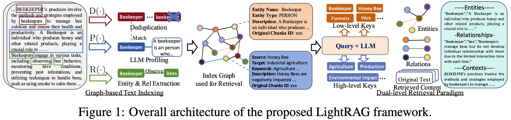

<div align="center">

<div style="margin: 20px 0;">
  
</div>

# 🚀 LightRAG: Simple and Fast Retrieval-Augmented Generation

<div align="center">
    <a href="https://trendshift.io/repositories/13043" target="_blank"></a>
</div>

<div align="center">
  <div style="width: 100%; height: 2px; margin: 20px 0; background: linear-gradient(90deg, transparent, #00d9ff, transparent);"></div>
</div>

<div align="center">
  <div style="background: linear-gradient(135deg, #667eea 0%, #764ba2 100%); border-radius: 15px; padding: 25px; text-align: center;">
    <p>
      <a href='https://github.com/HKUDS/LightRAG'></a>
      <a href='https://arxiv.org/abs/2410.05779'></a>
      <a href="https://github.com/HKUDS/LightRAG/stargazers"></a>
    </p>
    <p>
      
      <a href="https://pypi.org/project/lightrag-hku/"></a>
    </p>
    <p>
      <a href="https://discord.gg/yF2MmDJyGJ"></a>
      <a href="https://github.com/HKUDS/LightRAG/issues/285"></a>
    </p>
    <p>
      <a href="README-zh.md"></a>
      <a href="README.md"></a>
    </p>
    <p>
      <a href="https://pepy.tech/projects/lightrag-hku"></a>
    </p>
  </div>
</div>

</div>

<div align="center" style="margin: 30px 0;">
  
</div>

<div align="center" style="margin: 30px 0;">
    
</div>

---

## 🎉 News
- [2025.11]🎯[New Feature]: Integrated **RAGAS for Evaluation** and **Langfuse for Tracing**. Updated the API to return retrieved contexts alongside query results to support context precision metrics.
- [2025.10]🎯[Scalability Enhancement]: Eliminated processing bottlenecks to support **Large-Scale Datasets Efficiently**.
- [2025.09]🎯[New Feature] Enhances knowledge graph extraction accuracy for **Open-Sourced LLMs** such as Qwen3-30B-A3B.
- [2025.08]🎯[New Feature] **Reranker** is now supported, significantly boosting performance for mixed queries (set as default query mode).
- [2025.08]🎯[New Feature] Added **Document Deletion** with automatic KG regeneration to ensure optimal query performance.
- [2025.06]🎯[New Release] Our team has released [RAG-Anything](https://github.com/HKUDS/RAG-Anything) — an **All-in-One Multimodal RAG** system for seamless processing of text, images, tables, and equations.
- [2025.06]🎯[New Feature] LightRAG now supports comprehensive multimodal data handling through [RAG-Anything](https://github.com/HKUDS/RAG-Anything) integration, enabling seamless document parsing and RAG capabilities across diverse formats including PDFs, images, Office documents, tables, and formulas. Please refer to the new [multimodal section](https://github.com/HKUDS/LightRAG/?tab=readme-ov-file#multimodal-document-processing-rag-anything-integration) for details.
- [2025.03]🎯[New Feature] LightRAG now supports citation functionality, enabling proper source attribution and enhanced document traceability.
- [2025.02]🎯[New Feature] You can now use MongoDB as an all-in-one storage solution for unified data management.
- [2025.02]🎯[New Release] Our team has released [VideoRAG](https://github.com/HKUDS/VideoRAG)-a RAG system for understanding extremely long-context videos
- [2025.01]🎯[New Release] Our team has released [MiniRAG](https://github.com/HKUDS/MiniRAG) making RAG simpler with small models.
- [2025.01]🎯You can now use PostgreSQL as an all-in-one storage solution for data management.
- [2024.11]🎯[New Resource] A comprehensive guide to LightRAG is now available on [LearnOpenCV](https://learnopencv.com/lightrag). — explore in-depth tutorials and best practices. Many thanks to the blog author for this excellent contribution!
- [2024.11]🎯[New Feature] Introducing the LightRAG WebUI — an interface that allows you to insert, query, and visualize LightRAG knowledge through an intuitive web-based dashboard.
- [2024.11]🎯[New Feature] You can now [use Neo4J for Storage](https://github.com/HKUDS/LightRAG?tab=readme-ov-file#using-neo4j-for-storage)-enabling graph database support.
- [2024.10]🎯[New Feature] We've added a link to a [LightRAG Introduction Video](https://youtu.be/oageL-1I0GE). — a walkthrough of LightRAG's capabilities. Thanks to the author for this excellent contribution!
- [2024.10]🎯[New Channel] We have created a [Discord channel](https://discord.gg/yF2MmDJyGJ)!💬 Welcome to join our community for sharing, discussions, and collaboration! 🎉🎉
- [2024.10]🎯[New Feature] LightRAG now supports [Ollama models](https://github.com/HKUDS/LightRAG?tab=readme-ov-file#quick-start)!

<details>
  <summary style="font-size: 1.4em; font-weight: bold; cursor: pointer; display: list-item;">
    Algorithm Flowchart
  </summary>


*Figure 1: LightRAG Indexing Flowchart - Img Caption : [Source](https://learnopencv.com/lightrag/)*

*Figure 2: LightRAG Retrieval and Querying Flowchart - Img Caption : [Source](https://learnopencv.com/lightrag/)*

</details>

## Installation

> **💡 Using uv for Package Management**: This project uses [uv](https://docs.astral.sh/uv/) for fast and reliable Python package management.
> Install uv first: `curl -LsSf https://astral.sh/uv/install.sh | sh` (Unix/macOS) or `powershell -c "irm https://astral.sh/uv/install.ps1 | iex"` (Windows)
>
> **Note**: You can also use pip if you prefer, but uv is recommended for better performance and more reliable dependency management.
>
> **📦 Offline Deployment**: For offline or air-gapped environments, see the [Offline Deployment Guide](./docs/OfflineDeployment.md) for instructions on pre-installing all dependencies and cache files.

### Install LightRAG Server

The LightRAG Server is designed to provide Web UI and API support. The Web UI facilitates document indexing, knowledge graph exploration, and a simple RAG query interface. LightRAG Server also provide an Ollama compatible interfaces, aiming to emulate LightRAG as an Ollama chat model. This allows AI chat bot, such as Open WebUI, to access LightRAG easily.

* Install from PyPI

```bash
# Using uv (recommended)
uv pip install "lightrag-hku[api]"
# Or using pip
# pip install "lightrag-hku[api]"

# Build front-end artifacts
cd lightrag_webui
bun install --frozen-lockfile
bun run build
cd ..

# setup env file
cp env.example .env  # Update the .env with your LLM and embedding configurations
# Launch the server
lightrag-server
```

* Installation from Source

```bash
git clone https://github.com/HKUDS/LightRAG.git
cd LightRAG

# Using uv (recommended)
# Note: uv sync automatically creates a virtual environment in .venv/
uv sync --extra api
source .venv/bin/activate  # Activate the virtual environment (Linux/macOS)
# Or on Windows: .venv\Scripts\activate

### Or using pip with virtual environment
# python -m venv .venv
### source .venv/bin/activate  # Windows: .venv\Scripts\activate
# pip install -e ".[api]"

# Build front-end artifacts
cd lightrag_webui
bun install --frozen-lockfile
bun run build
cd ..

# setup env file
cp env.example .env  # Update the .env with your LLM and embedding configurations
# Launch API-WebUI server
lightrag-server
```

* Launching the LightRAG Server with Docker Compose

```bash
git clone https://github.com/HKUDS/LightRAG.git
cd LightRAG
cp env.example .env  # Update the .env with your LLM and embedding configurations
# modify LLM and Embedding settings in .env
docker compose up
```

> Historical versions of LightRAG docker images can be found here: [LightRAG Docker Images]( https://github.com/HKUDS/LightRAG/pkgs/container/lightrag)

### Install  LightRAG Core

* Install from source (Recommended)

```bash
cd LightRAG
# Note: uv sync automatically creates a virtual environment in .venv/
uv sync
source .venv/bin/activate  # Activate the virtual environment (Linux/macOS)
# Or on Windows: .venv\Scripts\activate

# Or: pip install -e .
```

* Install from PyPI

```bash
uv pip install lightrag-hku
# Or: pip install lightrag-hku
```

## Quick Start

### LLM and Technology Stack Requirements for LightRAG

LightRAG's demands on the capabilities of Large Language Models (LLMs) are significantly higher than those of traditional RAG, as it requires the LLM to perform entity-relationship extraction tasks from documents. Configuring appropriate Embedding and Reranker models is also crucial for improving query performance.

- **LLM Selection**:
  - It is recommended to use an LLM with at least 32 billion parameters.
  - The context length should be at least 32KB, with 64KB being recommended.
  - It is not recommended to choose reasoning models during the document indexing stage.
  - During the query stage, it is recommended to choose models with stronger capabilities than those used in the indexing stage to achieve better query results.
- **Embedding Model**:
  - A high-performance Embedding model is essential for RAG.
  - We recommend using mainstream multilingual Embedding models, such as: `BAAI/bge-m3` and `text-embedding-3-large`.
  - **Important Note**: The Embedding model must be determined before document indexing, and the same model must be used during the document query phase. For certain storage solutions (e.g., PostgreSQL), the vector dimension must be defined upon initial table creation. Therefore, when changing embedding models, it is necessary to delete the existing vector-related tables and allow LightRAG to recreate them with the new dimensions.
- **Reranker Model Configuration**:
  - Configuring a Reranker model can significantly enhance LightRAG's retrieval performance.
  - When a Reranker model is enabled, it is recommended to set the "mix mode" as the default query mode.
  - We recommend using mainstream Reranker models, such as: `BAAI/bge-reranker-v2-m3` or models provided by services like Jina.

### Quick Start for LightRAG Server

* For more information about LightRAG Server, please refer to [LightRAG Server](./lightrag/api/README.md).

### Quick Start for LightRAG core

To get started with LightRAG core, refer to the sample codes available in the `examples` folder. Additionally, a [video demo](https://www.youtube.com/watch?v=g21royNJ4fw) demonstration is provided to guide you through the local setup process. If you already possess an OpenAI API key, you can run the demo right away:

```bash
### you should run the demo code with project folder
cd LightRAG
### provide your API-KEY for OpenAI
export OPENAI_API_KEY="sk-...your_opeai_key..."
### download the demo document of "A Christmas Carol" by Charles Dickens
curl https://raw.githubusercontent.com/gusye1234/nano-graphrag/main/tests/mock_data.txt > ./book.txt
### run the demo code
python examples/lightrag_openai_demo.py
```

For a streaming response implementation example, please see `examples/lightrag_openai_compatible_demo.py`. Prior to execution, ensure you modify the sample code's LLM and embedding configurations accordingly.

**Note 1**: When running the demo program, please be aware that different test scripts may use different embedding models. If you switch to a different embedding model, you must clear the data directory (`./dickens`); otherwise, the program may encounter errors. If you wish to retain the LLM cache, you can preserve the `kv_store_llm_response_cache.json` file while clearing the data directory.

**Note 2**: Only `lightrag_openai_demo.py` and `lightrag_openai_compatible_demo.py` are officially supported sample codes. Other sample files are community contributions that haven't undergone full testing and optimization.

## Programming with LightRAG Core

> ⚠️ **If you would like to integrate LightRAG into your project, we recommend utilizing the REST API provided by the LightRAG Server**. LightRAG Core is typically intended for embedded applications or for researchers who wish to conduct studies and evaluations.

### ⚠️ Important: Initialization Requirements

**LightRAG requires explicit initialization before use.** You must call `await rag.initialize_storages()` after creating a LightRAG instance, otherwise you will encounter errors.

### A Simple Program

Use the below Python snippet to initialize LightRAG, insert text to it, and perform queries:

```python
import os
import asyncio
from lightrag import LightRAG, QueryParam
from lightrag.llm.openai import gpt_4o_mini_complete, gpt_4o_complete, openai_embed
from lightrag.utils import setup_logger

setup_logger("lightrag", level="INFO")

WORKING_DIR = "./rag_storage"
if not os.path.exists(WORKING_DIR):
    os.mkdir(WORKING_DIR)

async def initialize_rag():
    rag = LightRAG(
        working_dir=WORKING_DIR,
        embedding_func=openai_embed,
        llm_model_func=gpt_4o_mini_complete,
    )
    # IMPORTANT: Both initialization calls are required!
    await rag.initialize_storages()  # Initialize storage backends
    return rag

async def main():
    try:
        # Initialize RAG instance
        rag = await initialize_rag()
        await rag.ainsert("Your text")

        # Perform hybrid search
        mode = "hybrid"
        print(
          await rag.aquery(
              "What are the top themes in this story?",
              param=QueryParam(mode=mode)
          )
        )

    except Exception as e:
        print(f"An error occurred: {e}")
    finally:
        if rag:
            await rag.finalize_storages()

if __name__ == "__main__":
    asyncio.run(main())
```

Important notes for the above snippet:

- Export your OPENAI_API_KEY environment variable before running the script.
- This program uses the default storage settings for LightRAG, so all data will be persisted to WORKING_DIR/rag_storage.
- This program demonstrates only the simplest way to initialize a LightRAG object: Injecting the embedding and LLM functions, and initializing storage and pipeline status after creating the LightRAG object.

### LightRAG init parameters

A full list of LightRAG init parameters:

<details>
<summary> Parameters </summary>

| **Parameter** | **Type** | **Explanation** | **Default** |
| -------------- | ---------- | ----------------- | ------------- |
| **working_dir** | `str` | Directory where the cache will be stored | `lightrag_cache+timestamp` |
| **workspace** | str | Workspace name for data isolation between different LightRAG Instances | |
| **kv_storage** | `str` | Storage type for documents and text chunks. Supported types: `JsonKVStorage`,`PGKVStorage`,`RedisKVStorage`,`MongoKVStorage` | `JsonKVStorage` |
| **vector_storage** | `str` | Storage type for embedding vectors. Supported types: `NanoVectorDBStorage`,`PGVectorStorage`,`MilvusVectorDBStorage`,`ChromaVectorDBStorage`,`FaissVectorDBStorage`,`MongoVectorDBStorage`,`QdrantVectorDBStorage` | `NanoVectorDBStorage` |
| **graph_storage** | `str` | Storage type for graph edges and nodes. Supported types: `NetworkXStorage`,`Neo4JStorage`,`PGGraphStorage`,`AGEStorage` | `NetworkXStorage` |
| **doc_status_storage** | `str` | Storage type for documents process status. Supported types: `JsonDocStatusStorage`,`PGDocStatusStorage`,`MongoDocStatusStorage` | `JsonDocStatusStorage` |
| **chunk_token_size** | `int` | Maximum token size per chunk when splitting documents | `1200` |
| **chunk_overlap_token_size** | `int` | Overlap token size between two chunks when splitting documents | `100` |
| **tokenizer** | `Tokenizer` | The function used to convert text into tokens (numbers) and back using .encode() and .decode() functions following `TokenizerInterface` protocol. If you don't specify one, it will use the default Tiktoken tokenizer. | `TiktokenTokenizer` |
| **tiktoken_model_name** | `str` | If you're using the default Tiktoken tokenizer, this is the name of the specific Tiktoken model to use. This setting is ignored if you provide your own tokenizer. | `gpt-4o-mini` |
| **entity_extract_max_gleaning** | `int` | Number of loops in the entity extraction process, appending history messages | `1` |
| **node_embedding_algorithm** | `str` | Algorithm for node embedding (currently not used) | `node2vec` |
| **node2vec_params** | `dict` | Parameters for node embedding | `{"dimensions": 1536,"num_walks": 10,"walk_length": 40,"window_size": 2,"iterations": 3,"random_seed": 3,}` |
| **embedding_func** | `EmbeddingFunc` | Function to generate embedding vectors from text | `openai_embed` |
| **embedding_batch_num** | `int` | Maximum batch size for embedding processes (multiple texts sent per batch) | `32` |
| **embedding_func_max_async** | `int` | Maximum number of concurrent asynchronous embedding processes | `16` |
| **llm_model_func** | `callable` | Function for LLM generation | `gpt_4o_mini_complete` |
| **llm_model_name** | `str` | LLM model name for generation | `meta-llama/Llama-3.2-1B-Instruct` |
| **summary_context_size** | `int` | Maximum tokens send to LLM to generate summaries for entity relation merging | `10000`（configured by env var SUMMARY_CONTEXT_SIZE) |
| **summary_max_tokens** | `int` | Maximum token size for entity/relation description | `500`（configured by env var SUMMARY_MAX_TOKENS) |
| **llm_model_max_async** | `int` | Maximum number of concurrent asynchronous LLM processes | `4`（default value changed by env var MAX_ASYNC) |
| **llm_model_kwargs** | `dict` | Additional parameters for LLM generation | |
| **vector_db_storage_cls_kwargs** | `dict` | Additional parameters for vector database, like setting the threshold for nodes and relations retrieval | cosine_better_than_threshold: 0.2（default value changed by env var COSINE_THRESHOLD) |
| **enable_llm_cache** | `bool` | If `TRUE`, stores LLM results in cache; repeated prompts return cached responses | `TRUE` |
| **enable_llm_cache_for_entity_extract** | `bool` | If `TRUE`, stores LLM results in cache for entity extraction; Good for beginners to debug your application | `TRUE` |
| **addon_params** | `dict` | Additional parameters, e.g., `{"language": "Simplified Chinese", "entity_types": ["organization", "person", "location", "event"]}`: sets example limit, entity/relation extraction output language | language: English` |
| **embedding_cache_config** | `dict` | Configuration for question-answer caching. Contains three parameters: `enabled`: Boolean value to enable/disable cache lookup functionality. When enabled, the system will check cached responses before generating new answers. `similarity_threshold`: Float value (0-1), similarity threshold. When a new question's similarity with a cached question exceeds this threshold, the cached answer will be returned directly without calling the LLM. `use_llm_check`: Boolean value to enable/disable LLM similarity verification. When enabled, LLM will be used as a secondary check to verify the similarity between questions before returning cached answers. | Default: `{"enabled": False, "similarity_threshold": 0.95, "use_llm_check": False}` |

</details>

### Query Param

Use QueryParam to control the behavior your query:

```python
class QueryParam:
    """Configuration parameters for query execution in LightRAG."""

    mode: Literal["local", "global", "hybrid", "naive", "mix", "bypass"] = "global"
    """Specifies the retrieval mode:
    - "local": Focuses on context-dependent information.
    - "global": Utilizes global knowledge.
    - "hybrid": Combines local and global retrieval methods.
    - "naive": Performs a basic search without advanced techniques.
    - "mix": Integrates knowledge graph and vector retrieval.
    """

    only_need_context: bool = False
    """If True, only returns the retrieved context without generating a response."""

    only_need_prompt: bool = False
    """If True, only returns the generated prompt without producing a response."""

    response_type: str = "Multiple Paragraphs"
    """Defines the response format. Examples: 'Multiple Paragraphs', 'Single Paragraph', 'Bullet Points'."""

    stream: bool = False
    """If True, enables streaming output for real-time responses."""

    top_k: int = int(os.getenv("TOP_K", "60"))
    """Number of top items to retrieve. Represents entities in 'local' mode and relationships in 'global' mode."""

    chunk_top_k: int = int(os.getenv("CHUNK_TOP_K", "20"))
    """Number of text chunks to retrieve initially from vector search and keep after reranking.
    If None, defaults to top_k value.
    """

    max_entity_tokens: int = int(os.getenv("MAX_ENTITY_TOKENS", "6000"))
    """Maximum number of tokens allocated for entity context in unified token control system."""

    max_relation_tokens: int = int(os.getenv("MAX_RELATION_TOKENS", "8000"))
    """Maximum number of tokens allocated for relationship context in unified token control system."""

    max_total_tokens: int = int(os.getenv("MAX_TOTAL_TOKENS", "30000"))
    """Maximum total tokens budget for the entire query context (entities + relations + chunks + system prompt)."""

    # History messages are only sent to LLM for context, not used for retrieval
    conversation_history: list[dict[str, str]] = field(default_factory=list)
    """Stores past conversation history to maintain context.
    Format: [{"role": "user/assistant", "content": "message"}].
    """

    ids: list[str] | None = None
    """List of ids to filter the results."""

    model_func: Callable[..., object] | None = None
    """Optional override for the LLM model function to use for this specific query.
    If provided, this will be used instead of the global model function.
    This allows using different models for different query modes.
    """

    user_prompt: str | None = None
    """User-provided prompt for the query.
    Addition instructions for LLM. If provided, this will be inject into the prompt template.
    It's purpose is the let user customize the way LLM generate the response.
    """

    enable_rerank: bool = True
    """Enable reranking for retrieved text chunks. If True but no rerank model is configured, a warning will be issued.
    Default is True to enable reranking when rerank model is available.
    """
```

> default value of Top_k can be change by environment  variables  TOP_K.

### LLM and Embedding Injection

LightRAG requires the utilization of LLM and Embedding models to accomplish document indexing and querying tasks. During the initialization phase, it is necessary to inject the invocation methods of the relevant models into LightRAG：

<details>
<summary> <b>Using Open AI-like APIs</b> </summary>

* LightRAG also supports Open AI-like chat/embeddings APIs:

```python
import os
import numpy as np
from lightrag.utils import wrap_embedding_func_with_attrs
from lightrag.llm.openai import openai_complete_if_cache, openai_embed

async def llm_model_func(
    prompt, system_prompt=None, history_messages=[], keyword_extraction=False, **kwargs
) -> str:
    return await openai_complete_if_cache(
        "solar-mini",
        prompt,
        system_prompt=system_prompt,
        history_messages=history_messages,
        api_key=os.getenv("UPSTAGE_API_KEY"),
        base_url="https://api.upstage.ai/v1/solar",
        **kwargs
    )

@wrap_embedding_func_with_attrs(embedding_dim=4096, max_token_size=8192, model_name="solar-embedding-1-large-query")
async def embedding_func(texts: list[str]) -> np.ndarray:
    return await openai_embed.func(
        texts,
        model="solar-embedding-1-large-query",
        api_key=os.getenv("UPSTAGE_API_KEY"),
        base_url="https://api.upstage.ai/v1/solar"
    )

async def initialize_rag():
    rag = LightRAG(
        working_dir=WORKING_DIR,
        llm_model_func=llm_model_func,
        embedding_func=embedding_func  # Pass the decorated function directly
    )

    await rag.initialize_storages()
    return rag
```

> **Important Note on Embedding Function Wrapping:**
>
> `EmbeddingFunc` cannot be nested. Functions that have been decorated with `@wrap_embedding_func_with_attrs` (such as `openai_embed`, `ollama_embed`, etc.) cannot be wrapped again using `EmbeddingFunc()`. This is why we call `xxx_embed.func` (the underlying unwrapped function) instead of `xxx_embed` directly when creating custom embedding functions.

</details>

<details>
<summary> <b>Using Hugging Face Models</b> </summary>

* If you want to use Hugging Face models, you only need to set LightRAG as follows:

See `lightrag_hf_demo.py`

```python
from functools import partial
from transformers import AutoTokenizer, AutoModel

# Pre-load tokenizer and model
tokenizer = AutoTokenizer.from_pretrained("sentence-transformers/all-MiniLM-L6-v2")
embed_model = AutoModel.from_pretrained("sentence-transformers/all-MiniLM-L6-v2")

# Initialize LightRAG with Hugging Face model
rag = LightRAG(
    working_dir=WORKING_DIR,
    llm_model_func=hf_model_complete,  # Use Hugging Face model for text generation
    llm_model_name='meta-llama/Llama-3.1-8B-Instruct',  # Model name from Hugging Face
    # Use Hugging Face embedding function
    embedding_func=EmbeddingFunc(
        embedding_dim=384,
        max_token_size=2048,
        model_name="sentence-transformers/all-MiniLM-L6-v2",
        func=partial(
            hf_embed.func,  # Use .func to access the unwrapped function
            tokenizer=tokenizer,
            embed_model=embed_model
        )
    ),
)
```

</details>

<details>
<summary> <b>Using Ollama Models</b> </summary>

**Overview**

If you want to use Ollama models, you need to pull model you plan to use and embedding model, for example `nomic-embed-text`.

Then you only need to set LightRAG as follows:

```python
import numpy as np
from lightrag.utils import wrap_embedding_func_with_attrs
from lightrag.llm.ollama import ollama_model_complete, ollama_embed

@wrap_embedding_func_with_attrs(embedding_dim=768, max_token_size=8192, model_name="nomic-embed-text")
async def embedding_func(texts: list[str]) -> np.ndarray:
    return await ollama_embed.func(texts, embed_model="nomic-embed-text")

# Initialize LightRAG with Ollama model
rag = LightRAG(
    working_dir=WORKING_DIR,
    llm_model_func=ollama_model_complete,  # Use Ollama model for text generation
    llm_model_name='your_model_name', # Your model name
    embedding_func=embedding_func,  # Pass the decorated function directly
)
```

* **Increasing context size**

In order for LightRAG to work context should be at least 32k tokens. By default Ollama models have context size of 8k. You can achieve this using one of two ways:

* **Increasing the `num_ctx` parameter in Modelfile**

1. Pull the model:

```bash
ollama pull qwen2
```

2. Display the model file:

```bash
ollama show --modelfile qwen2 > Modelfile
```

3. Edit the Modelfile by adding the following line:

```bash
PARAMETER num_ctx 32768
```

4. Create the modified model:

```bash
ollama create -f Modelfile qwen2m
```

* **Setup `num_ctx` via Ollama API**

Tiy can use `llm_model_kwargs` param to configure ollama:

```python
import numpy as np
from lightrag.utils import wrap_embedding_func_with_attrs
from lightrag.llm.ollama import ollama_model_complete, ollama_embed

@wrap_embedding_func_with_attrs(embedding_dim=768, max_token_size=8192, model_name="nomic-embed-text")
async def embedding_func(texts: list[str]) -> np.ndarray:
    return await ollama_embed.func(texts, embed_model="nomic-embed-text")

rag = LightRAG(
    working_dir=WORKING_DIR,
    llm_model_func=ollama_model_complete,  # Use Ollama model for text generation
    llm_model_name='your_model_name', # Your model name
    llm_model_kwargs={"options": {"num_ctx": 32768}},
    embedding_func=embedding_func,  # Pass the decorated function directly
)
```

> **Important Note on Embedding Function Wrapping:**
>
> `EmbeddingFunc` cannot be nested. Functions that have been decorated with `@wrap_embedding_func_with_attrs` (such as `openai_embed`, `ollama_embed`, etc.) cannot be wrapped again using `EmbeddingFunc()`. This is why we call `xxx_embed.func` (the underlying unwrapped function) instead of `xxx_embed` directly when creating custom embedding functions.

* **Low RAM GPUs**

In order to run this experiment on low RAM GPU you should select small model and tune context window (increasing context increase memory consumption). For example, running this ollama example on repurposed mining GPU with 6Gb of RAM required to set context size to 26k while using `gemma2:2b`. It was able to find 197 entities and 19 relations on `book.txt`.

</details>

<details>
<summary> <b>LlamaIndex</b> </summary>

LightRAG supports integration with LlamaIndex (`llm/llama_index_impl.py`):

- Integrates with OpenAI and other providers through LlamaIndex
- See [LlamaIndex Documentation](https://developers.llamaindex.ai/python/framework/) for detailed setup or the [examples](examples/unofficial-sample/)

**Example Usage**

```python
# Using LlamaIndex with direct OpenAI access
import asyncio
from lightrag import LightRAG
from lightrag.llm.llama_index_impl import llama_index_complete_if_cache, llama_index_embed
from llama_index.embeddings.openai import OpenAIEmbedding
from llama_index.llms.openai import OpenAI
from lightrag.utils import setup_logger

# Setup log handler for LightRAG
setup_logger("lightrag", level="INFO")

async def initialize_rag():
    rag = LightRAG(
        working_dir="your/path",
        llm_model_func=llama_index_complete_if_cache,  # LlamaIndex-compatible completion function
        embedding_func=EmbeddingFunc(    # LlamaIndex-compatible embedding function
            embedding_dim=1536,
            max_token_size=2048,
            model_name=embed_model,
            func=partial(llama_index_embed.func, embed_model=embed_model)  # Use .func to access the unwrapped function
        ),
    )

    await rag.initialize_storages()
    return rag

def main():
    # Initialize RAG instance
    rag = asyncio.run(initialize_rag())

    with open("./book.txt", "r", encoding="utf-8") as f:
        rag.insert(f.read())

    # Perform naive search
    print(
        rag.query("What are the top themes in this story?", param=QueryParam(mode="naive"))
    )

    # Perform local search
    print(
        rag.query("What are the top themes in this story?", param=QueryParam(mode="local"))
    )

    # Perform global search
    print(
        rag.query("What are the top themes in this story?", param=QueryParam(mode="global"))
    )

    # Perform hybrid search
    print(
        rag.query("What are the top themes in this story?", param=QueryParam(mode="hybrid"))
    )

if __name__ == "__main__":
    main()
```

**For detailed documentation and examples, see:**

- [LlamaIndex Documentation](https://developers.llamaindex.ai/python/framework/)
- [Direct OpenAI Example](examples/unofficial-sample/lightrag_llamaindex_direct_demo.py)
- [LiteLLM Proxy Example](examples/unofficial-sample/lightrag_llamaindex_litellm_demo.py)
- [LiteLLM Proxy with Opik Example](examples/unofficial-sample/lightrag_llamaindex_litellm_opik_demo.py)

</details>

<details>
<summary> <b>Using Azure OpenAI Models</b> </summary>

If you want to use Azure OpenAI models, you only need to set up LightRAG as follows:

```python
import os
import numpy as np
from lightrag.utils import wrap_embedding_func_with_attrs
from lightrag.llm.azure_openai import azure_openai_complete_if_cache, azure_openai_embed

# Configure the generation model
async def llm_model_func(
    prompt, system_prompt=None, history_messages=[], keyword_extraction=False, **kwargs
) -> str:
    return await azure_openai_complete_if_cache(
        prompt,
        system_prompt=system_prompt,
        history_messages=history_messages,
        api_key=os.getenv("AZURE_OPENAI_API_KEY"),
        azure_endpoint=os.getenv("AZURE_OPENAI_ENDPOINT"),
        api_version=os.getenv("AZURE_OPENAI_API_VERSION"),
        deployment_name=os.getenv("AZURE_OPENAI_DEPLOYMENT_NAME"),
        **kwargs
    )

# Configure the embedding model
@wrap_embedding_func_with_attrs(
    embedding_dim=1536,
    max_token_size=8192,
    model_name=os.getenv("AZURE_OPENAI_EMBEDDING_MODEL")
)
async def embedding_func(texts: list[str]) -> np.ndarray:
    return await azure_openai_embed.func(
        texts,
        api_key=os.getenv("AZURE_OPENAI_API_KEY"),
        azure_endpoint=os.getenv("AZURE_OPENAI_ENDPOINT"),
        api_version=os.getenv("AZURE_OPENAI_API_VERSION"),
        deployment_name=os.getenv("AZURE_OPENAI_EMBEDDING_DEPLOYMENT_NAME")
    )

rag = LightRAG(
    working_dir=WORKING_DIR,
    llm_model_func=llm_model_func,
    embedding_func=embedding_func
)
```

</details>

<details>
<summary> <b>Using Google Gemini Models</b> </summary>

If you want to use Google Gemini models, you only need to set up LightRAG as follows:

```python
import os
import numpy as np
from lightrag.utils import wrap_embedding_func_with_attrs
from lightrag.llm.gemini import gemini_model_complete, gemini_embed

# Configure the generation model
async def llm_model_func(
    prompt, system_prompt=None, history_messages=[], keyword_extraction=False, **kwargs
) -> str:
    return await gemini_model_complete(
        prompt,
        system_prompt=system_prompt,
        history_messages=history_messages,
        api_key=os.getenv("GEMINI_API_KEY"),
        model_name="gemini-2.0-flash",
        **kwargs
    )

# Configure the embedding model
@wrap_embedding_func_with_attrs(
    embedding_dim=768,
    max_token_size=2048,
    model_name="models/text-embedding-004"
)
async def embedding_func(texts: list[str]) -> np.ndarray:
    return await gemini_embed.func(
        texts,
        api_key=os.getenv("GEMINI_API_KEY"),
        model="models/text-embedding-004"
    )

rag = LightRAG(
    working_dir=WORKING_DIR,
    llm_model_func=llm_model_func,
    llm_model_name="gemini-2.0-flash",
    embedding_func=embedding_func
)
```

</details>

### Rerank Function Injection

To enhance retrieval quality, documents can be re-ranked based on a more effective relevance scoring model. The `rerank.py` file provides three Reranker provider driver functions:

* **Cohere / vLLM**: `cohere_rerank`
* **Jina AI**: `jina_rerank`
* **Aliyun**: `ali_rerank`

You can inject one of these functions into the `rerank_model_func` attribute of the LightRAG object. This will enable LightRAG's query function to re-order retrieved text blocks using the injected function. For detailed usage, please refer to the `examples/rerank_example.py` file.

### User Prompt vs. Query

When using LightRAG for content queries, avoid combining the search process with unrelated output processing, as this significantly impacts query effectiveness. The `user_prompt` parameter in Query Param is specifically designed to address this issue — it does not participate in the RAG retrieval phase, but rather guides the LLM on how to process the retrieved results after the query is completed. Here's how to use it:

```python
# Create query parameters
query_param = QueryParam(
    mode = "hybrid",  # Other modes：local, global, hybrid, mix, naive
    user_prompt = "For diagrams, use mermaid format with English/Pinyin node names and Chinese display labels",
)

# Query and process
response_default = rag.query(
    "Please draw a character relationship diagram for Scrooge",
    param=query_param
)
print(response_default)
```

### Insert

<details>
  <summary> <b> Basic Insert </b></summary>

```python
# Basic Insert
rag.insert("Text")
```

</details>

<details>
  <summary> <b> Batch Insert </b></summary>

```python
# Basic Batch Insert: Insert multiple texts at once
rag.insert(["TEXT1", "TEXT2",...])

# Batch Insert with custom batch size configuration
rag = LightRAG(
    ...
    working_dir=WORKING_DIR,
    max_parallel_insert = 4
)

rag.insert(["TEXT1", "TEXT2", "TEXT3", ...])  # Documents will be processed in batches of 4
```

The `max_parallel_insert` parameter determines the number of documents processed concurrently in the document indexing pipeline. If unspecified, the default value is **2**. We recommend keeping this setting **below 10**, as the performance bottleneck typically lies with the LLM (Large Language Model) processing.

</details>

<details>
  <summary> <b> Insert with ID </b></summary>

If you want to provide your own IDs for your documents, number of documents and number of IDs must be the same.

```python
# Insert single text, and provide ID for it
rag.insert("TEXT1", ids=["ID_FOR_TEXT1"])

# Insert multiple texts, and provide IDs for them
rag.insert(["TEXT1", "TEXT2",...], ids=["ID_FOR_TEXT1", "ID_FOR_TEXT2"])
```

</details>

<details>
  <summary><b>Insert using Pipeline</b></summary>

The `apipeline_enqueue_documents` and `apipeline_process_enqueue_documents` functions allow you to perform incremental insertion of documents into the graph.This is useful for scenarios where you want to process documents in the background while still allowing the main thread to continue executing.

```python
rag = LightRAG(..)

await rag.apipeline_enqueue_documents(input)
# Your routine in loop
await rag.apipeline_process_enqueue_documents(input)
```

</details>

<details>
  <summary><b>Insert Multi-file Type Support</b></summary>

The `textract` supports reading file types such as TXT, DOCX, PPTX, CSV, and PDF.

```python
import textract

file_path = 'TEXT.pdf'
text_content = textract.process(file_path)

rag.insert(text_content.decode('utf-8'))
```

</details>

<details>
  <summary><b>Citation Functionality</b></summary>

By providing file paths, the system ensures that sources can be traced back to their original documents.

```python
# Define documents and their file paths
documents = ["Document content 1", "Document content 2"]
file_paths = ["path/to/doc1.txt", "path/to/doc2.txt"]

# Insert documents with file paths
rag.insert(documents, file_paths=file_paths)
```

</details>

### Storage

LightRAG uses 4 types of storage for different purposes:

* KV_STORAGE: llm response cache, text chunks, document information
* VECTOR_STORAGE: entities vectors, relation vectors, chunks vectors
* GRAPH_STORAGE: entity relation graph
* DOC_STATUS_STORAGE: document indexing status

Each storage type has several implementations:

* KV_STORAGE supported implementations:

```
JsonKVStorage    JsonFile (default)
PGKVStorage      Postgres
RedisKVStorage   Redis
MongoKVStorage   MongoDB
```

* GRAPH_STORAGE supported implementations:

```
NetworkXStorage      NetworkX (default)
Neo4JStorage         Neo4J
PGGraphStorage       PostgreSQL with AGE plugin
MemgraphStorage.     Memgraph
```

> Testing has shown that Neo4J delivers superior performance in production environments compared to PostgreSQL with AGE plugin.

* VECTOR_STORAGE supported implementations:

```
NanoVectorDBStorage         NanoVector (default)
PGVectorStorage             Postgres
MilvusVectorDBStorage       Milvus
FaissVectorDBStorage        Faiss
QdrantVectorDBStorage       Qdrant
MongoVectorDBStorage        MongoDB
```

* DOC_STATUS_STORAGE: supported implementations:

```
JsonDocStatusStorage        JsonFile (default)
PGDocStatusStorage          Postgres
MongoDocStatusStorage       MongoDB
```

Example connection configurations for each storage type can be found in the `env.example` file. The database instance in the connection string needs to be created by you on the database server beforehand. LightRAG is only responsible for creating tables within the database instance, not for creating the database instance itself. If using Redis as storage, remember to configure automatic data persistence rules for Redis, otherwise data will be lost after the Redis service restarts. If using PostgreSQL, it is recommended to use version 16.6 or above.

<details>
<summary> <b>Using Neo4J Storage</b> </summary>

* For production level scenarios you will most likely want to leverage an enterprise solution
* for KG storage. Running Neo4J in Docker is recommended for seamless local testing.
* See: https://hub.docker.com/_/neo4j

```python
export NEO4J_URI="neo4j://localhost:7687"
export NEO4J_USERNAME="neo4j"
export NEO4J_PASSWORD="password"

# Setup logger for LightRAG
setup_logger("lightrag", level="INFO")

# When you launch the project be sure to override the default KG by specifying graph_storage="Neo4JStorage".
# Initialize LightRAG with Neo4J implementation.
async def initialize_rag():
    rag = LightRAG(
        working_dir=WORKING_DIR,
        llm_model_func=gpt_4o_mini_complete,  # Use gpt_4o_mini_complete LLM model
        graph_storage="Neo4JStorage", #<-----------override KG default
    )

    # Initialize database connections
    await rag.initialize_storages()
    # Initialize pipeline status for document processing
    return rag
```

see test_neo4j.py for a working example.

</details>

<details>
<summary> <b>Using PostgreSQL Storage</b> </summary>

For production level scenarios you will most likely want to leverage an enterprise solution. PostgreSQL can provide a one-stop solution for you as KV store, VectorDB (pgvector) and GraphDB (apache AGE). PostgreSQL version 16.6 or higher is supported.

* PostgreSQL is lightweight,the whole binary distribution including all necessary plugins can be zipped to 40MB: Ref to [Windows Release](https://github.com/ShanGor/apache-age-windows/releases/tag/PG17%2Fv1.5.0-rc0) as it is easy to install for Linux/Mac.
* If you prefer docker, please start with this image if you are a beginner to avoid hiccups (Default user password:rag/rag): https://hub.docker.com/r/gzdaniel/postgres-for-rag
* How to start? Ref to: [examples/lightrag_zhipu_postgres_demo.py](https://github.com/HKUDS/LightRAG/blob/main/examples/lightrag_zhipu_postgres_demo.py)
* For high-performance graph database requirements, Neo4j is recommended as Apache AGE's performance is not as competitive.

</details>

<details>
<summary> <b>Using Faiss Storage</b> </summary>
Before using Faiss vector database, you must manually install `faiss-cpu` or `faiss-gpu`.

- Install the required dependencies:

```
pip install faiss-cpu
```

You can also install `faiss-gpu` if you have GPU support.

- Here we are using `sentence-transformers` but you can also use `OpenAIEmbedding` model with `3072` dimensions.

```python
async def embedding_func(texts: list[str]) -> np.ndarray:
    model = SentenceTransformer('all-MiniLM-L6-v2')
    embeddings = model.encode(texts, convert_to_numpy=True)
    return embeddings

# Initialize LightRAG with the LLM model function and embedding function
rag = LightRAG(
    working_dir=WORKING_DIR,
    llm_model_func=llm_model_func,
    embedding_func=EmbeddingFunc(
        embedding_dim=384,
        max_token_size=2048,
        model_name="all-MiniLM-L6-v2",
        func=embedding_func,
    ),
    vector_storage="FaissVectorDBStorage",
    vector_db_storage_cls_kwargs={
        "cosine_better_than_threshold": 0.3  # Your desired threshold
    }
)
```

</details>

<details>
<summary> <b>Using Memgraph for Storage</b> </summary>

* Memgraph is a high-performance, in-memory graph database compatible with the Neo4j Bolt protocol.
* You can run Memgraph locally using Docker for easy testing:
* See: https://memgraph.com/download

```python
export MEMGRAPH_URI="bolt://localhost:7687"

# Setup logger for LightRAG
setup_logger("lightrag", level="INFO")

# When you launch the project, override the default KG: NetworkX
# by specifying kg="MemgraphStorage".

# Note: Default settings use NetworkX
# Initialize LightRAG with Memgraph implementation.
async def initialize_rag():
    rag = LightRAG(
        working_dir=WORKING_DIR,
        llm_model_func=gpt_4o_mini_complete,  # Use gpt_4o_mini_complete LLM model
        graph_storage="MemgraphStorage", #<-----------override KG default
    )

    # Initialize database connections
    await rag.initialize_storages()
    # Initialize pipeline status for document processing
    return rag
```

</details>

<details>
<summary> <b>Using MongoDB Storage</b> </summary>

MongoDB provides a one-stop storage solution for LightRAG. MongoDB offers native KV storage and vector storage. LightRAG uses MongoDB collections to implement a simple graph storage. MongoDB's official vector search functionality (`$vectorSearch`) currently requires their official cloud service MongoDB Atlas. This functionality cannot be used on self-hosted MongoDB Community/Enterprise versions.

</details>

<details>
<summary> <b>Using Redis Storage</b> </summary>

LightRAG supports using Redis as KV storage. When using Redis storage, attention should be paid to persistence configuration and memory usage configuration. The following is the recommended Redis configuration:

```
save 900 1
save 300 10
save 60 1000
stop-writes-on-bgsave-error yes
maxmemory 4gb
maxmemory-policy noeviction
maxclients 500
```

</details>

### Data Isolation Between LightRAG Instances

The `workspace` parameter ensures data isolation between different LightRAG instances. Once initialized, the `workspace` is immutable and cannot be changed.Here is how workspaces are implemented for different types of storage:

- **For local file-based databases, data isolation is achieved through workspace subdirectories:** `JsonKVStorage`, `JsonDocStatusStorage`, `NetworkXStorage`, `NanoVectorDBStorage`, `FaissVectorDBStorage`.
- **For databases that store data in collections, it's done by adding a workspace prefix to the collection name:** `RedisKVStorage`, `RedisDocStatusStorage`, `MilvusVectorDBStorage`, `MongoKVStorage`, `MongoDocStatusStorage`, `MongoVectorDBStorage`, `MongoGraphStorage`, `PGGraphStorage`.
- **For Qdrant vector database, data isolation is achieved through payload-based partitioning (Qdrant's recommended multitenancy approach):** `QdrantVectorDBStorage` uses shared collections with payload filtering for unlimited workspace scalability.
- **For relational databases, data isolation is achieved by adding a `workspace` field to the tables for logical data separation:** `PGKVStorage`, `PGVectorStorage`, `PGDocStatusStorage`.
- **For the Neo4j graph database, logical data isolation is achieved through labels:** `Neo4JStorage`

To maintain compatibility with legacy data, the default workspace for PostgreSQL non-graph storage is `default` and, for PostgreSQL AGE graph storage is null, for Neo4j graph storage is `base` when no workspace is configured. For all external storages, the system provides dedicated workspace environment variables to override the common `WORKSPACE` environment variable configuration. These storage-specific workspace environment variables are: `REDIS_WORKSPACE`, `MILVUS_WORKSPACE`, `QDRANT_WORKSPACE`, `MONGODB_WORKSPACE`, `POSTGRES_WORKSPACE`, `NEO4J_WORKSPACE`.

### AGENTS.md -- Guiding Coding Agents

AGENTS.md is a simple, open format for guiding coding agents (https://agents.md/). It is a dedicated, predictable place to provide the context and instructions to help AI coding agents work on LightRAG project. Different AI coders should not maintain separate guidance files individually. If any AI coder cannot automatically recognize AGENTS.md, symbolic links can be used as a solution. After establishing symbolic links, you can prevent them from being committed to the Git repository by configuring your local `.gitignore_global`.

## Edit Entities and Relations

LightRAG now supports comprehensive knowledge graph management capabilities, allowing you to create, edit, and delete entities and relationships within your knowledge graph.

<details>
  <summary> <b> Create Entities and Relations </b></summary>

```python
# Create new entity
entity = rag.create_entity("Google", {
    "description": "Google is a multinational technology company specializing in internet-related services and products.",
    "entity_type": "company"
})

# Create another entity
product = rag.create_entity("Gmail", {
    "description": "Gmail is an email service developed by Google.",
    "entity_type": "product"
})

# Create relation between entities
relation = rag.create_relation("Google", "Gmail", {
    "description": "Google develops and operates Gmail.",
    "keywords": "develops operates service",
    "weight": 2.0
})
```

</details>

<details>
  <summary> <b> Edit Entities and Relations </b></summary>

```python
# Edit an existing entity
updated_entity = rag.edit_entity("Google", {
    "description": "Google is a subsidiary of Alphabet Inc., founded in 1998.",
    "entity_type": "tech_company"
})

# Rename an entity (with all its relationships properly migrated)
renamed_entity = rag.edit_entity("Gmail", {
    "entity_name": "Google Mail",
    "description": "Google Mail (formerly Gmail) is an email service."
})

# Edit a relation between entities
updated_relation = rag.edit_relation("Google", "Google Mail", {
    "description": "Google created and maintains Google Mail service.",
    "keywords": "creates maintains email service",
    "weight": 3.0
})
```

All operations are available in both synchronous and asynchronous versions. The asynchronous versions have the prefix "a" (e.g., `acreate_entity`, `aedit_relation`).

</details>

<details>
  <summary> <b> Insert Custom KG </b></summary>

```python
custom_kg = {
        "chunks": [
            {
                "content": "Alice and Bob are collaborating on quantum computing research.",
                "source_id": "doc-1",
                "file_path": "test_file",
            }
        ],
        "entities": [
            {
                "entity_name": "Alice",
                "entity_type": "person",
                "description": "Alice is a researcher specializing in quantum physics.",
                "source_id": "doc-1",
                "file_path": "test_file"
            },
            {
                "entity_name": "Bob",
                "entity_type": "person",
                "description": "Bob is a mathematician.",
                "source_id": "doc-1",
                "file_path": "test_file"
            },
            {
                "entity_name": "Quantum Computing",
                "entity_type": "technology",
                "description": "Quantum computing utilizes quantum mechanical phenomena for computation.",
                "source_id": "doc-1",
                "file_path": "test_file"
            }
        ],
        "relationships": [
            {
                "src_id": "Alice",
                "tgt_id": "Bob",
                "description": "Alice and Bob are research partners.",
                "keywords": "collaboration research",
                "weight": 1.0,
                "source_id": "doc-1",
                "file_path": "test_file"
            },
            {
                "src_id": "Alice",
                "tgt_id": "Quantum Computing",
                "description": "Alice conducts research on quantum computing.",
                "keywords": "research expertise",
                "weight": 1.0,
                "source_id": "doc-1",
                "file_path": "test_file"
            },
            {
                "src_id": "Bob",
                "tgt_id": "Quantum Computing",
                "description": "Bob researches quantum computing.",
                "keywords": "research application",
                "weight": 1.0,
                "source_id": "doc-1",
                "file_path": "test_file"
            }
        ]
    }

rag.insert_custom_kg(custom_kg)
```

</details>

<details>
  <summary> <b>Other Entity and Relation Operations</b></summary>

- **create_entity**: Creates a new entity with specified attributes
- **edit_entity**: Updates an existing entity's attributes or renames it
- **create_relation**: Creates a new relation between existing entities
- **edit_relation**: Updates an existing relation's attributes

These operations maintain data consistency across both the graph database and vector database components, ensuring your knowledge graph remains coherent.

</details>

## Delete Functions

LightRAG provides comprehensive deletion capabilities, allowing you to delete documents, entities, and relationships.

<details>
<summary> <b>Delete Entities</b> </summary>

You can delete entities by their name along with all associated relationships:

```python
# Delete entity and all its relationships (synchronous version)
rag.delete_by_entity("Google")

# Asynchronous version
await rag.adelete_by_entity("Google")
```

When deleting an entity:
- Removes the entity node from the knowledge graph
- Deletes all associated relationships
- Removes related embedding vectors from the vector database
- Maintains knowledge graph integrity

</details>

<details>
<summary> <b>Delete Relations</b> </summary>

You can delete relationships between two specific entities:

```python
# Delete relationship between two entities (synchronous version)
rag.delete_by_relation("Google", "Gmail")

# Asynchronous version
await rag.adelete_by_relation("Google", "Gmail")
```

When deleting a relationship:
- Removes the specified relationship edge
- Deletes the relationship's embedding vector from the vector database
- Preserves both entity nodes and their other relationships

</details>

<details>
<summary> <b>Delete by Document ID</b> </summary>

You can delete an entire document and all its related knowledge through document ID:

```python
# Delete by document ID (asynchronous version)
await rag.adelete_by_doc_id("doc-12345")
```

Optimized processing when deleting by document ID:
- **Smart Cleanup**: Automatically identifies and removes entities and relationships that belong only to this document
- **Preserve Shared Knowledge**: If entities or relationships exist in other documents, they are preserved and their descriptions are rebuilt
- **Cache Optimization**: Clears related LLM cache to reduce storage overhead
- **Incremental Rebuilding**: Reconstructs affected entity and relationship descriptions from remaining documents

The deletion process includes:
1. Delete all text chunks related to the document
2. Identify and delete entities and relationships that belong only to this document
3. Rebuild entities and relationships that still exist in other documents
4. Update all related vector indexes
5. Clean up document status records

Note: Deletion by document ID is an asynchronous operation as it involves complex knowledge graph reconstruction processes.

</details>

**Important Reminders:**

1. **Irreversible Operations**: All deletion operations are irreversible, please use with caution
2. **Performance Considerations**: Deleting large amounts of data may take some time, especially deletion by document ID
3. **Data Consistency**: Deletion operations automatically maintain consistency between the knowledge graph and vector database
4. **Backup Recommendations**: Consider backing up data before performing important deletion operations

**Batch Deletion Recommendations:**
- For batch deletion operations, consider using asynchronous methods for better performance
- For large-scale deletions, consider processing in batches to avoid excessive system load

## Entity Merging

<details>
<summary> <b>Merge Entities and Their Relationships</b> </summary>

LightRAG now supports merging multiple entities into a single entity, automatically handling all relationships:

```python
# Basic entity merging
rag.merge_entities(
    source_entities=["Artificial Intelligence", "AI", "Machine Intelligence"],
    target_entity="AI Technology"
)
```

With custom merge strategy:

```python
# Define custom merge strategy for different fields
rag.merge_entities(
    source_entities=["John Smith", "Dr. Smith", "J. Smith"],
    target_entity="John Smith",
    merge_strategy={
        "description": "concatenate",  # Combine all descriptions
        "entity_type": "keep_first",   # Keep the entity type from the first entity
        "source_id": "join_unique"     # Combine all unique source IDs
    }
)
```

With custom target entity data:

```python
# Specify exact values for the merged entity
rag.merge_entities(
    source_entities=["New York", "NYC", "Big Apple"],
    target_entity="New York City",
    target_entity_data={
        "entity_type": "LOCATION",
        "description": "New York City is the most populous city in the United States.",
    }
)
```

Advanced usage combining both approaches:

```python
# Merge company entities with both strategy and custom data
rag.merge_entities(
    source_entities=["Microsoft Corp", "Microsoft Corporation", "MSFT"],
    target_entity="Microsoft",
    merge_strategy={
        "description": "concatenate",  # Combine all descriptions
        "source_id": "join_unique"     # Combine source IDs
    },
    target_entity_data={
        "entity_type": "ORGANIZATION",
    }
)
```

When merging entities:

* All relationships from source entities are redirected to the target entity
* Duplicate relationships are intelligently merged
* Self-relationships (loops) are prevented
* Source entities are removed after merging
* Relationship weights and attributes are preserved

</details>

## Multimodal Document Processing (RAG-Anything Integration)

LightRAG now seamlessly integrates with [RAG-Anything](https://github.com/HKUDS/RAG-Anything), a comprehensive **All-in-One Multimodal Document Processing RAG system** built specifically for LightRAG. RAG-Anything enables advanced parsing and retrieval-augmented generation (RAG) capabilities, allowing you to handle multimodal documents seamlessly and extract structured content—including text, images, tables, and formulas—from various document formats for integration into your RAG pipeline.

**Key Features:**
- **End-to-End Multimodal Pipeline**: Complete workflow from document ingestion and parsing to intelligent multimodal query answering
- **Universal Document Support**: Seamless processing of PDFs, Office documents (DOC/DOCX/PPT/PPTX/XLS/XLSX), images, and diverse file formats
- **Specialized Content Analysis**: Dedicated processors for images, tables, mathematical equations, and heterogeneous content types
- **Multimodal Knowledge Graph**: Automatic entity extraction and cross-modal relationship discovery for enhanced understanding
- **Hybrid Intelligent Retrieval**: Advanced search capabilities spanning textual and multimodal content with contextual understanding

**Quick Start:**
1. Install RAG-Anything:
   ```bash
   pip install raganything
   ```
2. Process multimodal documents:
    <details>
    <summary> <b> RAGAnything Usage Example </b></summary>

    ```python
        import asyncio
        from raganything import RAGAnything
        from lightrag import LightRAG
        from lightrag.llm.openai import openai_complete_if_cache, openai_embed
        from lightrag.utils import EmbeddingFunc
        import os

        async def load_existing_lightrag():
            # First, create or load an existing LightRAG instance
            lightrag_working_dir = "./existing_lightrag_storage"

            # Check if previous LightRAG instance exists
            if os.path.exists(lightrag_working_dir) and os.listdir(lightrag_working_dir):
                print("✅ Found existing LightRAG instance, loading...")
            else:
                print("❌ No existing LightRAG instance found, will create new one")

            from functools import partial

            # Create/Load LightRAG instance with your configurations
            lightrag_instance = LightRAG(
                working_dir=lightrag_working_dir,
                llm_model_func=lambda prompt, system_prompt=None, history_messages=[], **kwargs: openai_complete_if_cache(
                    "gpt-4o-mini",
                    prompt,
                    system_prompt=system_prompt,
                    history_messages=history_messages,
                    api_key="your-api-key",
                    **kwargs,
                ),
                embedding_func=EmbeddingFunc(
                    embedding_dim=3072,
                    max_token_size=8192,
                    model="text-embedding-3-large",
                    func=partial(
                        openai_embed.func,  # Use .func to access the unwrapped function
                        model="text-embedding-3-large",
                        api_key=api_key,
                        base_url=base_url,
                    ),
                )
            )

            # Initialize storage (this will load existing data if available)
            await lightrag_instance.initialize_storages()

            # Now initialize RAGAnything with the existing LightRAG instance
            rag = RAGAnything(
                lightrag=lightrag_instance,  # Pass the existing LightRAG instance
                # Only need vision model for multimodal processing
                vision_model_func=lambda prompt, system_prompt=None, history_messages=[], image_data=None, **kwargs: openai_complete_if_cache(
                    "gpt-4o",
                    "",
                    system_prompt=None,
                    history_messages=[],
                    messages=[
                        {"role": "system", "content": system_prompt} if system_prompt else None,
                        {"role": "user", "content": [
                            {"type": "text", "text": prompt},
                            {"type": "image_url", "image_url": {"url": f"data:image/jpeg;base64,{image_data}"}}
                        ]} if image_data else {"role": "user", "content": prompt}
                    ],
                    api_key="your-api-key",
                    **kwargs,
                ) if image_data else openai_complete_if_cache(
                    "gpt-4o-mini",
                    prompt,
                    system_prompt=system_prompt,
                    history_messages=history_messages,
                    api_key="your-api-key",
                    **kwargs,
                )
                # Note: working_dir, llm_model_func, embedding_func, etc. are inherited from lightrag_instance
            )

            # Query the existing knowledge base
            result = await rag.query_with_multimodal(
                "What data has been processed in this LightRAG instance?",
                mode="hybrid"
            )
            print("Query result:", result)

            # Add new multimodal documents to the existing LightRAG instance
            await rag.process_document_complete(
                file_path="path/to/new/multimodal_document.pdf",
                output_dir="./output"
            )

        if __name__ == "__main__":
            asyncio.run(load_existing_lightrag())
    ```
    </details>

For detailed documentation and advanced usage, please refer to the [RAG-Anything repository](https://github.com/HKUDS/RAG-Anything).

## Token Usage Tracking

<details>
<summary> <b>Overview and Usage</b> </summary>

LightRAG provides a TokenTracker tool to monitor and manage token consumption by large language models. This feature is particularly useful for controlling API costs and optimizing performance.

### Usage

```python
from lightrag.utils import TokenTracker

# Create TokenTracker instance
token_tracker = TokenTracker()

# Method 1: Using context manager (Recommended)
# Suitable for scenarios requiring automatic token usage tracking
with token_tracker:
    result1 = await llm_model_func("your question 1")
    result2 = await llm_model_func("your question 2")

# Method 2: Manually adding token usage records
# Suitable for scenarios requiring more granular control over token statistics
token_tracker.reset()

rag.insert()

rag.query("your question 1", param=QueryParam(mode="naive"))
rag.query("your question 2", param=QueryParam(mode="mix"))

# Display total token usage (including insert and query operations)
print("Token usage:", token_tracker.get_usage())
```

### Usage Tips
- Use context managers for long sessions or batch operations to automatically track all token consumption
- For scenarios requiring segmented statistics, use manual mode and call reset() when appropriate
- Regular checking of token usage helps detect abnormal consumption early
- Actively use this feature during development and testing to optimize production costs

### Practical Examples
You can refer to these examples for implementing token tracking:
- `examples/lightrag_gemini_track_token_demo.py`: Token tracking example using Google Gemini model
- `examples/lightrag_siliconcloud_track_token_demo.py`: Token tracking example using SiliconCloud model

These examples demonstrate how to effectively use the TokenTracker feature with different models and scenarios.

</details>

## Data Export Functions

### Overview

LightRAG allows you to export your knowledge graph data in various formats for analysis, sharing, and backup purposes. The system supports exporting entities, relations, and relationship data.

### Export Functions

<details>
  <summary> <b> Basic Usage </b></summary>

```python
# Basic CSV export (default format)
rag.export_data("knowledge_graph.csv")

# Specify any format
rag.export_data("output.xlsx", file_format="excel")
```

</details>

<details>
  <summary> <b> Different File Formats supported </b></summary>

```python
#Export data in CSV format
rag.export_data("graph_data.csv", file_format="csv")

# Export data in Excel sheet
rag.export_data("graph_data.xlsx", file_format="excel")

# Export data in markdown format
rag.export_data("graph_data.md", file_format="md")

# Export data in Text
rag.export_data("graph_data.txt", file_format="txt")
```
</details>

<details>
  <summary> <b> Additional Options </b></summary>

Include vector embeddings in the export (optional):

```python
rag.export_data("complete_data.csv", include_vector_data=True)
```
</details>

### Data Included in Export

All exports include:

* Entity information (names, IDs, metadata)
* Relation data (connections between entities)
* Relationship information from vector database

## Cache

<details>
  <summary> <b>Clear Cache</b> </summary>

You can clear the LLM response cache with different modes:

```python
# Clear all cache
await rag.aclear_cache()

# Clear local mode cache
await rag.aclear_cache(modes=["local"])

# Clear extraction cache
await rag.aclear_cache(modes=["default"])

# Clear multiple modes
await rag.aclear_cache(modes=["local", "global", "hybrid"])

# Synchronous version
rag.clear_cache(modes=["local"])
```

Valid modes are:

- `"default"`: Extraction cache
- `"naive"`: Naive search cache
- `"local"`: Local search cache
- `"global"`: Global search cache
- `"hybrid"`: Hybrid search cache
- `"mix"`: Mix search cache

</details>

## Troubleshooting

### Common Initialization Errors

If you encounter these errors when using LightRAG:

1. **`AttributeError: __aenter__`**
   - **Cause**: Storage backends not initialized
   - **Solution**: Call `await rag.initialize_storages()` after creating the LightRAG instance

2. **`KeyError: 'history_messages'`**
   - **Cause**: Pipeline status not initialized
   - **Solution**: Call `await rag.initialize_storages()` after creating the LightRAG instance

3. **Both errors in sequence**
   - **Cause**: Neither initialization method was called
   - **Solution**: Always follow this pattern:
   ```python
   rag = LightRAG(...)
   await rag.initialize_storages()
   ```

### Model Switching Issues

When switching between different embedding models, you must clear the data directory to avoid errors. The only file you may want to preserve is `kv_store_llm_response_cache.json` if you wish to retain the LLM cache.

## LightRAG API

The LightRAG Server is designed to provide Web UI and API support.  **For more information about LightRAG Server, please refer to [LightRAG Server](./lightrag/api/README.md).**

## Graph Visualization

The LightRAG Server offers a comprehensive knowledge graph visualization feature. It supports various gravity layouts, node queries, subgraph filtering, and more. **For more information about LightRAG Server, please refer to [LightRAG Server](./lightrag/api/README.md).**


## Langfuse observability integration

Langfuse provides a drop-in replacement for the OpenAI client that automatically tracks all LLM interactions, enabling developers to monitor, debug, and optimize their RAG systems without code changes.

### Installation with Langfuse option

```
pip install lightrag-hku
pip install lightrag-hku[observability]

# Or install from source code with debug mode enabled
pip install -e .
pip install -e ".[observability]"
```

### Config Langfuse env vars

modify .env file:

```
## Langfuse Observability (Optional)
# LLM observability and tracing platform
# Install with: pip install lightrag-hku[observability]
# Sign up at: https://cloud.langfuse.com or self-host
LANGFUSE_SECRET_KEY=""
LANGFUSE_PUBLIC_KEY=""
LANGFUSE_HOST="https://cloud.langfuse.com"  # or your self-hosted instance
LANGFUSE_ENABLE_TRACE=true
```

### Langfuse Usage

Once installed and configured, Langfuse automatically traces all OpenAI LLM calls. Langfuse dashboard features include:

- **Tracing**: View complete LLM call chains
- **Analytics**: Token usage, latency, cost metrics
- **Debugging**: Inspect prompts and responses
- **Evaluation**: Compare model outputs
- **Monitoring**: Real-time alerting

### Important Notice

**Note**: LightRAG currently only integrates OpenAI-compatible API calls with Langfuse. APIs such as Ollama, Azure, and AWS Bedrock are not yet supported for Langfuse observability.

## RAGAS-based Evaluation

**RAGAS** (Retrieval Augmented Generation Assessment) is a framework for reference-free evaluation of RAG systems using LLMs. There is an evaluation script based on RAGAS. For detailed information, please refer to [RAGAS-based Evaluation Framework](lightrag/evaluation/README_EVALUASTION_RAGAS.md).

## Evaluation

### Dataset

The dataset used in LightRAG can be downloaded from [TommyChien/UltraDomain](https://huggingface.co/datasets/TommyChien/UltraDomain).

### Generate Query

LightRAG uses the following prompt to generate high-level queries, with the corresponding code in `examples/generate_query.py`.

<details>
<summary> Prompt </summary>

```python
Given the following description of a dataset:

{description}

Please identify 5 potential users who would engage with this dataset. For each user, list 5 tasks they would perform with this dataset. Then, for each (user, task) combination, generate 5 questions that require a high-level understanding of the entire dataset.

Output the results in the following structure:
- User 1: [user description]
    - Task 1: [task description]
        - Question 1:
        - Question 2:
        - Question 3:
        - Question 4:
        - Question 5:
    - Task 2: [task description]
        ...
    - Task 5: [task description]
- User 2: [user description]
    ...
- User 5: [user description]
    ...
```

</details>

### Batch Eval

To evaluate the performance of two RAG systems on high-level queries, LightRAG uses the following prompt, with the specific code available in `reproduce/batch_eval.py`.

<details>
<summary> Prompt </summary>

```python
---Role---
You are an expert tasked with evaluating two answers to the same question based on three criteria: **Comprehensiveness**, **Diversity**, and **Empowerment**.
---Goal---
You will evaluate two answers to the same question based on three criteria: **Comprehensiveness**, **Diversity**, and **Empowerment**.

- **Comprehensiveness**: How much detail does the answer provide to cover all aspects and details of the question?
- **Diversity**: How varied and rich is the answer in providing different perspectives and insights on the question?
- **Empowerment**: How well does the answer help the reader understand and make informed judgments about the topic?

For each criterion, choose the better answer (either Answer 1 or Answer 2) and explain why. Then, select an overall winner based on these three categories.

Here is the question:
{query}

Here are the two answers:

**Answer 1:**
{answer1}

**Answer 2:**
{answer2}

Evaluate both answers using the three criteria listed above and provide detailed explanations for each criterion.

Output your evaluation in the following JSON format:

{{
    "Comprehensiveness": {{
        "Winner": "[Answer 1 or Answer 2]",
        "Explanation": "[Provide explanation here]"
    }},
    "Empowerment": {{
        "Winner": "[Answer 1 or Answer 2]",
        "Explanation": "[Provide explanation here]"
    }},
    "Overall Winner": {{
        "Winner": "[Answer 1 or Answer 2]",
        "Explanation": "[Summarize why this answer is the overall winner based on the three criteria]"
    }}
}}
```

</details>

### Overall Performance Table

||**Agriculture**||**CS**||**Legal**||**Mix**||
|----------------------|---------------|------------|------|------------|---------|------------|-------|------------|
||NaiveRAG|**LightRAG**|NaiveRAG|**LightRAG**|NaiveRAG|**LightRAG**|NaiveRAG|**LightRAG**|
|**Comprehensiveness**|32.4%|**67.6%**|38.4%|**61.6%**|16.4%|**83.6%**|38.8%|**61.2%**|
|**Diversity**|23.6%|**76.4%**|38.0%|**62.0%**|13.6%|**86.4%**|32.4%|**67.6%**|
|**Empowerment**|32.4%|**67.6%**|38.8%|**61.2%**|16.4%|**83.6%**|42.8%|**57.2%**|
|**Overall**|32.4%|**67.6%**|38.8%|**61.2%**|15.2%|**84.8%**|40.0%|**60.0%**|
||RQ-RAG|**LightRAG**|RQ-RAG|**LightRAG**|RQ-RAG|**LightRAG**|RQ-RAG|**LightRAG**|
|**Comprehensiveness**|31.6%|**68.4%**|38.8%|**61.2%**|15.2%|**84.8%**|39.2%|**60.8%**|
|**Diversity**|29.2%|**70.8%**|39.2%|**60.8%**|11.6%|**88.4%**|30.8%|**69.2%**|
|**Empowerment**|31.6%|**68.4%**|36.4%|**63.6%**|15.2%|**84.8%**|42.4%|**57.6%**|
|**Overall**|32.4%|**67.6%**|38.0%|**62.0%**|14.4%|**85.6%**|40.0%|**60.0%**|
||HyDE|**LightRAG**|HyDE|**LightRAG**|HyDE|**LightRAG**|HyDE|**LightRAG**|
|**Comprehensiveness**|26.0%|**74.0%**|41.6%|**58.4%**|26.8%|**73.2%**|40.4%|**59.6%**|
|**Diversity**|24.0%|**76.0%**|38.8%|**61.2%**|20.0%|**80.0%**|32.4%|**67.6%**|
|**Empowerment**|25.2%|**74.8%**|40.8%|**59.2%**|26.0%|**74.0%**|46.0%|**54.0%**|
|**Overall**|24.8%|**75.2%**|41.6%|**58.4%**|26.4%|**73.6%**|42.4%|**57.6%**|
||GraphRAG|**LightRAG**|GraphRAG|**LightRAG**|GraphRAG|**LightRAG**|GraphRAG|**LightRAG**|
|**Comprehensiveness**|45.6%|**54.4%**|48.4%|**51.6%**|48.4%|**51.6%**|**50.4%**|49.6%|
|**Diversity**|22.8%|**77.2%**|40.8%|**59.2%**|26.4%|**73.6%**|36.0%|**64.0%**|
|**Empowerment**|41.2%|**58.8%**|45.2%|**54.8%**|43.6%|**56.4%**|**50.8%**|49.2%|
|**Overall**|45.2%|**54.8%**|48.0%|**52.0%**|47.2%|**52.8%**|**50.4%**|49.6%|

## Reproduce

All the code can be found in the `./reproduce` directory.

### Step-0 Extract Unique Contexts

First, we need to extract unique contexts in the datasets.

<details>
<summary> Code </summary>

```python
def extract_unique_contexts(input_directory, output_directory):

    os.makedirs(output_directory, exist_ok=True)

    jsonl_files = glob.glob(os.path.join(input_directory, '*.jsonl'))
    print(f"Found {len(jsonl_files)} JSONL files.")

    for file_path in jsonl_files:
        filename = os.path.basename(file_path)
        name, ext = os.path.splitext(filename)
        output_filename = f"{name}_unique_contexts.json"
        output_path = os.path.join(output_directory, output_filename)

        unique_contexts_dict = {}

        print(f"Processing file: {filename}")

        try:
            with open(file_path, 'r', encoding='utf-8') as infile:
                for line_number, line in enumerate(infile, start=1):
                    line = line.strip()
                    if not line:
                        continue
                    try:
                        json_obj = json.loads(line)
                        context = json_obj.get('context')
                        if context and context not in unique_contexts_dict:
                            unique_contexts_dict[context] = None
                    except json.JSONDecodeError as e:
                        print(f"JSON decoding error in file {filename} at line {line_number}: {e}")
        except FileNotFoundError:
            print(f"File not found: {filename}")
            continue
        except Exception as e:
            print(f"An error occurred while processing file {filename}: {e}")
            continue

        unique_contexts_list = list(unique_contexts_dict.keys())
        print(f"There are {len(unique_contexts_list)} unique `context` entries in the file {filename}.")

        try:
            with open(output_path, 'w', encoding='utf-8') as outfile:
                json.dump(unique_contexts_list, outfile, ensure_ascii=False, indent=4)
            print(f"Unique `context` entries have been saved to: {output_filename}")
        except Exception as e:
            print(f"An error occurred while saving to the file {output_filename}: {e}")

    print("All files have been processed.")

```

</details>

### Step-1 Insert Contexts

For the extracted contexts, we insert them into the LightRAG system.

<details>
<summary> Code </summary>

```python
def insert_text(rag, file_path):
    with open(file_path, mode='r') as f:
        unique_contexts = json.load(f)

    retries = 0
    max_retries = 3
    while retries < max_retries:
        try:
            rag.insert(unique_contexts)
            break
        except Exception as e:
            retries += 1
            print(f"Insertion failed, retrying ({retries}/{max_retries}), error: {e}")
            time.sleep(10)
    if retries == max_retries:
        print("Insertion failed after exceeding the maximum number of retries")
```

</details>

### Step-2 Generate Queries

We extract tokens from the first and the second half of each context in the dataset, then combine them as dataset descriptions to generate queries.

<details>
<summary> Code </summary>

```python
tokenizer = GPT2Tokenizer.from_pretrained('gpt2')

def get_summary(context, tot_tokens=2000):
    tokens = tokenizer.tokenize(context)
    half_tokens = tot_tokens // 2

    start_tokens = tokens[1000:1000 + half_tokens]
    end_tokens = tokens[-(1000 + half_tokens):1000]

    summary_tokens = start_tokens + end_tokens
    summary = tokenizer.convert_tokens_to_string(summary_tokens)

    return summary
```

</details>

### Step-3 Query

For the queries generated in Step-2, we will extract them and query LightRAG.

<details>
<summary> Code </summary>

```python
def extract_queries(file_path):
    with open(file_path, 'r') as f:
        data = f.read()

    data = data.replace('**', '')

    queries = re.findall(r'- Question \d+: (.+)', data)

    return queries
```

</details>

## 🔗 Related Projects

*Ecosystem & Extensions*

<div align="center">
  <table>
    <tr>
      <td align="center">
        <a href="https://github.com/HKUDS/RAG-Anything">
          <div style="width: 100px; height: 100px; background: linear-gradient(135deg, rgba(0, 217, 255, 0.1) 0%, rgba(0, 217, 255, 0.05) 100%); border-radius: 15px; border: 1px solid rgba(0, 217, 255, 0.2); display: flex; align-items: center; justify-content: center; margin-bottom: 10px;">
            <span style="font-size: 32px;">📸</span>
          </div>
          <b>RAG-Anything</b><br>
          <sub>Multimodal RAG</sub>
        </a>
      </td>
      <td align="center">
        <a href="https://github.com/HKUDS/VideoRAG">
          <div style="width: 100px; height: 100px; background: linear-gradient(135deg, rgba(0, 217, 255, 0.1) 0%, rgba(0, 217, 255, 0.05) 100%); border-radius: 15px; border: 1px solid rgba(0, 217, 255, 0.2); display: flex; align-items: center; justify-content: center; margin-bottom: 10px;">
            <span style="font-size: 32px;">🎥</span>
          </div>
          <b>VideoRAG</b><br>
          <sub>Extreme Long-Context Video RAG</sub>
        </a>
      </td>
      <td align="center">
        <a href="https://github.com/HKUDS/MiniRAG">
          <div style="width: 100px; height: 100px; background: linear-gradient(135deg, rgba(0, 217, 255, 0.1) 0%, rgba(0, 217, 255, 0.05) 100%); border-radius: 15px; border: 1px solid rgba(0, 217, 255, 0.2); display: flex; align-items: center; justify-content: center; margin-bottom: 10px;">
            <span style="font-size: 32px;">✨</span>
          </div>
          <b>MiniRAG</b><br>
          <sub>Extremely Simple RAG</sub>
        </a>
      </td>
    </tr>
  </table>
</div>

---

## ⭐ Star History

<a href="https://star-history.com/#HKUDS/LightRAG&Date">
 <picture>
   <source media="(prefers-color-scheme: dark)" srcset="https://api.star-history.com/svg?repos=HKUDS/LightRAG&type=Date&theme=dark" />
   <source media="(prefers-color-scheme: light)" srcset="https://api.star-history.com/svg?repos=HKUDS/LightRAG&type=Date" />
   
 </picture>
</a>

## 🤝 Contribution

<div align="center">
  We thank all our contributors for their valuable contributions.
</div>

<div align="center">
  <a href="https://github.com/HKUDS/LightRAG/graphs/contributors">
    
  </a>
</div>

---


## 📖 Citation

```python
@article{guo2024lightrag,
title={LightRAG: Simple and Fast Retrieval-Augmented Generation},
author={Zirui Guo and Lianghao Xia and Yanhua Yu and Tu Ao and Chao Huang},
year={2024},
eprint={2410.05779},
archivePrefix={arXiv},
primaryClass={cs.IR}
}
```

---

<div align="center" style="background: linear-gradient(135deg, #667eea 0%, #764ba2 100%); border-radius: 15px; padding: 30px; margin: 30px 0;">
  <div>
    
  </div>
  <div style="margin-top: 20px;">
    <a href="https://github.com/HKUDS/LightRAG" style="text-decoration: none;">
      
    </a>
    <a href="https://github.com/HKUDS/LightRAG/issues" style="text-decoration: none;">
      
    </a>
    <a href="https://github.com/HKUDS/LightRAG/discussions" style="text-decoration: none;">
      
    </a>
  </div>
</div>

<div align="center">
  <div style="width: 100%; max-width: 600px; margin: 20px auto; padding: 20px; background: linear-gradient(135deg, rgba(0, 217, 255, 0.1) 0%, rgba(0, 217, 255, 0.05) 100%); border-radius: 15px; border: 1px solid rgba(0, 217, 255, 0.2);">
    <div style="display: flex; justify-content: center; align-items: center; gap: 15px;">
      <span style="font-size: 24px;">⭐</span>
      <span style="color: #00d9ff; font-size: 18px;">Thank you for visiting LightRAG!</span>
      <span style="font-size: 24px;">⭐</span>
    </div>
  </div>
</div>
