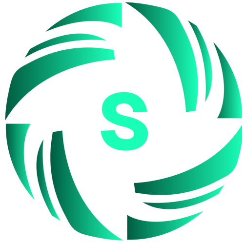

<div align="center">

<div style="margin: 20px 0;">
  
</div>

# 🚀 LightRAG: Specialized Production Fork

<div align="center">
    
    <a href="https://github.com/HKUDS/LightRAG"></a>
</div>

<div align="center">
  <div style="width: 100%; height: 2px; margin: 20px 0; background: linear-gradient(90deg, transparent, #00d9ff, transparent);"></div>
</div>

<p align="center">
  <b>A production-ready fork of LightRAG featuring S3 storage integration, a modernized Web UI, and a robust API.</b>
</p>

</div>

## 🔱 About This Fork

This repository is a specialized fork of [LightRAG](https://github.com/HKUDS/LightRAG), designed to bridge the gap between research and production. While preserving the core "Simple and Fast" philosophy, we have added critical infrastructure components:

- **☁️ S3 Storage Integration**: Native support for S3-compatible object storage (AWS, MinIO, Cloudflare R2) for scalable document and artifact management.
- **🖥️ Modern Web UI**: A completely redesigned interface featuring:
  - **S3 Browser**: Integrated file management system.
  - **File Viewers**: Built-in PDF and text viewers.
  - **Enhanced Layout**: Resizable panes and improved UX.
- **🔌 Robust API**: Expanded REST endpoints supporting multipart uploads, bulk operations, and advanced search parameters.
- **🛡️ Code Quality**: Comprehensive type hinting (Pyright strict), Ruff formatting, and extensive test coverage for critical paths.

---

## 📖 Introduction to LightRAG

**LightRAG** incorporates graph structures into text indexing and retrieval processes. This innovative framework employs a dual-level retrieval system that enhances comprehensive information retrieval from low-level entities to high-level broader topics.

<details>
  <summary><b>Algorithm Flowchart</b></summary>


*Figure 1: LightRAG Indexing Flowchart ([Source](https://learnopencv.com/lightrag/))*

</details>

## ⚡ Quick Start

### 1. Installation

This project uses [uv](https://docs.astral.sh/uv/) for fast and reliable package management.

**Option A: Install from PyPI**
```bash
uv pip install "lightrag-hku[api]"
```

**Option B: Install from Source (Recommended for this Fork)**
```bash
git clone https://github.com/YourUsername/LightRAG.git
cd LightRAG
uv sync --extra api
source .venv/bin/activate
```

### 2. Running the Server (UI + API)

The easiest way to experience the enhancements in this fork is via the LightRAG Server.

1.  **Configure Environment**:
    ```bash
    cp env.example .env
    # Edit .env to add your API keys (OpenAI/Azure/etc.) and S3 credentials
    ```

2.  **Start the Server**:
    ```bash
    lightrag-server
    ```

3.  **Access the UI**:
    Open [http://localhost:9600](http://localhost:9600) to view the Knowledge Graph, upload files via the S3 browser, and perform queries.

### 3. Python API Example

You can also use LightRAG directly in your Python code:

```python
import os
import asyncio
from lightrag import LightRAG, QueryParam
from lightrag.llm.openai import gpt_4o_mini_complete, openai_embed

WORKING_DIR = "./rag_storage"
if not os.path.exists(WORKING_DIR):
    os.mkdir(WORKING_DIR)

async def main():
    # Initialize LightRAG
    rag = LightRAG(
        working_dir=WORKING_DIR,
        embedding_func=openai_embed,
        llm_model_func=gpt_4o_mini_complete,
    )
    await rag.initialize_storages()

    # Insert Document
    await rag.ainsert("LightRAG is a retrieval-augmented generation framework.")

    # Query
    print(await rag.aquery(
        "What is LightRAG?",
        param=QueryParam(mode="hybrid")
    ))

if __name__ == "__main__":
    asyncio.run(main())
```

## 📦 Features & Architecture

### Storage Backends
LightRAG now targets a single, production-grade stack: PostgreSQL with pgvector and AGE-compatible graph support. Object storage remains pluggable (S3 or local).

| Type | Implementations |
|------|-----------------|
| **KV Storage** | PGKVStorage |
| **Vector Storage** | PGVectorStorage (pgvector) |
| **Graph Storage** | PGGraphStorage (AGE/PG) |
| **Object Storage** | **S3Storage (New)**, LocalFileStorage |

### Specialized API Routes
This fork exposes additional endpoints:
- `POST /documents/upload`: Multipart file upload (supports PDF, TXT, MD).
- `GET /storage/list`: List files in S3/Local storage.
- `GET /storage/content`: Retrieve file content.

## 🛠️ Configuration

See `env.example` for a complete list of configuration options. Key variables for this fork:

```ini
# S3 Configuration (Optional)
S3_ENDPOINT_URL=https://<accountid>.r2.cloudflarestorage.com
S3_ACCESS_KEY_ID=<your_access_key>
S3_SECRET_ACCESS_KEY=<your_secret_key>
S3_BUCKET_NAME=lightrag-docs
```

## 📚 Documentation

- [API Documentation](./lightrag/api/README.md)
- [Offline Deployment](./docs/OfflineDeployment.md)
- [Docker Deployment](./docs/DockerDeployment.md)

## 🤝 Contribution

Contributions are welcome! Please ensure you:
1.  Install development dependencies: `uv sync --extra test`
2.  Run tests before submitting: `pytest tests/`
3.  Format code: `ruff format .`

## 📜 License

This project is licensed under the MIT License. See the [LICENSE](LICENSE) file for details.

---
<div align="center">
  <sub>Fork maintained by <a href="https://github.com/clssck">clssck</a>. Based on the excellent work by the <a href="https://github.com/HKUDS">HKUDS</a> team.</sub>
</div>
