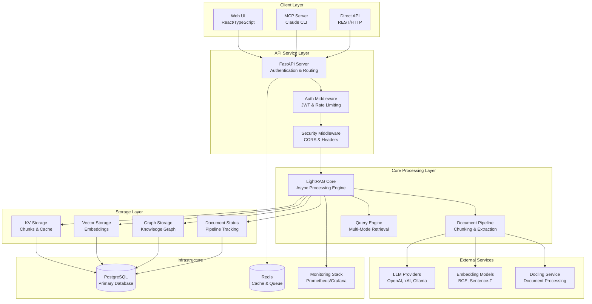
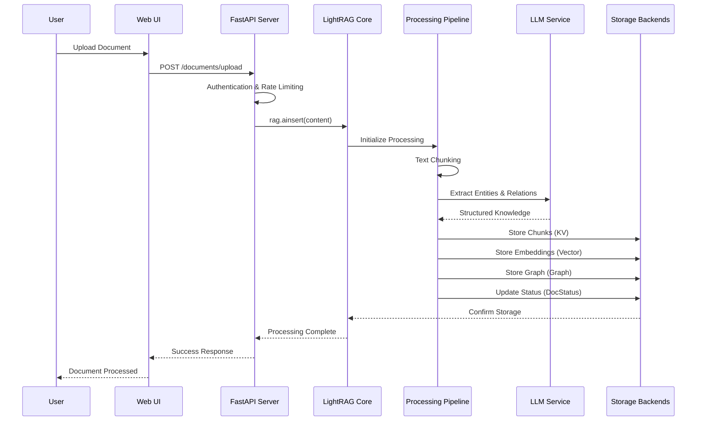
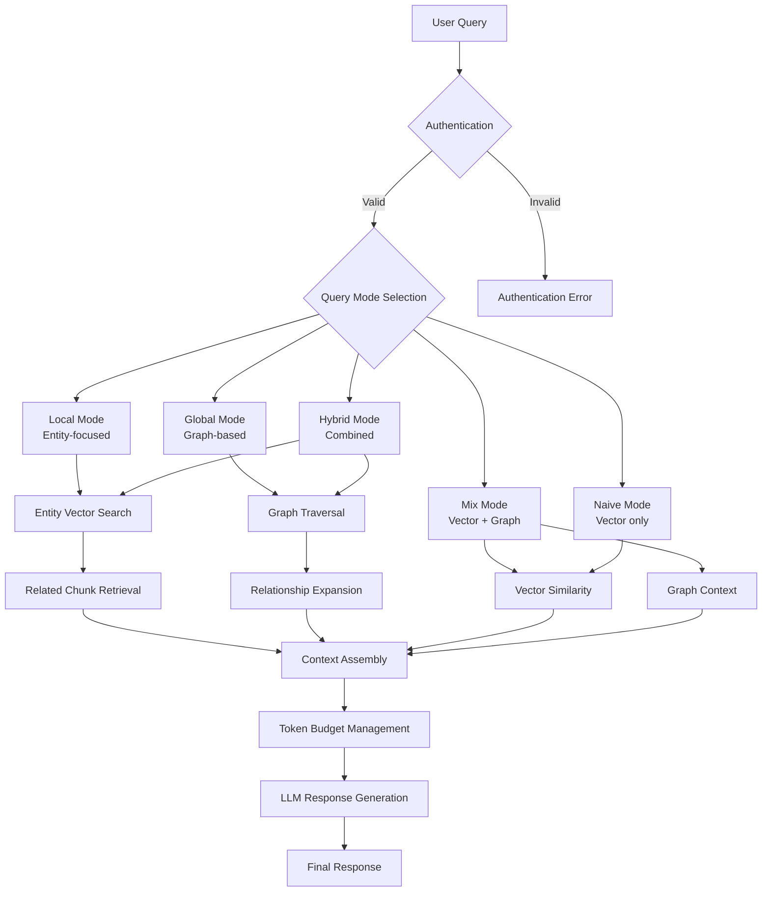
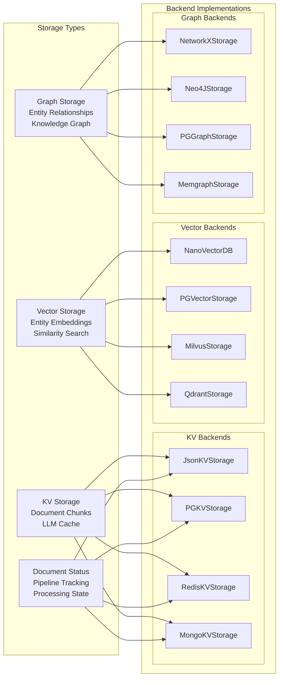
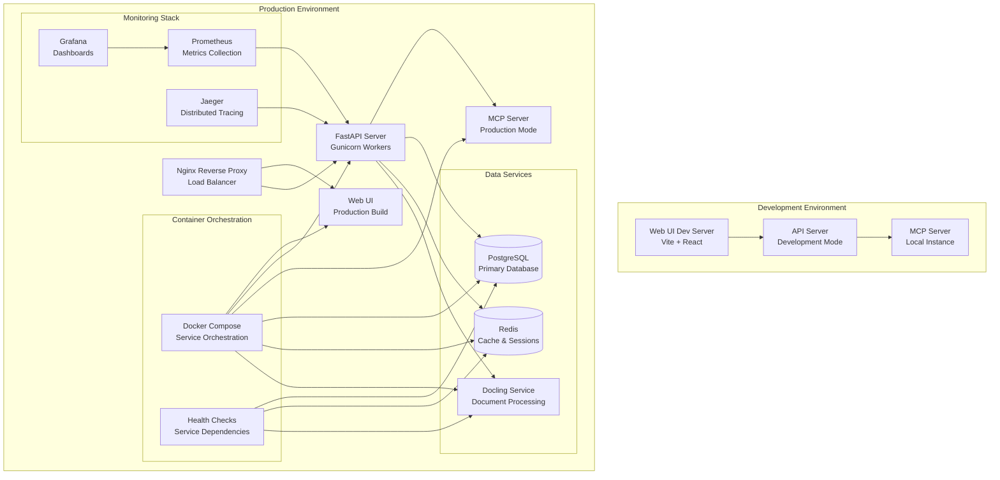
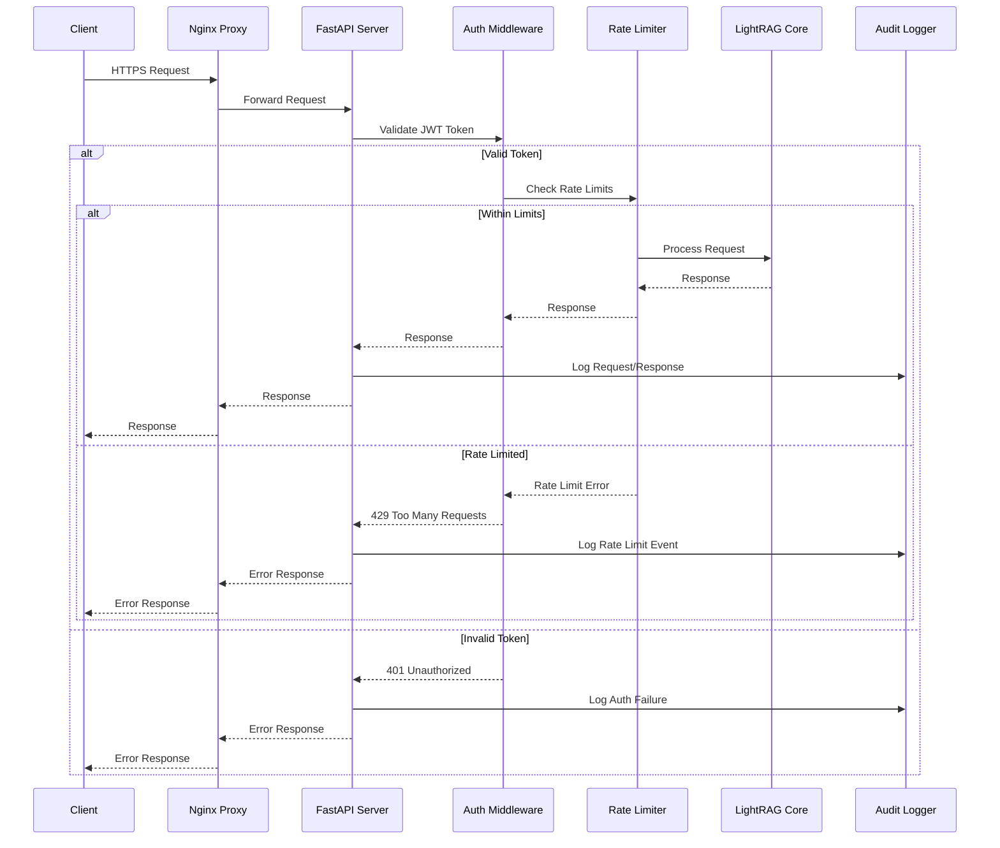
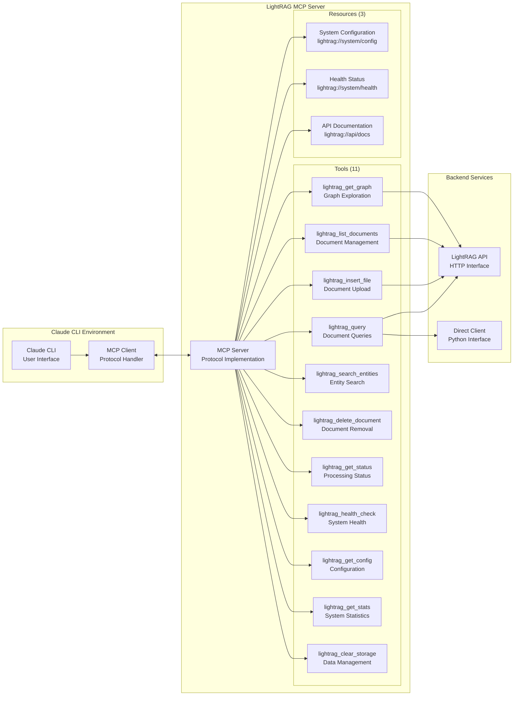
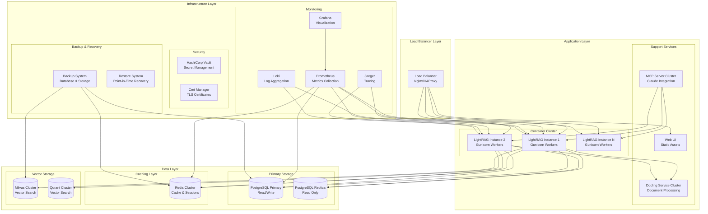
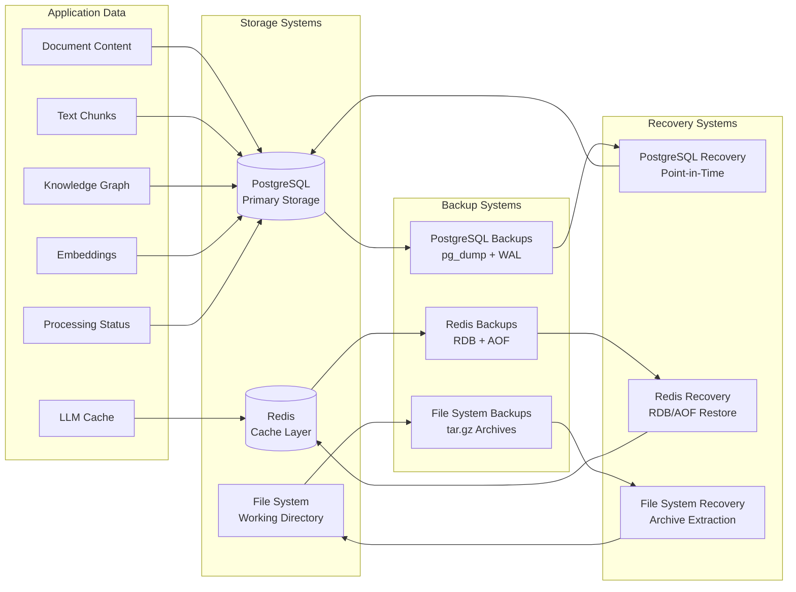

# LightRAG Visual Architecture Diagrams

## System Architecture Overview



## Document Processing Data Flow



## Query Processing Flow



## Storage Architecture Diagram



## Multi-Component Integration



## Authentication and Security Flow



## MCP Server Claude Integration



## Production Deployment Architecture



## Network Communication Diagram

```ascii
┌─────────────────┐    HTTPS/443     ┌─────────────────┐
│   Client Apps   │◄──────────────────►│  Load Balancer  │
│  Web UI, CLI    │                   │   Nginx/HAProxy │
└─────────────────┘                   └─────────────────┘
                                               │
                                      HTTP/8080│
                           ┌───────────────────┼───────────────────┐
                           │                   ▼                   │
                 ┌─────────────────┐ ┌─────────────────┐ ┌─────────────────┐
                 │ LightRAG App 1  │ │ LightRAG App 2  │ │ LightRAG App N  │
                 │   Port 9621     │ │   Port 9622     │ │   Port 962N     │
                 └─────────────────┘ └─────────────────┘ └─────────────────┘
                           │                   │                   │
                           └───────────────────┼───────────────────┘
                                               │
                                      Internal │ Network
                           ┌───────────────────┼───────────────────┐
                           │                   ▼                   │
                 ┌─────────────────┐ ┌─────────────────┐ ┌─────────────────┐
                 │   PostgreSQL    │ │     Redis       │ │  Vector Store   │
                 │   Port 5432     │ │   Port 6379     │ │  Various Ports  │
                 └─────────────────┘ └─────────────────┘ └─────────────────┘
                           │                   │                   │
                           └───────────────────┼───────────────────┘
                                               │
                                   Monitoring  │ Stack
                           ┌───────────────────┼───────────────────┐
                           │                   ▼                   │
                 ┌─────────────────┐ ┌─────────────────┐ ┌─────────────────┐
                 │   Prometheus    │ │    Grafana      │ │     Jaeger      │
                 │   Port 9090     │ │   Port 3000     │ │   Port 16686    │
                 └─────────────────┘ └─────────────────┘ └─────────────────┘
```

## Data Persistence and Backup Flow



This visual architecture documentation provides comprehensive diagrams covering all aspects of the LightRAG system architecture, from high-level component interactions to detailed deployment patterns and data flows.
