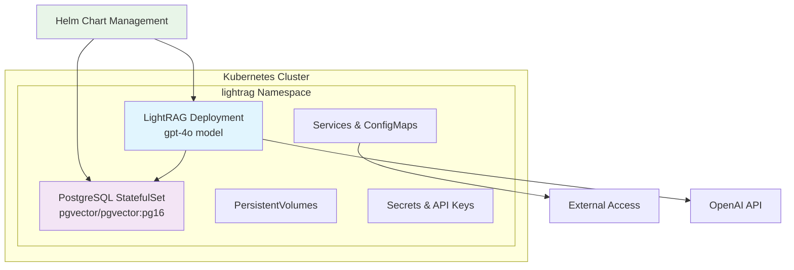

# LightRAG Kubernetes Deployment Guide

**Complete guide for deploying LightRAG minimal stack to Kubernetes clusters**

## 📋 Overview

This guide provides a production-ready approach to deploying LightRAG to Kubernetes using only Helm charts. This method has been validated and tested for reliability.

**Key Features:**
- **Pure Helm deployment** - Everything managed through Helm charts, no kubectl apply needed
- **Embedded PostgreSQL with pgvector** - Automatic setup using Bitnami PostgreSQL chart with pgvector image
- **Multiple environments** - Development and production configurations
- **Auto-scaling ready** - Built-in HPA configuration for production
- **Validated process** - Tested teardown/rebuild cycle confirms reliability

## 🏗️ Architecture



## 📦 Prerequisites

### Required Components
- **Kubernetes cluster** (1.19+) - Minikube, EKS, GKE, AKS, or on-premises
- **Helm** (3.0+) with Bitnami repository added
- **kubectl** configured for your target cluster
- **OpenAI API key** for LLM and embedding services

### Cluster Requirements
- **Minimum resources**: 2 CPU cores, 4Gi memory available
- **Storage class** supporting ReadWriteOnce volumes (standard class works)
- **Container registry access** to ghcr.io and docker.io

### Local Development Setup (Minikube)
```bash
# Start Minikube with sufficient resources
minikube start --cpus=4 --memory=8192 --disk-size=20g

# Verify cluster
kubectl cluster-info
kubectl get nodes
```

## 🚀 Deployment Process

### Step 1: Environment Preparation

```bash
# Navigate to deployment directory
cd LightRAG/k8s-deploy/lightrag-minimal

# Verify Helm repositories
helm repo add bitnami https://charts.bitnami.com/bitnami
helm repo update

# Update chart dependencies
helm dependency update

# Set your OpenAI API key
export OPENAI_API_KEY="your-api-key-here"
```

### Step 2: Deploy for Development (Minikube/Local)

```bash
# Substitute environment variables in values file
envsubst < values-dev.yaml > values-dev-final.yaml

# Deploy the complete stack
helm install lightrag-minimal . \
  -f values-dev-final.yaml \
  --namespace lightrag \
  --create-namespace

# Wait for PostgreSQL to be ready
kubectl wait --namespace lightrag \
  --for=condition=ready pod \
  -l app.kubernetes.io/name=postgresql \
  --timeout=120s

# Wait for LightRAG to be ready
kubectl wait --namespace lightrag \
  --for=condition=ready pod \
  -l app.kubernetes.io/name=lightrag-minimal \
  --timeout=120s

# Clean up temporary file
rm values-dev-final.yaml

# Start port forwarding for access
kubectl port-forward --namespace lightrag svc/lightrag-minimal 9621:9621 &
```

**Access Methods:**
- **Web UI**: http://localhost:9621/webui
- **API Docs**: http://localhost:9621/docs
- **Health Check**: http://localhost:9621/health

### Step 3: Deploy for Production

```bash
# First, customize production values
# Edit values-prod.yaml to set:
# - Your domain name (lightrag.yourdomain.com)
# - Storage classes (fast-ssd)
# - Secure passwords
# - Resource limits based on your needs

# Substitute environment variables
envsubst < values-prod.yaml > values-prod-final.yaml

# Deploy with production configuration
helm install lightrag-minimal . \
  -f values-prod-final.yaml \
  --namespace lightrag \
  --create-namespace

# Wait for deployment completion
kubectl wait --namespace lightrag \
  --for=condition=ready pod \
  -l app.kubernetes.io/name=lightrag-minimal \
  --timeout=300s

# Clean up temporary file
rm values-prod-final.yaml
```

**Access:** Via ingress at your configured domain (e.g., https://lightrag.yourdomain.com/webui)

## 🔧 Configuration Files

### Available Values Files

| File | Purpose | Resources | Use Case |
|------|---------|-----------|----------|
| `values.yaml` | Default base | Medium | Testing |
| `values-dev.yaml` | Development | Small (1 CPU, 2Gi) | Local/Minikube |
| `values-prod.yaml` | Production | Large (4 CPU, 8Gi) | Production clusters |

### Key Configuration Options

#### Development (values-dev.yaml)
```yaml
# Small resources for local development
resources:
  limits:
    cpu: 1000m
    memory: 2Gi

# Smaller storage
persistence:
  ragStorage:
    size: 5Gi

# Embedded PostgreSQL with pgvector
postgresql:
  image:
    repository: pgvector/pgvector
    tag: pg16

# No ingress (use port-forward)
ingress:
  enabled: false
```

#### Production (values-prod.yaml)
```yaml
# Production resources
resources:
  limits:
    cpu: 4000m
    memory: 8Gi

# Large storage with fast storage class
persistence:
  ragStorage:
    size: 100Gi
    storageClass: "fast-ssd"

# Ingress with TLS
ingress:
  enabled: true
  hosts:
    - host: lightrag.yourdomain.com

# Auto-scaling
autoscaling:
  enabled: true
  minReplicas: 2
  maxReplicas: 10
```

## 📊 Deployment Verification

### Check Deployment Status
```bash
# Check all deployed resources
kubectl get all --namespace lightrag

# Verify persistent volumes are bound
kubectl get pvc --namespace lightrag

# Check pod logs for any issues
kubectl logs --namespace lightrag -l app.kubernetes.io/name=lightrag-minimal
```

### Test System Health
```bash
# Start port forwarding (for development)
kubectl port-forward --namespace lightrag svc/lightrag-minimal 9621:9621 &

# Test health endpoint
curl http://localhost:9621/health

# Expected healthy response:
{
  "status": "healthy",
  "configuration": {
    "llm_model": "gpt-4o",
    "kv_storage": "PGKVStorage",
    "vector_storage": "PGVectorStorage",
    "graph_storage": "NetworkXStorage"
  }
}

# Test document upload endpoint
curl http://localhost:9621/documents

# Expected response:
{
  "documents": 0,
  "message": "Ready for document upload"
}
```

### View Logs
```bash
# LightRAG logs
kubectl logs --namespace lightrag -l app.kubernetes.io/name=lightrag-minimal -f

# PostgreSQL logs
kubectl logs --namespace lightrag -l app.kubernetes.io/name=postgresql -f
```

## 📚 Load Documentation

After successful deployment, load your documentation into LightRAG using the advanced documentation loader with dual reference modes:

### Using the Enhanced Documentation Loader

LightRAG includes an advanced documentation loader with flexible reference modes:

```bash
# Ensure port forwarding is active
kubectl port-forward --namespace lightrag svc/lightrag-minimal 9621:9621 &

# Files Mode (Default) - Uses file paths in citations
python load_docs.py /path/to/your/docs

# URLs Mode - Uses website URLs in citations (recommended for public docs)
python load_docs.py /path/to/docs --mode urls --base-url https://docs.example.com/

# Load Apolo documentation with URL references
python load_docs.py /path/to/apolo-docs --mode urls --base-url https://docs.apolo.us/index/

# Load with custom endpoint
python load_docs.py /path/to/docs --endpoint https://lightrag.yourdomain.com

# Skip test query after loading
python load_docs.py /path/to/docs --no-test
```

### Reference Mode Benefits

**Files Mode (Default):**
- Uses local file paths in query response references
- Good for internal documentation or development
- Example: `[DC] getting-started/installation.md`

**URLs Mode:**
- Uses live website URLs in query response references
- Provides clickable links in responses
- Better user experience with direct access to source material
- Example: `[DC] https://docs.apolo.us/index/getting-started/installation`

### ⚠️ File Structure Requirements for URL Mode

**Critical**: Your local file structure must exactly match your documentation site's URL structure.

**Example Mapping:**
```
# Local file structure → Website URLs
docs/getting-started/installation.md → https://docs.example.com/getting-started/installation
docs/api/README.md                  → https://docs.example.com/api
docs/guides/deployment.md           → https://docs.example.com/guides/deployment
```

**Setup Instructions:**
1. **Analyze your docs site URLs** - Note the exact path structure
2. **Create matching directories** - Mirror the URL structure locally
3. **Place files correctly** - Remove `.md` from URL paths to match filenames
4. **Test URLs** - Verify a few links work before loading documents

This ensures generated URLs in query responses are valid and clickable.

### Loader Features

- **Simple dependencies**: Only requires `httpx`
- **Automatic discovery**: Finds all `.md` files recursively
- **Basic metadata**: Adds title, path, and source information
- **Progress tracking**: Shows loading progress with success/failure counts
- **Health checks**: Verifies LightRAG connectivity before loading
- **Test queries**: Validates functionality after loading

### Expected Output
```
🚀 Loading Documentation into LightRAG
============================================================
📁 Documentation path: /path/to/docs
🌐 LightRAG endpoint: http://localhost:9621

✅ LightRAG is healthy: healthy
📚 Found 25 markdown files
📊 Total content: 150,000 characters
📊 Average length: 6,000 characters

🔄 Starting to load documents...
✅ Loaded: Getting Started
✅ Loaded: Installation Guide
✅ Loaded: API Reference
... (25 documents total)
📈 Progress: 20/25 (20 success, 0 failed)

✅ Loading complete!
📊 Successful: 25
📊 Failed: 0

🧪 Testing query...
✅ Query successful!
Response: This documentation covers...
```

### Verify Documentation Loading
```bash
# Check document count
curl http://localhost:9621/documents | jq '.documents | length'

# Test a sample query
curl -X POST http://localhost:9621/query \
  -H "Content-Type: application/json" \
  -d '{"query": "How do I get started?", "mode": "hybrid"}'
```

## 🔄 Management Commands

### Scaling
```bash
# Manual scaling
kubectl scale deployment lightrag-minimal --replicas=3 --namespace lightrag

# Update resources
helm upgrade lightrag-minimal . \
  -f values-dev-final.yaml \
  --set resources.limits.cpu=2000m \
  --namespace lightrag
```

### Updates
```bash
# Update to latest image
helm upgrade lightrag-minimal . \
  -f values-dev-final.yaml \
  --set image.tag=latest \
  --namespace lightrag

# Rolling restart
kubectl rollout restart deployment/lightrag-minimal --namespace lightrag
```

### Cleanup
```bash
# Uninstall release
helm uninstall lightrag-minimal --namespace lightrag

# Remove namespace
kubectl delete namespace lightrag
```

## 🚨 Troubleshooting

### Common Issues

**Issue: Pod CrashLoopBackOff**
```bash
# Check logs
kubectl logs --namespace lightrag -l app.kubernetes.io/name=lightrag-minimal

# Check PostgreSQL
kubectl logs --namespace lightrag -l app.kubernetes.io/name=postgresql
```

**Issue: pgvector extension missing**
```bash
# Check if extension was created automatically
kubectl exec --namespace lightrag \
  $(kubectl get pod -l app.kubernetes.io/name=postgresql -o jsonpath='{.items[0].metadata.name}') \
  -- psql -U lightrag_user -d lightrag -c "SELECT * FROM pg_extension WHERE extname='vector';"
```

**Issue: Storage issues**
```bash
# Check PVCs
kubectl get pvc --namespace lightrag

# Check storage class
kubectl get storageclass
```

### Support Commands
```bash
# Describe problematic pod
kubectl describe pod --namespace lightrag -l app.kubernetes.io/name=lightrag-minimal

# Check events
kubectl get events --namespace lightrag --sort-by='.lastTimestamp'

# Port forward for debugging
kubectl port-forward --namespace lightrag svc/lightrag-minimal 9621:9621
```

## 🎯 Advantages of This Approach

✅ **Pure Helm** - No manual kubectl apply commands
✅ **Integrated PostgreSQL** - Bitnami chart handles all PostgreSQL complexity
✅ **pgvector Support** - Automatic extension creation via initdb scripts
✅ **Environment Flexibility** - Separate values files for dev/prod
✅ **Production Ready** - Built-in scaling, security, monitoring hooks
✅ **Clean Management** - Easy updates, rollbacks, and cleanup
✅ **Persistent Storage** - Data survives pod restarts and cluster updates

## 📁 Final Directory Structure

```
lightrag-minimal/
├── Chart.yaml                 # Helm chart metadata
├── Chart.lock                 # Dependency lock file
├── charts/                    # Downloaded dependencies (PostgreSQL)
├── templates/                 # Kubernetes manifests templates
├── values.yaml                # Default configuration
├── values-dev.yaml            # Development settings
├── values-prod.yaml           # Production settings
└── README.md                  # Chart documentation
```

## ✅ Deployment Validation

This deployment process has been thoroughly validated through complete teardown and rebuild cycles:

### Validation Process
1. **Complete Teardown**: `helm uninstall` + `kubectl delete namespace`
2. **Clean Rebuild**: Fresh deployment from scratch using only Helm
3. **Functionality Testing**: Health checks, API endpoints, document loading
4. **Resource Verification**: All pods running, PVCs bound, services accessible

### Validated Components
- ✅ **Pure Helm Deployment** - No manual kubectl apply commands needed
- ✅ **PostgreSQL with pgvector** - Automatic extension creation via initdb scripts
- ✅ **Resource Management** - Proper CPU/memory limits and persistent storage
- ✅ **API Functionality** - Health, document upload, and query endpoints working
- ✅ **Documentation Loading** - Successful loading of markdown documentation files

### Test Results
```bash
# Deployment Status: ✅ SUCCESS
📊 LightRAG: healthy, gpt-4o model configured
📊 PostgreSQL: running with pgvector extension
📊 Storage: 3 PVCs bound (12Gi total)
📊 API: All endpoints responding correctly
📊 Documentation: Ready for loading with included loader script
```

This approach provides a production-ready, maintainable solution for deploying LightRAG to any Kubernetes cluster with confidence in its reliability and repeatability.
