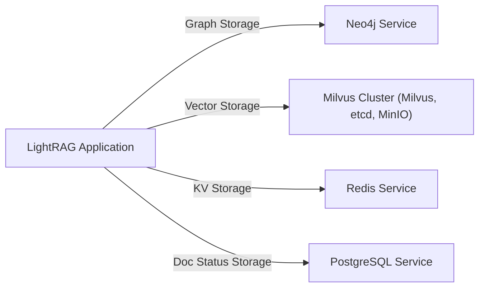
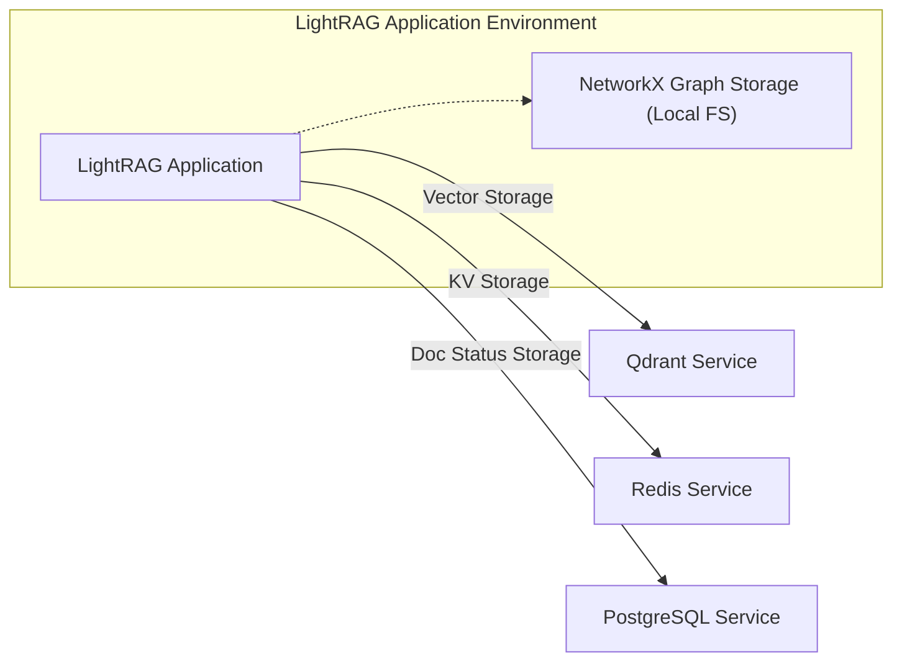
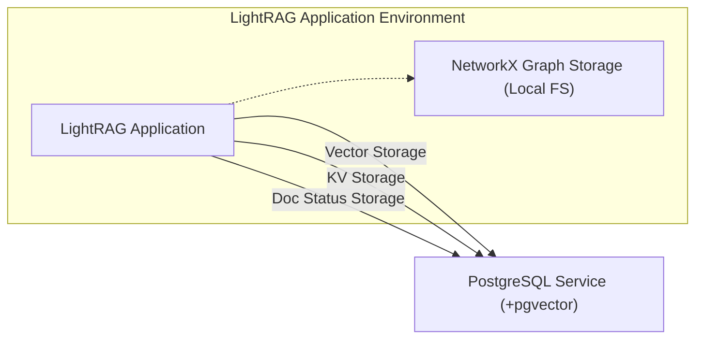
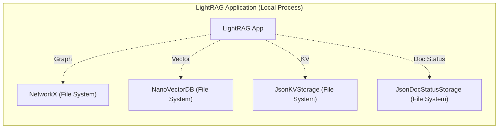
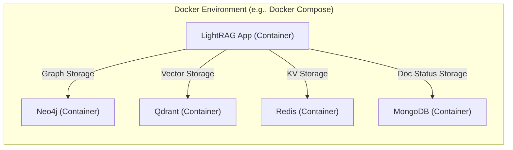

# LightRAG Storage Stack Configurations Report

## Executive Summary

LightRAG supports a modular storage architecture with 4 distinct storage types that can be mixed and matched:
- **Graph Storage**: Knowledge graph relationships
- **Vector Storage**: Document embeddings 
- **KV Storage**: Key-value pairs and metadata
- **Document Status Storage**: Document processing status

This report analyzes 25+ storage implementations across 8 database technologies to provide recommendations for different use cases.

## Storage Architecture Overview

### Storage Types & Available Implementations

| Storage Type | Implementations | Count |
|--------------|----------------|-------|
| **Graph Storage** | NetworkXStorage, Neo4JStorage, PGGraphStorage, AGEStorage¹, MongoGraphStorage¹ | 5 |
| **Vector Storage** | NanoVectorDBStorage, MilvusVectorDBStorage, ChromaVectorDBStorage, PGVectorStorage, FaissVectorDBStorage, QdrantVectorDBStorage, MongoVectorDBStorage | 7 |
| **KV Storage** | JsonKVStorage, RedisKVStorage, PGKVStorage, MongoKVStorage | 4 |
| **Doc Status Storage** | JsonDocStatusStorage, PGDocStatusStorage, MongoDocStatusStorage | 3 |

¹ *Currently commented out in production*

## Database Technology Analysis

### 1. PostgreSQL + pgvector
**Implementations**: PGVectorStorage, PGKVStorage, PGGraphStorage, PGDocStatusStorage

**Strengths:**
- ✅ **Unified Database**: Single database for all storage types
- ✅ **ACID Compliance**: Full transactional support
- ✅ **Mature Ecosystem**: Well-established, enterprise-ready
- ✅ **Minimal**: Single database to maintain
- ✅ **pgvector Extension**: Native vector operations with good performance
- ✅ **SQL Familiarity**: Easy to query and debug

**Weaknesses:**
- ❌ **Graph Limitations**: Requires AGE extension for advanced graph operations
- ❌ **Vector Performance**: Good but not specialized vector database performance
- ❌ **Single Point of Failure**: All data in one database

**Configuration:**
```yaml
LIGHTRAG_KV_STORAGE: PGKVStorage
LIGHTRAG_VECTOR_STORAGE: PGVectorStorage  
LIGHTRAG_DOC_STATUS_STORAGE: PGDocStatusStorage
LIGHTRAG_GRAPH_STORAGE: PGGraphStorage  # Requires AGE extension
```

### 2. Neo4j (Graph Specialist)
**Implementations**: Neo4JStorage

**Strengths:**
- ✅ **Graph Optimization**: Purpose-built for graph operations
- ✅ **Advanced Graph Analytics**: Complex graph algorithms built-in
- ✅ **Cypher Query Language**: Powerful graph query capabilities
- ✅ **Scalability**: Excellent for large, complex graphs
- ✅ **Visualization**: Rich graph visualization tools

**Weaknesses:**
- ❌ **Graph Only**: Requires additional databases for vectors/KV
- ❌ **Complexity**: More complex setup and maintenance
- ❌ **Cost**: Enterprise features require licensing
- ❌ **Memory Usage**: Can be memory-intensive

**Typical Configuration:**
```yaml
LIGHTRAG_GRAPH_STORAGE: Neo4JStorage
LIGHTRAG_VECTOR_STORAGE: MilvusVectorDBStorage  # Or Qdrant
LIGHTRAG_KV_STORAGE: RedisKVStorage
LIGHTRAG_DOC_STATUS_STORAGE: PGDocStatusStorage
```

### 3. Milvus (Vector Specialist)
**Implementations**: MilvusVectorDBStorage

**Strengths:**
- ✅ **Vector Performance**: Optimized for high-performance vector search
- ✅ **Scalability**: Designed for billion-scale vector collections
- ✅ **Multiple Indexes**: Various indexing algorithms (IVF, HNSW, etc.)
- ✅ **GPU Support**: CUDA acceleration for vector operations
- ✅ **Cloud Native**: Kubernetes-ready architecture

**Weaknesses:**
- ❌ **Complexity**: Complex distributed architecture
- ❌ **Resource Usage**: High memory and compute requirements
- ❌ **Overkill**: May be excessive for smaller datasets
- ❌ **Dependencies**: Requires etcd and MinIO for full deployment

**Typical Configuration:**
```yaml
LIGHTRAG_VECTOR_STORAGE: MilvusVectorDBStorage
LIGHTRAG_GRAPH_STORAGE: Neo4JStorage
LIGHTRAG_KV_STORAGE: RedisKVStorage
LIGHTRAG_DOC_STATUS_STORAGE: MongoDocStatusStorage
```

### 4. Qdrant (Vector Specialist)
**Implementations**: QdrantVectorDBStorage

**Strengths:**
- ✅ **Performance**: High-performance vector search with Rust backend
- ✅ **Simplicity**: Easier deployment than Milvus
- ✅ **Filtering**: Advanced payload filtering capabilities
- ✅ **API**: Rich REST and gRPC APIs
- ✅ **Memory Efficiency**: Lower memory footprint than Milvus

**Weaknesses:**
- ❌ **Ecosystem**: Smaller ecosystem compared to alternatives
- ❌ **Vector Only**: Requires additional databases for other storage types

### 5. MongoDB (Multi-Purpose)
**Implementations**: MongoKVStorage, MongoVectorDBStorage, MongoDocStatusStorage

**Strengths:**
- ✅ **Flexibility**: Schema-less document storage
- ✅ **Vector Search**: Native vector search capabilities (Atlas Search)
- ✅ **Multi-Purpose**: Can handle KV, vectors, and document status
- ✅ **Scalability**: Horizontal scaling with sharding
- ✅ **Developer Friendly**: Easy to work with JSON documents

**Weaknesses:**
- ❌ **Graph Limitations**: Not optimized for graph operations
- ❌ **Vector Performance**: Vector search not as optimized as specialists
- ❌ **Memory Usage**: Can be memory-intensive for large datasets

### 6. Redis (KV Specialist)
**Implementations**: RedisKVStorage

**Strengths:**
- ✅ **Speed**: In-memory performance for KV operations
- ✅ **Simplicity**: Simple key-value operations
- ✅ **Data Structures**: Rich data structures (lists, sets, hashes)
- ✅ **Caching**: Excellent for caching and session storage

**Weaknesses:**
- ❌ **Memory Bound**: Limited by available RAM
- ❌ **KV Only**: Only suitable for key-value storage
- ❌ **Persistence**: Data persistence requires configuration

### 7. Local File Storage
**Implementations**: NetworkXStorage, JsonKVStorage, JsonDocStatusStorage, NanoVectorDBStorage, FaissVectorDBStorage

**Strengths:**
- ✅ **Simplicity**: No external dependencies
- ✅ **Development**: Perfect for development and testing
- ✅ **Portability**: Easy to backup and move
- ✅ **Cost**: No infrastructure costs

**Weaknesses:**
- ❌ **Scalability**: Limited by single machine resources
- ❌ **Concurrency**: No built-in concurrent access
- ❌ **Performance**: Limited performance for large datasets
- ❌ **Reliability**: Single point of failure

### 8. ChromaDB (Vector Specialist)
**Implementations**: ChromaVectorDBStorage

**Strengths:**
- ✅ **Simplicity**: Easy to deploy and use
- ✅ **Python Native**: Built for Python ML workflows
- ✅ **Metadata**: Rich metadata filtering capabilities
- ✅ **Local/Distributed**: Can run locally or distributed

**Weaknesses:**
- ❌ **Performance**: Slower than Milvus/Qdrant for large scales
- ❌ **Maturity**: Newer project with evolving feature set

## Recommended Stack Configurations

### 1. 🏆 **Production High-Performance Stack**
**Best for**: Large-scale production deployments, complex graph analytics

```yaml
LIGHTRAG_GRAPH_STORAGE: Neo4JStorage
LIGHTRAG_VECTOR_STORAGE: MilvusVectorDBStorage  
LIGHTRAG_KV_STORAGE: RedisKVStorage
LIGHTRAG_DOC_STATUS_STORAGE: PGDocStatusStorage
```

**Services Required:**
- Neo4j (Graph operations)
- Milvus + etcd + MinIO (Vector search)
- Redis (KV cache)
- PostgreSQL (Document status)

**Pros**: Maximum performance, specialized for each data type
**Cons**: High complexity, resource intensive, expensive



### 2. 🎯 **Production Balanced Stack**
**Best for**: Production deployments prioritizing simplicity

```yaml
LIGHTRAG_GRAPH_STORAGE: NetworkXStorage
LIGHTRAG_VECTOR_STORAGE: QdrantVectorDBStorage
LIGHTRAG_KV_STORAGE: RedisKVStorage  
LIGHTRAG_DOC_STATUS_STORAGE: PGDocStatusStorage
```

**Services Required:**
- Qdrant (Vector search)
- Redis (KV cache)
- PostgreSQL (Document status)
- File system (Graph storage)

**Pros**: Good performance, simpler than full specialist stack
**Cons**: Graph operations limited by file-based storage



### 3. 💰 **Production Minimal Stack**
**Best for**: Budget-conscious production deployments

```yaml
LIGHTRAG_GRAPH_STORAGE: NetworkXStorage
LIGHTRAG_VECTOR_STORAGE: PGVectorStorage
LIGHTRAG_KV_STORAGE: PGKVStorage
LIGHTRAG_DOC_STATUS_STORAGE: PGDocStatusStorage
```

**Services Required:**
- PostgreSQL + pgvector (All storage except graph)
- File system (Graph storage)

**Pros**: Single database, low cost, good for medium scale
**Cons**: Not optimized for very large datasets or complex graphs



### 4. 🚀 **Development & Testing Stack**
**Best for**: Local development, testing, small deployments

```yaml
LIGHTRAG_GRAPH_STORAGE: NetworkXStorage
LIGHTRAG_VECTOR_STORAGE: NanoVectorDBStorage
LIGHTRAG_KV_STORAGE: JsonKVStorage
LIGHTRAG_DOC_STATUS_STORAGE: JsonDocStatusStorage
```

**Services Required:**
- None (all file-based)

**Pros**: Zero infrastructure, fast setup, portable
**Cons**: Limited scalability and performance



### 5. 🐳 **Docker All-in-One Stack**
**Best for**: Containerized deployments, cloud environments

```yaml
LIGHTRAG_GRAPH_STORAGE: Neo4JStorage
LIGHTRAG_VECTOR_STORAGE: QdrantVectorDBStorage
LIGHTRAG_KV_STORAGE: RedisKVStorage
LIGHTRAG_DOC_STATUS_STORAGE: MongoDocStatusStorage
```

**Services Required:**
- Neo4j (Graph)
- Qdrant (Vector)
- Redis (KV)
- MongoDB (Document status)

**Pros**: Cloud-native, each service containerized
**Cons**: More services to manage



## Performance Comparison

### Vector Search Performance (Approximate)
| Implementation | Small (1K docs) | Medium (100K docs) | Large (1M+ docs) | Memory Usage |
|---------------|-----------------|--------------------|-----------------|--------------| 
| MilvusVectorDB | ⭐⭐⭐⭐⭐ | ⭐⭐⭐⭐⭐ | ⭐⭐⭐⭐⭐ | High |
| QdrantVectorDB | ⭐⭐⭐⭐⭐ | ⭐⭐⭐⭐⭐ | ⭐⭐⭐⭐ | Medium |
| PGVectorStorage | ⭐⭐⭐⭐ | ⭐⭐⭐ | ⭐⭐ | Medium |
| ChromaVectorDB | ⭐⭐⭐⭐ | ⭐⭐⭐ | ⭐⭐ | Medium |
| FaissVectorDB | ⭐⭐⭐ | ⭐⭐⭐ | ⭐⭐⭐ | Low |
| NanoVectorDB | ⭐⭐⭐ | ⭐⭐ | ⭐ | Low |

### Graph Operations Performance
| Implementation | Node Queries | Edge Traversal | Complex Analytics | Scalability |
|---------------|--------------|----------------|------------------|-------------|
| Neo4JStorage | ⭐⭐⭐⭐⭐ | ⭐⭐⭐⭐⭐ | ⭐⭐⭐⭐⭐ | ⭐⭐⭐⭐⭐ |
| PGGraphStorage | ⭐⭐⭐⭐ | ⭐⭐⭐ | ⭐⭐⭐ | ⭐⭐⭐⭐ |
| NetworkXStorage | ⭐⭐⭐ | ⭐⭐⭐ | ⭐⭐ | ⭐⭐ |

### KV Operations Performance  
| Implementation | Read Speed | Write Speed | Concurrency | Persistence |
|---------------|------------|-------------|-------------|-------------|
| RedisKVStorage | ⭐⭐⭐⭐⭐ | ⭐⭐⭐⭐⭐ | ⭐⭐⭐⭐⭐ | ⭐⭐⭐ |
| PGKVStorage | ⭐⭐⭐⭐ | ⭐⭐⭐⭐ | ⭐⭐⭐⭐ | ⭐⭐⭐⭐⭐ |
| MongoKVStorage | ⭐⭐⭐⭐ | ⭐⭐⭐⭐ | ⭐⭐⭐⭐ | ⭐⭐⭐⭐⭐ |
| JsonKVStorage | ⭐⭐ | ⭐⭐ | ⭐ | ⭐⭐⭐⭐⭐ |

## Deployment Considerations

### Resource Requirements

| Configuration | CPU | Memory | Storage | Network |
|--------------|-----|--------|---------|---------|
| Development Stack | 2 cores | 4GB | 10GB | Minimal |
| Minimal Stack | 4 cores | 8GB | 50GB | Medium |
| Balanced Stack | 8 cores | 16GB | 100GB | High |
| High-Performance Stack | 16+ cores | 32GB+ | 500GB+ | Very High |

### Maintenance Complexity

| Stack Type | Setup Complexity | Operational Overhead | Monitoring | Backup Strategy |
|-----------|------------------|---------------------|------------|-----------------|
| Development | ⭐ | ⭐ | ⭐ | Simple |
| Minimal | ⭐⭐ | ⭐⭐ | ⭐⭐ | Medium |
| Balanced | ⭐⭐⭐ | ⭐⭐⭐ | ⭐⭐⭐ | Complex |
| High-Performance | ⭐⭐⭐⭐⭐ | ⭐⭐⭐⭐⭐ | ⭐⭐⭐⭐⭐ | Very Complex |

## Migration Paths

### Development → Production
1. Start with Development Stack (all file-based)
2. Migrate to Minimal Stack (PostgreSQL-based)
3. Scale to Balanced Stack (add specialized vector DB)
4. Optimize with High-Performance Stack (full specialization)

### Data Migration Tools
- **Database-specific**: Use native tools (pg_dump, neo4j-admin, etc.)
- **LightRAG native**: Built-in export/import capabilities
- **Cross-platform**: JSON export for universal compatibility

## Recommendations by Use Case

### 📚 **Documentation/Knowledge Base**
- **Small (<10K docs)**: Development Stack
- **Medium (<100K docs)**: Minimal Stack  
- **Large (>100K docs)**: Balanced Stack

### 🔬 **Research/Analytics**
- **Graph-heavy**: High-Performance Stack with Neo4j
- **Vector-heavy**: Balanced Stack with Milvus
- **Mixed workload**: Balanced Stack

### 💼 **Enterprise**
- **High Availability**: High-Performance Stack with clustering
- **Budget Conscious**: Minimal Stack with PostgreSQL
- **Regulatory**: On-premises with full control

### 🚀 **Startups/SMBs**
- **MVP**: Development Stack
- **Growing**: Minimal Stack
- **Scaling**: Balanced Stack

## Conclusion

The **Minimal Stack** (PostgreSQL + NetworkX) provides the best balance of performance, complexity, and cost for most use cases. It offers:

- ✅ Production-ready reliability
- ✅ Reasonable performance for medium-scale deployments  
- ✅ Low operational overhead
- ✅ Clear upgrade path to specialized components

For specialized needs:
- **High graph complexity** → Add Neo4j
- **High vector performance** → Add Qdrant/Milvus
- **High concurrency KV** → Add Redis

The modular architecture allows gradual optimization based on actual performance bottlenecks rather than premature optimization.

---

*Report generated based on LightRAG v1.3.7 implementation analysis*