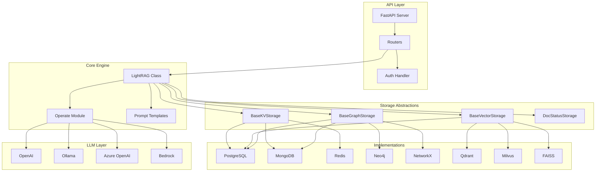
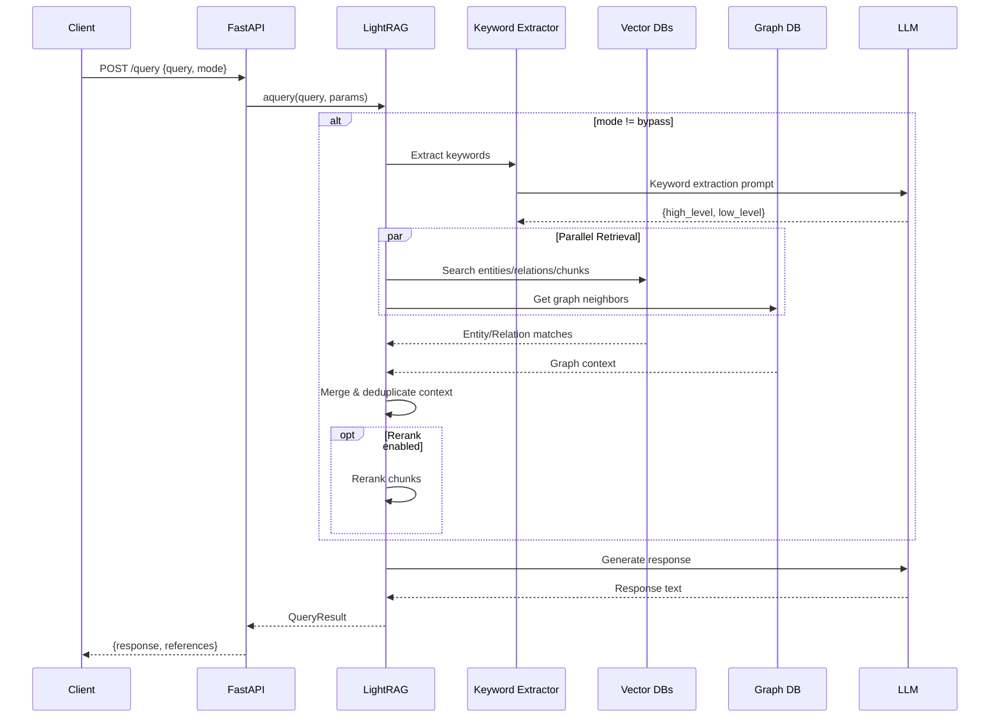

# LightRAG Architecture Overview

> Technical deep-dive into LightRAG's Graph-Enhanced RAG system architecture

**Version**: 1.4.9.1 | **Last Updated**: December 2025

---

## Table of Contents

1. [System Overview](#system-overview)
2. [Core Architecture](#core-architecture)
3. [Data Flow](#data-flow)
4. [Component Breakdown](#component-breakdown)
5. [Storage Architecture](#storage-architecture)
6. [Query Pipeline](#query-pipeline)
7. [Entity-Relationship Diagrams](#entity-relationship-diagrams)

---

## System Overview

LightRAG is a **Graph-Enhanced Retrieval-Augmented Generation** framework that combines knowledge graph construction with vector similarity search to provide contextually rich, accurate responses.

### Key Differentiators

| Feature | Traditional RAG | LightRAG |
|---------|----------------|----------|
| Retrieval | Vector similarity only | Graph + Vector hybrid |
| Context | Flat document chunks | Entity-Relation aware |
| Query Modes | Single mode | 5 modes (local/global/hybrid/naive/mix) |
| Knowledge | Implicit in embeddings | Explicit knowledge graph |
| Multi-tenant | ❌ | ✅ Full isolation |

### High-Level Architecture

```
┌─────────────────────────────────────────────────────────────────────────────┐
│                              LightRAG System                                │
├─────────────────────────────────────────────────────────────────────────────┤
│                                                                             │
│  ┌─────────────┐    ┌─────────────┐    ┌─────────────┐    ┌─────────────┐  │
│  │   FastAPI   │───▶│   LightRAG  │───▶│   Storage   │───▶│  Backends   │  │
│  │   Server    │    │    Core     │    │   Layer     │    │             │  │
│  └─────────────┘    └─────────────┘    └─────────────┘    └─────────────┘  │
│        │                  │                  │                  │          │
│        │                  ▼                  ▼                  ▼          │
│        │           ┌───────────┐      ┌───────────┐      ┌───────────┐    │
│        │           │ Chunking  │      │ KV Store  │      │ PostgreSQL│    │
│        │           │ + Extract │      │ VectorDB  │      │ MongoDB   │    │
│        │           │ + Merge   │      │ GraphDB   │      │ Neo4j     │    │
│        │           └───────────┘      │ DocStatus │      │ Redis     │    │
│        │                              └───────────┘      └───────────┘    │
│        │                                                                   │
│        ▼                                                                   │
│  ┌─────────────────────────────────────────────────────────────────────┐  │
│  │                     LLM / Embedding Providers                        │  │
│  │  OpenAI │ Azure │ Ollama │ Bedrock │ Anthropic │ HuggingFace │ ... │  │
│  └─────────────────────────────────────────────────────────────────────┘  │
│                                                                             │
└─────────────────────────────────────────────────────────────────────────────┘
```

---

## Core Architecture

### Module Dependency Graph



### Core Class: `LightRAG`

The `LightRAG` class (`lightrag/lightrag.py`) is the central orchestrator:

```
┌────────────────────────────────────────────────────────────────────┐
│                         LightRAG Class                             │
├────────────────────────────────────────────────────────────────────┤
│                                                                    │
│  Configuration                                                     │
│  ├── working_dir: str          # Data storage directory           │
│  ├── workspace: str            # Tenant isolation namespace        │
│  ├── kv_storage: str           # JsonKV/Redis/PG/Mongo            │
│  ├── vector_storage: str       # NanoVDB/Milvus/PG/Qdrant/FAISS   │
│  ├── graph_storage: str        # NetworkX/Neo4j/PG/Memgraph       │
│  └── doc_status_storage: str   # Json/Redis/PG/Mongo              │
│                                                                    │
│  Processing Settings                                               │
│  ├── chunk_token_size: int     # Default: 1200                    │
│  ├── chunk_overlap: int        # Default: 100                     │
│  ├── entity_extract_max_gleaning: int  # Default: 1               │
│  └── max_parallel_insert: int  # Default: 2                       │
│                                                                    │
│  Query Settings                                                    │
│  ├── top_k: int                # Default: 40                      │
│  ├── chunk_top_k: int          # Default: 20                      │
│  ├── max_entity_tokens: int    # Default: 6000                    │
│  ├── max_relation_tokens: int  # Default: 8000                    │
│  └── max_total_tokens: int     # Default: 30000                   │
│                                                                    │
│  Storage Instances                                                 │
│  ├── full_docs: BaseKVStorage                                     │
│  ├── text_chunks: BaseKVStorage                                   │
│  ├── entities_vdb: BaseVectorStorage                              │
│  ├── relationships_vdb: BaseVectorStorage                         │
│  ├── chunks_vdb: BaseVectorStorage                                │
│  ├── chunk_entity_relation_graph: BaseGraphStorage                │
│  └── doc_status: DocStatusStorage                                 │
│                                                                    │
│  Methods                                                           │
│  ├── insert(docs) → track_id                                      │
│  ├── ainsert(docs) → track_id                                     │
│  ├── query(text, params) → response                               │
│  ├── aquery(text, params) → response                              │
│  ├── delete_by_doc(doc_id) → result                               │
│  ├── get_knowledge_graph(label) → KnowledgeGraph                  │
│  └── get_processing_status(track_id) → status                     │
│                                                                    │
└────────────────────────────────────────────────────────────────────┘
```

---

## Data Flow

### Document Ingestion Pipeline

```
┌──────────────────────────────────────────────────────────────────────────┐
│                        Document Ingestion Flow                           │
├──────────────────────────────────────────────────────────────────────────┤
│                                                                          │
│  1. INPUT                                                                │
│     ▼                                                                    │
│  ┌──────────────────┐                                                    │
│  │  Raw Documents   │  ◀── String/List[String] + optional file_paths    │
│  └────────┬─────────┘                                                    │
│           │                                                              │
│  2. CHUNKING                                                             │
│     ▼                                                                    │
│  ┌──────────────────┐                                                    │
│  │ chunking_by_     │  ── chunk_token_size: 1200                        │
│  │ token_size()     │  ── overlap: 100 tokens                           │
│  └────────┬─────────┘  ── optional character split                      │
│           │                                                              │
│  3. ENTITY EXTRACTION                                                    │
│     ▼                                                                    │
│  ┌──────────────────┐                                                    │
│  │ extract_entities │  ── LLM extracts entities + relations             │
│  │ ()               │  ── Parallel processing per chunk                 │
│  └────────┬─────────┘  ── Gleaning for missed entities                  │
│           │                                                              │
│  4. MERGE & UPSERT                                                       │
│     ▼                                                                    │
│  ┌──────────────────┐                                                    │
│  │ merge_nodes_and_ │  ── Deduplicate entities                          │
│  │ edges()          │  ── Summarize descriptions via LLM                │
│  └────────┬─────────┘  ── Upsert to graph + vector DBs                  │
│           │                                                              │
│  5. STORAGE                                                              │
│     ▼                                                                    │
│  ┌──────────────────────────────────────────────────────────────────┐   │
│  │                    Storage Layer (Parallel Write)                 │   │
│  ├──────────────┬──────────────┬──────────────┬──────────────────────┤   │
│  │  full_docs   │ text_chunks  │ entities_vdb │ chunk_entity_graph   │   │
│  │  (KV Store)  │ (KV Store)   │ (Vector DB)  │ (Graph DB)           │   │
│  │              │              │ relations_vdb│                      │   │
│  │              │              │ chunks_vdb   │                      │   │
│  └──────────────┴──────────────┴──────────────┴──────────────────────┘   │
│                                                                          │
└──────────────────────────────────────────────────────────────────────────┘
```

### Entity Extraction Detail

```
┌─────────────────────────────────────────────────────────────────────┐
│                   Entity Extraction Process                         │
├─────────────────────────────────────────────────────────────────────┤
│                                                                     │
│  Input Chunk ────────────────────────────────────────────────────▶ │
│  "Apple Inc. announced new iPhone at Cupertino headquarters..."    │
│                                                                     │
│            ▼                                                        │
│  ┌─────────────────────────────────────────────────────────────┐   │
│  │               LLM Extraction Prompt                          │   │
│  │  - Entity types: Person, Organization, Location, Event...   │   │
│  │  - Output format: entity<SEP>name<SEP>type<SEP>description  │   │
│  │                   relation<SEP>src<SEP>tgt<SEP>kw<SEP>desc   │   │
│  └─────────────────────────────────────────────────────────────┘   │
│            ▼                                                        │
│  ┌─────────────────────────────────────────────────────────────┐   │
│  │                    Extracted Output                          │   │
│  │                                                              │   │
│  │  ENTITIES:                                                   │   │
│  │  ├── Apple Inc. (organization) - Tech company...            │   │
│  │  ├── iPhone (product) - Smartphone device...                │   │
│  │  └── Cupertino (location) - City in California...           │   │
│  │                                                              │   │
│  │  RELATIONS:                                                  │   │
│  │  ├── Apple Inc. → iPhone (produces)                         │   │
│  │  └── Apple Inc. → Cupertino (headquartered_in)              │   │
│  └─────────────────────────────────────────────────────────────┘   │
│                                                                     │
└─────────────────────────────────────────────────────────────────────┘
```

---

## Component Breakdown

### Namespace Registry

All storage namespaces are defined in `lightrag/namespace.py`:

```python
class NameSpace:
    # Key-Value Stores
    KV_STORE_FULL_DOCS = "full_docs"           # Complete document storage
    KV_STORE_TEXT_CHUNKS = "text_chunks"       # Chunked text storage
    KV_STORE_LLM_RESPONSE_CACHE = "llm_response_cache"  # LLM caching
    KV_STORE_FULL_ENTITIES = "full_entities"   # Entity metadata
    KV_STORE_FULL_RELATIONS = "full_relations" # Relation metadata
    
    # Vector Stores
    VECTOR_STORE_ENTITIES = "entities"         # Entity embeddings
    VECTOR_STORE_RELATIONSHIPS = "relationships"  # Relation embeddings
    VECTOR_STORE_CHUNKS = "chunks"             # Chunk embeddings
    
    # Graph Store
    GRAPH_STORE_CHUNK_ENTITY_RELATION = "chunk_entity_relation"
    
    # Document Status
    DOC_STATUS = "doc_status"
```

### Storage Implementation Matrix

| Backend | KV Store | Vector Store | Graph Store | Doc Status |
|---------|----------|--------------|-------------|------------|
| **JSON/File** | ✅ JsonKVStorage | ❌ | ❌ | ✅ JsonDocStatus |
| **PostgreSQL** | ✅ PGKVStorage | ✅ PGVectorStorage | ✅ PGGraphStorage | ✅ PGDocStatus |
| **MongoDB** | ✅ MongoKVStorage | ✅ MongoVectorDB | ✅ MongoGraphStorage | ✅ MongoDocStatus |
| **Redis** | ✅ RedisKVStorage | ❌ | ❌ | ✅ RedisDocStatus |
| **Neo4j** | ❌ | ❌ | ✅ Neo4JStorage | ❌ |
| **Memgraph** | ❌ | ❌ | ✅ MemgraphStorage | ❌ |
| **NetworkX** | ❌ | ❌ | ✅ NetworkXStorage | ❌ |
| **Milvus** | ❌ | ✅ MilvusVectorDB | ❌ | ❌ |
| **Qdrant** | ❌ | ✅ QdrantVectorDB | ❌ | ❌ |
| **FAISS** | ❌ | ✅ FaissVectorDB | ❌ | ❌ |
| **NanoVectorDB** | ❌ | ✅ NanoVectorDB | ❌ | ❌ |

---

## Storage Architecture

### Abstract Base Classes

```
┌────────────────────────────────────────────────────────────────────────┐
│                      Storage Abstract Classes                          │
├────────────────────────────────────────────────────────────────────────┤
│                                                                        │
│  StorageNameSpace (Base)                                               │
│  ├── namespace: str                                                    │
│  ├── workspace: str                                                    │
│  ├── global_config: dict                                               │
│  ├── tenant_id: Optional[str]    # Multi-tenant support               │
│  ├── kb_id: Optional[str]        # Knowledge base isolation            │
│  ├── initialize() → None                                               │
│  ├── finalize() → None                                                 │
│  ├── index_done_callback() → None                                      │
│  └── drop() → dict                                                     │
│                                                                        │
│  BaseKVStorage (StorageNameSpace)                                      │
│  ├── get_by_id(id) → dict                                              │
│  ├── get_by_ids(ids) → list[dict]                                      │
│  ├── filter_keys(keys) → set[str]                                      │
│  ├── upsert(data) → None                                               │
│  └── delete(ids) → None                                                │
│                                                                        │
│  BaseVectorStorage (StorageNameSpace)                                  │
│  ├── query(query, top_k, embedding) → list[dict]                       │
│  ├── upsert(data) → None                                               │
│  ├── delete(ids) → None                                                │
│  ├── delete_entity(name) → None                                        │
│  ├── get_by_id(id) → dict                                              │
│  └── get_vectors_by_ids(ids) → dict[str, list[float]]                  │
│                                                                        │
│  BaseGraphStorage (StorageNameSpace)                                   │
│  ├── has_node(node_id) → bool                                          │
│  ├── has_edge(src, tgt) → bool                                         │
│  ├── get_node(node_id) → dict                                          │
│  ├── get_edge(src, tgt) → dict                                         │
│  ├── get_node_edges(node_id) → list[tuple]                             │
│  ├── upsert_node(node_id, data) → None                                 │
│  ├── upsert_edge(src, tgt, data) → None                                │
│  ├── delete_node(node_id) → None                                       │
│  ├── get_knowledge_graph(label, depth) → KnowledgeGraph                │
│  └── get_all_labels() → list[str]                                      │
│                                                                        │
│  DocStatusStorage (StorageNameSpace)                                   │
│  ├── get_status_by_doc_id(doc_id) → DocProcessingStatus                │
│  ├── upsert_status(doc_id, status) → None                              │
│  ├── get_docs_by_status(status) → dict                                 │
│  └── delete_status(doc_id) → None                                      │
│                                                                        │
└────────────────────────────────────────────────────────────────────────┘
```

### PostgreSQL Storage Implementation

```
┌─────────────────────────────────────────────────────────────────────────┐
│                    PostgreSQL Storage Schema                            │
├─────────────────────────────────────────────────────────────────────────┤
│                                                                         │
│  Table: LIGHTRAG_DOC_FULL                                               │
│  ┌──────────────────────────────────────────────────────────────────┐  │
│  │ workspace VARCHAR(1024)  PK  │  Tenant isolation namespace       │  │
│  │ id        VARCHAR(255)   PK  │  Document hash ID                 │  │
│  │ doc_name  VARCHAR(1024)      │  Original filename                │  │
│  │ content   TEXT               │  Full document content            │  │
│  │ meta      JSONB              │  Document metadata                │  │
│  │ createtime TIMESTAMP(0)      │  Creation timestamp               │  │
│  │ updatetime TIMESTAMP(0)      │  Last update timestamp            │  │
│  └──────────────────────────────────────────────────────────────────┘  │
│                                                                         │
│  Table: LIGHTRAG_DOC_CHUNKS                                             │
│  ┌──────────────────────────────────────────────────────────────────┐  │
│  │ workspace       VARCHAR(1024) PK  │  Tenant namespace            │  │
│  │ id              VARCHAR(255)  PK  │  Chunk hash ID               │  │
│  │ full_doc_id     VARCHAR(255)      │  Parent document ID          │  │
│  │ chunk_order_index INT             │  Chunk sequence number       │  │
│  │ tokens          INT               │  Token count                 │  │
│  │ content         TEXT              │  Chunk text content          │  │
│  │ file_path       TEXT              │  Source file path            │  │
│  └──────────────────────────────────────────────────────────────────┘  │
│                                                                         │
│  Table: LIGHTRAG_VDB_ENTITY                                             │
│  ┌──────────────────────────────────────────────────────────────────┐  │
│  │ workspace      VARCHAR(1024) PK  │  Tenant namespace             │  │
│  │ id             VARCHAR(255)  PK  │  Entity hash ID               │  │
│  │ entity_name    VARCHAR(1024)     │  Entity display name          │  │
│  │ content        TEXT              │  Name + Description           │  │
│  │ content_vector VECTOR(dim)       │  Embedding vector             │  │
│  │ source_id      TEXT              │  Source chunk IDs             │  │
│  │ file_path      TEXT              │  Source file paths            │  │
│  └──────────────────────────────────────────────────────────────────┘  │
│                                                                         │
│  Table: LIGHTRAG_VDB_RELATION                                           │
│  ┌──────────────────────────────────────────────────────────────────┐  │
│  │ workspace      VARCHAR(1024) PK  │  Tenant namespace             │  │
│  │ id             VARCHAR(255)  PK  │  Relation hash ID             │  │
│  │ src_id         VARCHAR(1024)     │  Source entity name           │  │
│  │ tgt_id         VARCHAR(1024)     │  Target entity name           │  │
│  │ content        TEXT              │  Relation description         │  │
│  │ content_vector VECTOR(dim)       │  Embedding vector             │  │
│  │ source_id      TEXT              │  Source chunk IDs             │  │
│  │ file_path      TEXT              │  Source file paths            │  │
│  └──────────────────────────────────────────────────────────────────┘  │
│                                                                         │
│  Table: LIGHTRAG_GRAPH_NODES                                            │
│  ┌──────────────────────────────────────────────────────────────────┐  │
│  │ workspace    VARCHAR(1024) PK  │  Tenant namespace               │  │
│  │ id           VARCHAR(255)  PK  │  Node/Entity name               │  │
│  │ entity_type  VARCHAR(255)      │  Entity type (Person, etc.)     │  │
│  │ description  TEXT              │  Entity description             │  │
│  │ source_id    TEXT              │  Source chunk IDs               │  │
│  │ file_path    TEXT              │  Source file paths              │  │
│  └──────────────────────────────────────────────────────────────────┘  │
│                                                                         │
│  Table: LIGHTRAG_GRAPH_EDGES                                            │
│  ┌──────────────────────────────────────────────────────────────────┐  │
│  │ workspace    VARCHAR(1024) PK  │  Tenant namespace               │  │
│  │ source_id    VARCHAR(255)  PK  │  Source node ID                 │  │
│  │ target_id    VARCHAR(255)  PK  │  Target node ID                 │  │
│  │ weight       FLOAT             │  Edge weight/strength           │  │
│  │ description  TEXT              │  Relation description           │  │
│  │ keywords     TEXT              │  Relation keywords              │  │
│  │ source_chunk_id TEXT           │  Source chunk IDs               │  │
│  └──────────────────────────────────────────────────────────────────┘  │
│                                                                         │
└─────────────────────────────────────────────────────────────────────────┘
```

---

## Query Pipeline

### Query Modes

```
┌─────────────────────────────────────────────────────────────────────────┐
│                           Query Modes                                   │
├─────────────────────────────────────────────────────────────────────────┤
│                                                                         │
│  MODE: local                                                            │
│  ┌───────────────────────────────────────────────────────────────────┐ │
│  │ Focus: Specific entity context                                    │ │
│  │ 1. Extract keywords from query (LLM)                              │ │
│  │ 2. Search entity vector DB (top_k entities)                       │ │
│  │ 3. Get entity neighbors from graph (1-hop)                        │ │
│  │ 4. Retrieve related text chunks                                   │ │
│  │ 5. Generate response with entity-focused context                  │ │
│  └───────────────────────────────────────────────────────────────────┘ │
│                                                                         │
│  MODE: global                                                           │
│  ┌───────────────────────────────────────────────────────────────────┐ │
│  │ Focus: High-level relationships                                   │ │
│  │ 1. Extract keywords from query (LLM)                              │ │
│  │ 2. Search relationship vector DB (top_k relations)                │ │
│  │ 3. Get connected entities for each relation                       │ │
│  │ 4. Retrieve related text chunks                                   │ │
│  │ 5. Generate response with relationship-focused context            │ │
│  └───────────────────────────────────────────────────────────────────┘ │
│                                                                         │
│  MODE: hybrid                                                           │
│  ┌───────────────────────────────────────────────────────────────────┐ │
│  │ Focus: Combined entity + relation context                         │ │
│  │ 1. Execute LOCAL mode retrieval                                   │ │
│  │ 2. Execute GLOBAL mode retrieval                                  │ │
│  │ 3. Merge and deduplicate context                                  │ │
│  │ 4. Generate response with comprehensive context                   │ │
│  └───────────────────────────────────────────────────────────────────┘ │
│                                                                         │
│  MODE: naive                                                            │
│  ┌───────────────────────────────────────────────────────────────────┐ │
│  │ Focus: Direct vector similarity (traditional RAG)                 │ │
│  │ 1. Embed query                                                    │ │
│  │ 2. Search chunks vector DB (top_k chunks)                         │ │
│  │ 3. Generate response with chunk context                           │ │
│  └───────────────────────────────────────────────────────────────────┘ │
│                                                                         │
│  MODE: mix (DEFAULT)                                                    │
│  ┌───────────────────────────────────────────────────────────────────┐ │
│  │ Focus: Knowledge graph + vector retrieval                         │ │
│  │ 1. Execute HYBRID mode (entity + relations)                       │ │
│  │ 2. Execute NAIVE mode (direct chunk similarity)                   │ │
│  │ 3. Intelligently merge contexts                                   │ │
│  │ 4. Apply reranking if enabled                                     │ │
│  │ 5. Generate response with all context                             │ │
│  └───────────────────────────────────────────────────────────────────┘ │
│                                                                         │
│  MODE: bypass                                                           │
│  ┌───────────────────────────────────────────────────────────────────┐ │
│  │ Focus: Direct LLM (no retrieval)                                  │ │
│  │ 1. Send query directly to LLM                                     │ │
│  │ 2. No context retrieval                                           │ │
│  └───────────────────────────────────────────────────────────────────┘ │
│                                                                         │
└─────────────────────────────────────────────────────────────────────────┘
```

### Query Flow Diagram



---

## Entity-Relationship Diagrams

### Document Processing ERD

```
┌─────────────────────────────────────────────────────────────────────────┐
│                    Document Processing Data Model                       │
├─────────────────────────────────────────────────────────────────────────┤
│                                                                         │
│  ┌──────────────┐         ┌──────────────┐         ┌──────────────┐    │
│  │   Document   │ 1───n   │    Chunk     │  n───m  │    Entity    │    │
│  ├──────────────┤         ├──────────────┤         ├──────────────┤    │
│  │ id: str (PK) │─────────│ id: str (PK) │─────────│ id: str (PK) │    │
│  │ content: text│         │ doc_id: FK   │         │ name: str    │    │
│  │ file_path    │         │ order_index  │         │ type: str    │    │
│  │ meta: json   │         │ content: text│         │ description  │    │
│  │ created_at   │         │ tokens: int  │         │ source_ids   │    │
│  └──────────────┘         │ file_path    │         │ vector: []   │    │
│                           └──────────────┘         └──────────────┘    │
│                                  │                        │            │
│                                  │ n                      │ n          │
│                                  │                        │            │
│                                  ▼                        ▼            │
│                           ┌──────────────┐         ┌──────────────┐    │
│                           │ ChunkVector  │         │   Relation   │    │
│                           ├──────────────┤         ├──────────────┤    │
│                           │ chunk_id: FK │         │ id: str (PK) │    │
│                           │ vector: []   │         │ source: FK   │    │
│                           │ content: str │         │ target: FK   │    │
│                           └──────────────┘         │ description  │    │
│                                                    │ keywords: str│    │
│                                                    │ weight: float│    │
│                                                    │ vector: []   │    │
│                                                    └──────────────┘    │
│                                                                         │
│  Legend:                                                                │
│  ─────── = Relationship        PK = Primary Key                         │
│  1───n   = One-to-Many         FK = Foreign Key                         │
│  n───m   = Many-to-Many                                                 │
│                                                                         │
└─────────────────────────────────────────────────────────────────────────┘
```

### Knowledge Graph Schema

```
┌─────────────────────────────────────────────────────────────────────────┐
│                     Knowledge Graph Structure                           │
├─────────────────────────────────────────────────────────────────────────┤
│                                                                         │
│                          ┌─────────────┐                                │
│                          │   ENTITY    │                                │
│                          │  (Node)     │                                │
│                          ├─────────────┤                                │
│                          │ entity_id   │ ◀─────────────┐               │
│                          │ entity_type │               │               │
│                          │ description │               │               │
│                          │ source_id   │               │               │
│                          │ file_path   │               │               │
│                          │ created_at  │               │               │
│                          └──────┬──────┘               │               │
│                                 │                      │               │
│                      ┌──────────┴──────────┐           │               │
│                      │                     │           │               │
│                      ▼                     ▼           │               │
│              ┌─────────────┐       ┌─────────────┐     │               │
│              │  RELATION   │       │  RELATION   │     │               │
│              │   (Edge)    │       │   (Edge)    │     │               │
│              ├─────────────┤       ├─────────────┤     │               │
│              │ source ─────┼───────┼─────────────┼─────┘               │
│              │ target ─────┼───────┘             │                     │
│              │ weight      │                     │                     │
│              │ description │                     │                     │
│              │ keywords    │                     │                     │
│              │ source_id   │                     │                     │
│              └─────────────┘                     │                     │
│                                                  │                     │
│              ┌───────────────────────────────────┘                     │
│              │                                                         │
│              ▼                                                         │
│      ┌─────────────┐                                                   │
│      │   ENTITY    │                                                   │
│      │  (Node)     │  ◀── Another entity connected by relation         │
│      └─────────────┘                                                   │
│                                                                         │
│  Graph Properties:                                                      │
│  • Undirected edges (relations work both ways)                          │
│  • Multi-edges allowed (multiple relations between same entities)       │
│  • Self-loops not typical but possible                                  │
│  • Weighted edges (based on mention frequency)                          │
│                                                                         │
└─────────────────────────────────────────────────────────────────────────┘
```

### Multi-Tenant Data Isolation

```
┌─────────────────────────────────────────────────────────────────────────┐
│                    Multi-Tenant Data Model                              │
├─────────────────────────────────────────────────────────────────────────┤
│                                                                         │
│  ┌────────────────────────────────────────────────────────────────────┐ │
│  │                      Composite Key Pattern                         │ │
│  │                                                                    │ │
│  │  All tables use: (tenant_id, kb_id, resource_id) as primary key   │ │
│  │                                                                    │ │
│  │  workspace = "{tenant_id}:{kb_id}:{workspace_name}"               │ │
│  └────────────────────────────────────────────────────────────────────┘ │
│                                                                         │
│  ┌──────────────────┐      ┌──────────────────┐                        │
│  │     Tenant       │ 1──n │  Knowledge Base  │                        │
│  ├──────────────────┤      ├──────────────────┤                        │
│  │ id: UUID (PK)    │──────│ id: UUID (PK)    │                        │
│  │ name: str        │      │ tenant_id: FK    │                        │
│  │ config: json     │      │ name: str        │                        │
│  │ quota: json      │      │ config: json     │                        │
│  │ created_at       │      │ created_at       │                        │
│  └──────────────────┘      └────────┬─────────┘                        │
│                                     │                                   │
│                                     │ 1                                 │
│                                     ▼                                   │
│  ┌──────────────────────────────────────────────────────────────────┐  │
│  │                    Scoped Resources                               │  │
│  │  ┌─────────────┐  ┌─────────────┐  ┌─────────────┐              │  │
│  │  │  Documents  │  │  Entities   │  │  Relations  │              │  │
│  │  ├─────────────┤  ├─────────────┤  ├─────────────┤              │  │
│  │  │ tenant_id   │  │ tenant_id   │  │ tenant_id   │              │  │
│  │  │ kb_id       │  │ kb_id       │  │ kb_id       │              │  │
│  │  │ doc_id      │  │ entity_id   │  │ relation_id │              │  │
│  │  │ ...         │  │ ...         │  │ ...         │              │  │
│  │  └─────────────┘  └─────────────┘  └─────────────┘              │  │
│  └──────────────────────────────────────────────────────────────────┘  │
│                                                                         │
│  Query Filter Example (PostgreSQL):                                     │
│  SELECT * FROM entities                                                 │
│  WHERE workspace = 'tenant_a:kb_prod:default'                          │
│    AND entity_name ILIKE '%search_term%'                               │
│                                                                         │
└─────────────────────────────────────────────────────────────────────────┘
```

---

## Configuration Reference

### Default Constants

```python
# Query defaults (lightrag/constants.py)
DEFAULT_TOP_K = 40                    # Entities/relations to retrieve
DEFAULT_CHUNK_TOP_K = 20              # Text chunks to retrieve
DEFAULT_MAX_ENTITY_TOKENS = 6000      # Max tokens for entity context
DEFAULT_MAX_RELATION_TOKENS = 8000    # Max tokens for relation context
DEFAULT_MAX_TOTAL_TOKENS = 30000      # Total context budget

# Chunking defaults
DEFAULT_CHUNK_SIZE = 1200             # Tokens per chunk
DEFAULT_CHUNK_OVERLAP = 100           # Overlap between chunks

# Processing defaults
DEFAULT_MAX_GLEANING = 1              # Extra extraction passes
DEFAULT_MAX_ASYNC = 4                 # Concurrent LLM calls
DEFAULT_MAX_PARALLEL_INSERT = 2       # Concurrent document inserts

# Timeouts
DEFAULT_LLM_TIMEOUT = 180             # LLM call timeout (seconds)
DEFAULT_EMBEDDING_TIMEOUT = 30        # Embedding call timeout
```

### Environment Variables

```bash
# Storage backends
KV_STORAGE=JsonKVStorage          # JsonKVStorage|PGKVStorage|MongoKVStorage|RedisKVStorage
VECTOR_STORAGE=NanoVectorDBStorage # NanoVectorDBStorage|PGVectorStorage|MilvusVectorDBStorage|QdrantVectorDBStorage
GRAPH_STORAGE=NetworkXStorage     # NetworkXStorage|PGGraphStorage|Neo4JStorage|MemgraphStorage

# PostgreSQL (when using PG* backends)
POSTGRES_HOST=localhost
POSTGRES_PORT=5432
POSTGRES_USER=postgres
POSTGRES_PASSWORD=secret
POSTGRES_DATABASE=lightrag

# Neo4j (when using Neo4JStorage)
NEO4J_URI=bolt://localhost:7687
NEO4J_USERNAME=neo4j
NEO4J_PASSWORD=password

# Redis (when using Redis* backends)
REDIS_URI=redis://localhost:6379

# MongoDB (when using Mongo* backends)
MONGO_URI=mongodb://localhost:27017
MONGO_DATABASE=lightrag

# Processing
CHUNK_SIZE=1200
CHUNK_OVERLAP_SIZE=100
MAX_ASYNC=4
MAX_PARALLEL_INSERT=2

# Query
TOP_K=40
CHUNK_TOP_K=20
COSINE_THRESHOLD=0.2
```

---

## Next Steps

- **[0003-api-reference.md](./0003-api-reference.md)**: Complete REST API documentation
- **[0004-storage-backends.md](./0004-storage-backends.md)**: Detailed storage implementation guide
- **[0005-llm-integration.md](./0005-llm-integration.md)**: LLM provider configuration
- **[0006-deployment-guide.md](./0006-deployment-guide.md)**: Docker, K8s, and production setup
- **[0007-quick-start.md](./0007-quick-start.md)**: Getting started tutorial

---

**Version**: 1.4.9.1 | **License**: MIT | **Repository**: [HKUDS/LightRAG](https://github.com/HKUDS/LightRAG)
