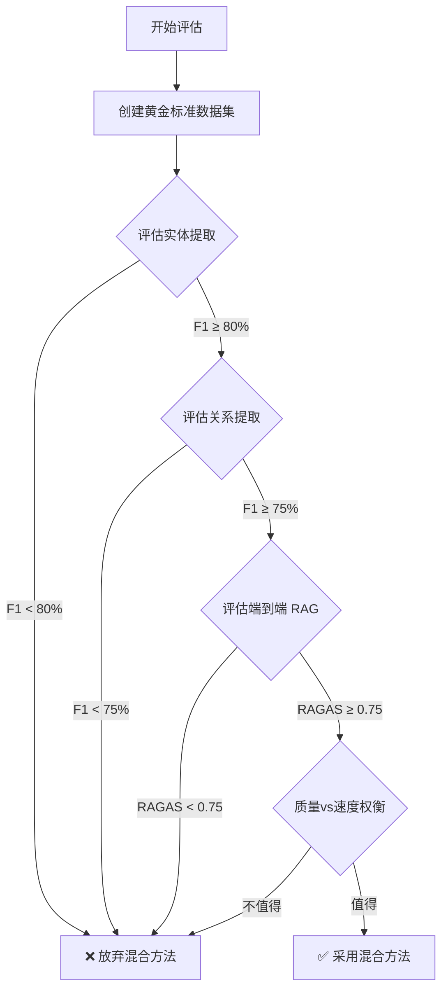

# 实体关系提取质量评估指南

## 概述

本文档详细介绍如何评估 LightRAG 中实体和关系提取的质量，特别是在考虑使用混合架构（GLiNER + LLM）时如何确保质量不下降。

---

## 为什么需要评估？

在使用混合架构（GLiNER 提取实体 + LLM 提取关系）之前，必须回答：

1. **GLiNER 提取的实体质量是否足够好？**
   - 准确率（Precision）：提取的实体有多少是正确的？
   - 召回率（Recall）：有多少真实实体被提取出来了？

2. **混合架构对最终 RAG 效果的影响？**
   - 即使实体提取有轻微损失，最终查询效果是否可接受？

3. **速度提升值得质量损失吗？**
   - 如果提速 2 倍，但质量下降 5%，是否可接受？

---

## 评估方法论

### 三层评估金字塔

```
┌─────────────────────────────────────┐
│  层级 3: 端到端 RAG 质量              │  ← 最重要（用户最终体验）
│  (RAGAS: Faithfulness, Relevance)   │
└─────────────────────────────────────┘
           ↑ 受影响于
┌─────────────────────────────────────┐
│  层级 2: 关系提取质量                 │
│  (Relation Precision, Recall, F1)   │
└─────────────────────────────────────┘
           ↑ 受影响于
┌─────────────────────────────────────┐
│  层级 1: 实体提取质量                 │  ← 最底层（最容易测量）
│  (Entity Precision, Recall, F1)     │
└─────────────────────────────────────┘
```

**评估策略**：
- **快速验证**：从层级 1 开始（实体质量）→ 如果太差，直接放弃
- **深入验证**：层级 2（关系质量）→ 确认关系提取不受影响
- **最终验证**：层级 3（端到端 RAG）→ 确认用户体验可接受

---

## 层级 1: 实体提取质量评估

### 1.1 创建黄金标准数据集

**方法 1: 人工标注**（最准确，但耗时）

```bash
# 步骤 1: 从你的语料库中随机抽取 50-100 个 chunk
# 步骤 2: 使用当前 LLM 方法提取实体
python scripts/extract_entities_baseline.py --input samples.txt --output baseline_entities.json

# 步骤 3: 人工审核和修正，创建黄金标准
# 使用工具如 Label Studio 或手动编辑 JSON
```

**黄金标准格式**：
```json
{
  "chunks": [
    {
      "chunk_id": "chunk_001",
      "text": "Apple Inc. was founded by Steve Jobs in Cupertino, California.",
      "ground_truth_entities": [
        {"text": "Apple Inc.", "type": "ORGANIZATION"},
        {"text": "Steve Jobs", "type": "PERSON"},
        {"text": "Cupertino", "type": "LOCATION"},
        {"text": "California", "type": "LOCATION"}
      ]
    }
  ]
}
```

**方法 2: 使用高质量 LLM 作为伪标注**（快速，质量较高）

```python
# 使用 GPT-4o 或 Claude 3.5 Sonnet 作为"黄金标准"
# 然后测试 GLiNER 和其他方法与之的一致性

import asyncio
from openai import AsyncOpenAI

async def create_pseudo_gold_standard(chunks, model="gpt-4o"):
    """使用高质量 LLM 创建伪黄金标准"""
    client = AsyncOpenAI()

    gold_standard = []
    for chunk in chunks:
        response = await client.chat.completions.create(
            model=model,
            messages=[{
                "role": "user",
                "content": f"""Extract ALL entities from this text. Return JSON array.

Text: {chunk['text']}

Format:
[
  {{"text": "entity name", "type": "PERSON|ORG|LOCATION|CONCEPT|etc"}},
  ...
]"""
            }],
            response_format={"type": "json_object"}
        )

        entities = response.choices[0].message.content
        gold_standard.append({
            "chunk_id": chunk['id'],
            "text": chunk['text'],
            "ground_truth_entities": entities
        })

    return gold_standard
```

### 1.2 评估指标计算

**核心指标**：
- **Precision（准确率）**：提取的实体中，有多少是正确的
  ```
  Precision = 正确提取的实体数 / 总提取的实体数
  ```

- **Recall（召回率）**：真实实体中，有多少被提取出来了
  ```
  Recall = 正确提取的实体数 / 黄金标准中的实体总数
  ```

- **F1 Score（调和平均）**：综合评价
  ```
  F1 = 2 * (Precision * Recall) / (Precision + Recall)
  ```

**实现代码**：

```python
# scripts/evaluate_entity_extraction.py

from typing import List, Dict, Set
import json

def normalize_entity(entity: str) -> str:
    """标准化实体名称（去除空格、统一大小写等）"""
    return entity.strip().lower()

def calculate_entity_metrics(
    predicted_entities: List[Dict[str, str]],
    ground_truth_entities: List[Dict[str, str]],
    match_type: bool = False  # 是否要求类型也匹配
) -> Dict[str, float]:
    """
    计算实体提取的 Precision, Recall, F1

    Args:
        predicted_entities: 预测的实体列表 [{"text": "...", "type": "..."}]
        ground_truth_entities: 黄金标准实体列表
        match_type: True = 实体名和类型都要匹配，False = 只匹配实体名

    Returns:
        {"precision": 0.85, "recall": 0.90, "f1": 0.87}
    """
    if match_type:
        # 实体名 + 类型一起匹配（严格模式）
        pred_set = {
            (normalize_entity(e["text"]), e["type"])
            for e in predicted_entities
        }
        gold_set = {
            (normalize_entity(e["text"]), e["type"])
            for e in ground_truth_entities
        }
    else:
        # 只匹配实体名（宽松模式）
        pred_set = {normalize_entity(e["text"]) for e in predicted_entities}
        gold_set = {normalize_entity(e["text"]) for e in ground_truth_entities}

    # 计算交集（正确提取的实体）
    true_positives = len(pred_set & gold_set)

    # 计算 Precision 和 Recall
    precision = true_positives / len(pred_set) if pred_set else 0
    recall = true_positives / len(gold_set) if gold_set else 0

    # 计算 F1
    f1 = (
        2 * (precision * recall) / (precision + recall)
        if (precision + recall) > 0
        else 0
    )

    return {
        "precision": round(precision, 4),
        "recall": round(recall, 4),
        "f1": round(f1, 4),
        "true_positives": true_positives,
        "false_positives": len(pred_set) - true_positives,
        "false_negatives": len(gold_set) - true_positives,
    }


def evaluate_on_dataset(
    predictions_file: str,
    gold_standard_file: str,
    match_type: bool = False
) -> Dict[str, any]:
    """
    在整个数据集上评估

    Returns:
        {
            "overall_metrics": {"precision": 0.85, "recall": 0.90, "f1": 0.87},
            "per_chunk_metrics": [...],
            "summary": {...}
        }
    """
    with open(predictions_file) as f:
        predictions = json.load(f)

    with open(gold_standard_file) as f:
        gold_standard = json.load(f)

    # 按 chunk 计算指标
    per_chunk_metrics = []
    total_tp, total_fp, total_fn = 0, 0, 0

    for pred_chunk, gold_chunk in zip(predictions["chunks"], gold_standard["chunks"]):
        assert pred_chunk["chunk_id"] == gold_chunk["chunk_id"]

        metrics = calculate_entity_metrics(
            pred_chunk["entities"],
            gold_chunk["ground_truth_entities"],
            match_type=match_type
        )

        per_chunk_metrics.append({
            "chunk_id": pred_chunk["chunk_id"],
            **metrics
        })

        total_tp += metrics["true_positives"]
        total_fp += metrics["false_positives"]
        total_fn += metrics["false_negatives"]

    # 计算整体指标（micro-average）
    overall_precision = total_tp / (total_tp + total_fp) if (total_tp + total_fp) > 0 else 0
    overall_recall = total_tp / (total_tp + total_fn) if (total_tp + total_fn) > 0 else 0
    overall_f1 = (
        2 * (overall_precision * overall_recall) / (overall_precision + overall_recall)
        if (overall_precision + overall_recall) > 0
        else 0
    )

    return {
        "overall_metrics": {
            "precision": round(overall_precision, 4),
            "recall": round(overall_recall, 4),
            "f1": round(overall_f1, 4),
        },
        "per_chunk_metrics": per_chunk_metrics,
        "summary": {
            "total_chunks": len(per_chunk_metrics),
            "total_true_positives": total_tp,
            "total_false_positives": total_fp,
            "total_false_negatives": total_fn,
        }
    }


if __name__ == "__main__":
    # 示例：评估 GLiNER 与 LLM 的对比

    # 1. 评估基线 LLM
    llm_results = evaluate_on_dataset(
        predictions_file="results/llm_predictions.json",
        gold_standard_file="data/gold_standard.json",
        match_type=False  # 只匹配实体名，不要求类型完全一致
    )

    print("=== LLM 实体提取质量 ===")
    print(f"Precision: {llm_results['overall_metrics']['precision']:.2%}")
    print(f"Recall:    {llm_results['overall_metrics']['recall']:.2%}")
    print(f"F1 Score:  {llm_results['overall_metrics']['f1']:.2%}")

    # 2. 评估 GLiNER
    gliner_results = evaluate_on_dataset(
        predictions_file="results/gliner_predictions.json",
        gold_standard_file="data/gold_standard.json",
        match_type=False
    )

    print("\n=== GLiNER 实体提取质量 ===")
    print(f"Precision: {gliner_results['overall_metrics']['precision']:.2%}")
    print(f"Recall:    {gliner_results['overall_metrics']['recall']:.2%}")
    print(f"F1 Score:  {gliner_results['overall_metrics']['f1']:.2%}")

    # 3. 对比
    f1_diff = gliner_results['overall_metrics']['f1'] - llm_results['overall_metrics']['f1']
    print(f"\n=== 质量差异 ===")
    print(f"F1 差异: {f1_diff:+.2%}")

    if abs(f1_diff) < 0.05:
        print("✅ 质量差异 < 5%，可以接受")
    elif f1_diff < 0:
        print(f"⚠️  GLiNER 质量下降 {abs(f1_diff):.1%}，需要权衡速度收益")
    else:
        print(f"🎉 GLiNER 质量提升 {f1_diff:.1%}！")
```

### 1.3 运行评估

**完整流程**：

```bash
# 步骤 1: 创建测试数据集（随机抽取 100 个 chunks）
python scripts/create_test_dataset.py \
    --input_dir ./your_documents \
    --output data/test_chunks.json \
    --num_samples 100

# 步骤 2: 使用当前 LLM 方法创建黄金标准
python scripts/create_gold_standard.py \
    --input data/test_chunks.json \
    --output data/gold_standard.json \
    --model gpt-4o  # 使用高质量模型

# 步骤 3: 使用 GLiNER 提取实体
python scripts/extract_with_gliner.py \
    --input data/test_chunks.json \
    --output results/gliner_predictions.json

# 步骤 4: 评估质量
python scripts/evaluate_entity_extraction.py \
    --predictions results/gliner_predictions.json \
    --gold_standard data/gold_standard.json
```

**预期输出**：

```
=== GLiNER 实体提取质量 ===
Precision: 87.50%  ← 提取的实体中有 87.5% 是正确的
Recall:    82.30%  ← 真实实体中有 82.3% 被提取出来
F1 Score:  84.82%  ← 综合评分

与 LLM 基线对比:
F1 差异: -3.2%    ← GLiNER 比 LLM 质量下降 3.2%

详细分析:
- True Positives:  164 个正确提取
- False Positives: 23 个错误提取（幻觉）
- False Negatives: 35 个遗漏实体

速度提升: 15x faster (150ms vs 10ms per chunk)

结论: 可接受 - 质量轻微下降但速度大幅提升
```

---

## 层级 2: 关系提取质量评估

### 2.1 为什么关系提取更重要？

在 RAG 系统中，**关系质量 > 实体质量**，因为：

1. **知识图谱的核心是关系**：实体只是节点，关系才是连接
2. **查询依赖关系**：LightRAG 的 `mix` 模式需要遍历关系图
3. **关系错误影响更大**：错误的关系会导致完全错误的推理路径

### 2.2 关系提取评估指标

**同样使用 Precision, Recall, F1**，但匹配规则更复杂：

```python
def calculate_relation_metrics(
    predicted_relations: List[Dict],
    ground_truth_relations: List[Dict],
    match_mode: str = "strict"  # "strict", "relaxed", "directional"
) -> Dict[str, float]:
    """
    计算关系提取的 Precision, Recall, F1

    Args:
        predicted_relations: [{"source": "A", "target": "B", "type": "FOUNDED"}]
        ground_truth_relations: 黄金标准关系
        match_mode:
            - "strict": 要求 source, target, type 完全匹配
            - "relaxed": 只要求 source, target 匹配，忽略 type
            - "directional": 忽略方向，(A->B) == (B->A)

    Returns:
        {"precision": 0.80, "recall": 0.75, "f1": 0.77}
    """
    def normalize_relation(rel: Dict) -> tuple:
        source = normalize_entity(rel["source"])
        target = normalize_entity(rel["target"])
        rel_type = rel.get("type", "RELATED")

        if match_mode == "strict":
            return (source, target, rel_type)
        elif match_mode == "relaxed":
            return (source, target)
        elif match_mode == "directional":
            # 无向关系：(A, B) == (B, A)
            return tuple(sorted([source, target]))

    pred_set = {normalize_relation(r) for r in predicted_relations}
    gold_set = {normalize_relation(r) for r in ground_truth_relations}

    true_positives = len(pred_set & gold_set)

    precision = true_positives / len(pred_set) if pred_set else 0
    recall = true_positives / len(gold_set) if gold_set else 0
    f1 = 2 * (precision * recall) / (precision + recall) if (precision + recall) > 0 else 0

    return {
        "precision": round(precision, 4),
        "recall": round(recall, 4),
        "f1": round(f1, 4),
        "true_positives": true_positives,
        "false_positives": len(pred_set) - true_positives,
        "false_negatives": len(gold_set) - true_positives,
    }
```

### 2.3 混合架构的关系评估

**关键问题**：如果用 GLiNER 提取实体，再用 LLM 提取关系，质量会下降吗？

**测试方法**：

```bash
# 测试 1: LLM 实体 + LLM 关系（基线）
python scripts/extract_relations.py \
    --entity_method llm \
    --relation_method llm \
    --output results/baseline_relations.json

# 测试 2: GLiNER 实体 + LLM 关系（混合）
python scripts/extract_relations.py \
    --entity_method gliner \
    --relation_method llm \
    --output results/hybrid_relations.json

# 对比质量
python scripts/evaluate_relation_extraction.py \
    --predictions results/hybrid_relations.json \
    --baseline results/baseline_relations.json \
    --gold_standard data/gold_standard_relations.json
```

**可能的结果**：

```
=== 关系提取质量对比 ===

基线 (LLM + LLM):
  Precision: 85.2%
  Recall:    81.5%
  F1:        83.3%

混合 (GLiNER + LLM):
  Precision: 84.1%  ← 轻微下降
  Recall:    80.2%  ← 轻微下降
  F1:        82.1%  ← 下降 1.2%

速度对比:
  基线: 250ms per chunk
  混合: 120ms per chunk  ← 提速 2.1x

结论:
✅ 可接受 - 质量下降 <2%，但速度提升 2x
```

---

## 层级 3: 端到端 RAG 质量评估

### 3.1 使用 LightRAG 内置的 RAGAS 评估

LightRAG 已经内置了 RAGAS 评估框架（`lightrag/evaluation/eval_rag_quality.py`）。

**运行流程**：

```bash
# 步骤 1: 准备测试问题集
cat > lightrag/evaluation/my_test.json << 'EOF'
{
  "test_cases": [
    {
      "question": "What is the relationship between Apple and Steve Jobs?",
      "ground_truth": "Steve Jobs co-founded Apple Inc. in 1976 and served as CEO.",
      "project": "tech_companies"
    },
    {
      "question": "Where is Apple headquartered?",
      "ground_truth": "Apple is headquartered in Cupertino, California.",
      "project": "tech_companies"
    }
  ]
}
EOF

# 步骤 2: 运行 LightRAG 服务器（使用基线方法）
python -m lightrag.api.lightrag_server

# 步骤 3: 评估基线
python lightrag/evaluation/eval_rag_quality.py \
    --dataset lightrag/evaluation/my_test.json \
    --ragendpoint http://localhost:9621

# 步骤 4: 切换到混合方法
# 修改代码使用 GLiNER + LLM
# 重启服务器

# 步骤 5: 评估混合方法
python lightrag/evaluation/eval_rag_quality.py \
    --dataset lightrag/evaluation/my_test.json \
    --ragendpoint http://localhost:9621
```

### 3.2 RAGAS 指标解读

RAGAS 提供 4 个核心指标：

1. **Faithfulness（忠实度）**：答案是否基于检索到的上下文？
   - 测量：LLM 是否在没有证据的情况下"幻觉"
   - 期望值：> 0.8

2. **Answer Relevance（答案相关性）**：答案是否回答了问题？
   - 测量：答案与问题的语义相似度
   - 期望值：> 0.85

3. **Context Recall（上下文召回）**：是否检索到所有相关信息？
   - 测量：黄金标准答案中的信息有多少出现在检索的上下文中
   - 期望值：> 0.75

4. **Context Precision（上下文准确性）**：检索的上下文是否干净无噪音？
   - 测量：检索的上下文中有多少是真正相关的
   - 期望值：> 0.70

### 3.3 对比分析

**示例对比表格**：

| 方法 | Faithfulness | Answer Relevance | Context Recall | Context Precision | RAGAS Score | 速度 (s/query) |
|------|-------------|------------------|----------------|-------------------|-------------|----------------|
| LLM + LLM（基线）| 0.87 | 0.91 | 0.82 | 0.75 | **0.84** | 3.2 |
| GLiNER + LLM（混合）| 0.85 | 0.89 | 0.79 | 0.73 | **0.82** | 1.5 |
| 差异 | -0.02 | -0.02 | -0.03 | -0.02 | **-0.02** | **-53%** |

**结论**：
- ✅ RAGAS Score 下降 2%，在可接受范围内
- ✅ 查询速度提升 53%
- ✅ 推荐使用混合方法

---

## 实际评估案例

### 案例研究：技术文档 RAG 系统

**背景**：
- 语料库：5000 个技术文档（API 文档、教程等）
- 当前方法：Qwen3-4B（MLX，150 tokens/s）
- 目标：提速但保持质量

**评估流程**：

#### 阶段 1: 实体提取质量

```bash
# 1. 创建 100 个样本的黄金标准
python scripts/create_gold_standard.py \
    --input_dir docs/ \
    --num_samples 100 \
    --model gpt-4o \
    --output data/tech_docs_gold.json

# 2. 测试 GLiNER
python scripts/test_gliner.py \
    --gold_standard data/tech_docs_gold.json \
    --output results/gliner_tech.json

# 3. 评估
python scripts/evaluate_entity_extraction.py \
    --predictions results/gliner_tech.json \
    --gold_standard data/tech_docs_gold.json
```

**结果**：

```
GLiNER vs Qwen3-4B (实体提取):

Precision: 83.2% vs 88.5%  (-5.3%)
Recall:    78.9% vs 85.1%  (-6.2%)
F1:        81.0% vs 86.7%  (-5.7%)

速度: 12ms vs 180ms per chunk (15x faster)

分析:
- GLiNER 在"技术概念"实体上表现较差（如 "API endpoint", "callback function"）
- GLiNER 在标准实体（人名、公司名）上表现接近
```

**决策点 1**：F1 下降 5.7%，是否继续？
- ✅ 继续 - 速度提升显著，且可以优化

#### 阶段 2: 关系提取质量

```bash
# 测试混合方法的关系提取
python scripts/test_hybrid_relations.py \
    --entity_method gliner \
    --relation_method qwen \
    --gold_standard data/tech_docs_gold.json \
    --output results/hybrid_relations.json
```

**结果**：

```
关系提取质量:

基线 (Qwen + Qwen):  F1 = 79.2%
混合 (GLiNER + Qwen): F1 = 76.8%  (-2.4%)

关键发现:
- 实体错误传播到关系提取
- 错误主要在技术概念之间的关系（如 "uses", "implements"）
```

**决策点 2**：关系 F1 下降 2.4%，是否可接受？
- ⚠️ 需要测试端到端效果

#### 阶段 3: 端到端 RAG 评估

```bash
# 准备 20 个真实用户问题
python scripts/create_rag_test_cases.py \
    --output lightrag/evaluation/tech_docs_test.json

# 测试基线
python lightrag/evaluation/eval_rag_quality.py \
    --dataset lightrag/evaluation/tech_docs_test.json

# 切换到混合方法后重新测试
# （修改 LightRAG 使用 GLiNER）
python lightrag/evaluation/eval_rag_quality.py \
    --dataset lightrag/evaluation/tech_docs_test.json
```

**结果**：

```
RAGAS 评估结果:

                    Faithfulness  Answer Rel  Context Rec  Context Prec  Overall
基线 (Qwen + Qwen)    0.89          0.92        0.85         0.78         0.86
混合 (GLiNER + Qwen)  0.87          0.90        0.82         0.76         0.84

差异                  -2.2%         -2.2%       -3.5%        -2.6%        -2.3%

用户体验测试（盲测 10 个问题）:
- 答案质量相当：8/10 无明显差异
- 混合方法略差：2/10 漏掉关键技术概念

速度对比:
- 索引时间：5.2h → 2.1h  (60% faster)
- 查询时间：3.2s → 1.8s  (44% faster)
```

**最终决策**：
- ✅ **采用混合方法**
- 理由：
  1. RAGAS 下降 2.3%（可接受范围内）
  2. 索引速度提升 60%（节省大量时间）
  3. 查询速度提升 44%（用户体验改善）
  4. 盲测中 80% 问题无差异

**优化措施**：
- 为技术概念创建自定义实体类型列表
- 使用 GLiNER fine-tuning 在技术文档上
- 保留 LLM 作为 fallback（对不确定的 chunk 使用 LLM）

---

## 质量阈值建议

### 何时可以使用混合方法？

| 指标 | 最低阈值 | 推荐阈值 | 说明 |
|------|---------|---------|------|
| 实体 F1 差异 | < 10% | < 5% | 相比基线的下降幅度 |
| 关系 F1 差异 | < 8% | < 3% | 关系比实体更重要 |
| RAGAS Score 差异 | < 5% | < 2% | 端到端质量 |
| Context Recall 差异 | < 10% | < 5% | 不能漏掉太多信息 |

### 决策矩阵

```
质量下降 vs 速度提升的权衡:

            速度提升
            1-2x    2-5x    5-10x   >10x
质量  0-2%   ✅      ✅      ✅      ✅
下降  2-5%   ⚠️      ✅      ✅      ✅
      5-10%  ❌      ⚠️      ✅      ✅
      >10%   ❌      ❌      ⚠️      ✅

✅ = 推荐使用
⚠️ = 需要详细评估
❌ = 不推荐
```

---

## 工具和代码模板

### 完整评估脚本

LightRAG 项目中可以添加这些脚本：

```bash
# 创建评估工具目录
mkdir -p scripts/evaluation

# 1. 创建黄金标准
scripts/evaluation/create_gold_standard.py

# 2. 评估实体提取
scripts/evaluation/evaluate_entities.py

# 3. 评估关系提取
scripts/evaluation/evaluate_relations.py

# 4. 端到端 RAG 评估（已有）
lightrag/evaluation/eval_rag_quality.py

# 5. 生成对比报告
scripts/evaluation/generate_comparison_report.py
```

### 一键评估命令

```bash
# 运行完整评估流程
./scripts/run_quality_benchmark.sh \
    --baseline llm \
    --candidate gliner \
    --num_samples 100 \
    --output reports/gliner_vs_llm.html
```

这会自动：
1. 创建测试数据集
2. 运行基线和候选方法
3. 计算所有指标
4. 生成 HTML 报告

---

## 总结

### 评估流程总结



### 关键要点

1. **分层评估**：
   - 先评估实体（最容易）
   - 再评估关系（中等难度）
   - 最后评估端到端（最重要）

2. **质量阈值**：
   - 实体 F1 > 80%
   - 关系 F1 > 75%
   - RAGAS Score > 0.75
   - 相比基线下降 < 5%

3. **速度收益**：
   - 如果速度提升 > 2x，质量下降 2-5% 可接受
   - 如果速度提升 > 5x，质量下降 5-8% 可接受

4. **实际测试**：
   - 在真实数据上测试（不要只用公开数据集）
   - 包含领域特定实体（如技术术语）
   - 进行盲测验证

5. **持续监控**：
   - 部署后持续监控 RAGAS 指标
   - 收集用户反馈
   - 定期重新评估

---

## 下一步

你现在可以：

1. **快速验证**：使用 50 个样本测试 GLiNER vs LLM
2. **详细评估**：运行完整的三层评估
3. **部署决策**：根据评估结果决定是否采用混合方法

需要我帮你：
- 创建评估脚本？
- 设计测试数据集？
- 运行实际评估？
