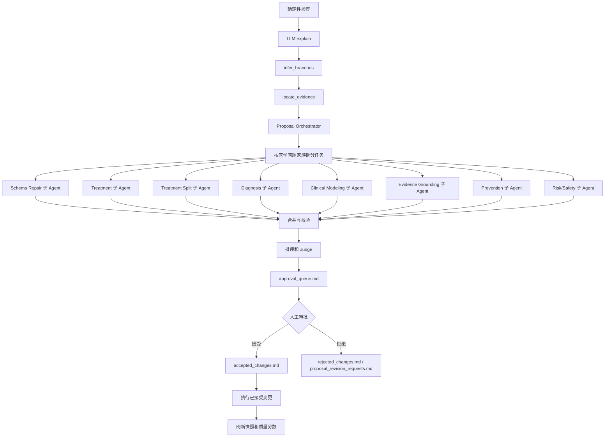

# 知识库迭代 Agent

知识库迭代 Agent 是 LightRAG 知识库的维护工作流。它面向“先检测、再审阅、再审批、最后确定性执行”的流程，帮助维护者发现医学知识图谱中的关系 schema、实体类型、证据方向、诊断/治疗/预防语义等问题。

它不是自动医学事实编辑器。LLM 可以解释问题、定位证据、生成候选 Proposal、排序修复方案，但不能直接修改 KG。任何会写入 KG 的变更都必须先进入审批队列，再由人接受，最后由确定性的 allowlisted apply engine 执行。

## 当前运行基线

截至 2026-06-24，推荐配置是：

- 模型：`deepseek-v4-flash`
- 模式：`agent_pipeline`
- 单轮 Proposal 上限：`200`
- 变更入口：人工接受 Proposal
- 写图入口：确定性 Apply Engine

最近一次真实运行和人工医学审核对象是 `influenza_medical_v1`：

- 初始医学审核：`53` 条 Proposal，接受 `3` 条，拒绝 `50` 条。
- 已执行接受项：`3` 条写入 KG，`0` 条 blocked。
- 第 1 轮复跑：生成 `15` 条 Proposal，全部拒绝。
- 第 2 轮复跑：同语义 `15` 条 Proposal 以 `-2` 后缀重新出现，全部拒绝。
- 当前审批队列：已清空；拒绝记录保留在 `rejected_changes.md`，运行证据归档在 `codex_runs/`。

这说明 P1 高产量漏斗已经能稳定产出可审批 Proposal，但当前最大问题不再是单轮 `200` 上限，而是拒绝记忆只按 Proposal ID 命中，无法阻止语义相同、ID 后缀变化的重复候选重新入队。下一轮工程重点应升级为 `semantic_fingerprint` / `execution_fingerprint` 级别的决策记忆。

当前 Proposal Orchestrator 已经为每个子 Agent 任务包加入 `role_contract`，并在任务包写入前预校验确定性 `action_candidates`。不安全的候选会进入 `rejected_action_candidates`，用于调试和前端展示，不再交给 LLM 照抄。任务包会携带 `allowed_evidence_spans`，`candidate_kg_expansion` 只能逐字复用其中同一条证据三元组。当 Web/API 运行使用 `skip_deterministic_subagent_calls=true`（当前 Web 默认值）时，安全且完整的候选任务会标记为 `deterministic_only`，直接由程序生成 Proposal，不调用子 Agent；无法安全执行的任务会在 `subagent_outputs/index.json` 中显示为 `blocked_no_executable_candidate`、`blocked_unsafe_candidates` 或 `blocked_no_grounding`。

Web/API 默认的子 Agent 安全参数是：每个任务最多 `4` 个问题、最多 `2` 条 Proposal、启用严格角色契约、启用 action candidate 预校验、启用证据 allowlist、启用确定性任务跳过 LLM。角色专用中文提示词位于 `lightrag/kb_iteration/prompts/subagents/`。

医学关系 schema 也补充了医院方向常用的风险关系：`risk_factor_for`、`high_risk_for`、`increases_risk_of`、`acute_exacerbation_of`。旧的 `risk_group_for` 已标记为由 `high_risk_for` 替代。这样 COPD、孕妇、儿童、老年人、急性加重、死亡/住院等风险和结局语义不会再被硬塞进 `has_complication`。

## 问题台账与确定性漏斗

原始问题（raw issue）是质量检查检测到的一条缺陷记录，不是待审批 Proposal。Agent 会把 `medical_schema_issues` 和 `entity_cleanup_issues` 归一化到 `issue_ledger.json`，每条记录都有稳定的 `issue_ref`，并且只会进入一个主路由状态。

问题路由（issue route）描述这条原始问题的去向：`deterministic_covered` 表示安全的确定性候选已经变成可进入队列的 Proposal；`llm_residual` 表示确定性层无法安全覆盖，才交给 LLM 子 Agent 继续推理；`blocked_safety`、`blocked_apply`、`blocked_evidence` 是安全、执行能力或证据门禁，不是文件传输失败；`deferred_budget` 表示本轮家族预算已满，问题被延后而不是丢失。

Web 的 LLM 审阅页会读取 `deterministic_proposal_report.json`，用“原始问题、候选动作、确定性覆盖、LLM 剩余、阻塞、延后、已选 Proposal、主要原因”等列展示确定性 Proposal 漏斗。`deterministic_proposal_report.md` 是同一漏斗的人类可读报告。

最新漏斗验证结果：`727` 条原始问题已全部入账，`0` 条未路由，`15` 条确定性候选进入 Proposal，`13` 条候选在生成阶段被丢弃。路由统计显示 `673` 条仍为 `llm_residual`、`39` 条被既有决策记忆拦截、`15` 条被确定性覆盖。该轮队列中的 `15` 条 Proposal 已全部被医学审核拒绝，因此当前 `approval_queue.md` 不再保留待审项。

## Web 上的使用流程

1. 选择 workspace。
2. 运行确定性检查，生成快照和质量报告。
3. 运行 LLM 审阅，让 Agent 解释问题、推断缺失分支、定位证据、生成 Proposal。
4. 查看审批队列。
5. 对每条 Proposal 选择接受或拒绝，也可以一键接受全部当前待审批 Proposal。
6. 点击“执行已接受变更”，由确定性 Apply Engine 写入 KG。
7. 重新运行检查，查看 `quality_score.json` 和质量报告的变化。
8. 如果仍有问题，继续下一轮 Agent 审阅。

接受 Proposal 只代表“允许执行”，不会立刻写 KG。真正写入发生在“执行已接受变更”按钮之后。

## 关键产物

工作目录：

```text
work/kb-iteration/<workspace>/
```

常用文件：

```text
kb_context.md                  当前 KB 摘要
quality_report.md              质量报告
snapshots/kg_snapshot.json      图谱快照
snapshots/quality_score.json    质量分数和问题明细
approval_queue.md              待审批 Proposal
improvement_backlog.md          改进 Backlog
accepted_changes.md            已接受变更记忆
rejected_changes.md            已拒绝变更记忆
proposal_revision_requests.md  拒绝后要求 Agent 返工的记忆
agent_memory_summary.md         压缩后的长期记忆
iteration_log.md               当前阶段日志
```

`approval_queue.md` 不是全量问题清单。它只包含本轮被选中、通过校验、并等待人工接受或拒绝的 Proposal。全量检测问题在 `snapshots/quality_score.json` 里。

当一轮审批部分完成后，推荐让 `approval_queue.md` 只保留仍需人工判断的 Proposal；完整原始定义可以保留在 `improvement_backlog.md`，供执行和审计追溯。不要把已经接受/拒绝过的旧队列继续当成当前待办。

## Agent 架构



## 医学建模边界

Agent 需要遵守医院方向的医学 KG schema：

- 症状、体征、检查结果不能简单写成“属于疾病”。
- 疾病到症状通常应使用 `has_manifestation`，但症状必须是具体患者可观察表现，不应是“临床表现”这类类别标签。
- 诊断证据方向要清楚，证据、检查或发现支持疾病诊断，而不是疾病随意指向泛化检查。
- 并发症、风险因素、严重程度、死亡、住院、复发等不能混成一种关系。
- 疫苗或预防措施的 `reduces_risk_of` 必须保留适用人群、场景或结局范围。
- 中医方药、证候、适应证要保留证候语义，不能只做泛化治疗边。
- LLM 不能自由编造医学事实；新增节点/边也必须有 `source_id`、`file_path` 和证据片段。

补充：医学 schema 校验现在由 `quality.py` 和 `proposals.py` 共用。`medical_schema.py` 会统一归一化实体类型，理解 `Intervention`、`ClinicalFinding`、`Evidence`、`MedicalConcept` 等轻量上位类型，并通过同一个 domain/range/qualifier 契约校验关系实例。`causative_agent`、`orders_test`、`has_result`、`contraindicated_for`、`precaution_for`、`interaction_with`、`monitor_with`、`uses_specimen`、`belongs_to_drug_class`、`evidenced_by` 等高风险关系不再按泛化的 `MedicalConcept -> MedicalConcept` 放行。

P1 更新后，schema 不只检查 domain/range，也会检查必填限定词、允许限定词和枚举值。`supports_or_refutes` 必须带 `polarity`，`recommended_for` 必须带 `purpose`（只允许 `treatment` 或 `prevention`）并至少带一个适用范围限定，例如 condition、age、age_min、age_max、population、route、timing 或 time_window。新增 `temporarily_deferred_for` 用于表达“暂缓”，避免和 `contraindicated_for`、`precaution_for`、`not_recommended_for` 混成一个模糊安全关系。

P2 更新后，流感专用的字符串规则集中在 `lightrag/kb_iteration/profiles/influenza_rules.py`。通用 proposal、quality 和 orchestrator 代码只调用 profile hook，不再各自维护重复的流感词表。

## 长期记忆

需要保留：

- `accepted_changes.md`：防止重复提出已接受并执行的修复。
- `rejected_changes.md`：记录拒绝原因，避免 Agent 下轮重复犯错。
- `proposal_revision_requests.md`：让 Agent 根据拒绝原因改写 Proposal。
- `agent_memory_summary.md`：压缩后的记忆层，避免长期文件越来越大影响速度。

注意：只按完整 Proposal ID 记忆是不够的。真实复跑已经证明，同一执行语义可以通过 `-2` 等后缀绕过精确 ID 记忆。后续记忆层必须同时保存语义指纹和执行指纹。

可以清理：

- 已完成审批后的 `approval_queue.md`。
- 旧的临时运行响应 JSON。
- 手工测试日志。
- 已被当前架构取代的一次性实施计划和设计草稿。

## 下一步重点

目前最需要继续增强的是 Proposal 质量和重复抑制：

1. 在入队前用 `semantic_fingerprint` / `execution_fingerprint` 命中已拒绝、已接受、已执行的等价候选。
2. 把医学审核拒绝类别回流到各确定性生成器，重点修正人群条件误作适应证、预防目标误作适应证、否定推荐误作正向适应证、并发症/风险/结局混用。
3. 重新跑一轮 Flash + 200，确认旧的 15 条语义重复候选不再进入队列。
4. 继续按诊断、治疗、预防、风险安全、实体清理、临床建模等医学家族分组展示和审批。
