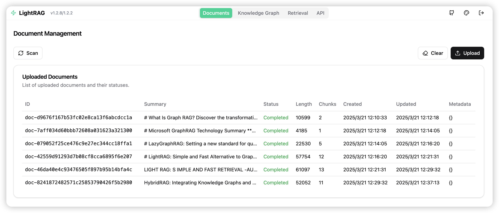
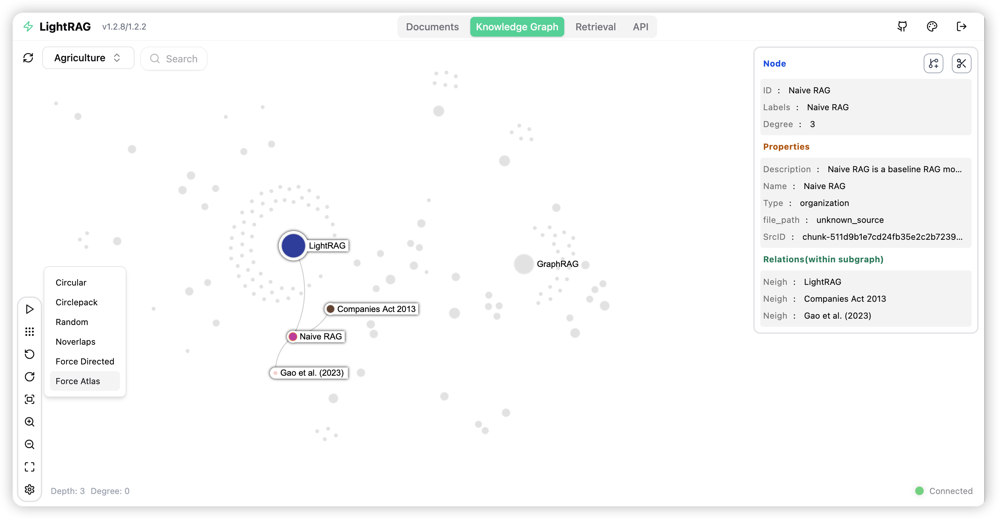
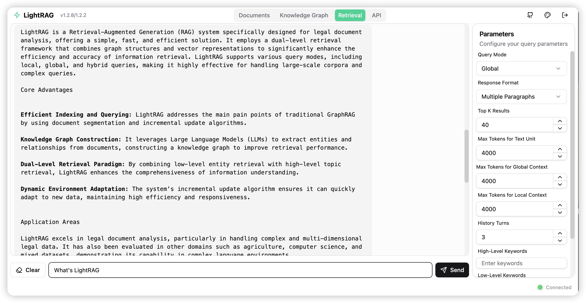
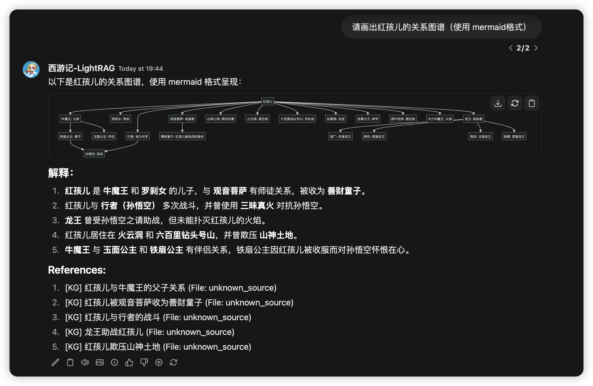

# LightRAG 服务器和 WebUI

LightRAG 服务器旨在提供 Web 界面和 API 支持。Web 界面便于文档索引、知识图谱探索和简单的 RAG 查询界面。LightRAG 服务器还提供了与 Ollama 兼容的接口，旨在将 LightRAG 模拟为 Ollama 聊天模型。这使得 AI 聊天机器人（如 Open WebUI）可以轻松访问 LightRAG。







## 从 v1.4.16 升级到 v1.5.0rc2

v1.5.0rc2 引入了新的文件处理流水线、解析器路由、多模态分析、基于角色的 LLM/VLM 配置、JSON 实体抽取以及若干 provider / storage 变更。升级生产实例前，请先阅读 [v1.5.0rc2 发布说明](https://github.com/HKUDS/LightRAG/releases/tag/v1.5.0rc2)。

- 如果希望升级服务器但保持旧版文件处理行为，请设置：

```bash
LIGHTRAG_PARSER=*:legacy-F
```

- `ENTITY_TYPES` 已不再支持。请改用 `ENTITY_TYPE_PROMPT_FILE`，并把 YAML profile 放在 `PROMPT_DIR/entity_type` 下（`PROMPT_DIR` 默认是 `./prompts`）。参考模板位于 `prompts/samples/entity_type_prompt.sample.yml`。
- 如果使用 OpenSearch 存储且集群版本低于 OpenSearch 3.3.0，请先升级 OpenSearch，再启用 v1.5 存储路径并校验已有索引。新部署建议使用 OpenSearch 3.3.0 或更高版本。
- 更换 embedding 模型、向量维度、非对称 embedding 行为或 query/document 前缀会改变向量语义。请清空受影响的 LightRAG workspace/向量数据并重新索引源文件。
- 修改解析器路由（`LIGHTRAG_PARSER`）或文件名 hint 只影响新上传文件。若要把已有文档切换到另一个解析引擎，请先删除该文档再重新上传。
- 修改 chunker 配置（`CHUNK_*`）会影响服务器重启后入队的文档。若希望旧文档的 `chunk_options` 快照也采用新配置，请重新处理这些文档。
- 启用多模态选项（`i/t/e`）需要已有解析 sidecar，并设置 `VLM_PROCESS_ENABLE=true`。已有文档可通过重新处理在可用 sidecar 上补跑 VLM 分析；但切换解析引擎仍需要删除并重新上传。

## 入门指南

### 安装

* 从 PyPI 安装

```bash
### 使用 uv 安装 LightRAG 服务器（作为工具，推荐)
uv tool install "lightrag-hku[api]"

### 或使用 pip
# python -m venv .venv
# source .venv/bin/activate  # Windows: .venv\Scripts\activate
# pip install "lightrag-hku[api]"
```

* 从源代码安装

```bash
# 克隆仓库
git clone https://github.com/HKUDS/lightrag.git

# 进入仓库目录
cd lightrag

# 一键初始化开发环境（推荐）
make dev
source .venv/bin/activate  # 激活虚拟环境 (Linux/macOS)
# Windows 系统: .venv\Scripts\activate

# make dev 会安装测试工具链以及完整的离线依赖栈
# （API、存储后端与各类 Provider 集成），并构建前端；不会生成 .env。
# 启动服务前请先运行 make env-base，或手动从 env.example 复制并配置 .env。

# 使用 uv 的等价手动步骤
# 注意: uv sync 会自动在 .venv/ 目录创建虚拟环境
uv sync --extra test --extra offline
source .venv/bin/activate  # 激活虚拟环境 (Linux/macOS)
# Windows 系统: .venv\Scripts\activate

# 或使用 pip 与虚拟环境
# python -m venv .venv
# source .venv/bin/activate  # Windows: .venv\Scripts\activate
# pip install -e ".[test,offline]"

# 构建前端代码
cd lightrag_webui
bun install --frozen-lockfile
bun run build
cd ..
```

### 启动 LightRAG 服务器前的准备

LightRAG 需要同时集成 LLM（大型语言模型）和嵌入模型以有效执行文档索引和查询操作。在首次部署 LightRAG 服务器之前，必须配置 LLM 和嵌入模型的设置。

LightRAG 支持以下 LLM 后端：

* ollama
* lollms
* openai 或 openai 兼容
* azure_openai
* bedrock
* gemini

LightRAG 支持以下 embedding 后端：

* lollms
* ollama
* openai 或 openai 兼容
* azure_openai
* bedrock
* jina
* gemini
* voyageai

建议使用环境变量来配置 LightRAG 服务器。项目根目录中有一个名为 `env.example` 的示例环境变量文件。请将此文件复制到启动目录并重命名为 `.env`。之后，您可以在 `.env` 文件中修改与 LLM 和嵌入模型相关的参数。需要注意的是，LightRAG 服务器每次启动时都会将 `.env` 中的环境变量加载到系统环境变量中。**LightRAG 服务器会优先使用系统环境变量中的设置**。

> 由于安装了 Python 扩展的 VS Code 可能会在集成终端中自动加载 .env 文件，请在每次修改 .env 文件后打开新的终端会话。

如果需要为实体抽取、关键词抽取、最终回答或多模态分析配置不同的 LLM/VLM，请参考 [基于角色的 LLM/VLM 配置指南](./RoleSpecificLLMConfiguration-zh.md)。

以下是 LLM 和嵌入模型的一些常见设置示例：

* OpenAI LLM + Ollama 嵌入

```
LLM_BINDING=openai
LLM_MODEL=gpt-4o
LLM_BINDING_HOST=https://api.openai.com/v1
LLM_BINDING_API_KEY=your_api_key

EMBEDDING_BINDING=ollama
EMBEDDING_BINDING_HOST=http://localhost:11434
EMBEDDING_MODEL=bge-m3:latest
EMBEDDING_DIM=1024
# EMBEDDING_BINDING_API_KEY=your_api_key
```

> 如果改为使用 Google Gemini, 设置 `LLM_BINDING=gemini`, 选择模型 `LLM_MODEL=gemini-flash-latest`, 并设置访问密钥 `LLM_BINDING_API_KEY` (或 `GEMINI_API_KEY`).

* Ollama LLM + Ollama 嵌入

```
LLM_BINDING=ollama
LLM_MODEL=mistral-nemo:latest
LLM_BINDING_HOST=http://localhost:11434
# LLM_BINDING_API_KEY=your_api_key
###  Ollama 服务器上下文 token 数（必须大于 MAX_TOTAL_TOKENS+2000）
OLLAMA_LLM_NUM_CTX=8192

EMBEDDING_BINDING=ollama
EMBEDDING_BINDING_HOST=http://localhost:11434
EMBEDDING_MODEL=bge-m3:latest
EMBEDDING_DIM=1024
# EMBEDDING_BINDING_API_KEY=your_api_key
```

> **重要提示**：在文档索引前必须确定使用的 Embedding 模型和非对称嵌入配置，且在查询阶段必须沿用相同设置。有些存储（例如 PostgreSQL）在首次建立表时需要确定向量维度。更换 Embedding 模型、向量维度、`EMBEDDING_ASYMMETRIC`、query/document 前缀或 provider task 行为后，必须清空现有 LightRAG workspace/向量数据并重新索引源文件。

#### 非对称嵌入配置

LightRAG 默认使用对称嵌入。只有显式设置 `EMBEDDING_ASYMMETRIC=true` 时，才会开启 query/document 非对称嵌入。

- `jina`、`gemini`、`voyageai` 等 provider task 型绑定通过 provider 参数（`task` / `task_type` / `input_type`）区分 query/document，不应配置 query/document 前缀。
- `openai`、`azure_openai`、`ollama` 等前缀型绑定必须同时配置 `EMBEDDING_QUERY_PREFIX` 和 `EMBEDDING_DOCUMENT_PREFIX`。如果某一侧明确不需要前缀，请使用 `NO_PREFIX`。
- 任何非对称嵌入配置的有效变更，都需要清空已有数据并重新索引文件。

完整校验规则和示例请参阅 [Asymmetric Embedding Configuration](./AsymmetricEmbedding.md)。

### 使用 Setup 工具创建 .env 文件

除了手动编辑 `env.example` 之外，您还可以使用交互式向导生成配置好的 `.env`，并在需要时生成 `docker-compose.final.yml`：

```bash
make env-base           # 必跑第一步：配置 LLM、Embedding、Reranker
make env-storage        # 可选：配置存储后端和数据库服务
make env-server         # 可选：配置服务端口、鉴权和 SSL
make env-security-check # 可选：审计当前 .env 中的安全风险
```

每个目标的详细说明请参阅 [docs/InteractiveSetup.md](./InteractiveSetup.md)。
这些 setup 向导只负责更新配置；如需在部署前审计当前 `.env` 的安全风险，请额外运行
`make env-security-check`。

### 启动 LightRAG 服务器

LightRAG 服务器支持两种运行模式：
* 简单高效的 Uvicorn 模式

```
lightrag-server
```
* 多进程 Gunicorn + Uvicorn 模式（生产模式，不支持 Windows 环境）

```
lightrag-gunicorn --workers 4
```

启动LightRAG的时候，当前工作目录必须含有`.env`配置文件。**要求将.env文件置于启动目录中是经过特意设计的**。 这样做的目的是支持用户同时启动多个LightRAG实例，并为不同实例配置不同的.env文件。**修改.env文件后，您需要重新打开终端以使新设置生效**。 这是因为每次启动时，LightRAG Server会将.env文件中的环境变量加载至系统环境变量，且系统环境变量的设置具有更高优先级。

启动时可以通过命令行参数覆盖`.env`文件中的配置。常用的命令行参数包括：

- `--host`：服务器监听地址（默认：0.0.0.0）
- `--port`：服务器监听端口（默认：9621）
- `--timeout`：LLM 请求超时时间（默认：150 秒）
- `--log-level`：日志级别（默认：INFO）
- `--working-dir`：数据库持久化目录（默认：./rag_storage）
- `--input-dir`：上传文件存放目录（默认：./inputs）
- `--workspace`: 工作空间名称，用于逻辑上隔离多个LightRAG实例之间的数据（默认：空）
- `--api-prefix`：对浏览器暴露的反向代理路径前缀，也可通过 `LIGHTRAG_API_PREFIX` 配置
- `--rerank-binding`：Rerank provider（`null`、`cohere`、`jina` 或 `aliyun`）

### 路径前缀和多站点 WebUI

当一台主机通过反向代理承载多个 LightRAG 实例，并由代理剥离站点前缀后再转发给后端时，请设置 `LIGHTRAG_API_PREFIX` 或 `--api-prefix`：

```bash
LIGHTRAG_API_PREFIX=/site01
lightrag-server --port 9621
```

后端会把该值作为 FastAPI 的 `root_path`，并把同一个运行时前缀注入 WebUI。WebUI 在服务端内部始终挂载到 `/webui`，因此同一份前端构建产物可以服务任意前缀。完整的 Nginx、Docker 和 Kubernetes 示例请参阅 [Single-Server Multi-Site Deployment](./MultiSiteDeployment.md)。

### 使用 Docker 启动 LightRAG 服务器

使用 Docker Compose 是部署和运行 LightRAG Server 最便捷的方式。

- 创建一个项目目录。
- 将 LightRAG 仓库中的 `docker-compose.yml` 文件复制到您的项目目录中。
- 准备 `.env` 文件：复制示例文件 [`env.example`](https://ai.znipower.com:5013/c/env.example) 创建自定义的 `.env` 文件，并根据您的具体需求配置 LLM 和嵌入参数。
- 通过以下命令启动 LightRAG 服务器：

```shell
docker compose up
# 如果希望启动后让程序退到后台运行，需要在命令的最后添加 -d 参数
```

> 可以通过以下链接获取官方的docker compose文件：[docker-compose.yml]( https://raw.githubusercontent.com/HKUDS/LightRAG/refs/heads/main/docker-compose.yml) 。如需获取LightRAG的历史版本镜像，可以访问以下链接: [LightRAG Docker Images]( https://github.com/HKUDS/LightRAG/pkgs/container/lightrag). 如需获取更多关于docker部署的信息，请参阅 [DockerDeployment.md](./DockerDeployment.md).

### 渐进式配置示例

如果您是 LightRAG 新用户，建议从最小可运行配置开始，确认上一阶段正常后再逐步开启更多能力：

1. 使用托管 LLM 和 Embedding 模型完成最小 Docker 启动
2. 增加 Reranking 以提升查询质量
3. 使用 MinerU 官方 API 和视觉模型开启多模态解析
4. 迁移到 GPU 加速、Docker 托管数据库的准生产部署

完整的 `env.example` 仍然是配置项总参考，并且会被 `make env-*` setup 向导使用。下面的片段只展示每一步最关键的配置。

#### 1. 最小 Docker 启动

如果您只想先把 WebUI 和 API 跑起来，并暂时不引入外部数据库、解析服务或本地模型服务，可以在 `docker-compose.yml` 旁边创建如下最小 `.env`：

```bash
###########################
### Server Configuration
###########################
PORT=9621
WEBUI_TITLE='My First LightRAG KB'
WEBUI_DESCRIPTION='Simple and Fast Graph Based RAG System'
OLLAMA_EMULATING_MODEL_TAG=latest

########################################
### Document processing configuration
########################################
SUMMARY_LANGUAGE=English
ENTITY_EXTRACTION_USE_JSON=true
LIGHTRAG_PARSER=*:native-teP,*:legacy-R
VLM_PROCESS_ENABLE=false

###########################################################################
### LLM Configuration
###########################################################################
LLM_BINDING=openai
LLM_BINDING_HOST=https://api.openai.com/v1
LLM_BINDING_API_KEY=your_api_key
LLM_MODEL=gpt-5-mini

KEYWORD_LLM_MODEL=gpt-5-nano
QUERY_LLM_MODEL=gpt-5

#######################################################################################
### Embedding Configuration (do not change after the first file is processed)
#######################################################################################
EMBEDDING_BINDING=openai
EMBEDDING_BINDING_HOST=https://api.openai.com/v1
EMBEDDING_BINDING_API_KEY=your_api_key
EMBEDDING_MODEL=text-embedding-3-large
EMBEDDING_DIM=3072
EMBEDDING_TOKEN_LIMIT=8192
EMBEDDING_SEND_DIM=false
EMBEDDING_USE_BASE64=true

############################
### Data storage selection
############################
LIGHTRAG_KV_STORAGE=JsonKVStorage
LIGHTRAG_DOC_STATUS_STORAGE=JsonDocStatusStorage
LIGHTRAG_GRAPH_STORAGE=NetworkXStorage
LIGHTRAG_VECTOR_STORAGE=NanoVectorDBStorage
```

如有需要，请将模型 ID 替换为您自己的 provider 账号可用的模型。上传文档前，先启动并验证服务：

```bash
docker compose up -d
curl http://localhost:9621/health
```

然后打开 WebUI：`http://localhost:9621/webui`，上传一个小型文本或 DOCX 文件，等待索引完成后使用 `hybrid` 或 `mix` 模式查询。

#### 2. 增加 Reranking

Reranking 是查询阶段能力。启用、关闭或更换 reranker 通常不需要重新索引已有文档。

使用 Cohere 官方托管 rerank 服务：

```bash
RERANK_BINDING=cohere
RERANK_MODEL=rerank-v3.5
RERANK_BINDING_HOST=https://api.cohere.com/v2/rerank
RERANK_BINDING_API_KEY=your_cohere_api_key
```

使用本地 vLLM 部署、并暴露 Cohere-compatible API 的 reranker：

```bash
RERANK_BINDING=cohere
RERANK_MODEL=BAAI/bge-reranker-v2-m3
RERANK_BINDING_HOST=http://localhost:8000/rerank
RERANK_BINDING_API_KEY=your_rerank_api_key_here
```

如果 LightRAG 自身运行在 Docker 容器中，而 reranker 运行在宿主机，请使用 `host.docker.internal` 等容器可访问地址，不要直接使用 `localhost`。如果 reranker 由 setup 向导生成，向导会自动把 Compose 内部服务地址注入到 `docker-compose.final.yml`。

#### 3. 使用 MinerU 官方 API 开启多模态解析

建议在基础文档流程已经正常后再开启该能力。使用 MinerU 官方 API 可以避免本地部署解析服务，但必须在 LightRAG 服务器启动前配置 `MINERU_API_TOKEN`。VLM 角色也必须使用支持图片输入的 provider/model。

```bash
LIGHTRAG_PARSER=*:native-iteP,*:mineru-iteP,*:legacy-R

VLM_PROCESS_ENABLE=true
VLM_LLM_MODEL=gpt-5-mini

MINERU_API_MODE=official
MINERU_API_TOKEN=your_mineru_api_token
MINERU_OFFICIAL_ENDPOINT=https://mineru.net
MINERU_MODEL_VERSION=vlm
MINERU_IS_OCR=false
```

该路由会优先对支持的 DOCX 文件使用内置 `native` 解析器，对 PDF、图片等其他 MinerU 支持的文件使用 MinerU，最后回退到 `legacy`。`i`、`t`、`e` 选项会在解析器产出对应 sidecar 时，对图片、表格和公式运行 VLM 分析。

使用 official 模式时，Docker 不需要访问宿主机上的 MinerU 回环地址；容器只需要能够访问 `MINERU_OFFICIAL_ENDPOINT`。

#### 4. GPU All-In-One 风格部署

对于本地 GPU 加速部署，建议使用 setup 向导生成 `.env` 和 `docker-compose.final.yml`，不要手写每个服务块：

```bash
make env-base
```

推荐选择：

- 主 LLM 使用托管 provider 或 OpenAI-compatible provider。
- 对 `Run embedding model locally via Docker (vLLM)?` 回答 `yes`。
- Embedding device 选择 `cuda`。
- 启用 reranking，对 `Run rerank service locally via Docker?` 回答 `yes`，rerank device 选择 `cuda`。

然后配置存储：

```bash
make env-storage
```

推荐存储选择：

- `LIGHTRAG_KV_STORAGE=PGKVStorage`
- `LIGHTRAG_DOC_STATUS_STORAGE=PGDocStatusStorage`
- `LIGHTRAG_VECTOR_STORAGE=MilvusVectorDBStorage`
- `LIGHTRAG_GRAPH_STORAGE=MemgraphStorage`
- PostgreSQL、Milvus 和 Memgraph 均选择本地 Docker 运行。
- 如果主机具备 NVIDIA GPU 支持且已安装 NVIDIA Container Toolkit，Milvus device 可选择 `cuda`。

最后配置服务端对外设置并验证：

```bash
make env-server
make env-validate
make env-security-check
docker compose -f docker-compose.final.yml up -d
```

对外暴露前，请在 `make env-server` 中配置认证、API key 和 SSL。生成的 `.env` 会保持宿主机可用；容器专用服务名和 Docker 专用覆盖项会写入 `docker-compose.final.yml`。

处理生产数据前请注意：

- 首次上传前确定 Embedding 模型、向量维度和非对称嵌入设置。之后修改这些配置需要清空对应 workspace/向量数据并重新索引文档。
- 首次上传前确定存储后端。当前不支持在不同存储实现之间直接迁移。
- 修改 `LIGHTRAG_PARSER` 只影响新上传文件。如需让已有文档使用新的解析路由，请删除后重新上传。

### Nginx 反向代理配置

在 LightRAG 服务器前使用 Nginx 作为反向代理时，需要为 `/documents/upload` 端点配置 `client_max_body_size` 以处理大文件上传。如果不进行此配置，Nginx 将拒绝大于 1MB（默认限制）的文件，并在请求到达 LightRAG 之前返回 `413 Request Entity Too Large` 错误。

**推荐配置：**

```nginx
server {
    listen 80;
    server_name your-domain.com;

    # 全局默认：8MB 用于 LLM 长上下文查询
    client_max_body_size 8M;

    # 上传端点：100MB 用于大文件上传
    location /documents/upload {
        client_max_body_size 100M;

        proxy_pass http://localhost:9621;
        proxy_set_header Host $host;
        proxy_set_header X-Real-IP $remote_addr;
        proxy_set_header X-Forwarded-For $proxy_add_x_forwarded_for;
        proxy_set_header X-Forwarded-Proto $scheme;

        # 大文件上传需要更长超时时间
        proxy_read_timeout 300s;
        proxy_send_timeout 300s;
    }

    # 流式端点：LLM 响应流式传输
    location ~ ^/(query/stream|api/chat|api/generate) {
        gzip off;  # 禁用流式响应的压缩

        proxy_pass http://localhost:9621;
        proxy_set_header Host $host;
        proxy_set_header X-Real-IP $remote_addr;
        proxy_set_header X-Forwarded-For $proxy_add_x_forwarded_for;
        proxy_set_header X-Forwarded-Proto $scheme;

        # LLM 生成需要较长超时
        proxy_read_timeout 300s;
    }

    # 其他端点
    location / {
        proxy_pass http://localhost:9621;
        proxy_set_header Host $host;
        proxy_set_header X-Real-IP $remote_addr;
        proxy_set_header X-Forwarded-For $proxy_add_x_forwarded_for;
        proxy_set_header X-Forwarded-Proto $scheme;
    }
}
```

**关键要点：**

1. **全局限制（8MB）**：足以处理具有长对话历史和上下文的 LLM 查询（128K tokens ≈ 512KB + JSON 开销）。
2. **上传端点（100MB）**：必须匹配或超过 `.env` 文件中的 `MAX_UPLOAD_SIZE`。默认 `MAX_UPLOAD_SIZE` 为 100MB。
3. **流式端点**：为流式端点禁用 gzip 压缩（`gzip off`）以确保实时响应传输。LightRAG 自动设置 `X-Accel-Buffering: no` 头以禁用响应缓冲。
4. **超时设置**：大文件上传和 LLM 生成需要更长的超时时间；相应调整 `proxy_read_timeout` 和 `proxy_send_timeout`。
5. **大小验证层**：
   - Nginx 首先验证 `Content-Length` 头
   - LightRAG 在上传过程中执行流式验证
   - 在两层设置适当的限制可确保更好的错误消息和安全性

### 离线部署

官方的 LightRAG Docker 镜像完全兼容离线或隔离网络环境。如需搭建自己的离线部署环境，请参考 [离线部署指南](./OfflineDeployment.md)。

### 启动多个 LightRAG 实例

有两种方式可以启动多个LightRAG实例。第一种方式是为每个实例配置一个完全独立的工作环境。此时需要为每个实例创建一个独立的工作目录，然后在这个工作目录上放置一个当前实例专用的`.env`配置文件。不同实例的配置文件中的服务器监听端口不能重复，然后在工作目录上执行 lightrag-server 启动服务即可。

第二种方式是所有实例共享一套相同的`.env`配置文件，然后通过命令行参数来为每个实例指定不同的服务器监听端口和工作空间。你可以在同一个工作目录中通过不同的命令行参数启动多个LightRAG实例。例如：

```
# 启动实例1
lightrag-server --port 9621 --workspace space1

# 启动实例2
lightrag-server --port 9622 --workspace space2
```

工作空间的作用是实现不同实例之间的数据隔离。因此不同实例之间的`workspace`参数必须不同，否则会导致数据混乱，数据将会被破坏。

通过 Docker Compose 启动多个 LightRAG 实例时，只需在 `docker-compose.yml` 中为每个容器指定不同的 `WORKSPACE` 和 `PORT` 环境变量即可。即使所有实例共享同一个 `.env` 文件，Compose 中定义的容器环境变量也会优先覆盖 `.env` 文件中的同名设置，从而确保每个实例拥有独立的配置。

### LightRAG 实例间的数据隔离

每个实例配置一个独立的工作目录和专用`.env`配置文件通常能够保证内存数据库中的本地持久化文件保存在各自的工作目录，实现数据的相互隔离。LightRAG默认存储全部都是内存数据库，通过这种方式进行数据隔离是没有问题的。但是如果使用的是外部数据库，如果不同实例访问的是同一个数据库实例，就需要通过配置工作空间来实现数据隔离，否则不同实例的数据将会出现冲突并被破坏。

命令行的 workspace 参数和`.env`文件中的环境变量`WORKSPACE` 都可以用于指定当前实例的工作空间名字，命令行参数的优先级别更高。下面是不同类型的存储实现工作空间的方式：

- **对于本地基于文件的数据库，数据隔离通过工作空间子目录实现：** JsonKVStorage, JsonDocStatusStorage, NetworkXStorage, NanoVectorDBStorage, FaissVectorDBStorage。
- **对于将数据存储在集合（collection）中的数据库，通过在集合名称前添加工作空间前缀来实现：** RedisKVStorage, RedisDocStatusStorage, MilvusVectorDBStorage, QdrantVectorDBStorage, MongoKVStorage, MongoDocStatusStorage, MongoVectorDBStorage, MongoGraphStorage, PGGraphStorage。
- **对于关系型数据库，数据隔离通过向表中添加 `workspace` 字段进行数据的逻辑隔离：** PGKVStorage, PGVectorStorage, PGDocStatusStorage。

* **对于Neo4j图数据库，通过label来实现数据的逻辑隔离**：Neo4JStorage
* **对于OpenSearch，通过索引名称前缀实现数据隔离**：OpenSearchKVStorage、OpenSearchDocStatusStorage、OpenSearchGraphStorage、OpenSearchVectorDBStorage

为了保持对遗留数据的兼容，在未配置工作空间时PostgreSQL的默认工作空间为`default`，Neo4j的默认工作空间为`base`。对于所有的外部存储，系统都提供了专用的工作空间环境变量，用于覆盖公共的 `WORKSPACE`环境变量配置。这些适用于指定存储类型的工作空间环境变量为：`REDIS_WORKSPACE`, `MILVUS_WORKSPACE`, `QDRANT_WORKSPACE`, `MONGODB_WORKSPACE`, `POSTGRES_WORKSPACE`, `NEO4J_WORKSPACE`, `OPENSEARCH_WORKSPACE`。

### Gunicorn + Uvicorn 的多工作进程

LightRAG 服务器可以在 `Gunicorn + Uvicorn` 预加载模式下运行。Gunicorn 的多工作进程（多进程）功能可以防止文档索引任务阻塞 RAG 查询。CPU 密集型文档提取工具应作为外置服务部署，避免阻塞 API 进程。

虽然 LightRAG 服务器使用一个工作进程来处理文档索引流程，但通过 Uvicorn 的异步任务支持，可以并行处理多个文件。文档索引速度的瓶颈主要在于 LLM。如果您的 LLM 支持高并发，您可以通过增加 LLM 的并发级别来加速文档索引。以下是几个与并发处理相关的环境变量及其默认值：

```
### 工作进程数，数字不大于 (2 x 核心数) + 1
WORKERS=2
### 一批中并行处理的文件数
MAX_PARALLEL_INSERT=3
# LLM 的最大并发请求数(MAX_ASYNC 作为兼容旧名仍可用)
MAX_ASYNC_LLM=4
```

在 macOS 上，Gunicorn 多工作进程模式还要求 Objective-C fork safety 覆盖变量必须在 Python 进程启动前就存在。不要依赖 `.env` 设置这个变量； `.env` 会在 Python 启动后才加载，对 Objective-C 运行时来说已经太晚：

```shell
export OBJC_DISABLE_INITIALIZE_FORK_SAFETY=YES
lightrag-gunicorn --workers 2
```

### 将 LightRAG 安装为 Linux 服务

从示例文件 `lightrag.service.example` 创建您的服务文件 `lightrag.service`。修改服务文件中的服务启动定义：

```text
# Set Enviroment to your Python virtual enviroment
Environment="PATH=/home/netman/lightrag-xyj/venv/bin"
WorkingDirectory=/home/netman/lightrag-xyj
# ExecStart=/home/netman/lightrag-xyj/venv/bin/lightrag-server
ExecStart=/home/netman/lightrag-xyj/venv/bin/lightrag-gunicorn
```

> ExecStart命令必须是 lightrag-gunicorn 或 lightrag-server 中的一个，不能使用其它脚本包裹它们。因为停止服务必须要求主进程必须是这两个进程。

安装 LightRAG 服务。如果您的系统是 Ubuntu，以下命令将生效：

```shell
sudo cp lightrag.service /etc/systemd/system/
sudo systemctl daemon-reload
sudo systemctl start lightrag.service
sudo systemctl status lightrag.service
sudo systemctl enable lightrag.service
```

## Ollama 模拟

我们为 LightRAG 提供了 Ollama 兼容接口，旨在将 LightRAG 模拟为 Ollama 聊天模型。这使得支持 Ollama 的 AI 聊天前端（如 Open WebUI）可以轻松访问 LightRAG。

### 将 Open WebUI 连接到 LightRAG

启动 lightrag-server 后，您可以在 Open WebUI 管理面板中添加 Ollama 类型的连接。然后，一个名为 `lightrag:latest` 的模型将出现在 Open WebUI 的模型管理界面中。用户随后可以通过聊天界面向 LightRAG 发送查询。对于这种用例，最好将 LightRAG 安装为服务。

Open WebUI 使用 LLM 来执行会话标题和会话关键词生成任务。因此，Ollama 聊天补全 API 会检测并将 OpenWebUI 会话相关请求直接转发给底层 LLM。Open WebUI 的截图：



### 在聊天中选择查询模式

如果您从 LightRAG 的 Ollama 接口发送消息（查询），默认查询模式是 `hybrid`。您可以通过发送带有查询前缀的消息来选择查询模式。

查询字符串中的查询前缀可以决定使用哪种 LightRAG 查询模式来生成响应。支持的前缀包括：

```
/local
/global
/hybrid
/naive
/mix

/bypass
/context
/localcontext
/globalcontext
/hybridcontext
/naivecontext
/mixcontext
```

例如，聊天消息 "/mix 唐僧有几个徒弟" 将触发 LightRAG 的混合模式查询。没有查询前缀的聊天消息默认会触发混合模式查询。

"/bypass" 不是 LightRAG 查询模式，它会告诉 API 服务器将查询连同聊天历史直接传递给底层 LLM。因此用户可以使用 LLM 基于聊天历史回答问题。如果您使用 Open WebUI 作为前端，您可以直接切换到普通 LLM 模型，而不是使用 /bypass 前缀。

"/context" 也不是 LightRAG 查询模式，它会告诉 LightRAG 只返回为 LLM 准备的上下文信息。您可以检查上下文是否符合您的需求，或者自行处理上下文。

### 在聊天中添加用户提示词

使用LightRAG进行内容查询时，应避免将搜索过程与无关的输出处理相结合，这会显著影响查询效果。用户提示（user prompt）正是为解决这一问题而设计 -- 它不参与RAG检索阶段，而是在查询完成后指导大语言模型（LLM）如何处理检索结果。我们可以在查询前缀末尾添加方括号，从而向LLM传递用户提示词：

```
/[使用mermaid格式画图] 请画出 Scrooge 的人物关系图谱
/mix[使用mermaid格式画图] 请画出 Scrooge 的人物关系图谱
```

## API 密钥和认证

默认情况下，LightRAG 服务器可以在没有任何认证的情况下访问。我们可以使用 API 密钥或账户凭证配置服务器以确保其安全。

* API 密钥

```
LIGHTRAG_API_KEY=your-secure-api-key-here
WHITELIST_PATHS=/health,/api/*
```

> 健康检查和 Ollama 模拟端点默认不进行 API 密钥检查。为了安全原因，如果不需要提供Ollama服务，应该把`/api/*`从WHITELIST_PATHS中移除。`/health` 仍保留在白名单中用作存活探针，但其完整配置仅返回给已认证调用方——未认证请求只会得到存活信号。

API Key使用的请求头是 `X-API-Key` 。以下是使用API访问LightRAG Server的一个例子：

```
curl -X 'POST' \
  'http://localhost:9621/documents/scan' \
  -H 'accept: application/json' \
  -H 'X-API-Key: your-secure-api-key-here-123' \
  -d ''
```

* 账户凭证（Web 界面需要登录后才能访问）

LightRAG API 服务器使用基于 HS256 算法的 JWT 认证。要启用安全访问控制，需要以下环境变量：

```bash
# JWT 认证
AUTH_ACCOUNTS='admin:{bcrypt}$2b$12$replace-with-generated-hash,user1:pass456'
TOKEN_SECRET='your-key'
TOKEN_EXPIRE_HOURS=4
```

没有前缀的密码会被当作明文。要使用 bcrypt，请在生成出的哈希前加上 `{bcrypt}`。最方便的方式是直接运行：

```bash
lightrag-hash-password --username admin
```

该命令会安全提示输入密码，并输出可直接粘贴到 `.env` 的 `admin:{bcrypt}...` 条目。

> 目前仅支持配置一个管理员账户和密码。尚未开发和实现完整的账户系统。

如果未配置账户凭证，Web 界面将以访客身份访问系统。因此，即使仅配置了 API 密钥，所有 API 仍然可以通过访客账户访问，这仍然不安全。因此，要保护 API，需要同时配置这两种认证方法。

## Azure OpenAI 后端配置

可以使用以下 Azure CLI 命令创建 Azure OpenAI API（您需要先从 [https://docs.microsoft.com/en-us/cli/azure/install-azure-cli](https://docs.microsoft.com/en-us/cli/azure/install-azure-cli) 安装 Azure CLI）：

```bash
# 根据需要更改资源组名称、位置和 OpenAI 资源名称
RESOURCE_GROUP_NAME=LightRAG
LOCATION=swedencentral
RESOURCE_NAME=LightRAG-OpenAI

az login
az group create --name $RESOURCE_GROUP_NAME --location $LOCATION
az cognitiveservices account create --name $RESOURCE_NAME --resource-group $RESOURCE_GROUP_NAME  --kind OpenAI --sku S0 --location swedencentral
az cognitiveservices account deployment create --resource-group $RESOURCE_GROUP_NAME  --model-format OpenAI --name $RESOURCE_NAME --deployment-name gpt-4o --model-name gpt-4o --model-version "2024-08-06"  --sku-capacity 100 --sku-name "Standard"
az cognitiveservices account deployment create --resource-group $RESOURCE_GROUP_NAME  --model-format OpenAI --name $RESOURCE_NAME --deployment-name text-embedding-3-large --model-name text-embedding-3-large --model-version "1"  --sku-capacity 80 --sku-name "Standard"
az cognitiveservices account show --name $RESOURCE_NAME --resource-group $RESOURCE_GROUP_NAME --query "properties.endpoint"
az cognitiveservices account keys list --name $RESOURCE_NAME -g $RESOURCE_GROUP_NAME
```

最后一个命令的输出将提供 OpenAI API 的端点和密钥。您可以使用这些值在 `.env` 文件中设置环境变量。

```
# .env 中的 Azure OpenAI 配置
LLM_BINDING=azure_openai
LLM_BINDING_HOST=your-azure-endpoint
LLM_MODEL=your-model-deployment-name
LLM_BINDING_API_KEY=your-azure-api-key
### API Version可选，默认为最新版本
AZURE_OPENAI_API_VERSION=2024-08-01-preview

### 如果使用 Azure OpenAI 进行嵌入
EMBEDDING_BINDING=azure_openai
EMBEDDING_MODEL=your-embedding-deployment-name
```

## LightRAG 服务器详细配置

API 服务器可以通过两种方式配置（优先级从高到低）：

* 命令行参数
* 环境变量或 .env 文件

大多数配置都有默认设置，详细信息请查看示例文件：`.env.example`。存储配置也应通过环境变量或 `.env` 文件设置。

### 支持的 LLM 和嵌入后端

LightRAG 支持绑定到各种 LLM 后端：

* ollama
* openai (含openai 兼容)
* azure_openai
* lollms
* bedrock
* gemini

LightRAG 支持绑定到各种嵌入后端：

* lollms
* ollama
* openai (含 openai 兼容)
* azure_openai
* bedrock
* jina
* gemini
* voyageai

使用环境变量 `LLM_BINDING` 或 CLI 参数 `--llm-binding` 选择 LLM 后端类型。使用环境变量 `EMBEDDING_BINDING` 或 CLI 参数 `--embedding-binding` 选择嵌入后端类型。

Bedrock 会忽略 `LLM_BINDING_API_KEY` 和 `EMBEDDING_BINDING_API_KEY`。请通过 AWS credential chain 使用 SigV4 凭据；如果要使用 Bedrock API key / bearer token，请在启动前显式设置进程级环境变量 `AWS_BEARER_TOKEN_BEDROCK`：

```bash
LLM_BINDING=bedrock
LLM_BINDING_HOST=DEFAULT_BEDROCK_ENDPOINT
LLM_MODEL=us.amazon.nova-lite-v1:0
AWS_REGION=us-west-2
# 使用 AWS credential chain，或设置 AWS_ACCESS_KEY_ID/AWS_SECRET_ACCESS_KEY，
# 或在启动服务器前设置 AWS_BEARER_TOKEN_BEDROCK。
```

非对称嵌入需要显式开启。仅当所选嵌入后端支持 provider task 参数或任务前缀时，才设置 `EMBEDDING_ASYMMETRIC=true`。修改这些设置前请先阅读 [Asymmetric Embedding Configuration](./AsymmetricEmbedding.md)，因为任何变更后都必须清空已有数据并重新索引文件。

LLM和Embedding配置例子请查看项目根目录的 env.example 文件。OpenAI和Ollama兼容LLM接口的支持的完整配置选型可以通过一下命令查看：

```
lightrag-server --llm-binding openai --help
lightrag-server --llm-binding ollama --help
lightrag-server --llm-binding gemini --help
lightrag-server --embedding-binding ollama --help
lightrag-server --embedding-binding gemini --help
```

> 请使用openai兼容方式访问OpenRouter、vLLM或SLang部署的LLM。可以通过 `OPENAI_LLM_EXTRA_BODY` 环境变量给OpenRouter、vLLM或SGLang推理框架传递额外的参数，实现推理模式的关闭或者其它个性化控制。

设置 `max_tokens` 参数旨在**防止在实体关系提取阶段出现LLM 响应输出过长或无休止的循环输出的问题**。设置 `max_tokens` 参数的目的是在超时发生之前截断 LLM 输出，从而防止文档提取失败。这解决了某些包含大量实体和关系的文本块（例如表格或引文）可能导致 LLM 产生过长甚至无限循环输出的问题。此设置对于本地部署的小参数模型尤为重要。`max_tokens` 值可以通过以下公式计算：

```
# For vLLM/SGLang doployed models, or most of OpenAI compatible API provider
OPENAI_LLM_MAX_TOKENS=9000

# For Ollama Deployed Modeles
OLLAMA_LLM_NUM_PREDICT=9000

# For OpenAI o1-mini or newer modles
OPENAI_LLM_MAX_COMPLETION_TOKENS=9000
```

### 基于角色的 LLM/VLM 配置

服务器可以为不同处理阶段使用不同模型，而不改变客户端 API。当前支持四个角色：

| 角色 | 用途 |
| --- | --- |
| `EXTRACT` | 实体/关系抽取以及实体/关系描述合并摘要 |
| `KEYWORD` | 查询检索前的关键词生成 |
| `QUERY` | 最终回答、bypass 查询以及 Ollama 兼容聊天响应 |
| `VLM` | 图片、表格、公式等 sidecar 项目的多模态分析 |

如果某个角色未单独配置，会继承基础 `LLM_*` 设置。同 provider 的最小示例：

```bash
LLM_BINDING=openai
LLM_MODEL=gpt-5-mini
LLM_BINDING_HOST=https://api.openai.com/v1
LLM_BINDING_API_KEY=your_api_key

EXTRACT_LLM_MODEL=gpt-5-mini
KEYWORD_LLM_MODEL=gpt-5-nano
QUERY_LLM_MODEL=gpt-5
VLM_LLM_MODEL=gpt-5-mini
```

跨 provider 规则、`QUERY_OPENAI_LLM_REASONING_EFFORT` 等 provider 专属选项、角色级 Bedrock SigV4 凭据以及队列行为，请参阅 [基于角色的 LLM/VLM 配置指南](./RoleSpecificLLMConfiguration-zh.md)。

### 多模态分析配置

解析器可以产出图片/绘图、表格和公式 sidecar。VLM 分析只会在两个条件同时满足时运行：

- 文档的 `process_options` 包含对应模态标记：`i` 表示图片，`t` 表示表格，`e` 表示公式。
- `VLM_PROCESS_ENABLE=true`，且实际生效的 VLM binding 支持图片输入。

当前支持视觉输入的 provider 包括 `openai`、`azure_openai`、`gemini`、`bedrock`、`ollama` 和 `anthropic`；`lollms` 不能用于 VLM。典型配置：

```bash
VLM_PROCESS_ENABLE=true
VLM_LLM_BINDING=openai
VLM_LLM_MODEL=gpt-4o
VLM_LLM_BINDING_HOST=https://api.openai.com/v1
VLM_LLM_BINDING_API_KEY=your_vlm_api_key
VLM_MAX_IMAGE_BYTES=5242880
SURROUNDING_LEADING_MAX_TOKENS=2000
SURROUNDING_TRAILING_MAX_TOKENS=2000
```

周边上下文预算控制在 VLM 和抽取 prompt 中为一个多模态项目注入多少附近文本。解析器与单文件选项示例见 [文档和块处理逻辑说明](#文档和块处理逻辑说明)。

### 实体提取配置

实体抽取使用基础 LLM 或 `EXTRACT` 角色 LLM。重要的服务端选项包括：

- `ENTITY_EXTRACTION_USE_JSON`：要求实体抽取输出 JSON 结构。v1.5 推荐开启以提高可靠性，但会增加一定延迟。
- `ENTITY_TYPE_PROMPT_FILE`：实体类型指导和示例的 YAML profile 文件名。该值只能是文件名，文件从 `PROMPT_DIR/entity_type` 加载，不要传绝对路径。
- `MAX_EXTRACT_INPUT_TOKENS`：单次抽取输入上下文的最大 token 预算。
- `MAX_EXTRACTION_RECORDS`：单次响应中实体和关系记录总数上限。
- `MAX_EXTRACTION_ENTITIES`：单次响应中实体记录数上限。

示例：

```bash
ENTITY_EXTRACTION_USE_JSON=true
ENTITY_TYPE_PROMPT_FILE=entity_type_prompt.yml
PROMPT_DIR=/opt/lightrag/prompts
MAX_EXTRACT_INPUT_TOKENS=20480
MAX_EXTRACTION_RECORDS=100
MAX_EXTRACTION_ENTITIES=40
```

如果旧 `.env` 中仍包含 `ENTITY_TYPES`，请在启动前移除。该变量已被 prompt profile 替代，服务器会对此进行快速失败校验。

### 支持的存储类型

LightRAG 使用 4 种类型的存储用于不同目的：

* KV_STORAGE：llm 响应缓存、文本块、文档信息
* VECTOR_STORAGE：实体向量、关系向量、块向量
* GRAPH_STORAGE：实体关系图
* DOC_STATUS_STORAGE：文档索引状态

每种存储类型都有多种存储实现方式。LightRAG Server 默认的存储实现为内存数据库，数据通过文件持久化保存到 WORKING_DIR 目录。LightRAG 还支持 PostgreSQL、MongoDB、FAISS、Milvus、Qdrant、Neo4j、Memgraph、Redis 和 OpenSearch 等存储实现方式。详细的存储支持方式请参考根目录下的 `README.md` 文件中关于存储的相关内容。

**Milvus 索引配置:** LightRAG 现在可通过环境变量支持对 Milvus 向量存储的可配置索引类型（AUTOINDEX、HNSW、HNSW_SQ、IVF_FLAT 等）。HNSW_SQ 需要 Milvus 2.6.8 或更高版本，并能显著节省内存。有关完整的配置选项，请参阅主 README.md 文件中的“使用 Milvus 进行向量存储”部分。

您可以通过环境变量选择存储实现。例如，在首次启动 API 服务器之前，您可以将以下环境变量设置为特定的存储实现名称：

```
LIGHTRAG_KV_STORAGE=PGKVStorage
LIGHTRAG_VECTOR_STORAGE=PGVectorStorage
LIGHTRAG_GRAPH_STORAGE=PGGraphStorage
LIGHTRAG_DOC_STATUS_STORAGE=PGDocStatusStorage
```

在向 LightRAG 添加文档后，您不能更改存储实现选择。目前尚不支持从一个存储实现迁移到另一个存储实现。更多配置信息请阅读示例 `.env.example` 文件。

### 在不同存储类型之间迁移LLM缓存

当LightRAG更换存储实现方式的时候，可以LLM缓存从就的存储迁移到新的存储。先以后在新的存储上重新上传文件时，将利用利用原有存储的LLM缓存大幅度加快文件处理的速度。LLM缓存迁移工具的使用方法请参考 [README_MIGRATE_LLM_CACHE.md](../lightrag/tools/README_MIGRATE_LLM_CACHE.md)

### LightRAG API 服务器命令行选项

| 参数 | 默认值 | 描述 |
| --- | --- | --- |
| `--host` | `0.0.0.0` | 服务器监听主机 |
| `--port` | `9621` | 服务器端口 |
| `--working-dir` | `./rag_storage` | RAG 存储工作目录 |
| `--input-dir` | `./inputs` | 上传/输入文档目录 |
| `--timeout` | `150` | Gunicorn worker timeout 以及 fallback 请求超时 |
| `--max-async` | `4` | 最大并发 LLM 操作数 |
| `--log-level` | `INFO` | 日志级别（`DEBUG`、`INFO`、`WARNING`、`ERROR`、`CRITICAL`） |
| `--verbose` | `False` | 详细调试输出，配合 debug 日志生效 |
| `--key` | `None` | 用于认证的 API key |
| `--ssl` | `False` | 启用 HTTPS |
| `--ssl-certfile` | `None` | SSL 证书文件路径，启用 `--ssl` 时必需 |
| `--ssl-keyfile` | `None` | SSL 私钥文件路径，启用 `--ssl` 时必需 |
| `--workspace` | `""` | 用于存储隔离的默认 workspace |
| `--api-prefix` | `""` | 反向代理路径前缀，也可通过 `LIGHTRAG_API_PREFIX` 配置 |
| `--workers` | `1` | Gunicorn worker 数量 |
| `--llm-binding` | `ollama` | LLM 绑定类型（`lollms`、`ollama`、`openai`、`openai-ollama`、`azure_openai`、`bedrock`、`gemini`） |
| `--embedding-binding` | `ollama` | Embedding 绑定类型（`lollms`、`ollama`、`openai`、`azure_openai`、`bedrock`、`jina`、`gemini`、`voyageai`） |
| `--rerank-binding` | `null` | Rerank 绑定类型（`null`、`cohere`、`jina`、`aliyun`） |

### Reranking 配置

Reranking 查询召回的块可以显著提高检索质量，它通过基于优化的相关性评分模型对文档重新排序。LightRAG 目前支持以下 rerank 提供商：

- **Cohere / vLLM**：提供与 Cohere AI 的 `v2/rerank` 端点的完整 API 集成。由于 vLLM 提供了与 Cohere 兼容的 reranker API，因此也支持所有通过 vLLM 部署的 reranker 模型。
- **Jina AI**：提供与所有 Jina rerank 模型的完全实现兼容性。
- **阿里云**：具有旨在支持阿里云 rerank API 格式的自定义实现。

Rerank 提供商通过 `.env` 文件进行配置。以下是使用 vLLM 本地部署的 rerank 模型的示例配置：

```
RERANK_BINDING=cohere
RERANK_MODEL=BAAI/bge-reranker-v2-m3
RERANK_BINDING_HOST=http://localhost:8000/rerank
RERANK_BINDING_API_KEY=your_rerank_api_key_here
```

以下是使用阿里云提供的 Reranker 服务的示例配置：

```
RERANK_BINDING=aliyun
RERANK_MODEL=gte-rerank-v2
RERANK_BINDING_HOST=https://dashscope.aliyuncs.com/api/v1/services/rerank/text-rerank/text-rerank
RERANK_BINDING_API_KEY=your_rerank_api_key_here
```

Reranker 调用有独立的并发和超时控制：

```bash
MAX_ASYNC_RERANK=4
RERANK_TIMEOUT=30
```

`MAX_ASYNC_RERANK` 未设置时回退到 `MAX_ASYNC_LLM`(`MAX_ASYNC` 作为兼容旧名仍可用)。`RERANK_TIMEOUT` 有独立默认值，因为 reranker 请求通常比 LLM 生成请求短。更完整的 reranker 配置示例，包括 Cohere-compatible chunking 选项以及 Jina/阿里云 endpoint，请参阅 `env.example` 文件。

### 启用 Reranking

可以按查询启用或禁用 Reranking。

`/query` 和 `/query/stream` API 端点包含一个 `enable_rerank` 参数，默认设置为 `true`，用于控制当前查询是否激活 reranking。要将 `enable_rerank` 参数的默认值更改为 `false`，请设置以下环境变量：

```
RERANK_BY_DEFAULT=False
```

### 在参考文件中包含文本块内容

默认情况下 `/query` and `/query/stream` 端点在返回引用内容仅包括 `reference_id` 和 `file_path`. 为了评估、调试或引用的需要，你可以要求在返回的引用内容包括实际检索到的文本块内容.

参数 `include_chunk_content` (默认值: `false`) 将控制返回的引用内容总是否包含召回文本块中的原文内容。这对于一下情形是非常有用的:

- **RAG 评估**: 类似 RAGAS 这一类评估系统的工作需要获取到召回的原文才能工作
- **Debugging**: 检查和验证用于生成答案到底使用了哪些原文
- **Citation Display**: 向用户展现回答应用了哪些原文
- **Transparency**: 为RAG检索提供一个可以观察的过程

**重要**: `content` 字段是一个**字符串数组**，其中每个字符串代表来自同一文件的分块（chunk）。由于单个文件可能对应多个分块，因此内容以列表形式返回，以保留分块边界。

**API请求示例:**

```json
{
  "query": "What is LightRAG?",
  "mode": "mix",
  "include_references": true,
  "include_chunk_content": true
}
```

**响应示例(含文本块内容):**

```json
{
  "response": "LightRAG is a graph-based RAG system...",
  "references": [
    {
      "reference_id": "1",
      "file_path": "/documents/intro.md",
      "content": [
        "LightRAG is a retrieval-augmented generation system that combines knowledge graphs with vector similarity search...",
        "The system uses a dual-indexing approach with both vector embeddings and graph structures for enhanced retrieval..."
      ]
    },
    {
      "reference_id": "2",
      "file_path": "/documents/features.md",
      "content": [
        "The system provides multiple query modes including local, global, hybrid, and mix modes..."
      ]
    }
  ]
}
```

**说明**:
- 此参数仅用于配合 `include_references=true` 参数工作. 如果没有包含引用参数，`include_chunk_content=true` 设置是不会生效的.
- **破坏性变化**: 之前版本返回的 `content` 是一个链接在一起的字符串。现在返回的是一个字符串数组，每个字符串代表一个分块的内容。这是为了保留分块边界，避免在合并时丢失信息。如果需要将所有分块合并为一个字符串，可使用 `"\n\n".join(content)` 等方法。

### .env 文件示例

下面示例适合作为已有部署的调优参考。首次运行建议优先阅读[渐进式配置示例](#渐进式配置示例)，而不是直接手动复制完整 `env.example`。

```bash
### Server Configuration
# HOST=0.0.0.0
PORT=9621
WORKERS=2
# LIGHTRAG_API_PREFIX=/site01

### Settings for document indexing
ENTITY_EXTRACTION_USE_JSON=true
# ENTITY_TYPE_PROMPT_FILE=entity_type_prompt.yml
# MAX_EXTRACT_INPUT_TOKENS=20480
# MAX_EXTRACTION_RECORDS=100
# MAX_EXTRACTION_ENTITIES=40
SUMMARY_LANGUAGE=Chinese
MAX_PARALLEL_INSERT=3
LIGHTRAG_PARSER=*:native-teP,*:legacy-R
# CHUNK_R_SEPARATORS=["\n\n","\n","。","！","？","；","，"," ",""]
# CHUNK_P_SIZE=2000

### LLM Configuration (Use valid host. For local services installed with docker, you can use host.docker.internal)
TIMEOUT=150
MAX_ASYNC_LLM=4

LLM_BINDING=openai
LLM_MODEL=gpt-4o-mini
LLM_BINDING_HOST=https://api.openai.com/v1
LLM_BINDING_API_KEY=your-api-key
KEYWORD_LLM_MODEL=gpt-4o-mini
QUERY_LLM_MODEL=gpt-4o

### Optional VLM configuration for documents using i/t/e process options
VLM_PROCESS_ENABLE=false
# VLM_LLM_MODEL=gpt-4o
# VLM_MAX_IMAGE_BYTES=5242880
# SURROUNDING_LEADING_MAX_TOKENS=2000
# SURROUNDING_TRAILING_MAX_TOKENS=2000

### Optional reranker configuration
RERANK_BINDING=null
# MAX_ASYNC_RERANK=4
# RERANK_TIMEOUT=30

### Embedding Configuration (Use valid host. For local services installed with docker, you can use host.docker.internal)
# see also env.ollama-binding-options.example for fine tuning ollama
EMBEDDING_MODEL=bge-m3:latest
EMBEDDING_DIM=1024
EMBEDDING_BINDING=ollama
EMBEDDING_BINDING_HOST=http://localhost:11434
# 可选：前缀型模型的非对称嵌入配置
# EMBEDDING_ASYMMETRIC=true
# EMBEDDING_QUERY_PREFIX="search_query: "
# EMBEDDING_DOCUMENT_PREFIX="search_document: "
# 如果某一侧明确不需要前缀，请使用 NO_PREFIX。

### For JWT Auth
# AUTH_ACCOUNTS='admin:{bcrypt}$2b$12$replace-with-generated-hash,user1:pass456'
# TOKEN_SECRET=your-key-for-LightRAG-API-Server-xxx
# TOKEN_EXPIRE_HOURS=48

# LIGHTRAG_API_KEY=your-secure-api-key-here-123
# WHITELIST_PATHS=/api/*
# WHITELIST_PATHS=/health,/api/*
```

## 文档和块处理逻辑说明

v1.5 引入了分阶段文档流水线。文件会先经过内容抽取引擎，然后进入可选的多模态分析、文本分块，最后执行实体/关系抽取；如果该文件禁用了知识图谱构建，则跳过实体/关系抽取和图写入。

### 快速配置示例

保持 v1.4 兼容行为：

```bash
LIGHTRAG_PARSER=*:legacy-F
```

不依赖外部解析服务的推荐起点：

```bash
LIGHTRAG_PARSER=*:native-teP,*:legacy-R
```

该配置会对支持的文件使用内置 `native` 解析器，为这些文件启用表格/公式 sidecar 分析选项，并尽可能使用段落语义分块；其他文件回退到 legacy 抽取和递归分块。

使用 MinerU 官方 API 和 VLM 的完整多模态配置：

```bash
LIGHTRAG_PARSER=*:native-iteP,*:mineru-iteP,*:legacy-R
VLM_PROCESS_ENABLE=true
VLM_LLM_MODEL=gpt-4o
MINERU_API_MODE=official
MINERU_API_TOKEN=your_mineru_api_token
MINERU_OFFICIAL_ENDPOINT=https://mineru.net
MINERU_MODEL_VERSION=vlm
MINERU_IS_OCR=false
```

如果将文件路由到 `docling`，请配置 `DOCLING_ENDPOINT=http://localhost:5001`。

### 解析引擎和路由

`LIGHTRAG_PARSER` 按文件扩展名定义默认抽取规则。规则从左到右匹配，可以用逗号或分号分隔：

```bash
LIGHTRAG_PARSER=pdf:mineru-R,docx:native-ietP,*:legacy-R
```

支持的引擎：

| 引擎 | 用途 |
| --- | --- |
| `legacy` | 原有抽取行为，适合兼容旧部署和简单文本类文件。 |
| `native` | 内置结构化解析器，目前重点支持 `.docx` 和 LightRAG Document sidecar。 |
| `mineru` | 外部 MinerU 解析器，适用于 PDF、Office 文件和图片。需要配置 `MINERU_API_MODE` 以及 `MINERU_LOCAL_ENDPOINT` 或 `MINERU_API_TOKEN`。 |
| `docling` | 外部 docling-serve 解析器，适用于 PDF、Office 文件、Markdown/HTML 和图片。需要配置 `DOCLING_ENDPOINT`。 |

文件名 hint 可以覆盖单个上传文件的默认规则：

```text
paper.[mineru-iteP].pdf
memo.[native-R!].docx
notes.[-R].md
```

`/documents/upload` 和 `/documents/scan` 会读取文件名 hint 和 `LIGHTRAG_PARSER`。`/documents/text` 与 `/documents/texts` 插入的是调用方已经提供的纯文本，在当前服务端路径中使用固定分块。

### 处理选项

处理选项可以在引擎后用连字符追加，也可以在文件名 hint 中单独写成 `[-OPTIONS]`。

| 选项 | 含义 |
| --- | --- |
| `i` | 对存在的图片/绘图 sidecar 运行 VLM 分析 |
| `t` | 对存在的表格 sidecar 运行 VLM 分析 |
| `e` | 对存在的公式 sidecar 运行 VLM 分析 |
| `!` | 跳过实体/关系抽取和图写入；仍会保存 chunk 向量 |
| `F` | 固定 token 分块，即 legacy 分块方式 |
| `R` | 递归字符分块，支持可配置分隔符级联 |
| `V` | 语义向量分块；超长 chunk 会再用 `R` 切分 |
| `P` | 面向结构化 LightRAG Document 内容的段落语义分块；缺少结构化内容时自动回退到 `R` |

每个文件最多选择 `F`、`R`、`V`、`P` 中的一种。分块参数通过 `CHUNK_SIZE`、`CHUNK_OVERLAP_SIZE` 以及策略专属变量配置，例如 `CHUNK_R_SEPARATORS`、`CHUNK_V_BREAKPOINT_THRESHOLD_TYPE`、`CHUNK_P_SIZE`、`CHUNK_P_OVERLAP_SIZE`。这些值在服务器启动时读取，并在文档入队时作为该文档的 `chunk_options` 快照保存。

完整路由语法、支持扩展名、解析缓存行为、chunker 配置、并发规则以及 Python SDK 差异，请参阅 [文件处理流水线规格](./FileProcessingPipeline-zh.md)。`P` 策略细节请参阅 [段落语义分块](./ParagraphSemanticChunking-zh.md)。如需在索引前调试解析输出，请参阅 [解析器调试 CLI](./ParserDebugCLI-zh.md)。

### 流水线并发

`MAX_PARALLEL_INSERT` 控制并行处理的文件数量。`MAX_ASYNC_LLM`(兼容旧名:`MAX_ASYNC`)控制并发 LLM 调用，包括抽取、合并、查询关键词生成和最终回答生成。解析压力较大的部署可以使用可选的分阶段流水线变量，例如 `MAX_PARALLEL_PARSE_NATIVE`、`MAX_PARALLEL_PARSE_MINERU`、`MAX_PARALLEL_PARSE_DOCLING` 和 `MAX_PARALLEL_ANALYZE`。

当处理循环 busy 时，上传和文本插入仍可被接受；运行中的循环会被通知并拾取新 pending 文档。`/documents/clear`、单文档删除等破坏性任务，以及 `/documents/scan` 的分类阶段仍会拒绝并发入队，以保护存储一致性。失败文件可通过 WebUI 重新处理，也可以触发 `/documents/scan`。

## API 端点

所有支持的后端（`lollms`、`ollama`、`openai` / OpenAI-compatible、`azure_openai`、`bedrock` 和 `gemini`）都暴露相同的 LightRAG REST API。当 API 服务器运行时，访问：

- Swagger UI：http://localhost:9621/docs
- ReDoc：http://localhost:9621/redoc

您可以使用提供的 curl 命令或通过 Swagger UI 界面测试 API 端点。确保：

1. 启动相应的后端服务，或确认托管 provider 的凭据可用
2. 启动 RAG 服务器
3. 使用文档管理端点上传一些文档
4. 使用查询端点查询系统
5. 如果在输入目录中放入新文件，触发文档扫描

`/health` 端点会返回运行状态和关键配置，包括角色 LLM 配置、LLM/embedding/rerank 队列状态、workspace/storage workspace 映射、VLM 是否启用、rerank 是否启用，以及流水线 busy/scanning/destructive 状态。该端点始终返回 HTTP 200 以便用作存活探针，但配置与运行诊断信息**仅返回给已认证调用方**（携带有效 JWT 或 `X-API-Key`）。未认证调用方只会收到存活信号（`status`、`auth_mode`、`core_version`、`api_version`、`pipeline_busy`/`pipeline_active`，以及 WebUI 标题/可用性等字段——这些要么同样由未认证的 `/auth-status` 端点公开，要么只是布尔值）。需携带凭证才能取得完整内容，例如 `curl -H "X-API-Key: <key>" http://localhost:9621/health`。

## 异步文档索引与进度跟踪

LightRAG采用异步文档索引机制，便于前端监控和查询文档处理进度。用户通过指定端点上传文件或插入文本时，系统将返回唯一的跟踪ID，以便实时监控处理进度。

**支持生成跟踪ID的API端点：**

* `/documents/upload`
* `/documents/text`
* `/documents/texts`

**文档处理状态查询端点：**
* `/documents/track_status/{track_id}`

该端点提供全面的状态信息，包括：
* 文档处理状态（待处理/处理中/已处理/失败）
* 内容摘要和元数据
* 处理失败时的错误信息
* 创建和更新时间戳
