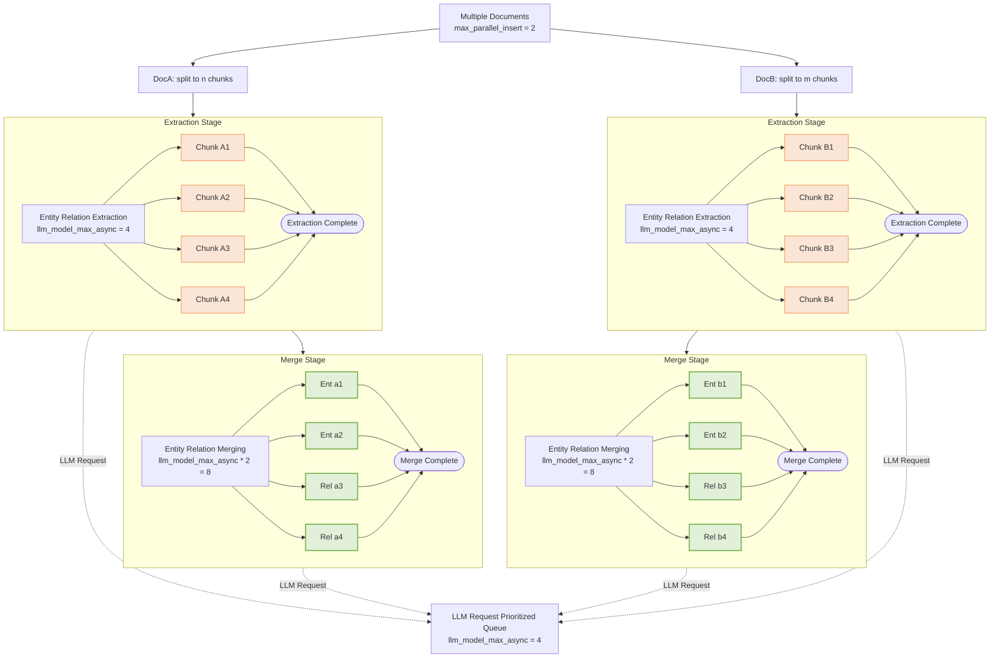

## LightRAG Multi-Document Processing: Concurrent Control Strategy

LightRAG employs a multi-layered concurrent control strategy when processing multiple documents. This article provides an in-depth analysis of the concurrent control mechanisms at document level, chunk level, and LLM request level, helping you understand why specific concurrent behaviors occur.

### 1. Document-Level Concurrent Control

**Control Parameter**: `max_parallel_insert`

This parameter controls the number of documents processed simultaneously. The purpose is to prevent excessive parallelism from overwhelming system resources, which could lead to extended processing times for individual files. Document-level concurrency is governed by the `max_parallel_insert` attribute within LightRAG, which defaults to 2 and is configurable via the `MAX_PARALLEL_INSERT` environment variable.  `max_parallel_insert` is recommended to be set between 2 and 10, typically `llm_model_max_async/3`. Setting this value too high can increase the likelihood of naming conflicts among entities and relationships across different documents during the merge phase, thereby reducing its overall efficiency.

### 2. Chunk-Level Concurrent Control

**Control Parameter**: `llm_model_max_async`

This parameter controls the number of chunks processed simultaneously in the extraction stage within a document. The purpose is to prevent a high volume of concurrent requests from monopolizing LLM processing resources, which would impede the efficient parallel processing of multiple files. Chunk-Level Concurrent Control is governed by the `llm_model_max_async` attribute within LightRAG, which defaults to 4 and is configurable via the `MAX_ASYNC` environment variable. The purpose of this parameter is to fully leverage the LLM's concurrency capabilities when processing individual documents.

In the `extract_entities` function, **each document independently creates** its own chunk semaphore. Since each document independently creates chunk semaphores, the theoretical chunk concurrency of the system is:
$$
ChunkConcurrency = Max Parallel Insert × LLM Model Max Async
$$
For example:
- `max_parallel_insert = 2` (process 2 documents simultaneously)
- `llm_model_max_async = 4` (maximum 4 chunk concurrency per document)
- Theoretical chunk-level concurrent: 2 × 4 = 8

### 3. Graph-Level Concurrent Control

**Control Parameter**: `llm_model_max_async * 2`

This parameter controls the number of entities and relations processed simultaneously in the merging stage within a document. The purpose is to prevent a high volume of concurrent requests from monopolizing LLM processing resources, which would impede the efficient parallel processing of multiple files. Graph-level concurrency is governed by the `llm_model_max_async` attribute within LightRAG, which defaults to 4 and is configurable via the `MAX_ASYNC` environment variable. Graph-level parallelism control parameters are equally applicable to managing parallelism during the entity relationship reconstruction phase after document deletion.

Given that the entity relationship merging phase doesn't necessitate LLM interaction for every operation, its parallelism is set at double the LLM's parallelism. This optimizes machine utilization while concurrently preventing excessive queuing resource contention for the LLM.

### 4. LLM-Level Concurrent Control

**Control Parameter**: `llm_model_max_async`

This parameter governs the **concurrent volume** of LLM requests dispatched by the entire LightRAG system, encompassing the document extraction stage, merging stage, and user query handling.

LLM request prioritization is managed via a global priority queue, which **systematically prioritizes user queries** over merging-related requests, and merging-related requests over extraction-related requests. This strategic prioritization **minimizes user query latency**.

LLM-level concurrency is governed by the `llm_model_max_async` attribute within LightRAG, which defaults to 4 and is configurable via the `MAX_ASYNC` environment variable.

### 5. Complete Concurrent Hierarchy Diagram

> The extraction and merge stages share a global prioritized LLM queue, regulated by `llm_model_max_async`. While numerous entity and relation extraction and merging operations may be "actively processing", **only a limited number will concurrently execute LLM requests** the remainder will be queued and awaiting their turn.

### 6. Performance Optimization Recommendations

* **Increase LLM Concurrent Setting based on the capabilities of your LLM server or API provider**

During the file processing phase, the performance and concurrency capabilities of the LLM are critical bottlenecks. When deploying LLMs locally, the service's concurrency capacity must adequately account for the context length requirements of LightRAG. LightRAG recommends that LLMs support a minimum context length of 32KB; therefore, server concurrency should be calculated based on this benchmark. For API providers, LightRAG will retry requests up to three times if the client's request is rejected due to concurrent request limits. Backend logs can be used to determine if LLM retries are occurring, thereby indicating whether `MAX_ASYNC` has exceeded the API provider's limits.

* **Align Parallel Document Insertion Settings with LLM Concurrency Configurations**

The recommended number of parallel document processing tasks is 1/4 of the LLM's concurrency, with a minimum of 2 and a maximum of 10. Setting a higher number of parallel document processing tasks typically does not accelerate overall document processing speed, as even a small number of concurrently processed documents can fully utilize the LLM's parallel processing capabilities. Excessive parallel document processing can significantly increase the processing time for each individual document. Since LightRAG commits processing results on a file-by-file basis, a large number of concurrent files would necessitate caching a substantial amount of data. In the event of a system error, all documents in the middle stage would require reprocessing, thereby increasing error handling costs. For instance, setting `MAX_PARALLEL_INSERT` to 3 is appropriate when `MAX_ASYNC` is configured to 12.
