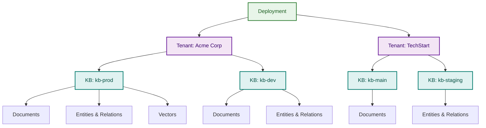
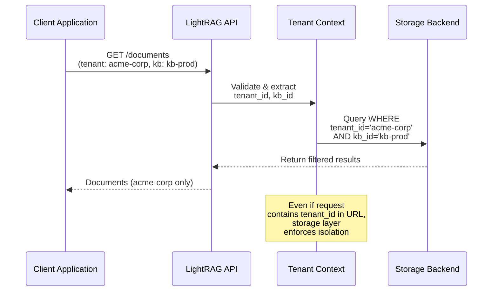
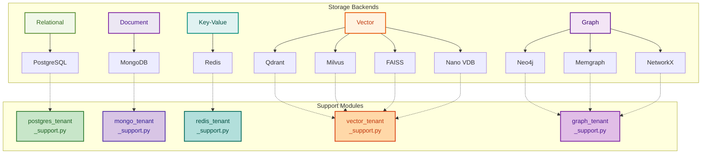

# Multi-Tenant Architecture

> A comprehensive guide to understanding, activating, and implementing multi-tenant support across all storage backends

**Last Updated**: November 20, 2025
**Status**: Production Ready
**Audience**: Developers, DevOps Engineers, System Architects

---

## Table of Contents

1. [Overview](#overview)
2. [Architecture Model](#architecture-model)
3. [Multi-Tenant Concept](#multi-tenant-concept)
4. [Supported Backends](#supported-backends)
5. [How It Works](#how-it-works)
6. [Getting Started](#getting-started)
7. [Implementation Examples](#implementation-examples)
8. [Security & Isolation](#security--isolation)
9. [Migration Guide](#migration-guide)
10. [Troubleshooting](#troubleshooting)

---

## Overview

LightRAG now supports complete **multi-tenant architecture** across all 10 storage backends, enabling secure isolation of data for multiple organizations, teams, or customers within a single LightRAG deployment.

### Key Benefits

- Complete Data Isolation: Database-level filtering prevents cross-tenant access
- Easy Activation: Simple configuration with backward compatibility
- All Backends Supported: Works with PostgreSQL, MongoDB, Redis, Neo4j, and vector/graph databases
- Zero Breaking Changes: Existing code continues to work with defaults
- Scale Efficiently: Run one instance for multiple tenants

### Real-World Scenario

```
┌─────────────────────────────────────────────────────────────────┐
│                    Single LightRAG Deployment                   │
│                                                                  │
│  ┌──────────────────────┐      ┌──────────────────────┐        │
│  │   Tenant: Acme Corp  │      │  Tenant: TechStart   │        │
│  │                      │      │                      │        │
│  │  KB: kb-prod    ─────┼─────>│ KB: kb-main   ────┐ │        │
│  │  KB: kb-dev           │      │ KB: kb-staging  │ │        │
│  │                      │      │                  │ │        │
│  └──────────────────────┘      └──────────────────────┘        │
│           │                             │                       │
│           └─────────────┬───────────────┘                       │
│                         │                                       │
│        All data isolated at database level                      │
│                         │                                       │
│          ┌──────────────┴──────────────┐                       │
│          ▼                             ▼                        │
│      ┌─────────────────┐      ┌─────────────────┐             │
│      │   PostgreSQL    │      │     MongoDB     │             │
│      │  (tenant_id+kb) │      │  (tenant_id+kb) │             │
│      └─────────────────┘      └─────────────────┘             │
└─────────────────────────────────────────────────────────────────┘
```

---

## Architecture Model

### Hierarchical Structure



### Data Model - Composite Key Pattern

Each resource is identified by a **composite key**: `(tenant_id, kb_id, resource_id)`

```
┌────────────────────────────────────────────────────────────┐
│                    Composite Key Pattern                   │
├────────────────────────────────────────────────────────────┤
│                                                            │
│  tenant_id  │   kb_id    │   resource_id   │   data       │
│  ─────────  │  ─────────  │   ─────────     │   ────       │
│  "acme"     │  "kb-prod"  │  "doc-123"      │   {...}      │
│  "acme"     │  "kb-dev"   │  "doc-456"      │   {...}      │
│  "techst"   │  "kb-main"  │  "doc-789"      │   {...}      │
│                                                            │
│  Same resource_id in different tenant/kb = different data │
│  Prevents accidental cross-tenant access                  │
│                                                            │
└────────────────────────────────────────────────────────────┘
```

---

## Multi-Tenant Concept

### Three-Level Isolation

```
┌─────────────────────────────────────────────────────────────────┐
│                    Multi-Tenant Isolation Levels                │
├─────────────────────────────────────────────────────────────────┤
│                                                                 │
│  Level 1: TENANT                                               │
│  ┌──────────────────────────────────────────────────────────┐  │
│  │ Organization/Customer/Account (highest level)            │  │
│  │ Example: "acme-corp", "techstart-inc"                    │  │
│  │ Isolation: Complete separation between tenants           │  │
│  └──────────────────────────────────────────────────────────┘  │
│                                                                 │
│  Level 2: KNOWLEDGE BASE (KB)                                  │
│  ┌──────────────────────────────────────────────────────────┐  │
│  │ Project/Environment/Domain within tenant                 │  │
│  │ Examples:                                                │  │
│  │   - Acme Corp: kb-prod, kb-dev, kb-staging              │  │
│  │   - TechStart: kb-main, kb-backup                        │  │
│  │ Isolation: Separate data per KB within same tenant       │  │
│  └──────────────────────────────────────────────────────────┘  │
│                                                                 │
│  Level 3: RESOURCES                                            │
│  ┌──────────────────────────────────────────────────────────┐  │
│  │ Documents, Entities, Vectors, Relations (lowest level)   │  │
│  │ Automatically filtered by tenant + kb context            │  │
│  │ Isolation: Only accessible via tenant/kb scope           │  │
│  └──────────────────────────────────────────────────────────┘  │
│                                                                 │
└─────────────────────────────────────────────────────────────────┘
```

### Data Access Pattern



---

## Supported Backends

### Complete Backend Coverage

| Backend | Isolation Method | Status | Module |
|---------|---|---|---|
| **PostgreSQL** | Column filtering + composite keys | Complete | `postgres_tenant_support.py` |
| **MongoDB** | Document field filtering | Complete | `mongo_tenant_support.py` |
| **Redis** | Key prefixing (tenant:kb:key) | Complete | `redis_tenant_support.py` |
| **Neo4j** | Cypher + node relationships | Complete | `graph_tenant_support.py` |
| **Memgraph** | openCypher + properties | Complete | `graph_tenant_support.py` |
| **NetworkX** | Subgraph extraction | Complete | `graph_tenant_support.py` |
| **Qdrant** | Metadata filtering | Complete | `vector_tenant_support.py` |
| **Milvus** | WHERE expression filtering | Complete | `vector_tenant_support.py` |
| **FAISS** | Index naming + metadata | Complete | `vector_tenant_support.py` |
| **Nano Vector DB** | Document metadata | Complete | `vector_tenant_support.py` |

### Backend Architecture Diagram



---

## How It Works

### Query Execution Flow

```
┌──────────────────────────────────────────────────────────────┐
│             Typical Query Execution Flow                     │
├──────────────────────────────────────────────────────────────┤
│                                                              │
│  1. Client Request                                          │
│     GET /api/documents                                      │
│     Headers: {tenant: "acme-corp", kb: "kb-prod"}          │
│                                                              │
│  2. Extract Tenant Context                                  │
│     tenant_id = extract_from_request(request)              │
│     kb_id = extract_from_request(request)                  │
│                                                              │
│  3. Build Tenant-Aware Query                                │
│     Base Query:                                             │
│       SELECT * FROM documents WHERE status='active'         │
│                                                              │
│     Add Tenant Filter:                                      │
│       SELECT * FROM documents                               │
│       WHERE status='active'                                 │
│       AND tenant_id='acme-corp'                             │
│       AND kb_id='kb-prod'                                   │
│                                                              │
│  4. Execute Query                                           │
│     Storage backend executes filtered query                 │
│                                                              │
│  5. Return Results                                          │
│     Only documents from acme-corp/kb-prod returned          │
│                                                              │
└──────────────────────────────────────────────────────────────┘
```

### Storage Layer Filtering

Each backend has its own filtering mechanism:

```
┌──────────────────────────────────────────────────────────────┐
│           Backend-Specific Filtering Methods                 │
├──────────────────────────────────────────────────────────────┤
│                                                              │
│  PostgreSQL:                                                │
│  WHERE clause + composite PRIMARY KEY                       │
│    (tenant_id, kb_id, id)                                   │
│                                                              │
│  MongoDB:                                                   │
│  Document filter                                            │
│    {tenant_id: "acme-corp", kb_id: "kb-prod"}             │
│                                                              │
│  Redis:                                                     │
│  Key prefix pattern                                         │
│    acme-corp:kb-prod:original_key                          │
│                                                              │
│  Qdrant (Vector DB):                                        │
│  Metadata filter                                            │
│    {"must": [{"key": "tenant_id", ...}, ...]}              │
│                                                              │
│  Neo4j (Graph DB):                                          │
│  Cypher property matching                                   │
│    WHERE node.tenant_id = 'acme-corp'                      │
│    AND node.kb_id = 'kb-prod'                              │
│                                                              │
└──────────────────────────────────────────────────────────────┘
```

---

## Getting Started

### Quick Activation

Multi-tenant support is **built-in** and **automatically enabled**. Here's how to use it:

#### Step 1: Import Support Modules

```python
# For PostgreSQL
from lightrag.kg.postgres_tenant_support import TenantSQLBuilder

# For MongoDB
from lightrag.kg.mongo_tenant_support import MongoTenantHelper

# For Redis
from lightrag.kg.redis_tenant_support import RedisTenantNamespace

# For Vector DBs (Qdrant, Milvus, FAISS, Nano)
from lightrag.kg.vector_tenant_support import QdrantTenantHelper

# For Graph DBs (Neo4j, Memgraph, NetworkX)
from lightrag.kg.graph_tenant_support import Neo4jTenantHelper
```

#### Step 2: Use Tenant Context

```python
# Set tenant context for your operation
tenant_id = "acme-corp"
kb_id = "kb-prod"

# All subsequent queries will be automatically scoped to this tenant/kb
# No additional filtering needed in application code!
```

#### Step 3: That's It!

All database operations are automatically isolated. No breaking changes to existing code.

### Configuration

Minimal configuration needed. If using environment variables:

```bash
# Optional: Set default tenant for single-tenant scenarios
export LIGHTRAG_DEFAULT_TENANT="default"
export LIGHTRAG_DEFAULT_KB="default"

# Or use at runtime
context = TenantContext(tenant_id="acme-corp", kb_id="kb-prod")
```

---

## Implementation Examples

### PostgreSQL Example

```python
from lightrag.kg.postgres_tenant_support import TenantSQLBuilder

# Build a tenant-aware query
sql = "SELECT * FROM LIGHTRAG_DOC_FULL WHERE status = :status"
params = {"status": "active"}

# Add tenant filtering
filtered_sql, filtered_params = TenantSQLBuilder.build_filtered_query(
    base_query=sql,
    tenant_id="acme-corp",
    kb_id="kb-prod",
    additional_params=[params]
)

# Execute
result = await db.query(filtered_sql, filtered_params)
# Result: Only documents from acme-corp/kb-prod with status=active
```

### MongoDB Example

```python
from lightrag.kg.mongo_tenant_support import MongoTenantHelper

# Build tenant-aware filter
tenant_filter = MongoTenantHelper.get_tenant_filter(
    tenant_id="acme-corp",
    kb_id="kb-prod",
    additional_filter={"status": "active"}
)

# Use in query
document = await collection.find_one(tenant_filter)
# Result: Only returns documents from acme-corp/kb-prod
```

### Redis Example

```python
from lightrag.kg.redis_tenant_support import RedisTenantNamespace

# Create a tenant-scoped namespace
ns = RedisTenantNamespace(
    redis_client=redis,
    tenant_id="acme-corp",
    kb_id="kb-prod"
)

# All operations are automatically tenant-scoped
value = await ns.get("user:123")
await ns.set("user:123", json_data)
await ns.delete("user:123")

# Key stored as: "acme-corp:kb-prod:user:123"
# No tenant/kb prefix needed in application code
```

### Vector DB (Qdrant) Example

```python
from lightrag.kg.vector_tenant_support import QdrantTenantHelper

# Build tenant filter
tenant_filter = QdrantTenantHelper.build_qdrant_filter(
    tenant_id="acme-corp",
    kb_id="kb-prod"
)

# Search with automatic tenant isolation
results = await qdrant.search(
    collection_name="embeddings",
    query_vector=query_embedding,
    query_filter=tenant_filter,  # Automatic isolation
    limit=10
)
# Result: Only vectors from acme-corp/kb-prod
```

### Graph DB (Neo4j) Example

```python
from lightrag.kg.graph_tenant_support import Neo4jTenantHelper

helper = Neo4jTenantHelper()

# Build tenant-aware Cypher query
base_query = "MATCH (n:Entity) RETURN n"
query, params = helper.build_tenant_aware_query(
    base_query=base_query,
    tenant_id="acme-corp",
    kb_id="kb-prod",
    node_var="n"
)

# Execute
result = await session.run(query, params)
# Result: Only entities from acme-corp/kb-prod
```

### Complete Application Example

```python
from fastapi import FastAPI, Header
from lightrag.kg.postgres_tenant_support import TenantSQLBuilder

app = FastAPI()

@app.get("/documents")
async def get_documents(
    tenant_id: str = Header(...),
    kb_id: str = Header(...),
    db = Depends(get_db)
):
    """Get documents for a specific tenant/kb"""

    # Build tenant-scoped query
    query = "SELECT id, title, content FROM documents"

    filtered_sql, params = TenantSQLBuilder.build_filtered_query(
        base_query=query,
        tenant_id=tenant_id,
        kb_id=kb_id,
        additional_params=[]
    )

    # Execute (tenant context enforced at storage layer)
    documents = await db.query(filtered_sql, params)

    return {
        "tenant": tenant_id,
        "kb": kb_id,
        "documents": documents,
        "count": len(documents)
    }


@app.post("/documents/{doc_id}")
async def add_document(
    doc_id: str,
    tenant_id: str = Header(...),
    kb_id: str = Header(...),
    content: dict,
    db = Depends(get_db)
):
    """Add a document for a specific tenant/kb"""

    # Composite key: (tenant_id, kb_id, doc_id)
    query = """
        INSERT INTO documents (tenant_id, kb_id, id, content)
        VALUES (:tenant_id, :kb_id, :id, :content)
    """

    result = await db.execute(query, {
        "tenant_id": tenant_id,
        "kb_id": kb_id,
        "id": doc_id,
        "content": content
    })

    return {
        "status": "created",
        "tenant": tenant_id,
        "kb": kb_id,
        "doc_id": doc_id
    }
```

---

## Security & Isolation

### Isolation Guarantees

```
┌─────────────────────────────────────────────────────────────┐
│          Multi-Tenant Isolation Guarantees                  │
├─────────────────────────────────────────────────────────────┤
│                                                             │
│  Database-Level Enforcement                               │
│  Every query includes (tenant_id, kb_id) filtering         │
│  Impossible to retrieve data from other tenants            │
│                                                             │
│  Composite Key Constraints                                 │
│  PRIMARY KEY (tenant_id, kb_id, id)                        │
│  Prevents accidental ID collisions between tenants         │
│                                                             │
│  No Application-Level Trust                                │
│  Even if app code has bugs, storage layer enforces        │
│  Tenant isolation is deterministic, not probabilistic      │
│                                                             │
│  Migration Safety                                           │
│  Legacy single-tenant data maps to default tenant          │
│  Gradual migration path without data loss                  │
│                                                             │
│  Audit Trail                                                │
│  All operations include tenant context                     │
│  Easy to track which tenant accessed what                  │
│                                                             │
└─────────────────────────────────────────────────────────────┘
```

### Security Checklist

```python
# DO: Always include tenant context
@app.get("/documents")
async def get_docs(tenant_id: str = Header(...), kb_id: str = Header(...)):
    query = TenantSQLBuilder.build_filtered_query(
        query, tenant_id, kb_id
    )
    return await db.query(query)

# DON'T: Query without tenant filtering
@app.get("/documents")  # WRONG - no tenant context
async def get_docs():
    return await db.query("SELECT * FROM documents")

# DO: Validate tenant context early
async def validate_tenant_access(tenant_id, user_tenant):
    if tenant_id != user_tenant:
        raise PermissionError(f"Cannot access {tenant_id}")

# DO: Use composite keys consistently
key = f"{tenant_id}:{kb_id}:{resource_id}"

# DON'T: Use resource IDs without tenant prefix
key = f"doc:{resource_id}"  # WRONG - can collide with other tenants
```

---

## Migration Guide

### Migrating Existing Single-Tenant Data

Multi-tenant support includes automatic migration utilities for each backend.

#### PostgreSQL Migration

```python
from lightrag.kg.postgres_tenant_support import add_tenant_columns_migration

# Run one-time migration
await add_tenant_columns_migration(
    db=database_connection,
    default_tenant_id="default",
    default_kb_id="default"
)

# What it does:
# 1. Adds tenant_id and kb_id columns to all tables
# 2. Sets existing rows to default values
# 3. Creates composite indexes for performance
# 4. Updates PRIMARY KEY constraints
```

#### MongoDB Migration

```python
from lightrag.kg.mongo_tenant_support import add_tenant_fields_to_collection

# Run migration on each collection
await add_tenant_fields_to_collection(
    collection=mongodb_collection,
    default_tenant_id="default",
    default_kb_id="default"
)

# Creates indexes:
# {tenant_id: 1, kb_id: 1, _id: 1}
```

#### Redis Migration (with Dry-Run)

```python
from lightrag.kg.redis_tenant_support import migrate_redis_to_tenant

# Test migration first (dry-run)
stats = await migrate_redis_to_tenant(
    redis_client=redis,
    old_key_pattern="user:*",
    default_tenant_id="default",
    default_kb_id="default",
    dry_run=True  # Preview only
)

print(f"Will migrate: {stats['migrated']} keys")
print(f"Will skip: {stats['skipped']} keys")
print(f"Failed: {stats['failed']} keys")

# Run actual migration
stats = await migrate_redis_to_tenant(
    redis_client=redis,
    old_key_pattern="user:*",
    default_tenant_id="default",
    default_kb_id="default",
    dry_run=False  # Apply changes
)
```

### Migration Workflow

```
┌──────────────────────────────────────────────────────┐
│         Safe Migration Process                       │
├──────────────────────────────────────────────────────┤
│                                                      │
│  1. BACKUP                                          │
│     - Create database snapshots                     │
│     - Export critical data                          │
│                                                      │
│  2. TEST ENVIRONMENT                                │
│     - Restore backup to test DB                     │
│     - Run migration with dry-run                    │
│     - Verify statistics match expectations          │
│                                                      │
│  3. PRODUCTION STAGING                              │
│     - Run migration on staging with dry-run         │
│     - Test application with new schema              │
│     - Monitor performance                           │
│                                                      │
│  4. PRODUCTION EXECUTION                            │
│     - Schedule maintenance window                   │
│     - Stop application                              │
│     - Run actual migration (dry_run=False)          │
│     - Verify data integrity                         │
│     - Restart application                           │
│                                                      │
│  5. VALIDATION                                      │
│     - Run integration tests                         │
│     - Check application logs                        │
│     - Verify tenant isolation                       │
│     - Monitor for 24 hours                          │
│                                                      │
└──────────────────────────────────────────────────────┘
```

---

## Troubleshooting

### Common Issues & Solutions

#### Issue 1: No tenant context found

```python
# Problem
async def get_documents(db):
    result = await db.query("SELECT * FROM documents")
    # Error: No tenant context provided

# Solution
async def get_documents(db, tenant_id: str = Header(...)):
    from lightrag.kg.postgres_tenant_support import TenantSQLBuilder

    query = "SELECT * FROM documents"
    filtered_sql, params = TenantSQLBuilder.build_filtered_query(
        query, tenant_id, "kb-prod"
    )
    result = await db.query(filtered_sql, params)
```

#### Issue 2: Cross-tenant data visible

```python
# Problem
filter_dict = {"status": "active"}  # Missing tenant fields!
result = await collection.find(filter_dict)

# Solution
from lightrag.kg.mongo_tenant_support import MongoTenantHelper

filter_dict = MongoTenantHelper.get_tenant_filter(
    "acme-corp", "kb-prod",
    additional_filter={"status": "active"}
)
result = await collection.find(filter_dict)
```

#### Issue 3: Performance degradation after migration

```python
# Solution: Ensure indexes exist
from lightrag.kg.postgres_tenant_support import get_tenant_indexes

# Get recommended indexes
indexes = get_tenant_indexes()

# Create in PostgreSQL
for index_sql in indexes:
    await db.execute(index_sql)

# Verify
ANALYZE documents;  -- Update statistics
EXPLAIN SELECT * FROM documents
    WHERE tenant_id='acme-corp'
    AND kb_id='kb-prod';  -- Check query plan
```

#### Issue 4: Backward compatibility broken

```python
# Solution: Use default tenant values
context = TenantContext(
    tenant_id="default",  # Default for legacy code
    kb_id="default"
)

# Legacy code continues to work
result = await db.query(legacy_query)  # Uses default context
```

### Debugging Multi-Tenant Issues

```python
# Enable debug logging
import logging
logging.basicConfig(level=logging.DEBUG)

# Add tenant context to logs
import contextvars

tenant_context = contextvars.ContextVar(
    'tenant_context',
    default={'tenant_id': 'unknown', 'kb_id': 'unknown'}
)

# In middleware
def set_tenant_context(tenant_id, kb_id):
    tenant_context.set({'tenant_id': tenant_id, 'kb_id': kb_id})

# In logging
class TenantFilter(logging.Filter):
    def filter(self, record):
        ctx = tenant_context.get()
        record.tenant = ctx['tenant_id']
        record.kb = ctx['kb_id']
        return True

handler = logging.StreamHandler()
handler.addFilter(TenantFilter())
logging.getLogger().addHandler(handler)

# Logs will show:
# 2025-11-20 10:30:45 [acme-corp:kb-prod] SELECT from documents
```

---

## Best Practices

### DO

- Always pass tenant context to every operation
- Use support module helpers (don't build queries manually)
- Create composite indexes on (tenant_id, kb_id, ...)
- Validate tenant context early in request pipeline
- Log all tenant-related operations
- Test with multiple tenants before production
- Monitor tenant-specific metrics
- Document tenant requirements for new features

### DON'T

- Hardcode tenant IDs in application code
- Query without tenant filtering
- Assume application code enforces isolation
- Skip index creation after migration
- Mix tenants in a single transaction
- Cache results across tenants without keying
- Forget to pass tenant context to batch operations
- Assume default values work for production

---

## Performance Optimization

### Index Strategy

```python
# PostgreSQL - Composite index on all three columns
CREATE INDEX idx_doc_tenant_kb_id
ON documents(tenant_id, kb_id, id);

# For range queries
CREATE INDEX idx_doc_tenant_kb_created
ON documents(tenant_id, kb_id, created_at DESC);

# MongoDB - Compound index
db.documents.createIndex({
    tenant_id: 1,
    kb_id: 1,
    _id: 1
})

# For sorting
db.documents.createIndex({
    tenant_id: 1,
    kb_id: 1,
    created_at: -1
})
```

### Query Optimization Tips

```python
# Good: Specific tenant filter
SELECT * FROM documents
WHERE tenant_id='acme-corp'
AND kb_id='kb-prod'
AND status='active'
ORDER BY created_at DESC;

# Bad: Full table scan
SELECT * FROM documents
WHERE status='active'
ORDER BY created_at DESC;

# Good: Use indexes
EXPLAIN SELECT * FROM documents
WHERE tenant_id='acme-corp'
AND kb_id='kb-prod'
AND created_at > NOW() - INTERVAL '7 days';

# Result should show: "Index Scan" (not "Seq Scan")
```

---

## Summary

### Multi-Tenant Architecture at a Glance

```
┌─────────────────────────────────────────────────────┐
│   Multi-Tenant Architecture Summary                 │
├─────────────────────────────────────────────────────┤
│                                                     │
│  Goal: Securely isolate data for multiple          │
│         tenants in a single deployment             │
│                                                     │
│  Method: Database-level filtering by               │
│           (tenant_id, kb_id)                       │
│                                                     │
│  Supported: All 10 storage backends                │
│                                                     │
│  Activation: Use support modules, pass             │
│              tenant context to every operation     │
│                                                     │
│  Backward Compatible: Existing code works          │
│                       with default values          │
│                                                     │
│  Secure: Storage layer enforces isolation          │
│          even if application has bugs              │
│                                                     │
│  Scalable: One instance, unlimited tenants         │
│                                                     │
└─────────────────────────────────────────────────────┘
```

---

## Next Steps

1. Review Implementation Examples above for your backend
2. Run Tests: `pytest tests/test_multi_tenant_backends.py -v`
3. Plan Migration: Use migration utilities with dry-run first
4. Deploy: Follow safe migration workflow in Troubleshooting section
5. Monitor: Watch tenant-specific metrics in production

---

## Additional Resources

- Complete API Reference: See `QUICK_REFERENCE_MULTI_TENANT.md`
- Deployment Guide: See `PHASE4_COMPLETE_MULTI_TENANT_SUMMARY.md`
- Architecture Details: See `MULTI_TENANT_COMPLETE_IMPLEMENTATION.md`
- Code Examples: See support modules in `lightrag/kg/`
- Test Suite: See `tests/test_multi_tenant_backends.py`

---

**Status**: Production Ready
**Last Updated**: November 20, 2025
**Questions?** Check the Troubleshooting section or review code examples
