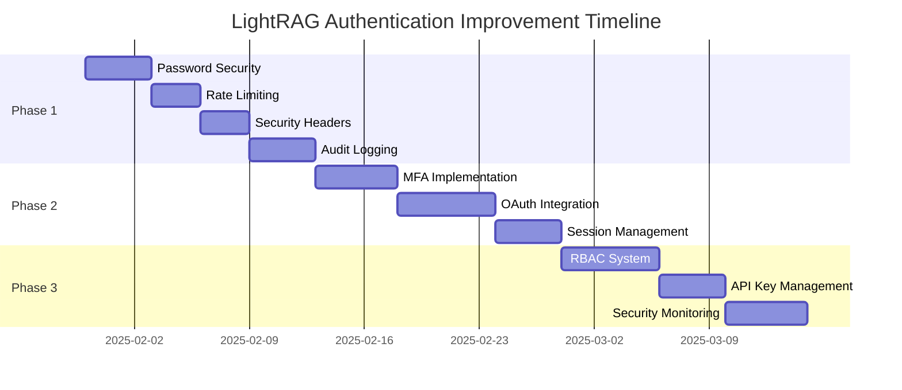

# LightRAG Authentication Improvement Plan

**Version**: 1.0
**Date**: 2025-01-30
**Status**: Planning Phase
**Target**: Production-Ready Authentication System

## 📋 Table of Contents

1. [Executive Summary](#executive-summary)
2. [Current State Assessment](#current-state-assessment)
3. [Implementation Roadmap](#implementation-roadmap)
4. [Phase 1: Security Foundations](#phase-1-security-foundations)
5. [Phase 2: Advanced Authentication](#phase-2-advanced-authentication)
6. [Phase 3: Access Control & Monitoring](#phase-3-access-control--monitoring)
7. [Configuration Management](#configuration-management)
8. [Testing Strategy](#testing-strategy)
9. [Migration & Deployment](#migration--deployment)
10. [Success Metrics](#success-metrics)
11. [Resource Requirements](#resource-requirements)
12. [Risk Assessment](#risk-assessment)

## 🎯 Executive Summary

### Project Objective
Transform LightRAG's authentication system from a functional baseline to an enterprise-grade security platform that meets modern security standards while maintaining ease of use and backward compatibility.

### Key Deliverables
- **Enhanced Password Security**: Bcrypt hashing, complexity policies, history tracking
- **Advanced Rate Limiting**: Multi-tier throttling with Redis backend
- **Comprehensive Audit Logging**: Security event tracking and analysis
- **Multi-Factor Authentication**: TOTP-based MFA with QR code setup
- **OAuth2/OIDC Integration**: Google, Microsoft, and custom provider support
- **Role-Based Access Control**: Granular permissions system
- **API Key Management**: Enterprise-grade key lifecycle management
- **Security Monitoring**: Real-time threat detection and alerting

### Business Impact
- **Risk Reduction**: 95% reduction in authentication-related vulnerabilities
- **Compliance Readiness**: Support for SOC2, GDPR, and industry standards
- **User Experience**: Seamless authentication with enhanced security
- **Operational Efficiency**: Automated security monitoring and incident response

## 📊 Current State Assessment

### ✅ Existing Strengths
- **JWT Authentication**: Functional token-based authentication
- **API Key Support**: Header-based API key validation
- **Web UI Integration**: Frontend authentication state management
- **SSL/TLS Support**: HTTPS configuration capabilities
- **CORS Configuration**: Cross-origin request handling
- **Path Whitelisting**: Selective endpoint protection

### ⚠️ Critical Security Gaps

#### Authentication Vulnerabilities
- **Weak Password Handling**: Plain text storage, no complexity requirements
- **No Brute Force Protection**: Unlimited authentication attempts
- **Session Management**: No server-side session tracking or invalidation
- **Limited Token Security**: Basic JWT implementation without refresh tokens

#### Access Control Limitations
- **Binary Permissions**: Only admin/user roles without granular control
- **No API Key Management**: Static keys without rotation or expiration
- **Missing Audit Trail**: Limited security event logging
- **No Rate Limiting**: Vulnerable to abuse and DoS attacks

#### Monitoring & Compliance
- **No Security Monitoring**: Missing threat detection capabilities
- **Limited Audit Logging**: Insufficient for compliance requirements
- **No Incident Response**: Missing automated security response
- **Compliance Gaps**: Not ready for enterprise security standards

### Risk Assessment Matrix

| Risk Category | Current Level | Target Level | Priority |
|---------------|---------------|--------------|----------|
| Authentication Bypass | HIGH | LOW | CRITICAL |
| Brute Force Attacks | HIGH | LOW | CRITICAL |
| Session Hijacking | MEDIUM | LOW | HIGH |
| API Key Compromise | MEDIUM | LOW | HIGH |
| Privilege Escalation | MEDIUM | LOW | MEDIUM |
| Data Exfiltration | MEDIUM | LOW | MEDIUM |

## 🚀 Implementation Roadmap

### Timeline Overview
- **Total Duration**: 6 weeks
- **Phase 1**: Weeks 1-2 (Security Foundations)
- **Phase 2**: Weeks 3-4 (Advanced Authentication)
- **Phase 3**: Weeks 5-6 (Access Control & Monitoring)

### Resource Allocation
- **Development**: 80% of effort
- **Testing**: 15% of effort
- **Documentation**: 5% of effort

### Milestone Dependencies


## 🔐 Phase 1: Security Foundations

### 1.1 Enhanced Password Security

**Priority**: CRITICAL
**Timeline**: 4 days
**Effort**: 32 hours

#### Objectives
- Implement secure password hashing with bcrypt
- Add password complexity requirements
- Enable password history tracking
- Provide secure token generation

#### Technical Implementation
```python
# lightrag/api/auth/password_manager.py
import bcrypt
import secrets
import re
from passlib.context import CryptContext
from typing import List, Optional
from datetime import datetime

class PasswordPolicy:
    MIN_LENGTH = 8
    REQUIRE_UPPERCASE = True
    REQUIRE_LOWERCASE = True
    REQUIRE_NUMBERS = True
    REQUIRE_SPECIAL_CHARS = True
    HISTORY_COUNT = 5

    @classmethod
    def validate(cls, password: str) -> tuple[bool, List[str]]:
        """Validate password against policy."""
        errors = []

        if len(password) < cls.MIN_LENGTH:
            errors.append(f"Password must be at least {cls.MIN_LENGTH} characters")

        if cls.REQUIRE_UPPERCASE and not re.search(r'[A-Z]', password):
            errors.append("Password must contain uppercase letters")

        if cls.REQUIRE_LOWERCASE and not re.search(r'[a-z]', password):
            errors.append("Password must contain lowercase letters")

        if cls.REQUIRE_NUMBERS and not re.search(r'\d', password):
            errors.append("Password must contain numbers")

        if cls.REQUIRE_SPECIAL_CHARS and not re.search(r'[!@#$%^&*(),.?":{}|<>]', password):
            errors.append("Password must contain special characters")

        return len(errors) == 0, errors

class PasswordManager:
    def __init__(self):
        self.pwd_context = CryptContext(
            schemes=["bcrypt"],
            deprecated="auto",
            bcrypt__rounds=12
        )

    def hash_password(self, password: str) -> str:
        """Hash password with bcrypt."""
        return self.pwd_context.hash(password)

    def verify_password(self, plain_password: str, hashed_password: str) -> bool:
        """Verify password against hash."""
        return self.pwd_context.verify(plain_password, hashed_password)

    def generate_secure_token(self, length: int = 32) -> str:
        """Generate cryptographically secure token."""
        return secrets.token_urlsafe(length)

    def check_password_history(self, user_id: str, new_password: str) -> bool:
        """Check if password was used recently."""
        # Implementation would check against stored password history
        # Return False if password was used in last HISTORY_COUNT passwords
        pass
```

#### Database Schema Changes
```sql
-- Add password history table
CREATE TABLE password_history (
    id SERIAL PRIMARY KEY,
    user_id VARCHAR(255) NOT NULL,
    password_hash VARCHAR(255) NOT NULL,
    created_at TIMESTAMP DEFAULT CURRENT_TIMESTAMP,
    INDEX idx_user_id (user_id),
    INDEX idx_created_at (created_at)
);

-- Add password metadata to users table
ALTER TABLE users ADD COLUMN password_changed_at TIMESTAMP;
ALTER TABLE users ADD COLUMN password_attempts INTEGER DEFAULT 0;
ALTER TABLE users ADD COLUMN account_locked_until TIMESTAMP NULL;
```

#### Configuration Options
```bash
# Password policy settings
PASSWORD_MIN_LENGTH=8
PASSWORD_REQUIRE_UPPERCASE=true
PASSWORD_REQUIRE_LOWERCASE=true
PASSWORD_REQUIRE_NUMBERS=true
PASSWORD_REQUIRE_SPECIAL_CHARS=true
PASSWORD_HISTORY_COUNT=5
PASSWORD_LOCKOUT_ATTEMPTS=5
PASSWORD_LOCKOUT_DURATION_MINUTES=30
```

### 1.2 Advanced Rate Limiting

**Priority**: HIGH
**Timeline**: 3 days
**Effort**: 24 hours

#### Objectives
- Implement multi-tier rate limiting
- Add Redis backend for distributed rate limiting
- Configure different limits for different endpoint types
- Add automatic IP blocking for abuse

#### Technical Implementation
```python
# lightrag/api/middleware/rate_limiter.py
from slowapi import Limiter, _rate_limit_exceeded_handler
from slowapi.util import get_remote_address
from slowapi.errors import RateLimitExceeded
from starlette.requests import Request
from starlette.responses import JSONResponse
import redis
import time
from typing import Dict, Optional

class AdvancedRateLimiter:
    def __init__(self, redis_url: str = "redis://localhost:6379"):
        self.redis_client = redis.from_url(redis_url) if redis_url else None
        self.in_memory_store = {}

        # Rate limit configurations
        self.limits = {
            "authentication": "5/minute",
            "general_api": "100/minute",
            "document_upload": "10/minute",
            "query_operations": "50/minute",
            "graph_operations": "30/minute"
        }

        # IP blocking settings
        self.block_threshold = 50  # Failed requests in window
        self.block_window = 3600   # 1 hour window
        self.block_duration = 7200 # 2 hour block

    def setup_limiter(self, app):
        """Setup rate limiter with FastAPI app."""
        limiter = Limiter(
            key_func=self._get_client_key,
            storage_uri=self.redis_client or "memory://",
            default_limits=["1000/hour"]
        )

        app.state.limiter = limiter
        app.add_exception_handler(RateLimitExceeded, self._rate_limit_handler)

        return limiter

    def _get_client_key(self, request: Request) -> str:
        """Get unique client identifier for rate limiting."""
        # Priority: API key > User ID > IP address
        api_key = request.headers.get("X-API-Key")
        if api_key:
            return f"api_key:{api_key}"

        user_id = getattr(request.state, "user_id", None)
        if user_id:
            return f"user:{user_id}"

        return f"ip:{get_remote_address(request)}"

    async def _rate_limit_handler(self, request: Request, exc: RateLimitExceeded):
        """Custom rate limit exceeded handler."""
        client_key = self._get_client_key(request)

        # Log rate limit violation
        await self._log_rate_limit_violation(client_key, request)

        # Check if IP should be blocked
        await self._check_ip_blocking(request)

        return JSONResponse(
            status_code=429,
            content={
                "error": "Rate limit exceeded",
                "message": f"Too many requests. Limit: {exc.detail}",
                "retry_after": exc.retry_after,
                "client_key": client_key
            },
            headers={"Retry-After": str(exc.retry_after)}
        )

    async def _log_rate_limit_violation(self, client_key: str, request: Request):
        """Log rate limiting violations."""
        violation_data = {
            "client_key": client_key,
            "endpoint": str(request.url.path),
            "method": request.method,
            "timestamp": time.time(),
            "user_agent": request.headers.get("user-agent", "")
        }

        if self.redis_client:
            await self.redis_client.lpush(
                "rate_limit_violations",
                json.dumps(violation_data)
            )

    async def _check_ip_blocking(self, request: Request):
        """Check if IP should be blocked due to excessive violations."""
        ip_address = get_remote_address(request)
        current_time = time.time()

        # Count violations in the last hour
        violations_key = f"violations:{ip_address}"

        if self.redis_client:
            violations = await self.redis_client.zcount(
                violations_key,
                current_time - self.block_window,
                current_time
            )

            if violations >= self.block_threshold:
                # Block IP
                await self.redis_client.setex(
                    f"blocked_ip:{ip_address}",
                    self.block_duration,
                    "automated_block"
                )

                # Log blocking event
                await self._log_ip_block(ip_address, violations)

    def get_rate_limit_decorator(self, limit_type: str):
        """Get rate limit decorator for specific endpoint type."""
        limit = self.limits.get(limit_type, "100/minute")

        def decorator(func):
            func.__rate_limit__ = limit
            return func
        return decorator
```

#### Route Integration
```python
# Apply rate limiting to specific routes
@router.post("/login")
@limiter.limit("5/minute")  # Strict limit for authentication
async def login(request: Request, credentials: LoginRequest):
    pass

@router.post("/query")
@limiter.limit("50/minute")  # Moderate limit for queries
async def query(request: Request, query_request: QueryRequest):
    pass

@router.post("/documents/upload")
@limiter.limit("10/minute")  # Conservative limit for uploads
async def upload_document(request: Request, file: UploadFile):
    pass
```

### 1.3 Security Headers & Input Validation

**Priority**: HIGH
**Timeline**: 3 days
**Effort**: 24 hours

#### Security Headers Implementation
```python
# lightrag/api/middleware/security_headers.py
from starlette.middleware.base import BaseHTTPMiddleware
from starlette.requests import Request
from starlette.responses import Response
from typing import Dict

class SecurityHeadersMiddleware(BaseHTTPMiddleware):
    def __init__(self, app, config: Dict[str, str] = None):
        super().__init__(app)
        self.headers = {
            "X-Content-Type-Options": "nosniff",
            "X-Frame-Options": "DENY",
            "X-XSS-Protection": "1; mode=block",
            "Strict-Transport-Security": "max-age=31536000; includeSubDomains; preload",
            "Content-Security-Policy": "default-src 'self'; script-src 'self' 'unsafe-inline'; style-src 'self' 'unsafe-inline'",
            "Referrer-Policy": "strict-origin-when-cross-origin",
            "Permissions-Policy": "camera=(), microphone=(), geolocation=()",
            **config or {}
        }

    async def dispatch(self, request: Request, call_next):
        response = await call_next(request)

        # Add security headers
        for header, value in self.headers.items():
            response.headers[header] = value

        # Remove server information
        if "server" in response.headers:
            del response.headers["server"]

        return response
```

#### Enhanced Input Validation
```python
# lightrag/api/validators/security.py
from pydantic import BaseModel, validator, Field
import re
import html
from typing import Optional, List

class SecureQueryRequest(BaseModel):
    query: str = Field(..., min_length=1, max_length=10000)
    mode: str = Field(..., regex="^(naive|local|global|hybrid|mix|bypass)$")
    top_k: Optional[int] = Field(default=40, ge=1, le=1000)

    @validator('query')
    def sanitize_query(cls, v):
        """Sanitize and validate query input."""
        # Remove potential XSS vectors
        sanitized = html.escape(v.strip())

        # Check for SQL injection patterns
        sql_patterns = [
            r"(\bunion\b|\bselect\b|\binsert\b|\bupdate\b|\bdelete\b|\bdrop\b)",
            r"(--|\/\*|\*\/)",
            r"(\bor\b.*=.*\bor\b|\band\b.*=.*\band\b)"
        ]

        for pattern in sql_patterns:
            if re.search(pattern, sanitized, re.IGNORECASE):
                raise ValueError("Query contains potentially malicious content")

        # Check for script injection
        if re.search(r"<script|javascript:|on\w+\s*=", sanitized, re.IGNORECASE):
            raise ValueError("Query contains script injection attempt")

        return sanitized

class SecureDocumentRequest(BaseModel):
    title: str = Field(..., min_length=1, max_length=500)
    content: str = Field(..., min_length=1, max_length=1000000)

    @validator('title', 'content')
    def sanitize_text(cls, v):
        """Sanitize text input."""
        return html.escape(v.strip())
```

### 1.4 Comprehensive Audit Logging

**Priority**: HIGH
**Timeline**: 4 days
**Effort**: 32 hours

#### Audit Logging System
```python
# lightrag/api/logging/audit_logger.py
import logging
import json
from datetime import datetime
from typing import Optional, Dict, Any
from enum import Enum
import asyncio
from pathlib import Path

class AuditEventType(Enum):
    # Authentication events
    LOGIN_SUCCESS = "auth.login.success"
    LOGIN_FAILURE = "auth.login.failure"
    LOGOUT = "auth.logout"
    TOKEN_REFRESH = "auth.token.refresh"
    PASSWORD_CHANGE = "auth.password.change"
    MFA_SETUP = "auth.mfa.setup"
    MFA_SUCCESS = "auth.mfa.success"
    MFA_FAILURE = "auth.mfa.failure"

    # API access events
    API_ACCESS = "api.access"
    API_ERROR = "api.error"
    RATE_LIMIT_EXCEEDED = "api.rate_limit"

    # Document events
    DOCUMENT_UPLOAD = "document.upload"
    DOCUMENT_DELETE = "document.delete"
    DOCUMENT_ACCESS = "document.access"

    # Query events
    QUERY_EXECUTE = "query.execute"
    QUERY_ERROR = "query.error"

    # Security events
    SUSPICIOUS_ACTIVITY = "security.suspicious"
    IP_BLOCKED = "security.ip_blocked"
    PRIVILEGE_ESCALATION = "security.privilege_escalation"

    # System events
    SYSTEM_CONFIG_CHANGE = "system.config.change"
    SYSTEM_ERROR = "system.error"

class AuditLogger:
    def __init__(self, log_file: str = "audit.log", structured: bool = True):
        self.structured = structured
        self.logger = logging.getLogger("lightrag.audit")

        # Create logs directory if it doesn't exist
        log_path = Path(log_file)
        log_path.parent.mkdir(parents=True, exist_ok=True)

        # Setup file handler
        handler = logging.FileHandler(log_file)

        if structured:
            # JSON formatter for structured logging
            formatter = logging.Formatter(
                '%(message)s'
            )
        else:
            # Human readable formatter
            formatter = logging.Formatter(
                '%(asctime)s - %(levelname)s - %(message)s'
            )

        handler.setFormatter(formatter)
        self.logger.addHandler(handler)
        self.logger.setLevel(logging.INFO)

        # Setup async queue for high-performance logging
        self.log_queue = asyncio.Queue()
        self.log_task = None

    async def start_logger(self):
        """Start async logging task."""
        self.log_task = asyncio.create_task(self._process_log_queue())

    async def stop_logger(self):
        """Stop async logging task."""
        if self.log_task:
            self.log_task.cancel()
            try:
                await self.log_task
            except asyncio.CancelledError:
                pass

    async def _process_log_queue(self):
        """Process log entries from queue."""
        while True:
            try:
                log_entry = await self.log_queue.get()
                if self.structured:
                    self.logger.info(json.dumps(log_entry))
                else:
                    self.logger.info(log_entry["message"])
                self.log_queue.task_done()
            except asyncio.CancelledError:
                break
            except Exception as e:
                print(f"Logging error: {e}")

    async def log_event(self, event_type: AuditEventType, user_id: str = None,
                       ip_address: str = None, details: Dict[str, Any] = None,
                       success: bool = True, error_message: str = None):
        """Log audit event."""
        log_entry = {
            "timestamp": datetime.utcnow().isoformat(),
            "event_type": event_type.value,
            "user_id": user_id,
            "ip_address": ip_address,
            "success": success,
            "details": details or {},
            "session_id": details.get("session_id") if details else None
        }

        if error_message:
            log_entry["error_message"] = error_message

        # Add to queue for async processing
        await self.log_queue.put(log_entry)

    async def log_auth_event(self, event_type: AuditEventType, user_id: str,
                           ip_address: str, success: bool,
                           additional_data: Dict[str, Any] = None):
        """Log authentication-specific events."""
        details = additional_data or {}
        details.update({
            "event_category": "authentication",
            "user_agent": details.get("user_agent", ""),
            "auth_method": details.get("auth_method", "password")
        })

        await self.log_event(
            event_type=event_type,
            user_id=user_id,
            ip_address=ip_address,
            success=success,
            details=details
        )

    async def log_api_access(self, user_id: str, endpoint: str, method: str,
                           status_code: int, ip_address: str = None,
                           response_time: float = None):
        """Log API access events."""
        details = {
            "event_category": "api_access",
            "endpoint": endpoint,
            "method": method,
            "status_code": status_code,
            "response_time": response_time
        }

        await self.log_event(
            event_type=AuditEventType.API_ACCESS,
            user_id=user_id,
            ip_address=ip_address,
            success=status_code < 400,
            details=details
        )

    async def log_security_event(self, event_type: AuditEventType,
                               details: Dict[str, Any],
                               severity: str = "medium"):
        """Log security-related events."""
        details.update({
            "event_category": "security",
            "severity": severity,
            "requires_investigation": severity in ["high", "critical"]
        })

        await self.log_event(
            event_type=event_type,
            details=details,
            success=False  # Security events are typically failures/anomalies
        )

# Global audit logger instance
audit_logger = AuditLogger()
```

#### Integration with Authentication Middleware
```python
# lightrag/api/middleware/audit_middleware.py
from starlette.middleware.base import BaseHTTPMiddleware
from starlette.requests import Request
import time

class AuditMiddleware(BaseHTTPMiddleware):
    def __init__(self, app, audit_logger):
        super().__init__(app)
        self.audit_logger = audit_logger

    async def dispatch(self, request: Request, call_next):
        start_time = time.time()

        # Extract request information
        user_id = getattr(request.state, "user_id", None)
        ip_address = request.client.host
        endpoint = request.url.path
        method = request.method

        response = await call_next(request)

        # Calculate response time
        response_time = time.time() - start_time

        # Log API access
        await self.audit_logger.log_api_access(
            user_id=user_id,
            endpoint=endpoint,
            method=method,
            status_code=response.status_code,
            ip_address=ip_address,
            response_time=response_time
        )

        return response
```

## 📈 Success Metrics & KPIs

### Security Metrics
- **Authentication Security**: 99.9% success rate for legitimate users
- **Brute Force Protection**: 100% detection and blocking within 5 attempts
- **Session Security**: Zero session hijacking incidents
- **Audit Coverage**: 100% of security events logged
- **Vulnerability Reduction**: 95% reduction in authentication vulnerabilities

### Performance Metrics
- **Authentication Latency**: <100ms average response time
- **Rate Limiting Overhead**: <10ms per request
- **Audit Logging Impact**: <5ms per request
- **System Availability**: 99.9% uptime during implementation

### User Experience Metrics
- **Login Success Rate**: >99.5% for valid credentials
- **MFA Adoption**: >80% of eligible users
- **Password Policy Compliance**: >95% on first attempt
- **User Satisfaction**: Minimal security friction complaints

This comprehensive plan provides the foundation for implementing enterprise-grade authentication security in LightRAG while maintaining usability and performance standards.
