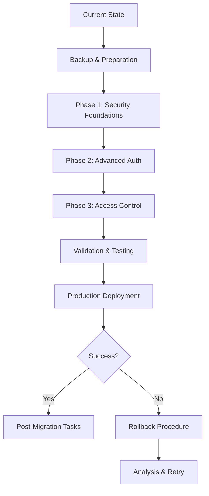

# LightRAG Authentication Migration Guide

**Version**: 1.0
**Date**: 2025-01-30
**Status**: Implementation Ready

## 📋 Table of Contents

1. [Migration Overview](#migration-overview)
2. [Pre-Migration Checklist](#pre-migration-checklist)
3. [Phase-by-Phase Migration](#phase-by-phase-migration)
4. [Database Migration Scripts](#database-migration-scripts)
5. [Configuration Migration](#configuration-migration)
6. [Testing & Validation](#testing--validation)
7. [Rollback Procedures](#rollback-procedures)
8. [Post-Migration Tasks](#post-migration-tasks)

## 🎯 Migration Overview

### Migration Objectives
- **Zero Downtime**: Seamless transition without service interruption
- **Backward Compatibility**: Existing authentication continues to work
- **Data Integrity**: All user data and sessions preserved
- **Security Enhancement**: Immediate security improvements
- **Feature Enablement**: Gradual rollout of new authentication features

### Migration Timeline
- **Preparation**: 2-3 days
- **Phase 1**: 3-4 days (Security Foundations)
- **Phase 2**: 4-5 days (Advanced Authentication)
- **Phase 3**: 5-6 days (Access Control & Monitoring)
- **Validation**: 2-3 days
- **Total Duration**: 16-21 days

### Migration Approach


## ✅ Pre-Migration Checklist

### Environment Preparation
- [ ] **Backup Current Database**: Full backup of user data and configurations
- [ ] **Document Current Settings**: Record all current authentication configurations
- [ ] **Test Environment Setup**: Identical staging environment for testing
- [ ] **Dependency Installation**: Install new required packages
- [ ] **SSL Certificates**: Ensure valid SSL certificates for production
- [ ] **Redis Setup**: Install and configure Redis for sessions and rate limiting

### Infrastructure Requirements
- [ ] **Database Permissions**: Ensure database user has DDL permissions
- [ ] **Redis Instance**: Accessible Redis instance for session storage
- [ ] **Log Storage**: Adequate disk space for audit logs
- [ ] **Monitoring**: Set up monitoring for new authentication metrics
- [ ] **Backup Strategy**: Automated backup procedures in place

### Team Preparation
- [ ] **Migration Team**: Assign roles and responsibilities
- [ ] **Communication Plan**: Notify stakeholders of migration schedule
- [ ] **Rollback Team**: Prepare team for potential rollback scenarios
- [ ] **Documentation**: Ensure all team members have access to migration docs

## 🚀 Phase-by-Phase Migration

### Phase 1: Security Foundations Migration

#### 1.1 Password Security Migration

**Duration**: 1-2 days
**Risk Level**: LOW

##### Migration Steps:

1. **Install Password Security Dependencies**
```bash
# Install new password hashing libraries
pip install bcrypt passlib[bcrypt]
```

2. **Database Schema Updates**
```sql
-- Add new columns for enhanced password security
ALTER TABLE users ADD COLUMN password_hash_new VARCHAR(255);
ALTER TABLE users ADD COLUMN password_changed_at TIMESTAMP;
ALTER TABLE users ADD COLUMN password_attempts INTEGER DEFAULT 0;
ALTER TABLE users ADD COLUMN account_locked_until TIMESTAMP NULL;

-- Create password history table
CREATE TABLE password_history (
    id SERIAL PRIMARY KEY,
    user_id VARCHAR(255) NOT NULL,
    password_hash VARCHAR(255) NOT NULL,
    created_at TIMESTAMP DEFAULT CURRENT_TIMESTAMP,
    FOREIGN KEY (user_id) REFERENCES users(id) ON DELETE CASCADE,
    INDEX idx_user_id (user_id),
    INDEX idx_created_at (created_at)
);
```

3. **Password Hash Migration Script**
```python
#!/usr/bin/env python3
"""
Migrate existing passwords to bcrypt hashing.
This script should be run during a maintenance window.
"""

import asyncio
import bcrypt
from lightrag.api.auth.password_manager import PasswordManager
from lightrag.database import get_database_connection

async def migrate_passwords():
    """Migrate all existing passwords to bcrypt."""
    db = await get_database_connection()
    password_manager = PasswordManager()

    # Get all users with old password format
    users = await db.fetch("SELECT id, password FROM users WHERE password_hash_new IS NULL")

    migrated_count = 0
    failed_count = 0

    for user in users:
        try:
            # Hash the existing password (if it's plain text)
            # Note: This assumes passwords were stored as plain text
            # Adjust based on your current hashing method
            new_hash = password_manager.hash_password(user['password'])

            # Update user record
            await db.execute(
                "UPDATE users SET password_hash_new = ?, password_changed_at = ? WHERE id = ?",
                new_hash, datetime.utcnow(), user['id']
            )

            migrated_count += 1
            print(f"Migrated password for user: {user['id']}")

        except Exception as e:
            print(f"Failed to migrate password for user {user['id']}: {e}")
            failed_count += 1

    print(f"Migration complete: {migrated_count} migrated, {failed_count} failed")

if __name__ == "__main__":
    asyncio.run(migrate_passwords())
```

4. **Enable New Password System**
```python
# Update authentication code to use new password hashing
# lightrag/api/auth/auth_service.py

async def authenticate_user(username: str, password: str) -> Optional[User]:
    user = await get_user_by_username(username)
    if not user:
        return None

    # Try new password hash first
    if user.password_hash_new:
        if password_manager.verify_password(password, user.password_hash_new):
            return user

    # Fallback to old password method (for gradual migration)
    elif user.password and verify_old_password(password, user.password):
        # Upgrade to new hash format
        new_hash = password_manager.hash_password(password)
        await update_user_password_hash(user.id, new_hash)
        return user

    return None
```

#### 1.2 Rate Limiting Migration

**Duration**: 1 day
**Risk Level**: MEDIUM

##### Migration Steps:

1. **Install Rate Limiting Dependencies**
```bash
pip install slowapi redis
```

2. **Redis Configuration**
```bash
# Add to environment configuration
REDIS_URL=redis://localhost:6379
RATE_LIMITING_ENABLED=true
RATE_LIMIT_GENERAL=100/minute
RATE_LIMIT_AUTH=5/minute
```

3. **Gradual Rate Limiting Rollout**
```python
# lightrag/api/middleware/rate_limiter.py

class GradualRateLimiter:
    def __init__(self):
        self.enabled = os.getenv("RATE_LIMITING_ENABLED", "false").lower() == "true"
        self.warning_mode = os.getenv("RATE_LIMITING_WARNING_MODE", "true").lower() == "true"

    async def check_rate_limit(self, request: Request):
        if not self.enabled:
            return True

        # Check rate limit
        is_allowed = await self._check_limit(request)

        if not is_allowed:
            if self.warning_mode:
                # Log but don't block in warning mode
                logger.warning(f"Rate limit exceeded for {request.client.host}")
                return True
            else:
                # Block in enforcement mode
                raise RateLimitExceeded("Rate limit exceeded")

        return True
```

#### 1.3 Security Headers Migration

**Duration**: 0.5 days
**Risk Level**: LOW

##### Migration Steps:

1. **Add Security Headers Middleware**
```python
# Add to main application startup
from lightrag.api.middleware.security_headers import SecurityHeadersMiddleware

app.add_middleware(SecurityHeadersMiddleware)
```

2. **Configure Security Headers**
```bash
# Environment configuration
SECURITY_HEADERS_ENABLED=true
CSP_POLICY="default-src 'self'; script-src 'self' 'unsafe-inline'"
HSTS_MAX_AGE=31536000
```

### Phase 2: Advanced Authentication Migration

#### 2.1 Multi-Factor Authentication Setup

**Duration**: 2-3 days
**Risk Level**: MEDIUM

##### Migration Steps:

1. **MFA Database Schema**
```sql
-- Create MFA tables
CREATE TABLE user_mfa (
    user_id VARCHAR(255) PRIMARY KEY,
    totp_secret VARCHAR(255),
    is_enabled BOOLEAN DEFAULT FALSE,
    backup_codes_hash TEXT,
    created_at TIMESTAMP DEFAULT CURRENT_TIMESTAMP,
    last_used TIMESTAMP,
    FOREIGN KEY (user_id) REFERENCES users(id) ON DELETE CASCADE
);
```

2. **MFA Dependencies**
```bash
pip install pyotp qrcode[pil]
```

3. **Gradual MFA Rollout**
```python
# Make MFA optional initially
MFA_REQUIRED=false
MFA_AVAILABLE=true
MFA_GRACE_PERIOD_DAYS=30
```

#### 2.2 OAuth Integration Setup

**Duration**: 2-3 days
**Risk Level**: MEDIUM

##### Migration Steps:

1. **OAuth Dependencies**
```bash
pip install authlib httpx
```

2. **OAuth Configuration**
```bash
# OAuth provider settings
OAUTH_ENABLED=true
GOOGLE_CLIENT_ID=your-google-client-id
GOOGLE_CLIENT_SECRET=your-google-client-secret
AZURE_CLIENT_ID=your-azure-client-id
AZURE_CLIENT_SECRET=your-azure-client-secret
```

3. **OAuth User Linking**
```sql
-- Table for linking OAuth accounts to existing users
CREATE TABLE user_oauth_accounts (
    id SERIAL PRIMARY KEY,
    user_id VARCHAR(255) NOT NULL,
    provider VARCHAR(50) NOT NULL,
    provider_user_id VARCHAR(255) NOT NULL,
    provider_email VARCHAR(255),
    access_token_hash VARCHAR(255),
    refresh_token_hash VARCHAR(255),
    created_at TIMESTAMP DEFAULT CURRENT_TIMESTAMP,
    updated_at TIMESTAMP DEFAULT CURRENT_TIMESTAMP ON UPDATE CURRENT_TIMESTAMP,
    FOREIGN KEY (user_id) REFERENCES users(id) ON DELETE CASCADE,
    UNIQUE KEY unique_provider_user (provider, provider_user_id),
    INDEX idx_user_id (user_id)
);
```

### Phase 3: Access Control Migration

#### 3.1 RBAC System Migration

**Duration**: 3-4 days
**Risk Level**: HIGH

##### Migration Steps:

1. **RBAC Database Schema**
```sql
-- Create RBAC tables
CREATE TABLE roles (
    id SERIAL PRIMARY KEY,
    name VARCHAR(100) UNIQUE NOT NULL,
    description TEXT,
    permissions JSON NOT NULL,
    is_system_role BOOLEAN DEFAULT FALSE,
    is_active BOOLEAN DEFAULT TRUE,
    created_at TIMESTAMP DEFAULT CURRENT_TIMESTAMP,
    updated_at TIMESTAMP DEFAULT CURRENT_TIMESTAMP ON UPDATE CURRENT_TIMESTAMP
);

CREATE TABLE user_roles (
    id SERIAL PRIMARY KEY,
    user_id VARCHAR(255) NOT NULL,
    role_name VARCHAR(100) NOT NULL,
    assigned_by VARCHAR(255),
    assigned_at TIMESTAMP DEFAULT CURRENT_TIMESTAMP,
    expires_at TIMESTAMP NULL,
    is_active BOOLEAN DEFAULT TRUE,
    FOREIGN KEY (user_id) REFERENCES users(id) ON DELETE CASCADE,
    FOREIGN KEY (role_name) REFERENCES roles(name) ON UPDATE CASCADE,
    UNIQUE KEY unique_user_role (user_id, role_name)
);
```

2. **Migrate Existing Users to RBAC**
```python
#!/usr/bin/env python3
"""
Migrate existing users to RBAC system.
"""

async def migrate_to_rbac():
    """Migrate existing user roles to RBAC."""
    db = await get_database_connection()
    rbac = RBACManager()

    # Create default roles
    await rbac.create_default_roles_in_db(db)

    # Migrate existing users
    users = await db.fetch("SELECT id, role FROM users")

    for user in users:
        # Map old roles to new RBAC roles
        old_role = user.get('role', 'user')
        new_role = {
            'admin': 'admin',
            'user': 'user',
            'guest': 'guest'
        }.get(old_role, 'user')

        # Assign role to user
        await db.execute(
            "INSERT INTO user_roles (user_id, role_name, assigned_by) VALUES (?, ?, ?)",
            user['id'], new_role, 'system'
        )

    print("RBAC migration completed")

if __name__ == "__main__":
    asyncio.run(migrate_to_rbac())
```

#### 3.2 API Key Management Migration

**Duration**: 2-3 days
**Risk Level**: MEDIUM

##### Migration Steps:

1. **API Key Database Schema**
```sql
CREATE TABLE api_keys (
    key_id VARCHAR(100) PRIMARY KEY,
    name VARCHAR(255) NOT NULL,
    description TEXT,
    key_hash VARCHAR(255) UNIQUE NOT NULL,
    prefix VARCHAR(20) NOT NULL,
    permissions JSON NOT NULL,
    scope ENUM('read_only', 'read_write', 'admin', 'custom') NOT NULL,
    status ENUM('active', 'expired', 'revoked', 'suspended') DEFAULT 'active',
    created_by VARCHAR(255) NOT NULL,
    created_at TIMESTAMP DEFAULT CURRENT_TIMESTAMP,
    expires_at TIMESTAMP NULL,
    last_used TIMESTAMP NULL,
    usage_count INTEGER DEFAULT 0,
    rate_limit INTEGER NULL,
    allowed_ips JSON NULL,
    metadata JSON NULL,
    FOREIGN KEY (created_by) REFERENCES users(id),
    INDEX idx_key_hash (key_hash),
    INDEX idx_created_by (created_by),
    INDEX idx_status (status)
);
```

2. **Migrate Existing API Keys**
```python
#!/usr/bin/env python3
"""
Migrate existing API keys to new management system.
"""

async def migrate_api_keys():
    """Migrate existing API keys."""
    db = await get_database_connection()
    api_key_manager = APIKeyManager(db, rbac_manager)

    # Get existing API keys (assuming they're stored in environment or config)
    existing_keys = get_existing_api_keys()  # Implement based on current storage

    for key_info in existing_keys:
        # Create new managed API key
        await api_key_manager.migrate_existing_key(
            old_key=key_info['key'],
            name=key_info.get('name', 'Migrated Key'),
            created_by='system',
            permissions=['document:read', 'document:write', 'query:execute']
        )

    print("API key migration completed")
```

## 🗄️ Database Migration Scripts

### Master Migration Script
```python
#!/usr/bin/env python3
"""
Master migration script for LightRAG authentication system.
"""

import asyncio
import sys
from datetime import datetime
from lightrag.database import get_database_connection

class AuthenticationMigration:
    def __init__(self):
        self.db = None
        self.migration_log = []

    async def initialize(self):
        """Initialize migration environment."""
        self.db = await get_database_connection()
        await self.log_migration_start()

    async def log_migration_start(self):
        """Log migration start."""
        await self.db.execute("""
            CREATE TABLE IF NOT EXISTS migration_log (
                id SERIAL PRIMARY KEY,
                migration_name VARCHAR(255) NOT NULL,
                status ENUM('started', 'completed', 'failed', 'rolled_back') NOT NULL,
                started_at TIMESTAMP DEFAULT CURRENT_TIMESTAMP,
                completed_at TIMESTAMP NULL,
                error_message TEXT NULL,
                migration_data JSON NULL
            )
        """)

        await self.db.execute(
            "INSERT INTO migration_log (migration_name, status) VALUES (?, ?)",
            "authentication_enhancement_v1", "started"
        )

    async def run_migration(self):
        """Run complete migration process."""
        try:
            # Phase 1: Security Foundations
            await self.migrate_password_security()
            await self.setup_rate_limiting()
            await self.setup_audit_logging()

            # Phase 2: Advanced Authentication
            await self.setup_mfa_tables()
            await self.setup_oauth_tables()
            await self.setup_session_management()

            # Phase 3: Access Control
            await self.setup_rbac_tables()
            await self.setup_api_key_management()

            # Data Migration
            await self.migrate_existing_data()

            await self.log_migration_success()

        except Exception as e:
            await self.log_migration_failure(str(e))
            raise

    async def migrate_password_security(self):
        """Migrate password security."""
        print("Migrating password security...")

        # Add new password columns
        await self.db.execute("""
            ALTER TABLE users
            ADD COLUMN IF NOT EXISTS password_hash_new VARCHAR(255),
            ADD COLUMN IF NOT EXISTS password_changed_at TIMESTAMP,
            ADD COLUMN IF NOT EXISTS password_attempts INTEGER DEFAULT 0,
            ADD COLUMN IF NOT EXISTS account_locked_until TIMESTAMP NULL
        """)

        # Create password history table
        await self.db.execute("""
            CREATE TABLE IF NOT EXISTS password_history (
                id SERIAL PRIMARY KEY,
                user_id VARCHAR(255) NOT NULL,
                password_hash VARCHAR(255) NOT NULL,
                created_at TIMESTAMP DEFAULT CURRENT_TIMESTAMP,
                FOREIGN KEY (user_id) REFERENCES users(id) ON DELETE CASCADE,
                INDEX idx_user_id (user_id),
                INDEX idx_created_at (created_at)
            )
        """)

        print("Password security migration completed")

    async def setup_mfa_tables(self):
        """Setup MFA tables."""
        print("Setting up MFA tables...")

        await self.db.execute("""
            CREATE TABLE IF NOT EXISTS user_mfa (
                user_id VARCHAR(255) PRIMARY KEY,
                totp_secret VARCHAR(255),
                is_enabled BOOLEAN DEFAULT FALSE,
                backup_codes_hash TEXT,
                created_at TIMESTAMP DEFAULT CURRENT_TIMESTAMP,
                last_used TIMESTAMP,
                FOREIGN KEY (user_id) REFERENCES users(id) ON DELETE CASCADE
            )
        """)

        await self.db.execute("""
            CREATE TABLE IF NOT EXISTS mfa_attempts (
                id SERIAL PRIMARY KEY,
                user_id VARCHAR(255) NOT NULL,
                attempt_type ENUM('totp', 'backup_code') NOT NULL,
                success BOOLEAN NOT NULL,
                ip_address VARCHAR(45),
                user_agent TEXT,
                created_at TIMESTAMP DEFAULT CURRENT_TIMESTAMP,
                FOREIGN KEY (user_id) REFERENCES users(id) ON DELETE CASCADE,
                INDEX idx_user_attempts (user_id, created_at)
            )
        """)

        print("MFA tables setup completed")

    async def setup_rbac_tables(self):
        """Setup RBAC tables."""
        print("Setting up RBAC tables...")

        await self.db.execute("""
            CREATE TABLE IF NOT EXISTS roles (
                id SERIAL PRIMARY KEY,
                name VARCHAR(100) UNIQUE NOT NULL,
                description TEXT,
                permissions JSON NOT NULL,
                is_system_role BOOLEAN DEFAULT FALSE,
                is_active BOOLEAN DEFAULT TRUE,
                created_at TIMESTAMP DEFAULT CURRENT_TIMESTAMP,
                updated_at TIMESTAMP DEFAULT CURRENT_TIMESTAMP ON UPDATE CURRENT_TIMESTAMP,
                INDEX idx_name (name)
            )
        """)

        await self.db.execute("""
            CREATE TABLE IF NOT EXISTS user_roles (
                id SERIAL PRIMARY KEY,
                user_id VARCHAR(255) NOT NULL,
                role_name VARCHAR(100) NOT NULL,
                assigned_by VARCHAR(255),
                assigned_at TIMESTAMP DEFAULT CURRENT_TIMESTAMP,
                expires_at TIMESTAMP NULL,
                is_active BOOLEAN DEFAULT TRUE,
                FOREIGN KEY (user_id) REFERENCES users(id) ON DELETE CASCADE,
                FOREIGN KEY (role_name) REFERENCES roles(name) ON UPDATE CASCADE,
                UNIQUE KEY unique_user_role (user_id, role_name),
                INDEX idx_user_id (user_id)
            )
        """)

        print("RBAC tables setup completed")

    async def migrate_existing_data(self):
        """Migrate existing user data to new system."""
        print("Migrating existing data...")

        # Create default roles
        default_roles = [
            ('admin', '["system:admin", "document:*", "query:*", "graph:*"]', 'Full system access'),
            ('user', '["document:read", "document:write", "query:execute", "graph:read"]', 'Standard user'),
            ('viewer', '["document:read", "query:execute", "graph:read"]', 'Read-only access')
        ]

        for role_name, permissions, description in default_roles:
            await self.db.execute("""
                INSERT IGNORE INTO roles (name, permissions, description, is_system_role)
                VALUES (?, ?, ?, TRUE)
            """, role_name, permissions, description)

        # Migrate existing users to RBAC
        users = await self.db.fetch("SELECT id, role FROM users WHERE role IS NOT NULL")

        for user in users:
            old_role = user.get('role', 'user')
            new_role = {'admin': 'admin', 'user': 'user'}.get(old_role, 'user')

            await self.db.execute("""
                INSERT IGNORE INTO user_roles (user_id, role_name, assigned_by)
                VALUES (?, ?, 'system')
            """, user['id'], new_role)

        print("Data migration completed")

    async def log_migration_success(self):
        """Log successful migration."""
        await self.db.execute("""
            UPDATE migration_log
            SET status = 'completed', completed_at = CURRENT_TIMESTAMP
            WHERE migration_name = 'authentication_enhancement_v1' AND status = 'started'
        """)
        print("Migration completed successfully!")

    async def log_migration_failure(self, error_message: str):
        """Log migration failure."""
        await self.db.execute("""
            UPDATE migration_log
            SET status = 'failed', completed_at = CURRENT_TIMESTAMP, error_message = ?
            WHERE migration_name = 'authentication_enhancement_v1' AND status = 'started'
        """, error_message)
        print(f"Migration failed: {error_message}")

async def main():
    """Run migration."""
    migration = AuthenticationMigration()

    try:
        await migration.initialize()
        await migration.run_migration()
        print("\n✅ Authentication migration completed successfully!")

    except Exception as e:
        print(f"\n❌ Migration failed: {e}")
        sys.exit(1)

if __name__ == "__main__":
    asyncio.run(main())
```

## 🧪 Testing & Validation

### Migration Testing Checklist

#### Pre-Migration Testing
- [ ] **Backup Verification**: Ensure backups are complete and restorable
- [ ] **Current Functionality**: Verify all current authentication works
- [ ] **Test Data**: Create test users with various roles and permissions
- [ ] **API Testing**: Ensure all API endpoints work with current authentication

#### Post-Phase Testing
- [ ] **Phase 1 Validation**:
  - [ ] Password hashing works correctly
  - [ ] Rate limiting functions properly
  - [ ] Security headers are applied
  - [ ] Audit logging captures events

- [ ] **Phase 2 Validation**:
  - [ ] MFA setup and verification works
  - [ ] OAuth flows complete successfully
  - [ ] Session management functions properly

- [ ] **Phase 3 Validation**:
  - [ ] RBAC permissions are enforced
  - [ ] API key management works
  - [ ] Security monitoring captures events

#### Integration Testing
```python
#!/usr/bin/env python3
"""
Integration tests for authentication migration.
"""

import pytest
import asyncio
from lightrag.api.auth import AuthenticationService

class TestAuthenticationMigration:

    @pytest.mark.asyncio
    async def test_password_migration(self):
        """Test password migration."""
        auth_service = AuthenticationService()

        # Test old password still works during migration
        user = await auth_service.authenticate("testuser", "oldpassword")
        assert user is not None

        # Test new password hash is created
        assert user.password_hash_new is not None

    @pytest.mark.asyncio
    async def test_rbac_migration(self):
        """Test RBAC migration."""
        from lightrag.api.auth.rbac import RBACManager

        rbac = RBACManager()

        # Test default roles exist
        roles = rbac.list_roles()
        assert len(roles) >= 3

        # Test user role assignment
        assert rbac.check_permission("testuser", Permission.DOCUMENT_READ)

    @pytest.mark.asyncio
    async def test_api_key_migration(self):
        """Test API key migration."""
        from lightrag.api.auth.api_key_manager import APIKeyManager

        api_manager = APIKeyManager()

        # Test existing API keys still work
        key_info = await api_manager.validate_api_key("existing_api_key")
        assert key_info is not None
```

## 🔄 Rollback Procedures

### Automatic Rollback Triggers
- Migration script failure
- Critical functionality breaking
- Performance degradation > 50%
- Security vulnerability introduction

### Rollback Steps

#### Database Rollback
```python
#!/usr/bin/env python3
"""
Rollback script for authentication migration.
"""

async def rollback_migration():
    """Rollback authentication migration."""
    db = await get_database_connection()

    try:
        # Phase 3 Rollback: Remove RBAC tables
        await db.execute("DROP TABLE IF EXISTS user_roles")
        await db.execute("DROP TABLE IF EXISTS roles")
        await db.execute("DROP TABLE IF EXISTS api_keys")

        # Phase 2 Rollback: Remove advanced auth tables
        await db.execute("DROP TABLE IF EXISTS user_mfa")
        await db.execute("DROP TABLE IF EXISTS mfa_attempts")
        await db.execute("DROP TABLE IF EXISTS user_oauth_accounts")

        # Phase 1 Rollback: Remove security enhancement columns
        await db.execute("ALTER TABLE users DROP COLUMN IF EXISTS password_hash_new")
        await db.execute("ALTER TABLE users DROP COLUMN IF EXISTS password_changed_at")
        await db.execute("ALTER TABLE users DROP COLUMN IF EXISTS password_attempts")
        await db.execute("ALTER TABLE users DROP COLUMN IF EXISTS account_locked_until")
        await db.execute("DROP TABLE IF EXISTS password_history")

        # Log rollback
        await db.execute("""
            UPDATE migration_log
            SET status = 'rolled_back', completed_at = CURRENT_TIMESTAMP
            WHERE migration_name = 'authentication_enhancement_v1'
        """)

        print("Rollback completed successfully")

    except Exception as e:
        print(f"Rollback failed: {e}")
        raise

if __name__ == "__main__":
    asyncio.run(rollback_migration())
```

#### Configuration Rollback
```bash
#!/bin/bash
# Rollback configuration changes

# Restore original configuration
cp lightrag.conf.backup lightrag.conf

# Remove new environment variables
unset RATE_LIMITING_ENABLED
unset MFA_ENABLED
unset OAUTH_ENABLED
unset RBAC_ENABLED

# Restart services with original configuration
systemctl restart lightrag-server
systemctl restart redis-server

echo "Configuration rollback completed"
```

## 📋 Post-Migration Tasks

### Immediate Post-Migration (Day 1)
- [ ] **Monitoring Setup**: Configure monitoring for new authentication metrics
- [ ] **Log Analysis**: Review migration logs for any warnings or errors
- [ ] **Performance Validation**: Confirm response times are within acceptable limits
- [ ] **User Communication**: Notify users of new security features available
- [ ] **Documentation Update**: Update user documentation with new features

### Short-term Tasks (Week 1)
- [ ] **Security Audit**: Conduct security review of new implementation
- [ ] **User Training**: Provide training on new features (MFA, API keys)
- [ ] **Monitoring Tuning**: Adjust monitoring thresholds based on actual usage
- [ ] **Performance Optimization**: Optimize any identified performance bottlenecks
- [ ] **Backup Validation**: Ensure new data structures are included in backups

### Long-term Tasks (Month 1)
- [ ] **Security Review**: Comprehensive security assessment
- [ ] **User Adoption Metrics**: Analyze adoption of new security features
- [ ] **Performance Analysis**: Long-term performance impact assessment
- [ ] **Documentation Review**: Update all documentation with lessons learned
- [ ] **Team Training**: Ensure all team members understand new systems

This migration guide provides a comprehensive approach to safely implementing the authentication improvements while maintaining system stability and user access throughout the process.
