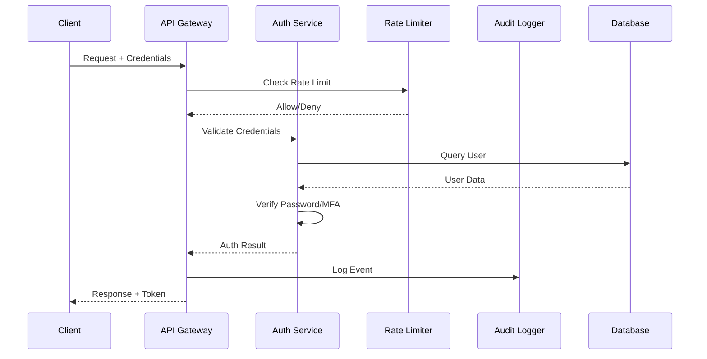

# LightRAG Authentication Technical Specifications

**Version**: 1.0
**Date**: 2025-01-30
**Status**: Implementation Ready

## 📋 Table of Contents

1. [Architecture Overview](#architecture-overview)
2. [Phase 2: Advanced Authentication](#phase-2-advanced-authentication)
3. [Phase 3: Access Control & Monitoring](#phase-3-access-control--monitoring)
4. [Database Schema](#database-schema)
5. [API Specifications](#api-specifications)
6. [Configuration Reference](#configuration-reference)
7. [Security Considerations](#security-considerations)

## 🏗️ Architecture Overview

### Authentication Flow Diagram


### Component Architecture
```
┌─────────────────────────────────────────────────────────────┐
│                    API Gateway Layer                        │
├─────────────────────────────────────────────────────────────┤
│  Security Headers │ Rate Limiter │ Audit Middleware │ CORS  │
├─────────────────────────────────────────────────────────────┤
│                 Authentication Service                      │
├─────────────────────────────────────────────────────────────┤
│ Password Mgmt │ JWT Service │ MFA Manager │ OAuth Provider  │
├─────────────────────────────────────────────────────────────┤
│              Access Control & Monitoring                    │
├─────────────────────────────────────────────────────────────┤
│ RBAC Engine │ API Key Mgmt │ Session Store │ Security Monitor│
├─────────────────────────────────────────────────────────────┤
│                    Storage Layer                            │
├─────────────────────────────────────────────────────────────┤
│  PostgreSQL  │    Redis     │  Audit Logs  │   File Store   │
└─────────────────────────────────────────────────────────────┘
```

## 🔐 Phase 2: Advanced Authentication

### 2.1 Multi-Factor Authentication (MFA)

#### TOTP Implementation
```python
# lightrag/api/auth/mfa.py
import pyotp
import qrcode
from io import BytesIO
import base64
from typing import Optional, Dict, Any
from datetime import datetime
import secrets

class MFAManager:
    def __init__(self, issuer_name: str = "LightRAG"):
        self.issuer_name = issuer_name
        self.backup_codes_count = 10

    def generate_secret(self) -> str:
        """Generate TOTP secret for user."""
        return pyotp.random_base32()

    def generate_qr_code(self, user_email: str, secret: str) -> str:
        """Generate QR code for authenticator app setup."""
        totp_uri = pyotp.totp.TOTP(secret).provisioning_uri(
            name=user_email,
            issuer_name=self.issuer_name
        )

        qr = qrcode.QRCode(
            version=1,
            error_correction=qrcode.constants.ERROR_CORRECT_L,
            box_size=10,
            border=4
        )
        qr.add_data(totp_uri)
        qr.make(fit=True)

        img = qr.make_image(fill_color="black", back_color="white")
        buffered = BytesIO()
        img.save(buffered, format="PNG")
        img_str = base64.b64encode(buffered.getvalue()).decode()

        return f"data:image/png;base64,{img_str}"

    def verify_totp(self, secret: str, token: str, window: int = 1) -> bool:
        """Verify TOTP token with configurable time window."""
        totp = pyotp.TOTP(secret)
        return totp.verify(token, valid_window=window)

    def generate_backup_codes(self) -> list[str]:
        """Generate backup codes for MFA recovery."""
        codes = []
        for _ in range(self.backup_codes_count):
            # Generate 8-character alphanumeric code
            code = ''.join(secrets.choice('ABCDEFGHIJKLMNOPQRSTUVWXYZ0123456789')
                          for _ in range(8))
            codes.append(code)
        return codes

    def verify_backup_code(self, user_id: str, code: str) -> bool:
        """Verify backup code and mark as used."""
        # Implementation would check against stored backup codes
        # and mark the code as used
        pass

    async def setup_mfa(self, user_id: str, user_email: str) -> Dict[str, Any]:
        """Setup MFA for user."""
        secret = self.generate_secret()
        qr_code = self.generate_qr_code(user_email, secret)
        backup_codes = self.generate_backup_codes()

        # Store secret and backup codes in database
        # await self.store_mfa_data(user_id, secret, backup_codes)

        return {
            "secret": secret,
            "qr_code": qr_code,
            "backup_codes": backup_codes,
            "setup_instructions": {
                "step1": "Install an authenticator app (Google Authenticator, Authy, etc.)",
                "step2": "Scan the QR code or enter the secret manually",
                "step3": "Enter the 6-digit code from your app to complete setup",
                "step4": "Save the backup codes in a secure location"
            }
        }
```

#### MFA Database Schema
```sql
-- MFA settings table
CREATE TABLE user_mfa (
    user_id VARCHAR(255) PRIMARY KEY,
    totp_secret VARCHAR(255),
    is_enabled BOOLEAN DEFAULT FALSE,
    backup_codes_hash TEXT, -- JSON array of hashed backup codes
    created_at TIMESTAMP DEFAULT CURRENT_TIMESTAMP,
    last_used TIMESTAMP,
    FOREIGN KEY (user_id) REFERENCES users(id) ON DELETE CASCADE
);

-- MFA attempt tracking
CREATE TABLE mfa_attempts (
    id SERIAL PRIMARY KEY,
    user_id VARCHAR(255) NOT NULL,
    attempt_type ENUM('totp', 'backup_code') NOT NULL,
    success BOOLEAN NOT NULL,
    ip_address VARCHAR(45),
    user_agent TEXT,
    created_at TIMESTAMP DEFAULT CURRENT_TIMESTAMP,
    FOREIGN KEY (user_id) REFERENCES users(id) ON DELETE CASCADE,
    INDEX idx_user_attempts (user_id, created_at),
    INDEX idx_failed_attempts (success, created_at)
);
```

### 2.2 OAuth2/OIDC Integration

#### OAuth Provider Implementation
```python
# lightrag/api/auth/oauth_providers.py
from authlib.integrations.starlette_client import OAuth
from authlib.integrations.starlette_client import OAuthError
from starlette.config import Config
from starlette.requests import Request
from typing import Dict, Any, Optional
import httpx

class OAuthProvider:
    """Base OAuth provider class."""

    def __init__(self, name: str, config: Dict[str, Any]):
        self.name = name
        self.config = config

    async def get_user_info(self, token: Dict[str, Any]) -> Dict[str, Any]:
        """Get user information from OAuth provider."""
        raise NotImplementedError

    async def get_authorization_url(self, request: Request,
                                  redirect_uri: str) -> str:
        """Get authorization URL for OAuth flow."""
        raise NotImplementedError

class GoogleOAuthProvider(OAuthProvider):
    def __init__(self, client_id: str, client_secret: str):
        super().__init__("google", {
            "client_id": client_id,
            "client_secret": client_secret,
            "server_metadata_url": "https://accounts.google.com/.well-known/openid_configuration"
        })

    async def get_user_info(self, token: Dict[str, Any]) -> Dict[str, Any]:
        """Get user info from Google."""
        async with httpx.AsyncClient() as client:
            response = await client.get(
                "https://openidconnect.googleapis.com/v1/userinfo",
                headers={"Authorization": f"Bearer {token['access_token']}"}
            )
            response.raise_for_status()
            return response.json()

class AzureOAuthProvider(OAuthProvider):
    def __init__(self, client_id: str, client_secret: str, tenant_id: str = "common"):
        self.tenant_id = tenant_id
        super().__init__("azure", {
            "client_id": client_id,
            "client_secret": client_secret,
            "tenant_id": tenant_id
        })

    async def get_user_info(self, token: Dict[str, Any]) -> Dict[str, Any]:
        """Get user info from Microsoft Graph."""
        async with httpx.AsyncClient() as client:
            response = await client.get(
                "https://graph.microsoft.com/v1.0/me",
                headers={"Authorization": f"Bearer {token['access_token']}"}
            )
            response.raise_for_status()
            return response.json()

class OAuthManager:
    def __init__(self, config: Config):
        self.oauth = OAuth(config)
        self.providers = {}
        self._setup_providers(config)

    def _setup_providers(self, config: Config):
        """Setup OAuth providers based on configuration."""
        # Google OAuth
        google_client_id = config.get('GOOGLE_CLIENT_ID')
        google_client_secret = config.get('GOOGLE_CLIENT_SECRET')

        if google_client_id and google_client_secret:
            self.oauth.register(
                name='google',
                client_id=google_client_id,
                client_secret=google_client_secret,
                server_metadata_url='https://accounts.google.com/.well-known/openid_configuration',
                client_kwargs={
                    'scope': 'openid email profile'
                }
            )
            self.providers['google'] = GoogleOAuthProvider(
                google_client_id, google_client_secret
            )

        # Microsoft Azure
        azure_client_id = config.get('AZURE_CLIENT_ID')
        azure_client_secret = config.get('AZURE_CLIENT_SECRET')
        azure_tenant_id = config.get('AZURE_TENANT_ID', 'common')

        if azure_client_id and azure_client_secret:
            self.oauth.register(
                name='azure',
                client_id=azure_client_id,
                client_secret=azure_client_secret,
                authorize_url=f'https://login.microsoftonline.com/{azure_tenant_id}/oauth2/v2.0/authorize',
                token_url=f'https://login.microsoftonline.com/{azure_tenant_id}/oauth2/v2.0/token',
                client_kwargs={
                    'scope': 'openid email profile'
                }
            )
            self.providers['azure'] = AzureOAuthProvider(
                azure_client_id, azure_client_secret, azure_tenant_id
            )

    async def start_oauth_flow(self, request: Request, provider: str) -> str:
        """Start OAuth authorization flow."""
        if provider not in self.providers:
            raise ValueError(f"Unsupported OAuth provider: {provider}")

        client = self.oauth.create_client(provider)
        redirect_uri = request.url_for('oauth_callback', provider=provider)

        return await client.authorize_redirect(request, redirect_uri)

    async def handle_callback(self, request: Request, provider: str) -> Dict[str, Any]:
        """Handle OAuth callback and get user info."""
        if provider not in self.providers:
            raise ValueError(f"Unsupported OAuth provider: {provider}")

        client = self.oauth.create_client(provider)
        token = await client.authorize_access_token(request)

        provider_instance = self.providers[provider]
        user_info = await provider_instance.get_user_info(token)

        return {
            'provider': provider,
            'user_info': user_info,
            'token': token
        }
```

### 2.3 Enhanced Session Management

#### Redis-based Session Store
```python
# lightrag/api/auth/session_manager.py
import redis.asyncio as redis
import json
import secrets
from datetime import datetime, timedelta
from typing import Optional, Dict, Any
import uuid

class SessionData:
    def __init__(self, user_id: str, user_data: Dict[str, Any],
                 session_id: str = None, created_at: datetime = None):
        self.session_id = session_id or str(uuid.uuid4())
        self.user_id = user_id
        self.user_data = user_data
        self.created_at = created_at or datetime.utcnow()
        self.last_activity = datetime.utcnow()
        self.ip_address = None
        self.user_agent = None

    def to_dict(self) -> Dict[str, Any]:
        return {
            "session_id": self.session_id,
            "user_id": self.user_id,
            "user_data": self.user_data,
            "created_at": self.created_at.isoformat(),
            "last_activity": self.last_activity.isoformat(),
            "ip_address": self.ip_address,
            "user_agent": self.user_agent
        }

    @classmethod
    def from_dict(cls, data: Dict[str, Any]) -> 'SessionData':
        session = cls(
            user_id=data["user_id"],
            user_data=data["user_data"],
            session_id=data["session_id"],
            created_at=datetime.fromisoformat(data["created_at"])
        )
        session.last_activity = datetime.fromisoformat(data["last_activity"])
        session.ip_address = data.get("ip_address")
        session.user_agent = data.get("user_agent")
        return session

class SessionManager:
    def __init__(self, redis_url: str = "redis://localhost:6379",
                 session_timeout: timedelta = timedelta(hours=24),
                 cleanup_interval: int = 3600):
        self.redis_client = redis.from_url(redis_url)
        self.session_timeout = session_timeout
        self.cleanup_interval = cleanup_interval
        self.session_prefix = "session:"
        self.user_sessions_prefix = "user_sessions:"

    async def create_session(self, user_id: str, user_data: Dict[str, Any],
                           ip_address: str = None, user_agent: str = None) -> SessionData:
        """Create new session for user."""
        session = SessionData(user_id, user_data)
        session.ip_address = ip_address
        session.user_agent = user_agent

        # Store session data
        session_key = f"{self.session_prefix}{session.session_id}"
        await self.redis_client.setex(
            session_key,
            int(self.session_timeout.total_seconds()),
            json.dumps(session.to_dict())
        )

        # Track user sessions for management
        user_sessions_key = f"{self.user_sessions_prefix}{user_id}"
        await self.redis_client.sadd(user_sessions_key, session.session_id)
        await self.redis_client.expire(user_sessions_key,
                                     int(self.session_timeout.total_seconds()))

        return session

    async def get_session(self, session_id: str) -> Optional[SessionData]:
        """Get session by ID."""
        session_key = f"{self.session_prefix}{session_id}"
        session_data = await self.redis_client.get(session_key)

        if not session_data:
            return None

        try:
            data = json.loads(session_data)
            return SessionData.from_dict(data)
        except (json.JSONDecodeError, KeyError):
            # Invalid session data, clean up
            await self.redis_client.delete(session_key)
            return None

    async def update_session(self, session_id: str,
                           updates: Dict[str, Any] = None) -> bool:
        """Update session data and refresh expiration."""
        session = await self.get_session(session_id)
        if not session:
            return False

        # Update last activity
        session.last_activity = datetime.utcnow()

        # Apply updates if provided
        if updates:
            session.user_data.update(updates)

        # Store updated session
        session_key = f"{self.session_prefix}{session_id}"
        await self.redis_client.setex(
            session_key,
            int(self.session_timeout.total_seconds()),
            json.dumps(session.to_dict())
        )

        return True

    async def invalidate_session(self, session_id: str) -> bool:
        """Invalidate specific session."""
        session = await self.get_session(session_id)
        if not session:
            return False

        # Remove from session store
        session_key = f"{self.session_prefix}{session_id}"
        await self.redis_client.delete(session_key)

        # Remove from user sessions
        user_sessions_key = f"{self.user_sessions_prefix}{session.user_id}"
        await self.redis_client.srem(user_sessions_key, session_id)

        return True

    async def invalidate_user_sessions(self, user_id: str,
                                     exclude_session: str = None) -> int:
        """Invalidate all sessions for a user."""
        user_sessions_key = f"{self.user_sessions_prefix}{user_id}"
        session_ids = await self.redis_client.smembers(user_sessions_key)

        invalidated_count = 0
        for session_id in session_ids:
            session_id = session_id.decode() if isinstance(session_id, bytes) else session_id

            if exclude_session and session_id == exclude_session:
                continue

            if await self.invalidate_session(session_id):
                invalidated_count += 1

        return invalidated_count

    async def get_user_sessions(self, user_id: str) -> list[SessionData]:
        """Get all active sessions for a user."""
        user_sessions_key = f"{self.user_sessions_prefix}{user_id}"
        session_ids = await self.redis_client.smembers(user_sessions_key)

        sessions = []
        for session_id in session_ids:
            session_id = session_id.decode() if isinstance(session_id, bytes) else session_id
            session = await self.get_session(session_id)
            if session:
                sessions.append(session)

        return sessions

    async def cleanup_expired_sessions(self) -> int:
        """Clean up expired sessions (maintenance task)."""
        # This would be run periodically to clean up orphaned data
        cleaned_count = 0

        # Implementation would scan for expired sessions and clean them up
        # This is a simplified version - in production, you'd want more efficient cleanup

        return cleaned_count
```

## 🛡️ Phase 3: Access Control & Monitoring

### 3.1 Role-Based Access Control (RBAC)

#### RBAC Core Implementation
```python
# lightrag/api/auth/rbac.py
from enum import Enum
from typing import Set, Dict, List, Optional, Any
from pydantic import BaseModel
from dataclasses import dataclass
import json

class Permission(Enum):
    # Document permissions
    DOCUMENT_READ = "document:read"
    DOCUMENT_WRITE = "document:write"
    DOCUMENT_DELETE = "document:delete"
    DOCUMENT_UPLOAD = "document:upload"
    DOCUMENT_BATCH = "document:batch"

    # Query permissions
    QUERY_EXECUTE = "query:execute"
    QUERY_STREAM = "query:stream"
    QUERY_HISTORY = "query:history"

    # Graph permissions
    GRAPH_READ = "graph:read"
    GRAPH_WRITE = "graph:write"
    GRAPH_DELETE = "graph:delete"
    GRAPH_EXPORT = "graph:export"

    # System permissions
    SYSTEM_ADMIN = "system:admin"
    SYSTEM_MONITOR = "system:monitor"
    SYSTEM_CONFIG = "system:config"
    SYSTEM_USERS = "system:users"
    SYSTEM_LOGS = "system:logs"

    # API permissions
    API_KEYS_MANAGE = "api:keys:manage"
    API_KEYS_CREATE = "api:keys:create"
    API_KEYS_DELETE = "api:keys:delete"

@dataclass
class Role:
    name: str
    permissions: Set[Permission]
    description: str
    is_system_role: bool = True
    created_at: Optional[str] = None
    updated_at: Optional[str] = None

class RBACManager:
    def __init__(self):
        self.roles: Dict[str, Role] = {}
        self.user_roles: Dict[str, Set[str]] = {}
        self._setup_default_roles()

    def _setup_default_roles(self):
        """Setup default system roles."""
        self.roles = {
            "super_admin": Role(
                name="super_admin",
                permissions=set(Permission),  # All permissions
                description="Full system access with all permissions",
                is_system_role=True
            ),
            "admin": Role(
                name="admin",
                permissions={
                    Permission.DOCUMENT_READ, Permission.DOCUMENT_WRITE,
                    Permission.DOCUMENT_DELETE, Permission.DOCUMENT_UPLOAD,
                    Permission.DOCUMENT_BATCH, Permission.QUERY_EXECUTE,
                    Permission.QUERY_STREAM, Permission.QUERY_HISTORY,
                    Permission.GRAPH_READ, Permission.GRAPH_WRITE,
                    Permission.GRAPH_DELETE, Permission.GRAPH_EXPORT,
                    Permission.SYSTEM_MONITOR, Permission.SYSTEM_USERS,
                    Permission.API_KEYS_MANAGE, Permission.API_KEYS_CREATE,
                    Permission.API_KEYS_DELETE
                },
                description="Administrative access with user management",
                is_system_role=True
            ),
            "power_user": Role(
                name="power_user",
                permissions={
                    Permission.DOCUMENT_READ, Permission.DOCUMENT_WRITE,
                    Permission.DOCUMENT_UPLOAD, Permission.DOCUMENT_BATCH,
                    Permission.QUERY_EXECUTE, Permission.QUERY_STREAM,
                    Permission.QUERY_HISTORY, Permission.GRAPH_READ,
                    Permission.GRAPH_WRITE, Permission.GRAPH_EXPORT,
                    Permission.API_KEYS_CREATE
                },
                description="Advanced user with document and graph management",
                is_system_role=True
            ),
            "user": Role(
                name="user",
                permissions={
                    Permission.DOCUMENT_READ, Permission.DOCUMENT_WRITE,
                    Permission.DOCUMENT_UPLOAD, Permission.QUERY_EXECUTE,
                    Permission.QUERY_STREAM, Permission.QUERY_HISTORY,
                    Permission.GRAPH_READ
                },
                description="Standard user with basic operations",
                is_system_role=True
            ),
            "viewer": Role(
                name="viewer",
                permissions={
                    Permission.DOCUMENT_READ, Permission.QUERY_EXECUTE,
                    Permission.GRAPH_READ
                },
                description="Read-only access to documents and queries",
                is_system_role=True
            ),
            "guest": Role(
                name="guest",
                permissions={
                    Permission.DOCUMENT_READ, Permission.QUERY_EXECUTE
                },
                description="Limited guest access",
                is_system_role=True
            )
        }

    def create_role(self, name: str, permissions: Set[Permission],
                   description: str) -> Role:
        """Create custom role."""
        if name in self.roles:
            raise ValueError(f"Role '{name}' already exists")

        role = Role(
            name=name,
            permissions=permissions,
            description=description,
            is_system_role=False
        )

        self.roles[name] = role
        return role

    def assign_role_to_user(self, user_id: str, role_name: str):
        """Assign role to user."""
        if role_name not in self.roles:
            raise ValueError(f"Role '{role_name}' does not exist")

        if user_id not in self.user_roles:
            self.user_roles[user_id] = set()

        self.user_roles[user_id].add(role_name)

    def remove_role_from_user(self, user_id: str, role_name: str):
        """Remove role from user."""
        if user_id in self.user_roles:
            self.user_roles[user_id].discard(role_name)

    def get_user_roles(self, user_id: str) -> Set[str]:
        """Get all roles assigned to user."""
        return self.user_roles.get(user_id, set())

    def get_user_permissions(self, user_id: str) -> Set[Permission]:
        """Get all permissions for user based on assigned roles."""
        user_roles = self.get_user_roles(user_id)
        permissions = set()

        for role_name in user_roles:
            if role_name in self.roles:
                permissions.update(self.roles[role_name].permissions)

        return permissions

    def check_permission(self, user_id: str, required_permission: Permission) -> bool:
        """Check if user has required permission."""
        user_permissions = self.get_user_permissions(user_id)
        return required_permission in user_permissions

    def check_permissions(self, user_id: str,
                         required_permissions: List[Permission]) -> bool:
        """Check if user has all required permissions."""
        user_permissions = self.get_user_permissions(user_id)
        return all(perm in user_permissions for perm in required_permissions)

    def get_role_info(self, role_name: str) -> Optional[Dict[str, Any]]:
        """Get role information."""
        if role_name not in self.roles:
            return None

        role = self.roles[role_name]
        return {
            "name": role.name,
            "description": role.description,
            "permissions": [perm.value for perm in role.permissions],
            "is_system_role": role.is_system_role,
            "permission_count": len(role.permissions)
        }

    def list_roles(self) -> List[Dict[str, Any]]:
        """List all available roles."""
        return [self.get_role_info(name) for name in self.roles.keys()]

# Dependency for checking permissions
def require_permission(permission: Permission):
    """Decorator factory for requiring specific permission."""
    def decorator(func):
        func.__required_permission__ = permission
        return func
    return decorator

def require_permissions(permissions: List[Permission]):
    """Decorator factory for requiring multiple permissions."""
    def decorator(func):
        func.__required_permissions__ = permissions
        return func
    return decorator
```

#### RBAC Database Schema
```sql
-- Roles table
CREATE TABLE roles (
    id SERIAL PRIMARY KEY,
    name VARCHAR(100) UNIQUE NOT NULL,
    description TEXT,
    permissions JSON NOT NULL, -- Array of permission strings
    is_system_role BOOLEAN DEFAULT FALSE,
    is_active BOOLEAN DEFAULT TRUE,
    created_at TIMESTAMP DEFAULT CURRENT_TIMESTAMP,
    updated_at TIMESTAMP DEFAULT CURRENT_TIMESTAMP ON UPDATE CURRENT_TIMESTAMP,
    INDEX idx_name (name),
    INDEX idx_system_role (is_system_role)
);

-- User roles mapping
CREATE TABLE user_roles (
    id SERIAL PRIMARY KEY,
    user_id VARCHAR(255) NOT NULL,
    role_name VARCHAR(100) NOT NULL,
    assigned_by VARCHAR(255), -- User ID who assigned the role
    assigned_at TIMESTAMP DEFAULT CURRENT_TIMESTAMP,
    expires_at TIMESTAMP NULL, -- Optional role expiration
    is_active BOOLEAN DEFAULT TRUE,
    FOREIGN KEY (user_id) REFERENCES users(id) ON DELETE CASCADE,
    FOREIGN KEY (role_name) REFERENCES roles(name) ON UPDATE CASCADE,
    UNIQUE KEY unique_user_role (user_id, role_name),
    INDEX idx_user_id (user_id),
    INDEX idx_role_name (role_name),
    INDEX idx_expires_at (expires_at)
);

-- Permission audit log
CREATE TABLE permission_audit (
    id SERIAL PRIMARY KEY,
    user_id VARCHAR(255) NOT NULL,
    permission VARCHAR(100) NOT NULL,
    action ENUM('granted', 'denied', 'checked') NOT NULL,
    resource VARCHAR(255), -- Optional resource identifier
    ip_address VARCHAR(45),
    user_agent TEXT,
    created_at TIMESTAMP DEFAULT CURRENT_TIMESTAMP,
    INDEX idx_user_permission (user_id, permission),
    INDEX idx_action_time (action, created_at)
);
```

### 3.2 API Key Management System

#### Enhanced API Key Management
```python
# lightrag/api/auth/api_key_manager.py
from datetime import datetime, timedelta
from typing import Optional, List, Dict, Any
import secrets
import hashlib
from enum import Enum
from pydantic import BaseModel

class APIKeyStatus(Enum):
    ACTIVE = "active"
    EXPIRED = "expired"
    REVOKED = "revoked"
    SUSPENDED = "suspended"

class APIKeyScope(Enum):
    READ_ONLY = "read_only"
    READ_WRITE = "read_write"
    ADMIN = "admin"
    CUSTOM = "custom"

class APIKey(BaseModel):
    key_id: str
    name: str
    description: Optional[str] = None
    key_hash: str
    prefix: str  # First 8 chars for identification
    permissions: List[str]
    scope: APIKeyScope
    status: APIKeyStatus
    created_by: str
    created_at: datetime
    expires_at: Optional[datetime] = None
    last_used: Optional[datetime] = None
    usage_count: int = 0
    rate_limit: Optional[int] = None  # Requests per minute
    allowed_ips: Optional[List[str]] = None
    metadata: Dict[str, Any] = {}

class APIKeyManager:
    def __init__(self, db_connection, rbac_manager):
        self.db = db_connection
        self.rbac = rbac_manager
        self.key_prefix = "lrag"
        self.default_expiry_days = 90

    def _generate_api_key(self) -> tuple[str, str, str]:
        """Generate API key with prefix and hash."""
        # Generate random key
        random_part = secrets.token_urlsafe(24)
        full_key = f"{self.key_prefix}_{random_part}"

        # Create prefix for identification (first 12 characters)
        prefix = full_key[:12]

        # Hash the full key for storage
        key_hash = hashlib.sha256(full_key.encode()).hexdigest()

        return full_key, prefix, key_hash

    async def create_api_key(self, name: str, created_by: str,
                           permissions: List[str] = None,
                           scope: APIKeyScope = APIKeyScope.READ_WRITE,
                           expires_days: Optional[int] = None,
                           description: str = None,
                           rate_limit: Optional[int] = None,
                           allowed_ips: Optional[List[str]] = None,
                           metadata: Dict[str, Any] = None) -> tuple[str, APIKey]:
        """Create new API key."""

        # Generate key components
        full_key, prefix, key_hash = self._generate_api_key()
        key_id = f"key_{secrets.token_urlsafe(8)}"

        # Set expiration
        expires_at = None
        if expires_days:
            expires_at = datetime.utcnow() + timedelta(days=expires_days)
        elif self.default_expiry_days:
            expires_at = datetime.utcnow() + timedelta(days=self.default_expiry_days)

        # Set default permissions based on scope
        if not permissions:
            permissions = self._get_default_permissions(scope)

        # Create API key record
        api_key = APIKey(
            key_id=key_id,
            name=name,
            description=description,
            key_hash=key_hash,
            prefix=prefix,
            permissions=permissions,
            scope=scope,
            status=APIKeyStatus.ACTIVE,
            created_by=created_by,
            created_at=datetime.utcnow(),
            expires_at=expires_at,
            rate_limit=rate_limit,
            allowed_ips=allowed_ips,
            metadata=metadata or {}
        )

        # Store in database
        await self._store_api_key(api_key)

        return full_key, api_key

    def _get_default_permissions(self, scope: APIKeyScope) -> List[str]:
        """Get default permissions for scope."""
        scope_permissions = {
            APIKeyScope.READ_ONLY: [
                "document:read", "query:execute", "graph:read"
            ],
            APIKeyScope.READ_WRITE: [
                "document:read", "document:write", "document:upload",
                "query:execute", "query:stream", "graph:read", "graph:write"
            ],
            APIKeyScope.ADMIN: [
                "document:*", "query:*", "graph:*", "system:monitor"
            ]
        }
        return scope_permissions.get(scope, [])

    async def validate_api_key(self, api_key: str) -> Optional[APIKey]:
        """Validate API key and return key info."""
        # Hash the provided key
        key_hash = hashlib.sha256(api_key.encode()).hexdigest()

        # Retrieve key record
        key_record = await self._get_api_key_by_hash(key_hash)

        if not key_record:
            return None

        # Check if key is active
        if key_record.status != APIKeyStatus.ACTIVE:
            return None

        # Check expiration
        if key_record.expires_at and key_record.expires_at < datetime.utcnow():
            # Auto-expire the key
            await self._update_key_status(key_record.key_id, APIKeyStatus.EXPIRED)
            return None

        # Update usage statistics
        await self._update_key_usage(key_record.key_id)

        return key_record

    async def revoke_api_key(self, key_id: str, revoked_by: str) -> bool:
        """Revoke API key."""
        success = await self._update_key_status(key_id, APIKeyStatus.REVOKED)

        if success:
            # Log revocation
            await self._log_key_event(key_id, "revoked", revoked_by)

        return success

    async def list_api_keys(self, user_id: str,
                          include_revoked: bool = False) -> List[Dict[str, Any]]:
        """List API keys for user."""
        keys = await self._get_user_api_keys(user_id, include_revoked)

        # Return safe representation (no hashes)
        return [
            {
                "key_id": key.key_id,
                "name": key.name,
                "description": key.description,
                "prefix": key.prefix,
                "scope": key.scope.value,
                "status": key.status.value,
                "created_at": key.created_at.isoformat(),
                "expires_at": key.expires_at.isoformat() if key.expires_at else None,
                "last_used": key.last_used.isoformat() if key.last_used else None,
                "usage_count": key.usage_count,
                "permissions": key.permissions
            }
            for key in keys
        ]

    async def rotate_api_key(self, key_id: str, rotated_by: str) -> tuple[str, APIKey]:
        """Rotate API key (create new key with same permissions)."""
        old_key = await self._get_api_key_by_id(key_id)
        if not old_key:
            raise ValueError("API key not found")

        # Create new key with same properties
        new_full_key, new_key = await self.create_api_key(
            name=f"{old_key.name} (rotated)",
            created_by=rotated_by,
            permissions=old_key.permissions,
            scope=old_key.scope,
            description=f"Rotated from {old_key.prefix}...",
            rate_limit=old_key.rate_limit,
            allowed_ips=old_key.allowed_ips,
            metadata=old_key.metadata
        )

        # Revoke old key
        await self.revoke_api_key(key_id, rotated_by)

        return new_full_key, new_key

    async def check_rate_limit(self, key_id: str) -> tuple[bool, Dict[str, Any]]:
        """Check if API key is within rate limits."""
        key_record = await self._get_api_key_by_id(key_id)
        if not key_record or not key_record.rate_limit:
            return True, {}

        # Check usage in last minute
        current_usage = await self._get_key_usage_last_minute(key_id)

        within_limit = current_usage < key_record.rate_limit

        return within_limit, {
            "limit": key_record.rate_limit,
            "current": current_usage,
            "remaining": max(0, key_record.rate_limit - current_usage),
            "reset_at": (datetime.utcnow() + timedelta(minutes=1)).isoformat()
        }

    # Database interaction methods (implementation would depend on chosen DB)
    async def _store_api_key(self, api_key: APIKey):
        """Store API key in database."""
        pass

    async def _get_api_key_by_hash(self, key_hash: str) -> Optional[APIKey]:
        """Retrieve API key by hash."""
        pass

    async def _get_api_key_by_id(self, key_id: str) -> Optional[APIKey]:
        """Retrieve API key by ID."""
        pass

    async def _update_key_status(self, key_id: str, status: APIKeyStatus) -> bool:
        """Update API key status."""
        pass

    async def _update_key_usage(self, key_id: str):
        """Update key usage statistics."""
        pass

    async def _get_user_api_keys(self, user_id: str,
                               include_revoked: bool) -> List[APIKey]:
        """Get all API keys for user."""
        pass

    async def _log_key_event(self, key_id: str, event: str, user_id: str):
        """Log API key events."""
        pass

    async def _get_key_usage_last_minute(self, key_id: str) -> int:
        """Get API key usage in last minute."""
        pass
```

This technical specification provides comprehensive implementation details for the advanced authentication features planned for LightRAG. Each component is designed to be modular, secure, and production-ready while maintaining backward compatibility with existing authentication mechanisms.
