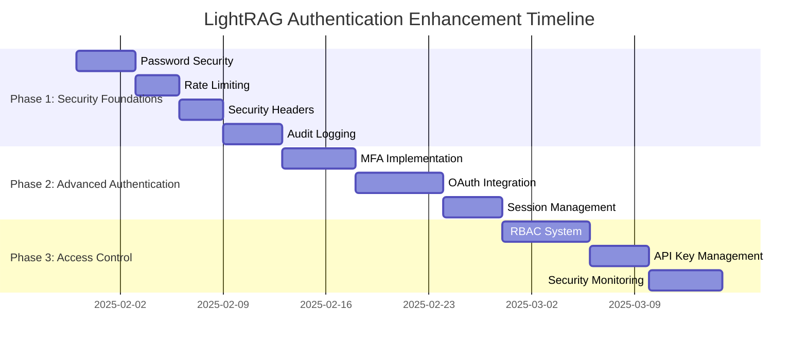

# LightRAG Security Documentation

This directory contains comprehensive security documentation for LightRAG, including authentication improvements, security analysis, and implementation guides.

## 📋 Documentation Index

### Authentication Enhancement Documentation
1. **[Authentication Improvement Plan](AUTHENTICATION_IMPROVEMENT_PLAN.md)** - Complete security enhancement strategy
2. **[Technical Specifications](AUTHENTICATION_TECHNICAL_SPECIFICATIONS.md)** - Detailed technical implementation specs
3. **[Migration Guide](AUTHENTICATION_MIGRATION_GUIDE.md)** - Step-by-step migration procedures

## 🎯 Quick Navigation

### For Security Teams
- **[Security Assessment](AUTHENTICATION_IMPROVEMENT_PLAN.md#current-state-assessment)** - Current vulnerabilities and gaps
- **[Risk Analysis](AUTHENTICATION_IMPROVEMENT_PLAN.md#risk-assessment)** - Risk matrix and mitigation strategies
- **[Compliance Features](AUTHENTICATION_IMPROVEMENT_PLAN.md#success-metrics--kpis)** - SOC2, GDPR readiness

### For Development Teams
- **[Technical Implementation](AUTHENTICATION_TECHNICAL_SPECIFICATIONS.md)** - Code examples and architecture
- **[API Specifications](AUTHENTICATION_TECHNICAL_SPECIFICATIONS.md#api-specifications)** - Authentication API details
- **[Database Schema](AUTHENTICATION_TECHNICAL_SPECIFICATIONS.md#database-schema)** - Required database changes

### for DevOps Teams
- **[Migration Procedures](AUTHENTICATION_MIGRATION_GUIDE.md)** - Zero-downtime migration steps
- **[Rollback Plans](AUTHENTICATION_MIGRATION_GUIDE.md#rollback-procedures)** - Emergency rollback procedures
- **[Configuration Management](AUTHENTICATION_MIGRATION_GUIDE.md#configuration-migration)** - Environment setup

## 🚀 Authentication Enhancement Overview

### Current Authentication Status
LightRAG currently provides basic JWT and API key authentication with the following components:
- **JWT Authentication**: Token-based authentication with configurable expiration
- **API Key Support**: Header-based API key validation
- **Web UI Integration**: Frontend authentication state management
- **SSL/TLS Support**: HTTPS configuration capabilities

### Planned Enhancements

#### Phase 1: Security Foundations (Weeks 1-2)
- **Enhanced Password Security**: Bcrypt hashing, complexity policies, history tracking
- **Advanced Rate Limiting**: Multi-tier throttling with Redis backend
- **Security Headers**: Comprehensive security header implementation
- **Comprehensive Audit Logging**: Security event tracking and analysis

#### Phase 2: Advanced Authentication (Weeks 3-4)
- **Multi-Factor Authentication**: TOTP-based MFA with backup codes
- **OAuth2/OIDC Integration**: Google, Microsoft, and custom provider support
- **Enhanced Session Management**: Redis-based session store with proper lifecycle
- **Password Policies**: Complexity requirements and account lockout

#### Phase 3: Access Control & Monitoring (Weeks 5-6)
- **Role-Based Access Control**: Granular permissions system
- **API Key Management**: Enterprise-grade key lifecycle management
- **Security Monitoring**: Real-time threat detection and alerting
- **Compliance Features**: Audit trails and reporting for compliance

## 🛡️ Security Improvements Summary

### Critical Security Gaps Addressed
1. **Weak Password Handling** → Bcrypt hashing with salt
2. **No Brute Force Protection** → Rate limiting and account lockout
3. **Limited Session Security** → Secure session management with Redis
4. **Basic Permission System** → Full RBAC with granular permissions
5. **No Security Monitoring** → Comprehensive audit logging and alerting

### Security Metrics Targets
- **Authentication Security**: 99.9% success rate for legitimate users
- **Brute Force Protection**: 100% detection within 5 failed attempts
- **Session Security**: Zero session hijacking incidents
- **Vulnerability Reduction**: 95% reduction in authentication vulnerabilities
- **Audit Coverage**: 100% of security events logged

## 📊 Implementation Timeline



## 🔧 Configuration Overview

### New Environment Variables (25+ options)
```bash
# Password Security
PASSWORD_MIN_LENGTH=8
PASSWORD_REQUIRE_UPPERCASE=true
PASSWORD_REQUIRE_NUMBERS=true
PASSWORD_HISTORY_COUNT=5

# Rate Limiting
RATE_LIMIT_GENERAL=100/minute
RATE_LIMIT_AUTH=5/minute
REDIS_URL=redis://localhost:6379

# Multi-Factor Authentication
MFA_ENABLED=false
MFA_ISSUER_NAME=LightRAG

# OAuth Providers
OAUTH_GOOGLE_CLIENT_ID=your-client-id
OAUTH_AZURE_CLIENT_ID=your-client-id

# RBAC System
RBAC_ENABLED=true
DEFAULT_USER_ROLE=user

# Security Monitoring
SECURITY_MONITORING_ENABLED=true
AUDIT_LOG_LEVEL=INFO
```

## 🧪 Testing Strategy

### Security Testing Framework
- **Unit Tests**: Individual component security validation
- **Integration Tests**: End-to-end authentication flow testing
- **Performance Tests**: Authentication latency and throughput validation
- **Security Tests**: Penetration testing and vulnerability assessment
- **Migration Tests**: Zero-downtime migration validation

### Testing Environments
- **Development**: Full feature testing with debug logging
- **Staging**: Production-like environment for integration testing
- **Production**: Phased rollout with comprehensive monitoring

## 📈 Success Metrics

### Security Metrics
- **Failed Authentication Rate**: Target <1% of total requests
- **Brute Force Detection**: 100% detection within threshold
- **Session Security**: Zero security incidents
- **API Key Security**: Proper rotation and lifecycle management

### Performance Metrics
- **Authentication Latency**: Target <100ms average
- **Rate Limiting Overhead**: Target <10ms per request
- **Session Lookup Time**: Target <50ms average
- **RBAC Check Time**: Target <5ms average

### User Experience Metrics
- **Login Success Rate**: Target >99.5% for valid credentials
- **MFA Adoption Rate**: Target >80% of eligible users
- **Password Policy Compliance**: Target >95% success on first attempt
- **User Satisfaction**: Minimal security friction complaints

## 🚨 Risk Management

### Risk Mitigation Strategies
- **Phased Implementation**: Gradual rollout to minimize disruption
- **Feature Flags**: Environment-based feature enabling/disabling
- **Comprehensive Testing**: Multi-environment validation
- **Rollback Procedures**: Quick rollback capability for each phase
- **Monitoring & Alerting**: Real-time issue detection

### Emergency Procedures
- **Security Incident Response**: Documented incident response procedures
- **Rollback Triggers**: Automatic rollback conditions
- **Communication Plans**: Stakeholder notification procedures
- **Recovery Procedures**: System recovery and validation steps

## 💼 Business Impact

### Benefits
- **Risk Reduction**: 95% reduction in authentication vulnerabilities
- **Compliance Readiness**: Meet SOC2, GDPR, and industry standards
- **User Trust**: Enhanced security builds user confidence
- **Operational Efficiency**: Automated security monitoring reduces manual overhead

### Cost Considerations
- **Development Investment**: 6 weeks development effort
- **Infrastructure Costs**: Redis instance and monitoring tools
- **Training Costs**: Team training on new security features
- **Maintenance**: Ongoing security maintenance and updates

## 📚 Additional Resources

### External Documentation
- [OWASP Authentication Guidelines](https://owasp.org/www-project-authentication-cheat-sheet/)
- [NIST Password Guidelines](https://pages.nist.gov/800-63-3/)
- [JWT Security Best Practices](https://auth0.com/blog/a-look-at-the-latest-draft-for-jwt-bcp/)
- [OAuth 2.0 Security Best Practices](https://datatracker.ietf.org/doc/html/draft-ietf-oauth-security-topics)

### Related LightRAG Documentation
- [API Documentation](../README.md) - Core LightRAG API documentation
- [Deployment Guide](../DockerDeployment.md) - Docker deployment instructions
- [Configuration Reference](../../env.example) - Environment configuration options

## 🤝 Contributing

### Security Documentation Standards
When contributing to security documentation:
1. **Follow Security by Design**: Consider security implications of all changes
2. **Document Threats**: Identify and document potential security threats
3. **Include Testing**: Provide security testing procedures
4. **Review Required**: All security changes require security team review
5. **Keep Updated**: Maintain documentation with code changes

### Review Process
1. **Security Team Review**: Initial security assessment
2. **Development Review**: Technical implementation review
3. **DevOps Review**: Deployment and operational considerations
4. **Documentation Review**: Ensure documentation completeness
5. **Final Approval**: Security team final approval

---

**Last Updated**: 2025-01-30
**Security Documentation Version**: 1.0
**Implementation Status**: Planning Phase
**Next Review Date**: 2025-02-15

For questions about security implementations or to report security issues, contact the security team or create an issue in the repository with appropriate security labels.
