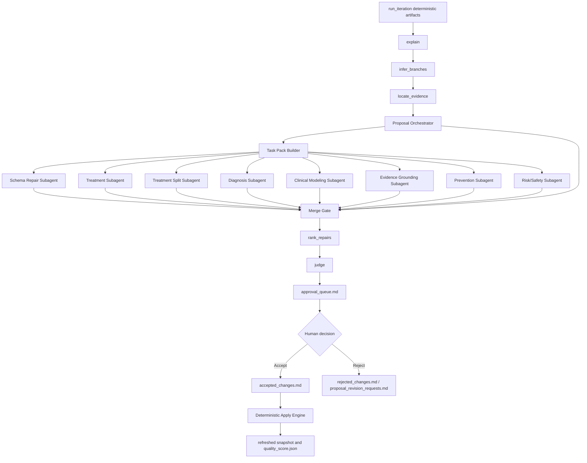

# KG Iteration Multi-Agent Proposal Orchestrator Plan

Last updated: 2026-06-24

This is the active implementation plan for the LightRAG knowledge-base iteration Agent. Older one-off design and execution plans were removed after they were superseded by this architecture and by the maintained user/operator docs.

## Current Goal

Upgrade the KG iteration Agent so large medical knowledge graphs can move from hundreds of detected schema/semantic issues to a clinically reviewable set of grounded proposals.

The active Web/API mode remains `agent_pipeline`. Internally, the proposal stage uses:

1. Deterministic medical issue detection.
2. Proposal Orchestrator task packing.
3. Specialized subagent proposal drafting.
4. Merge, validation, deduplication, and conflict gates.
5. Human approval through `approval_queue.md`.
6. Deterministic allowlisted apply after approval.

LLM output is never allowed to mutate KG storage directly.

## Current Architecture



## Implemented

- Medical relationship schema rules and deterministic defect detectors.
- Multi-agent task packing by issue family.
- `candidate_kg_expansion` proposal validation.
- Human-only approval flow with accept, reject, and accept-all actions in the WebUI.
- Deterministic apply support for allowlisted medical proposal actions.
- Long-term memory files:
  - `accepted_changes.md`
  - `rejected_changes.md`
  - `proposal_revision_requests.md`
  - `agent_memory_summary.md`
- Agent runtime defaults:
  - `KB_ITERATION_LLM_MODEL=deepseek-v4-flash`
  - `max_proposals_per_run=200`
- Guardrails added after real medical review:
  - reject review-only `review_context_request` items from proposal output;
  - skip already-normalized edges;
  - block bad `has_complication` migrations for outcomes, severity, and chronic conditions;
  - require population/context qualifiers for `reduces_risk_of`;
  - require executable payloads to match deterministic action candidates when a candidate exists.
- P3 subagent safety layer:
  - role contracts for schema repair, treatment, treatment split, prevention, risk/safety, diagnosis, clinical modeling, evidence grounding, and general tasks;
  - stable `candidate_id` values for deterministic action candidates;
  - prevalidation before candidates reach LLM subagents;
  - `allowed_evidence_spans` allowlist for candidate KG expansion;
  - deterministic-only and blocked task states;
  - role-specific Chinese prompt files under `lightrag/kb_iteration/prompts/subagents/`;
  - machine-readable retry constraints for role predicates, candidate IDs, split payload fields, and evidence grounding.

## Latest Real Run

Workspace: `influenza_medical_v1`

Runtime:

- model: `deepseek-v4-flash`
- mode: `agent_pipeline`
- max proposals: `200`
- stop reason: `pending_human_review`

Observed medical review and apply result:

- initial review queue: `53` proposals
- accepted: `3`
- rejected: `50`
- deterministic apply: `3` applied, `0` blocked

Follow-up Agent reruns:

- round 1: `15` proposals generated, `0` accepted, `15` rejected
- round 2: the same semantic `15` proposals regenerated with `-2` ID suffixes, `0` accepted, `15` rejected

Current queue state:

- `approval_queue.md` is empty after cleanup because the latest queue was fully reviewed and rejected.
- `rejected_changes.md` contains the round 2 proposal IDs.
- runtime evidence is archived under `codex_runs/round0_before_round1/`, `codex_runs/round1_after_review/`, and `codex_runs/round2_after_review/`.

Important note: exact proposal-ID memory is insufficient. The next source fix should suppress equivalent candidates by `semantic_fingerprint` and `execution_fingerprint`, so suffix-modified IDs cannot bypass prior reject/accept/apply decisions.

## 2026-06-22 P0 Schema Tightening Update

Implemented source-level fixes for the medical-relation detection bottleneck:

- Connected executable `medical_fact_role_split` proposals to `split_relation` payloads and deterministic apply support.
- Added shared medical entity type normalization and lightweight type hierarchy support.
- Tightened high-risk relation specs that were previously generic, including `causative_agent`, `orders_test`, `has_result`, `uses_specimen`, `belongs_to_drug_class`, `recommended_for`, `not_recommended_for`, `contraindicated_for`, `precaution_for`, `interaction_with`, `monitor_with`, and `evidenced_by`.
- Routed quality checks and typed proposal validation through a shared domain/range/qualifier relation contract.
- Added regression coverage for executable split proposals, strict canonical relation mismatch detection, and typed proposal rejection.

## 2026-06-22 P1/P2 Schema And Profile Update

Implemented the next source-level pass without running a real Agent iteration:

- Added required qualifier and required-any qualifier validation to the shared medical schema contract.
- Added constrained qualifier values for high-risk semantics such as `supports_or_refutes.polarity` and `recommended_for.purpose`.
- Tightened `recommended_for` so broad population recommendations must carry `purpose=treatment|prevention` plus at least one scope qualifier such as condition, age, population, route, timing, or time window.
- Added `temporarily_deferred_for` so the Agent can distinguish temporary deferral from contraindication, precaution, and not-recommended relations.
- Extended cross-edge conflict detection so `recommended_for` conflicts with `temporarily_deferred_for` under the same qualifier scope.
- Exposed `prevention` and `risk_safety` as proposal orchestration roles, matching the existing issue-family routing.
- Moved remaining influenza-specific parent/subtype taxonomy guards into `profiles/influenza_rules.py`, leaving generic proposal code to call profile hooks.
- Updated propose/judge prompts so LLM proposal drafts match the stricter validator.

## 2026-06-22 P3 Subagent Safety Update

Implemented the attached subagent-architecture hardening pass:

- Added `lightrag/kb_iteration/subagent_contracts.py` for per-role proposal type and predicate allowlists, forbidden predicates, payload modes, and proposal-count limits.
- Extended `ProposalTaskPack` with `rejected_action_candidates`, `role_contract`, `allowed_evidence_spans`, `execution_mode`, and `block_reason`.
- Populated `allowed_evidence_spans` from issue evidence fields and enforced exact evidence-tuple reuse for `candidate_kg_expansion`.
- Added stable action candidate IDs and deterministic candidate prevalidation.
- Refreshed candidates, rejected candidates, evidence spans, execution mode, and block reason when task packs are split for context budget.
- Applied the same contract/prevalidation path to fallback quality-finding task packs.
- Loaded `prompts/subagents/base_zh.md` plus a role-specific Chinese prompt for each subagent.
- Added Web/API defaults for strict role contracts, candidate prevalidation, evidence allowlists, deterministic-call skipping, and per-task proposal limits.
- Added `risk_factor_for`, `high_risk_for`, `increases_risk_of`, and `acute_exacerbation_of`; deprecated `risk_group_for` in favor of `high_risk_for`.

## 2026-06-22 P4 Proposal Funnel Update

Implemented the first high-yield deterministic proposal funnel pass:

- `Proposal Orchestrator` now reads both `medical_schema_issues` and `entity_cleanup_issues` before task packing.
- Structured issues now carry `issue_source`, `issue_family`, `issue_kind`, stable `issue_ref`, and dedupe keys.
- Deterministic candidate generation moved into `lightrag/kb_iteration/deterministic_proposals/`.
- Implemented first-pass family generators for:
  - entity cleanup;
  - clinical modeling;
  - diagnosis;
  - treatment;
  - risk/safety;
  - prevention.
- TCM generation remains deferred until `medical_schema.py` defines explicit TCM predicates.
- Quality issues preserve qualifiers, and task packs track `covered_issue_refs` plus `residual_issue_refs`.
- Mixed deterministic/residual packs use `execution_mode=hybrid`; deterministic candidates can become proposals while unresolved issues still go to LLM subagents.
- Generator rejections and candidate-to-proposal conversion failures are structured instead of being silently dropped.
- `value_node_to_qualifier` now validates and applies through a full safety loop, writing qualifiers into the JSON `qualifiers` field.
- Ambiguous treatment safety/risk candidates are rejected instead of choosing from unordered predicates.
- Conflict-review issues do not generate mutation candidates.
- `legacy_schema` dispatch now routes by predicate family.

## Remaining Work

1. Add fingerprint-based decision memory before queueing:
   - `semantic_fingerprint` for clinically equivalent source/target/predicate intent;
   - `execution_fingerprint` for equivalent deterministic mutation payloads;
   - suppress matches against rejected, accepted, and already-applied memories.
2. Feed rejection classes back into deterministic generators, especially population-as-indication, prevention-target-as-indication, negative recommendation as positive indication, and complication/risk/outcome predicate confusion.
3. Keep family-level counters for detected, skipped, generated, selected, rejected, and applied proposals visible in the Web/API reports.
4. Batch proposals by clinical family so a 200-proposal run remains reviewable.
5. Add API/Web controls for enabled families, per-family deterministic limits, LLM limits, entity cleanup inclusion, TCM inclusion, and review-conflict inclusion.
6. Add apply capability checks before queueing candidates, so accepted proposals are less likely to become `blocked`.
7. Improve detectors for:
   - treatment, dose, contraindication, and precautions;
   - diagnosis, diagnostic criteria, evidence direction, and test panels;
   - prevention, vaccine, population, and risk reduction;
   - complication, risk factor, outcome, and severity distinctions;
   - TCM formula, component, and syndrome indications;
   - unknown entity type and alias fragmentation.

## Verification Baseline

Latest focused verification after the full P4 robustness pass:

```powershell
.venv\Scripts\python.exe -m pytest tests\kg\test_kb_iteration_agent_pipeline.py tests\kg\test_kb_iteration_medical_schema.py tests\kg\test_kb_iteration_proposals.py tests\kg\test_kb_iteration_proposal_orchestrator.py tests\kg\test_kb_iteration_quality.py tests\kg\test_kb_iteration_apply.py tests\kg\test_kb_iteration_snapshot.py tests\kg\test_kb_iteration_agent_outputs.py tests\api\routes\test_kb_iteration_routes.py -q
```

Result: `530 passed`

```powershell
.venv\Scripts\python.exe -m ruff check lightrag/kb_iteration/agent_pipeline.py lightrag/kb_iteration/proposal_orchestrator.py lightrag/kb_iteration/proposals.py lightrag/kb_iteration/quality.py lightrag/kb_iteration/medical_schema.py lightrag/kb_iteration/apply.py lightrag/kb_iteration/snapshot.py lightrag/kb_iteration/agent_outputs.py lightrag/kb_iteration/deterministic_proposals tests/kg/test_kb_iteration_agent_pipeline.py tests/kg/test_kb_iteration_medical_schema.py tests/kg/test_kb_iteration_proposals.py tests/kg/test_kb_iteration_proposal_orchestrator.py tests/kg/test_kb_iteration_quality.py tests/kg/test_kb_iteration_apply.py tests/kg/test_kb_iteration_snapshot.py tests/kg/test_kb_iteration_agent_outputs.py tests/api/routes/test_kb_iteration_routes.py
```

Result: passed

Latest focused verification after P0 schema tightening:

```powershell
.venv\Scripts\python.exe -m pytest tests\kg\test_kb_iteration_medical_schema.py tests\kg\test_kb_iteration_quality.py tests\kg\test_kb_iteration_proposals.py tests\kg\test_kb_iteration_proposal_orchestrator.py tests\kg\test_kb_iteration_apply.py tests\kg\test_kb_iteration_agent_pipeline.py tests\api\routes\test_kb_iteration_routes.py -q
```

Result: `446 passed`

```powershell
.venv\Scripts\python.exe -m ruff check lightrag/kb_iteration/medical_schema.py lightrag/kb_iteration/quality.py lightrag/kb_iteration/proposals.py lightrag/kb_iteration/proposal_orchestrator.py lightrag/kb_iteration/apply.py lightrag/kb_iteration/agent_pipeline.py tests/kg/test_kb_iteration_medical_schema.py tests/kg/test_kb_iteration_quality.py tests/kg/test_kb_iteration_proposals.py tests/kg/test_kb_iteration_proposal_orchestrator.py tests/kg/test_kb_iteration_apply.py tests/kg/test_kb_iteration_agent_pipeline.py tests/api/routes/test_kb_iteration_routes.py
```

Result: passed

Latest focused verification after P1/P2 schema/profile tightening:

```powershell
.venv\Scripts\python.exe -m pytest tests\kg\test_kb_iteration_medical_schema.py tests\kg\test_kb_iteration_quality.py tests\kg\test_kb_iteration_proposals.py tests\kg\test_kb_iteration_proposal_orchestrator.py tests\kg\test_kb_iteration_apply.py tests\kg\test_kb_iteration_agent_pipeline.py tests\api\routes\test_kb_iteration_routes.py tests\kg\test_kb_iteration_influenza_rules.py -q
```

Result: `460 passed`

```powershell
.venv\Scripts\python.exe -m ruff check lightrag/kb_iteration/medical_schema.py lightrag/kb_iteration/quality.py lightrag/kb_iteration/proposals.py lightrag/kb_iteration/proposal_orchestrator.py lightrag/kb_iteration/profiles/influenza_rules.py lightrag/kb_iteration/agent_pipeline.py tests/kg/test_kb_iteration_medical_schema.py tests/kg/test_kb_iteration_quality.py tests/kg/test_kb_iteration_proposals.py tests/kg/test_kb_iteration_proposal_orchestrator.py tests/kg/test_kb_iteration_apply.py tests/kg/test_kb_iteration_influenza_rules.py
```

Result: passed

Previous focused verification recorded before cleanup:

```powershell
.venv\Scripts\python.exe -m pytest tests\kg\test_kb_iteration_agent_pipeline.py tests\api\routes\test_kb_iteration_routes.py tests\kg\test_kb_iteration_proposal_orchestrator.py tests\kg\test_kb_iteration_proposals.py -q
```

Result: `325 passed`

```powershell
.venv\Scripts\python.exe -m ruff check lightrag/kb_iteration/agent_pipeline.py lightrag/kb_iteration/proposal_orchestrator.py lightrag/kb_iteration/proposals.py lightrag/api/routers/kb_iteration_routes.py
```

Result: passed

Latest focused verification after the full P3 subagent safety pass:

```powershell
.venv\Scripts\python.exe -m pytest tests\kg\test_kb_iteration_agent_pipeline.py tests\kg\test_kb_iteration_medical_schema.py tests\kg\test_kb_iteration_proposals.py tests\kg\test_kb_iteration_proposal_orchestrator.py tests\kg\test_kb_iteration_quality.py tests\kg\test_kb_iteration_apply.py tests\kg\test_kb_iteration_snapshot.py tests\kg\test_kb_iteration_agent_outputs.py tests\api\routes\test_kb_iteration_routes.py -q
```

Result: `508 passed`

```powershell
.venv\Scripts\python.exe -m ruff check lightrag/kb_iteration/agent_pipeline.py lightrag/kb_iteration/proposal_orchestrator.py lightrag/kb_iteration/proposals.py lightrag/kb_iteration/quality.py lightrag/kb_iteration/medical_schema.py lightrag/api/routers/kb_iteration_routes.py tests/kg/test_kb_iteration_agent_pipeline.py tests/kg/test_kb_iteration_proposals.py tests/kg/test_kb_iteration_quality.py tests/kg/test_kb_iteration_proposal_orchestrator.py tests/api/routes/test_kb_iteration_routes.py
```

Result: passed

Frontend touched-file ESLint passed. `bun test` was not run because `bun` is not available on PATH in this shell.

Run focused tests again after any source changes beyond documentation/workspace cleanup.
