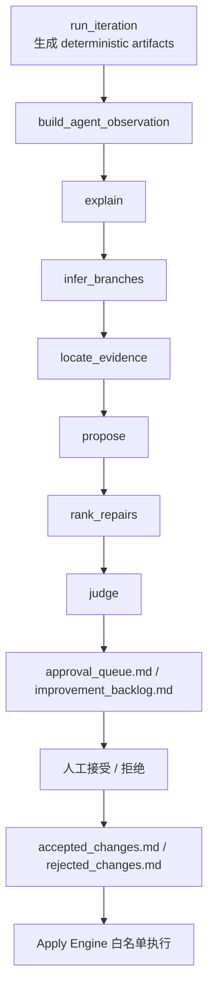
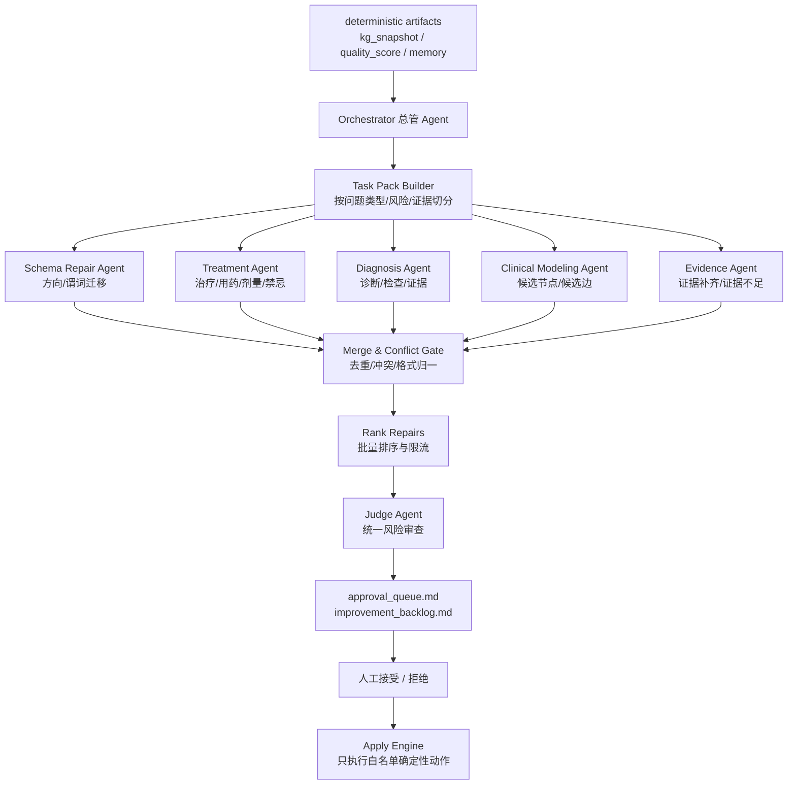

# KG Agent Multi-Agent Proposal Orchestrator Implementation Plan

> **For agentic workers:** REQUIRED SUB-SKILL: Use superpowers:subagent-driven-development (recommended) or superpowers:executing-plans to implement this plan task-by-task. Steps use checkbox (`- [ ]`) syntax for tracking.

**Goal:** 在现有知识库迭代 Agent 架构上增加“总管 Agent + 多子 Agent”的批量 proposal 生成能力，让大量医学 KG 问题可以被分流、并行分析、统一合并、去重、冲突检测，并写入人工审批队列。

**Architecture:** 保留现有 `explain -> infer_branches -> locate_evidence -> propose -> rank_repairs -> judge` 单 Agent 流程；新增可选 `multi_agent_pipeline` 模式。新模式由 Orchestrator 读取 deterministic artifacts 和压缩记忆，生成 Task Pack，分发给多个逻辑子 Agent，收集草案后统一 merge/judge，再写 `approval_queue.md` 和 `improvement_backlog.md`。子 Agent 可以提出候选节点/候选边，但不能直接写 KG；真正写入仍由后端白名单 apply 引擎决定。

**Tech Stack:** Python dataclasses, pytest, FastAPI, existing `LLMReviewClient`, JSON/Markdown artifacts, React 19 + TypeScript + Bun, Tailwind.

---

## Current Architecture

现有 Agent 流程是单条多阶段流水线：



当前问题：

- 面对 800+ `medical_schema_issues`，单个 `propose` Agent 只能少量输出，吞吐低。
- LLM 容易在 `action_payload`、`expected_metric_change`、`patch_candidate` 等字段上被校验打回，导致多次重试。
- 新增节点/边的医学建模需求没有独立 proposal 类型，只能挤进现有修复类型。
- 多个方向的问题（症状、治疗、诊断、病原分型、候选建模）没有任务分流，LLM 上下文负担重。

## Target Architecture

新架构在现有单 Agent 流水线旁边增加“多子 Agent proposal 轨道”：



关键边界：

- 子 Agent 只输出 proposal draft，不直接写 `approval_queue.md`。
- Orchestrator 是唯一合并者和写入者。
- 现有 `medical_relation_schema_migration` 和 `value_node_to_qualifier` 继续要求 deterministic `action_payload`。
- 新增 `candidate_kg_expansion` 类型，允许 LLM 提出候选节点/候选边，但必须有 `source_id`、`file_path`、`evidence_quote`、`why_not_existing`，并且本阶段不自动写 KG。
- 任何涉及 KG、规则、prompt、workspace、WebUI 的 proposal 仍然 `requires_approval=true`。

## File Map

- Create: `lightrag/kb_iteration/proposal_orchestrator.py`
  - 负责 Task Pack dataclasses、issue 分流、action candidate 生成、子 Agent 输出合并、去重和冲突检测。
- Modify: `lightrag/kb_iteration/agent_pipeline.py`
  - 增加 `proposal_mode` / `multi_agent_pipeline` 支持、精准 retry feedback、trace 记录。
- Modify: `lightrag/kb_iteration/agent_context.py`
  - 为 Orchestrator 和子 Agent 构建小上下文，包含 action candidates、证据窗口、压缩记忆。
- Modify: `lightrag/kb_iteration/proposals.py`
  - 增加 `candidate_kg_expansion` proposal 类型与 payload 校验。
- Modify: `lightrag/kb_iteration/models.py`
  - 如需要，增加 lightweight dataclasses 或继续使用 `ImprovementProposal.action_payload` 承载 candidate payload。
- Create prompts:
  - `lightrag/kb_iteration/prompts/orchestrator_zh.md`
  - `lightrag/kb_iteration/prompts/subagent_schema_repair_zh.md`
  - `lightrag/kb_iteration/prompts/subagent_treatment_zh.md`
  - `lightrag/kb_iteration/prompts/subagent_diagnosis_zh.md`
  - `lightrag/kb_iteration/prompts/subagent_modeling_zh.md`
  - `lightrag/kb_iteration/prompts/proposal_merge_zh.md`
- Modify: `lightrag/api/routers/kb_iteration_routes.py`
  - API 支持 `mode="multi_agent_pipeline"` 和批量参数。
- Modify WebUI:
  - `lightrag_webui/src/components/kg-maintenance/kgMaintenanceArtifacts.ts`
  - `lightrag_webui/src/components/kg-maintenance/IterationWorkbenchPanels.tsx`
  - `lightrag_webui/src/components/kg-maintenance/KGMaintenanceShell.test.tsx`
  - `lightrag_webui/src/components/kg-maintenance/IterationWorkbenchPanels.test.tsx`
- Tests:
  - `tests/kg/test_kb_iteration_proposal_orchestrator.py`
  - `tests/kg/test_kb_iteration_agent_pipeline.py`
  - `tests/kg/test_kb_iteration_proposals.py`
  - `tests/api/routes/test_kb_iteration_routes.py`
  - WebUI focused tests under `lightrag_webui/src/components/kg-maintenance/`

---

## Task 1: Add Proposal Orchestrator Models And Task Packs

**Files:**
- Create: `lightrag/kb_iteration/proposal_orchestrator.py`
- Test: `tests/kg/test_kb_iteration_proposal_orchestrator.py`

- [ ] **Step 1: Write failing tests for task pack grouping**

Create `tests/kg/test_kb_iteration_proposal_orchestrator.py`:

```python
from pathlib import Path

from lightrag.kb_iteration.proposal_orchestrator import (
    build_proposal_task_packs,
)


def test_build_task_packs_groups_medical_schema_issues_by_subagent(tmp_path: Path) -> None:
    package = tmp_path / "pkg"
    snapshot_dir = package / "snapshots"
    snapshot_dir.mkdir(parents=True)
    (snapshot_dir / "kg_snapshot.json").write_text(
        """
{
  "workspace": "demo",
  "nodes": [
    {"id": "流行性感冒", "label": "流行性感冒", "entity_type": "Disease", "source_id": "chunk-1", "file_path": "guide.md"},
    {"id": "高热不退", "label": "高热不退", "entity_type": "Symptom", "source_id": "chunk-1", "file_path": "guide.md"},
    {"id": "奥司他韦", "label": "奥司他韦", "entity_type": "Drug", "source_id": "chunk-2", "file_path": "guide.md"}
  ],
  "edges": [
    {"id": "高热不退->流行性感冒", "source": "高热不退", "target": "流行性感冒", "keywords": "临床表现", "source_id": "chunk-1", "file_path": "guide.md"},
    {"id": "奥司他韦->流行性感冒", "source": "奥司他韦", "target": "流行性感冒", "keywords": "推荐治疗", "source_id": "chunk-2", "file_path": "guide.md"}
  ],
  "source_files": ["guide.md"]
}
""".strip()
        + "\n",
        encoding="utf-8",
    )
    (snapshot_dir / "quality_score.json").write_text(
        """
{
  "metrics": {"medical_schema_issue_count": 2},
  "details": {
    "medical_schema_issues": [
      {
        "issue_kind": "reverse_clinical_manifestation_direction",
        "edge_id": "高热不退->流行性感冒",
        "source": "高热不退",
        "target": "流行性感冒",
        "keywords": "临床表现",
        "candidate_predicates": ["has_manifestation"],
        "source_id": "chunk-1",
        "file_path": "guide.md"
      },
      {
        "issue_kind": "legacy_overloaded_relation",
        "edge_id": "奥司他韦->流行性感冒",
        "source": "奥司他韦",
        "target": "流行性感冒",
        "keywords": "推荐治疗",
        "candidate_predicates": ["has_indication", "recommends"],
        "source_id": "chunk-2",
        "file_path": "guide.md"
      }
    ]
  }
}
""".strip()
        + "\n",
        encoding="utf-8",
    )

    packs = build_proposal_task_packs(package, max_issues_per_pack=10, max_packs=10)

    assert [pack.agent_role for pack in packs] == ["schema_repair", "treatment"]
    schema_pack = packs[0]
    assert schema_pack.task_id == "schema_repair-001"
    assert schema_pack.issues[0]["edge_id"] == "高热不退->流行性感冒"
    assert schema_pack.action_candidates[0]["action_payload"]["new_keywords"] == "has_manifestation"
```

- [ ] **Step 2: Run test and confirm failure**

Run:

```powershell
.venv\Scripts\python.exe -m pytest tests/kg/test_kb_iteration_proposal_orchestrator.py -q
```

Expected:

```text
ModuleNotFoundError: No module named 'lightrag.kb_iteration.proposal_orchestrator'
```

- [ ] **Step 3: Add minimal orchestrator dataclasses and grouping**

Create `lightrag/kb_iteration/proposal_orchestrator.py`:

```python
from __future__ import annotations

import json
from dataclasses import asdict, dataclass, field
from pathlib import Path
from typing import Any


@dataclass(frozen=True)
class ProposalTaskPack:
    task_id: str
    agent_role: str
    title: str
    instructions: list[str] = field(default_factory=list)
    issues: list[dict[str, Any]] = field(default_factory=list)
    action_candidates: list[dict[str, Any]] = field(default_factory=list)
    context: dict[str, Any] = field(default_factory=dict)

    def to_dict(self) -> dict[str, Any]:
        return asdict(self)


def build_proposal_task_packs(
    package_dir: str | Path,
    *,
    max_issues_per_pack: int = 50,
    max_packs: int = 20,
) -> list[ProposalTaskPack]:
    package_path = Path(package_dir)
    quality = _read_json(package_path / "snapshots" / "quality_score.json")
    issues = _list_of_dicts(
        ((quality.get("details") or {}).get("medical_schema_issues"))
        if isinstance(quality, dict)
        else None
    )

    grouped: dict[str, list[dict[str, Any]]] = {}
    for issue in issues:
        role = _agent_role_for_issue(issue)
        grouped.setdefault(role, []).append(issue)

    packs: list[ProposalTaskPack] = []
    for role in ("schema_repair", "treatment", "diagnosis", "clinical_modeling"):
        role_issues = grouped.get(role, [])
        for index, chunk in enumerate(_chunks(role_issues, max_issues_per_pack), start=1):
            packs.append(
                ProposalTaskPack(
                    task_id=f"{role}-{index:03d}",
                    agent_role=role,
                    title=_title_for_role(role),
                    instructions=_instructions_for_role(role),
                    issues=chunk,
                    action_candidates=[
                        candidate
                        for issue in chunk
                        for candidate in _action_candidates_for_issue(issue)
                    ],
                )
            )
            if len(packs) >= max_packs:
                return packs
    return packs


def _agent_role_for_issue(issue: dict[str, Any]) -> str:
    text = " ".join(str(issue.get(key, "")) for key in ("issue_kind", "keywords"))
    candidates = " ".join(str(item) for item in issue.get("candidate_predicates") or [])
    text = f"{text} {candidates}".casefold()
    if any(token in text for token in ("推荐治疗", "剂量", "has_indication", "recommends", "dosing")):
        return "treatment"
    if any(token in text for token in ("诊断", "检查", "检测", "criterion", "performed_by_method")):
        return "diagnosis"
    if any(token in text for token in ("candidate", "missing_entity", "missing_relation")):
        return "clinical_modeling"
    return "schema_repair"


def _action_candidates_for_issue(issue: dict[str, Any]) -> list[dict[str, Any]]:
    edge_id = str(issue.get("edge_id", "")).strip()
    source = str(issue.get("source", "")).strip()
    target = str(issue.get("target", "")).strip()
    keywords = str(issue.get("keywords", "")).strip()
    predicates = [str(item).strip() for item in issue.get("candidate_predicates") or [] if str(item).strip()]
    if not edge_id or not source or not target or "has_manifestation" not in predicates:
        return []
    return [
        {
            "candidate_id": f"action-{edge_id}",
            "proposal_type": "medical_relation_schema_migration",
            "source_issue_edge_id": edge_id,
            "action_payload": {
                "action": "replace_relation",
                "edge_id": edge_id,
                "expected_source": source,
                "expected_target": target,
                "current_keywords": keywords,
                "new_source": target,
                "new_target": source,
                "new_keywords": "has_manifestation",
                "qualifiers": {},
            },
        }
    ]


def _title_for_role(role: str) -> str:
    return {
        "schema_repair": "医学关系方向/谓词修复",
        "treatment": "治疗/用药关系修复",
        "diagnosis": "诊断/检查关系修复",
        "clinical_modeling": "候选实体/候选关系建模",
    }.get(role, role)


def _instructions_for_role(role: str) -> list[str]:
    if role == "clinical_modeling":
        return [
            "可以提出 candidate_kg_expansion，但必须绑定 source_id、file_path 和 evidence_quote。",
            "不能声称候选节点/边已经存在于 KG。",
        ]
    return [
        "优先从 action_candidates 原样复制 action_payload。",
        "不要改写 edge_id、expected_source、expected_target、new_source、new_target。",
    ]


def _chunks(items: list[dict[str, Any]], size: int) -> list[list[dict[str, Any]]]:
    size = max(1, size)
    return [items[index : index + size] for index in range(0, len(items), size)]


def _read_json(path: Path) -> dict[str, Any]:
    if not path.is_file():
        return {}
    value = json.loads(path.read_text(encoding="utf-8"))
    return value if isinstance(value, dict) else {}


def _list_of_dicts(value: Any) -> list[dict[str, Any]]:
    if not isinstance(value, list):
        return []
    return [item for item in value if isinstance(item, dict)]
```

- [ ] **Step 4: Run test and confirm pass**

Run:

```powershell
.venv\Scripts\python.exe -m pytest tests/kg/test_kb_iteration_proposal_orchestrator.py -q
```

Expected:

```text
1 passed
```

- [ ] **Step 5: Commit**

```powershell
git add lightrag/kb_iteration/proposal_orchestrator.py tests/kg/test_kb_iteration_proposal_orchestrator.py
git commit -m "feat: add kg proposal task packs"
```

---

## Task 2: Add Candidate KG Expansion Proposal Type

**Files:**
- Modify: `lightrag/kb_iteration/proposals.py`
- Test: `tests/kg/test_kb_iteration_proposals.py`

- [ ] **Step 1: Write failing tests for candidate expansion**

Append to `tests/kg/test_kb_iteration_proposals.py`:

```python
from lightrag.kb_iteration.models import ImprovementProposal
from lightrag.kb_iteration.proposals import validate_proposal


def test_candidate_kg_expansion_requires_approval_and_evidence_payload() -> None:
    proposal = ImprovementProposal(
        id="prop-candidate-expansion-001",
        type="candidate_kg_expansion",
        target="candidate:influenza-treatment-model",
        proposed_change="Add candidate treatment relation extracted from guideline evidence.",
        reason="The source text mentions a treatment relation not represented in KG.",
        evidence=["source_id: chunk-2; file_path: guide.md"],
        confidence=0.78,
        risk="medium",
        requires_approval=True,
        action_payload={
            "candidate_nodes": [
                {"id_hint": "奥司他韦", "label": "奥司他韦", "entity_type": "Drug"}
            ],
            "candidate_edges": [
                {
                    "source_hint": "奥司他韦",
                    "target_hint": "流行性感冒",
                    "predicate": "has_indication",
                }
            ],
            "source_id": "chunk-2",
            "file_path": "guide.md",
            "evidence_quote": "奥司他韦适用于流行性感冒抗病毒治疗。",
            "why_not_existing": "No canonical has_indication edge exists in the snapshot.",
        },
    )

    validate_proposal(proposal)


def test_candidate_kg_expansion_rejects_missing_quote() -> None:
    proposal = ImprovementProposal(
        id="prop-candidate-expansion-missing-quote",
        type="candidate_kg_expansion",
        target="candidate:bad",
        proposed_change="Add candidate edge.",
        reason="Missing quote should be rejected.",
        evidence=["source_id: chunk-2; file_path: guide.md"],
        confidence=0.5,
        risk="medium",
        requires_approval=True,
        action_payload={
            "candidate_nodes": [],
            "candidate_edges": [],
            "source_id": "chunk-2",
            "file_path": "guide.md",
            "why_not_existing": "No edge exists.",
        },
    )

    with pytest.raises(ValueError, match="candidate_kg_expansion"):
        validate_proposal(proposal)
```

- [ ] **Step 2: Run tests and confirm failure**

Run:

```powershell
.venv\Scripts\python.exe -m pytest tests/kg/test_kb_iteration_proposals.py::test_candidate_kg_expansion_requires_approval_and_evidence_payload tests/kg/test_kb_iteration_proposals.py::test_candidate_kg_expansion_rejects_missing_quote -q
```

Expected:

```text
unknown proposal type candidate_kg_expansion requires approval
```

- [ ] **Step 3: Add proposal type and payload validation**

Modify `lightrag/kb_iteration/proposals.py`:

```python
MUTATION_PROPOSAL_TYPES = {
    # existing entries...
    "candidate_kg_expansion",
}
```

Add after the medical migration validation:

```python
    if proposal.type == "candidate_kg_expansion":
        _validate_candidate_kg_expansion_payload(proposal.action_payload)
```

Add helper:

```python
def _validate_candidate_kg_expansion_payload(action_payload: dict[str, object]) -> None:
    required_strings = ("source_id", "file_path", "evidence_quote", "why_not_existing")
    for field_name in required_strings:
        value = action_payload.get(field_name)
        if not isinstance(value, str) or not value.strip():
            raise ValueError(
                f"candidate_kg_expansion action_payload must include {field_name}"
            )
    candidate_nodes = action_payload.get("candidate_nodes")
    candidate_edges = action_payload.get("candidate_edges")
    if not isinstance(candidate_nodes, list):
        raise ValueError("candidate_kg_expansion candidate_nodes must be a list")
    if not isinstance(candidate_edges, list):
        raise ValueError("candidate_kg_expansion candidate_edges must be a list")
    for node in candidate_nodes:
        if not isinstance(node, dict):
            raise ValueError("candidate_kg_expansion candidate_nodes entries must be objects")
    for edge in candidate_edges:
        if not isinstance(edge, dict):
            raise ValueError("candidate_kg_expansion candidate_edges entries must be objects")
```

- [ ] **Step 4: Run tests and confirm pass**

Run:

```powershell
.venv\Scripts\python.exe -m pytest tests/kg/test_kb_iteration_proposals.py::test_candidate_kg_expansion_requires_approval_and_evidence_payload tests/kg/test_kb_iteration_proposals.py::test_candidate_kg_expansion_rejects_missing_quote -q
```

Expected:

```text
2 passed
```

- [ ] **Step 5: Commit**

```powershell
git add lightrag/kb_iteration/proposals.py tests/kg/test_kb_iteration_proposals.py
git commit -m "feat: add candidate kg expansion proposals"
```

---

## Task 3: Add Prompt v2 And Precise Retry Feedback

**Files:**
- Modify: `lightrag/kb_iteration/agent_pipeline.py`
- Modify: `lightrag/kb_iteration/prompts/propose_zh.md`
- Create: `lightrag/kb_iteration/prompts/subagent_schema_repair_zh.md`
- Create: `lightrag/kb_iteration/prompts/subagent_treatment_zh.md`
- Create: `lightrag/kb_iteration/prompts/subagent_diagnosis_zh.md`
- Create: `lightrag/kb_iteration/prompts/subagent_modeling_zh.md`
- Test: `tests/kg/test_kb_iteration_agent_pipeline.py`

- [ ] **Step 1: Write failing tests for retry feedback**

Append to `tests/kg/test_kb_iteration_agent_pipeline.py`:

```python
from lightrag.kb_iteration.agent_pipeline import _retry_user_prompt


def test_retry_prompt_gives_action_candidate_copy_instruction() -> None:
    prompt = _retry_user_prompt(
        "base",
        stage="propose",
        error="proposal prop-x action_payload expected_source is not grounded in deterministic artifacts",
        previous_errors=[],
    )

    assert "从 action_candidates 原样复制" in prompt
    assert "expected_source" in prompt
    assert "不要翻译、不要改写、不要新增节点" in prompt


def test_propose_prompt_mentions_candidate_kg_expansion_boundary() -> None:
    prompt = _stage_prompt("propose", "clinical_guideline_zh")

    assert "candidate_kg_expansion" in prompt
    assert "候选节点" in prompt
    assert "不能直接写入 KG" in prompt
```

- [ ] **Step 2: Run tests and confirm failure**

Run:

```powershell
.venv\Scripts\python.exe -m pytest tests/kg/test_kb_iteration_agent_pipeline.py::test_retry_prompt_gives_action_candidate_copy_instruction tests/kg/test_kb_iteration_agent_pipeline.py::test_propose_prompt_mentions_candidate_kg_expansion_boundary -q
```

Expected:

```text
assertion failure because prompt text is not present
```

- [ ] **Step 3: Update precise retry feedback**

Modify `_retry_user_prompt()` in `lightrag/kb_iteration/agent_pipeline.py`:

```python
    if stage == "propose":
        if "action_payload" in error and "grounded" in error:
            guidance.extend(
                [
                    "如果错误涉及 action_payload grounding，请从 action_candidates 原样复制 edge_id、expected_source、expected_target、new_source、new_target、new_keywords。",
                    "不要翻译、不要改写、不要新增节点；如果 action_candidates 没有对应动作，请改成 candidate_kg_expansion 或 review_context_request。",
                ]
            )
        if "expected_metric_change" in error:
            guidance.append(
                'For "expected_metric_change", use finite JSON numbers only; use {} if no numeric estimate is available.'
            )
        if "patch_candidate" in error:
            guidance.append('For "patch_candidate", output a string; use "" when no patch file exists.')
```

Keep the existing approval/evidence reminders.

- [ ] **Step 4: Update propose prompt v2**

Modify `lightrag/kb_iteration/prompts/propose_zh.md` to include:

```markdown
## 批量 proposal 规则

- 每轮最多输出 20 条 proposal。
- 优先输出 10 条低风险确定性 schema 修复。
- 最多输出 5 条治疗/诊断关系修复。
- 最多输出 5 条候选新增节点/边。

## action_candidates 规则

如果上下文中存在 `action_candidates`：

- 修已有边时，必须从 `action_candidates[].action_payload` 原样复制 `edge_id`、`expected_source`、`expected_target`、`new_source`、`new_target`、`new_keywords`。
- 不要翻译、不要改写、不要新增节点。
- 如果没有合适 action candidate，不要伪造 action_payload。

## candidate_kg_expansion 规则

当指南证据显示 KG 缺少实体或关系时，可以生成 `type="candidate_kg_expansion"`。

这类 proposal 只是候选建模，不能直接写入 KG，必须人工审批，并且必须携带：

- `candidate_nodes`
- `candidate_edges`
- `source_id`
- `file_path`
- `evidence_quote`
- `why_not_existing`

没有 `evidence_quote` 时，输出 `review_context_request`，不要输出候选事实。
```

- [ ] **Step 5: Create subagent prompts**

Create `lightrag/kb_iteration/prompts/subagent_schema_repair_zh.md`:

```markdown
# Schema Repair Sub-Agent

你只处理已有边的方向和谓词规范化。

输入包含 `task_pack`、`issues`、`action_candidates`。

规则：
- 优先从 `action_candidates` 复制 action_payload。
- 不要新增节点。
- 不要新增医学事实。
- 如果候选动作不足，输出 `skipped` 并说明需要证据。
- 输出 JSON only。
```

Create `subagent_treatment_zh.md`, `subagent_diagnosis_zh.md`, `subagent_modeling_zh.md` with the same JSON-only rule and role-specific scope.

- [ ] **Step 6: Run tests**

Run:

```powershell
.venv\Scripts\python.exe -m pytest tests/kg/test_kb_iteration_agent_pipeline.py::test_retry_prompt_gives_action_candidate_copy_instruction tests/kg/test_kb_iteration_agent_pipeline.py::test_propose_prompt_mentions_candidate_kg_expansion_boundary -q
```

Expected:

```text
2 passed
```

- [ ] **Step 7: Commit**

```powershell
git add lightrag/kb_iteration/agent_pipeline.py lightrag/kb_iteration/prompts tests/kg/test_kb_iteration_agent_pipeline.py
git commit -m "feat: harden kg proposal prompts"
```

---

## Task 4: Implement Multi-Agent Proposal Pipeline Mode

**Files:**
- Modify: `lightrag/kb_iteration/agent_pipeline.py`
- Modify: `lightrag/kb_iteration/proposal_orchestrator.py`
- Test: `tests/kg/test_kb_iteration_agent_pipeline.py`
- Test: `tests/kg/test_kb_iteration_proposal_orchestrator.py`

- [ ] **Step 1: Write failing pipeline test**

Append to `tests/kg/test_kb_iteration_agent_pipeline.py`:

```python
class MultiAgentProposalClient(SequencedAgentClient):
    def __init__(self) -> None:
        super().__init__()
        self.outputs = [
            {"issue_explanations": []},
            {"required": [], "present": [], "missing": [], "missing_branches": []},
            {"evidence_map": []},
            {
                "subagent_result": {
                    "agent_role": "schema_repair",
                    "task_id": "schema_repair-001",
                    "proposals": [
                        {
                            "id": "修复-临床表现-高热不退",
                            "type": "medical_relation_schema_migration",
                            "target": "edge_id: flu-fever",
                            "proposed_change": "Normalize manifestation direction.",
                            "reason": "Existing edge direction is reversed.",
                            "evidence": ["source_id: chunk-1; file_path: guide.md; relation_id: flu-fever"],
                            "confidence": 0.9,
                            "risk": "low",
                            "requires_approval": True,
                            "expected_metric_change": {},
                            "action_payload": {
                                "action": "replace_relation",
                                "edge_id": "flu-fever",
                                "expected_source": "flu",
                                "expected_target": "entity fever",
                                "current_keywords": "clinical_manifestation",
                                "new_source": "flu",
                                "new_target": "entity fever",
                                "new_keywords": "has_manifestation",
                                "qualifiers": {}
                            }
                        }
                    ],
                    "skipped": [],
                    "needs_more_evidence": [],
                    "notes": []
                }
            },
            {
                "repair_plan": [
                    {
                        "rank": 1,
                        "proposal_id": "prop-medical_relation_schema_migration-expected",
                        "priority": "high",
                        "risk": "low",
                        "reason": "Safe deterministic action.",
                        "human_checks": []
                    }
                ]
            },
            {
                "judge_results": [
                    {
                        "proposal_id": "prop-medical_relation_schema_migration-expected",
                        "decision": "needs_human",
                        "reason": "Mutation requires human review."
                    }
                ]
            },
        ]
```

Then add:

```python
def test_multi_agent_pipeline_writes_subagent_artifacts_and_approval_queue(tmp_path: Path) -> None:
    package = tmp_path / "package"
    _write_agent_package(package)
    client = MultiAgentProposalClient()

    result = run_llm_agent_pipeline(
        workspace="demo",
        package_dir=package,
        client=client,
        config=LLMAgentPipelineConfig(proposal_mode="multi_agent", max_subagent_tasks=3),
    )

    assert result.stop_reason == "pending_human_review"
    assert (package / "proposal_task_packs.json").is_file()
    assert (package / "subagent_outputs" / "schema_repair-001.json").is_file()
    assert (package / "proposal_merge_report.md").is_file()
    assert "proposals:" in (package / "approval_queue.md").read_text(encoding="utf-8")
```

- [ ] **Step 2: Run test and confirm failure**

Run:

```powershell
.venv\Scripts\python.exe -m pytest tests/kg/test_kb_iteration_agent_pipeline.py::test_multi_agent_pipeline_writes_subagent_artifacts_and_approval_queue -q
```

Expected:

```text
TypeError: LLMAgentPipelineConfig.__init__() got an unexpected keyword argument 'proposal_mode'
```

- [ ] **Step 3: Extend config**

Modify `LLMAgentPipelineConfig`:

```python
@dataclass(frozen=True)
class LLMAgentPipelineConfig:
    max_context_tokens_per_stage: int = 12000
    max_stage_retries: int = 5
    allow_llm_judge: bool = True
    generate_patch_candidates: bool = False
    require_human_for_mutation: bool = True
    proposal_mode: str = "single"
    max_subagent_tasks: int = 8
    max_parallel_subagents: int = 2
    max_proposals_per_run: int = 20
```

- [ ] **Step 4: Add orchestration call after locate_evidence**

In `run_llm_agent_pipeline()`, when `stage == "propose"` and `pipeline_config.proposal_mode == "multi_agent"`, call a new helper:

```python
if stage == "propose" and pipeline_config.proposal_mode == "multi_agent":
    parsed = _run_multi_agent_propose_stage(
        output_dir=output_dir,
        client=client,
        profile=profile,
        config=pipeline_config,
        previous_outputs=previous_outputs,
        trace=trace,
    )
else:
    raw_output = client.complete(...)
```

The helper should:

- Build task packs with `build_proposal_task_packs()`.
- Write `proposal_task_packs.json`.
- For each pack, call the role prompt.
- Parse proposals through existing `parse_agent_stage_output("propose", ...)`.
- Validate evidence and action payloads with existing validators.
- Write each raw subagent output to `subagent_outputs/{task_id}.json`.
- Merge proposals.
- Write `proposal_merge_report.md`.

- [ ] **Step 5: Keep bounded parallelism conservative**

Implement bounded parallelism only after serial behavior is green:

```python
max_workers = max(1, min(config.max_parallel_subagents, len(task_packs)))
```

Use serial execution when `max_workers == 1`. For parallel execution, use `ThreadPoolExecutor`; if the client fails with event-loop errors, fall back to serial and record this in `llm_review_trace.json` as `subagent_parallel_fallback`.

- [ ] **Step 6: Run focused tests**

Run:

```powershell
.venv\Scripts\python.exe -m pytest tests/kg/test_kb_iteration_agent_pipeline.py tests/kg/test_kb_iteration_proposal_orchestrator.py -q
```

Expected:

```text
all focused pipeline/orchestrator tests passed
```

- [ ] **Step 7: Commit**

```powershell
git add lightrag/kb_iteration/agent_pipeline.py lightrag/kb_iteration/proposal_orchestrator.py tests/kg/test_kb_iteration_agent_pipeline.py tests/kg/test_kb_iteration_proposal_orchestrator.py
git commit -m "feat: add multi-agent proposal pipeline"
```

---

## Task 5: Add Merge, Deduplication, Conflict Detection, And Limits

**Files:**
- Modify: `lightrag/kb_iteration/proposal_orchestrator.py`
- Test: `tests/kg/test_kb_iteration_proposal_orchestrator.py`

- [ ] **Step 1: Write failing tests**

Append:

```python
from lightrag.kb_iteration.models import ImprovementProposal
from lightrag.kb_iteration.proposal_orchestrator import merge_subagent_proposals


def test_merge_subagent_proposals_deduplicates_same_action_payload() -> None:
    proposal = ImprovementProposal(
        id="prop-a",
        type="medical_relation_schema_migration",
        target="edge:e1",
        proposed_change="Fix edge.",
        reason="Same fix.",
        evidence=["source_id: chunk-1; file_path: guide.md; relation_id: e1"],
        confidence=0.9,
        risk="low",
        requires_approval=True,
        action_payload={
            "action": "replace_relation",
            "edge_id": "e1",
            "expected_source": "a",
            "expected_target": "b",
            "new_source": "b",
            "new_target": "a",
            "new_keywords": "has_manifestation",
        },
    )

    merged = merge_subagent_proposals([[proposal], [proposal]], max_proposals=20)

    assert [item.id for item in merged.proposals] == ["prop-a"]
    assert merged.conflicts == []


def test_merge_subagent_proposals_records_conflicting_same_target() -> None:
    first = _proposal_for_conflict("prop-a", "has_manifestation")
    second = _proposal_for_conflict("prop-b", "has_diagnostic_criterion")

    merged = merge_subagent_proposals([[first], [second]], max_proposals=20)

    assert merged.proposals == []
    assert merged.conflicts[0]["target"] == "edge:e1"
```

- [ ] **Step 2: Run tests and confirm failure**

Run:

```powershell
.venv\Scripts\python.exe -m pytest tests/kg/test_kb_iteration_proposal_orchestrator.py -q
```

- [ ] **Step 3: Implement merge helper**

Add dataclass:

```python
@dataclass(frozen=True)
class MergedProposalSet:
    proposals: list[ImprovementProposal]
    conflicts: list[dict[str, Any]]
    dropped: list[dict[str, Any]]
```

Add helper:

```python
def merge_subagent_proposals(
    proposal_batches: list[list[ImprovementProposal]],
    *,
    max_proposals: int,
) -> MergedProposalSet:
    by_key: dict[str, ImprovementProposal] = {}
    conflicts: list[dict[str, Any]] = []
    dropped: list[dict[str, Any]] = []
    for proposal in [item for batch in proposal_batches for item in batch]:
        key = _proposal_merge_key(proposal)
        existing = by_key.get(key)
        if existing is None:
            by_key[key] = proposal
            continue
        if existing.action_payload == proposal.action_payload:
            continue
        conflicts.append(
            {
                "target": proposal.target,
                "proposal_ids": [existing.id, proposal.id],
                "reason": "same target has conflicting action_payload",
            }
        )
        by_key.pop(key, None)
    selected = sorted(by_key.values(), key=lambda item: (-item.confidence, item.risk, item.id))
    if len(selected) > max_proposals:
        for proposal in selected[max_proposals:]:
            dropped.append({"id": proposal.id, "reason": "max_proposals_per_run limit"})
        selected = selected[:max_proposals]
    return MergedProposalSet(proposals=selected, conflicts=conflicts, dropped=dropped)
```

- [ ] **Step 4: Run tests**

Run:

```powershell
.venv\Scripts\python.exe -m pytest tests/kg/test_kb_iteration_proposal_orchestrator.py -q
```

Expected:

```text
all orchestrator tests passed
```

- [ ] **Step 5: Commit**

```powershell
git add lightrag/kb_iteration/proposal_orchestrator.py tests/kg/test_kb_iteration_proposal_orchestrator.py
git commit -m "feat: merge kg subagent proposals"
```

---

## Task 6: Expose Multi-Agent Mode In API And WebUI

**Files:**
- Modify: `lightrag/api/routers/kb_iteration_routes.py`
- Modify: `lightrag_webui/src/components/kg-maintenance/kgMaintenanceArtifacts.ts`
- Modify: `lightrag_webui/src/components/kg-maintenance/IterationWorkbenchPanels.tsx`
- Test: `tests/api/routes/test_kb_iteration_routes.py`
- Test: `lightrag_webui/src/components/kg-maintenance/kgMaintenanceArtifacts.test.ts`
- Test: `lightrag_webui/src/components/kg-maintenance/IterationWorkbenchPanels.test.tsx`

- [ ] **Step 1: Add API request tests**

Append to `tests/api/routes/test_kb_iteration_routes.py`:

```python
def test_llm_review_request_allows_multi_agent_pipeline_mode() -> None:
    from lightrag.api.routers.kb_iteration_routes import RunLLMReviewRequest

    request = RunLLMReviewRequest(mode="multi_agent_pipeline")

    assert request.mode == "multi_agent_pipeline"
```

- [ ] **Step 2: Run and confirm failure**

Run:

```powershell
.venv\Scripts\python.exe -m pytest tests/api/routes/test_kb_iteration_routes.py::test_llm_review_request_allows_multi_agent_pipeline_mode -q
```

Expected:

```text
Input should be 'agent_pipeline' or 'loop'
```

- [ ] **Step 3: Update API request model**

Modify `RunLLMReviewRequest`:

```python
mode: Literal["agent_pipeline", "multi_agent_pipeline", "loop"] = "agent_pipeline"
max_subagent_tasks: int = Field(default=8, ge=1, le=50)
max_parallel_subagents: int = Field(default=2, ge=1, le=8)
max_proposals_per_run: int = Field(default=20, ge=1, le=100)
```

When calling `run_llm_agent_pipeline`, pass:

```python
proposal_mode="multi_agent" if request.mode == "multi_agent_pipeline" else "single",
max_subagent_tasks=request.max_subagent_tasks,
max_parallel_subagents=request.max_parallel_subagents,
max_proposals_per_run=request.max_proposals_per_run,
```

- [ ] **Step 4: Add artifacts**

Add API artifacts:

```python
"proposal_task_packs": ("proposal_task_packs.json", "application/json"),
"proposal_merge_report": ("proposal_merge_report.md", "text/markdown"),
"proposal_conflicts": ("proposal_conflicts.md", "text/markdown"),
```

Add WebUI artifact definitions with Chinese labels:

- `子 Agent 任务包`
- `Proposal 合并报告`
- `Proposal 冲突报告`

- [ ] **Step 5: Run backend and frontend focused tests**

Run:

```powershell
.venv\Scripts\python.exe -m pytest tests/api/routes/test_kb_iteration_routes.py -q
cd lightrag_webui
npx --yes bun test src/components/kg-maintenance/kgMaintenanceArtifacts.test.ts src/components/kg-maintenance/IterationWorkbenchPanels.test.tsx
```

Expected:

```text
backend and frontend focused tests passed
```

- [ ] **Step 6: Commit**

```powershell
git add lightrag/api/routers/kb_iteration_routes.py lightrag_webui/src/components/kg-maintenance tests/api/routes/test_kb_iteration_routes.py
git commit -m "feat: expose multi-agent kg proposal mode"
```

---

## Task 7: End-To-End Verification

**Files:**
- Modify: `docs/KBIterationAgent.md`
- Modify: `task_plan.md`
- Modify: `findings.md`
- Modify: `progress.md`

- [ ] **Step 1: Run backend focused suite**

Run:

```powershell
.venv\Scripts\python.exe -m pytest tests/kg/test_kb_iteration_proposal_orchestrator.py tests/kg/test_kb_iteration_agent_pipeline.py tests/kg/test_kb_iteration_proposals.py tests/api/routes/test_kb_iteration_routes.py -q
```

Expected:

```text
all focused backend/API tests passed
```

- [ ] **Step 2: Run backend lint**

Run:

```powershell
.venv\Scripts\python.exe -m ruff check lightrag/kb_iteration lightrag/api/routers/kb_iteration_routes.py tests/kg tests/api/routes/test_kb_iteration_routes.py
```

Expected:

```text
All checks passed!
```

- [ ] **Step 3: Run frontend focused tests, lint, and build**

Run:

```powershell
cd lightrag_webui
npx --yes bun test src/components/kg-maintenance/IterationWorkbenchPanels.test.tsx src/components/kg-maintenance/KGMaintenanceShell.test.tsx src/components/kg-maintenance/kgMaintenanceArtifacts.test.ts src/components/kg-maintenance/SnapshotTables.test.tsx
npx --yes bun run lint
npx --yes bun run build
```

Expected:

```text
focused tests pass
lint exits 0
build exits 0
```

- [ ] **Step 4: Run real deterministic check**

Run:

```powershell
$body = @{ profile = 'clinical_guideline_zh' } | ConvertTo-Json -Compress
Invoke-RestMethod -Method Post -Uri 'http://127.0.0.1:9621/kb-iteration/influenza_medical_v1/runs' -ContentType 'application/json' -Body $body -TimeoutSec 120
```

Expected:

```text
quality.metrics.medical_schema_issue_count exists
```

- [ ] **Step 5: Run real multi-agent LLM review**

Run:

```powershell
$body = @{
  profile = 'clinical_guideline_zh'
  mode = 'multi_agent_pipeline'
  max_stage_retries = 5
  allow_llm_judge = $true
  require_human_for_mutation = $true
  max_subagent_tasks = 8
  max_parallel_subagents = 2
  max_proposals_per_run = 20
} | ConvertTo-Json -Compress
Invoke-RestMethod -Method Post -Uri 'http://127.0.0.1:9621/kb-iteration/influenza_medical_v1/llm-review/runs' -ContentType 'application/json' -Body $body -TimeoutSec 1200
```

Expected:

```text
stopReason is pending_human_review or needs_more_evidence
proposal_task_packs.json exists
proposal_merge_report.md exists
approval_queue.md is valid YAML
```

- [ ] **Step 6: Verify safety boundaries**

Inspect artifacts:

```powershell
Get-Content -Raw D:\LightRAG\work\kb-iteration\influenza_medical_v1\proposal_merge_report.md
Get-Content -Raw D:\LightRAG\work\kb-iteration\influenza_medical_v1\approval_queue.md
```

Confirm:

- `candidate_kg_expansion` entries include evidence quote and source fields.
- No candidate expansion was auto-applied to KG.
- `medical_relation_schema_migration` entries use copied deterministic `action_payload`.
- Conflicts are not silently written as executable proposals.

- [ ] **Step 7: Update docs and planning memory**

Add to `docs/KBIterationAgent.md`:

```markdown
### Multi-Agent Proposal Orchestrator

The Agent can optionally split large KG maintenance work into bounded task packs. A total Orchestrator prepares context for specialized sub-agents, merges their proposal drafts, removes duplicates, records conflicts, and writes a single approval queue. Sub-agents may propose candidate nodes and relations through `candidate_kg_expansion`, but they cannot write KG data directly. Real KG mutation remains limited to deterministic apply actions after human approval.
```

Append runtime findings to `findings.md` and verification results to `progress.md`.

- [ ] **Step 8: Commit docs**

```powershell
git add docs/KBIterationAgent.md task_plan.md findings.md progress.md
git commit -m "docs: document multi-agent kg proposal workflow"
```

---

## Acceptance Criteria

- Existing `agent_pipeline` mode still works unchanged.
- New `multi_agent_pipeline` mode can be selected from API.
- Orchestrator creates bounded Task Packs from deterministic artifacts and memory.
- Sub Agent prompts receive narrow context and role-specific instructions.
- LLM can propose `candidate_kg_expansion` with evidence, but it cannot auto-write KG.
- Executable medical proposals prefer copied `action_candidates` and keep strict grounding validation.
- Merge layer deduplicates identical proposals and records conflicts instead of silently choosing a side.
- Approval queue remains the only human-facing proposal write target.
- Apply Engine remains the only KG mutation path.
- WebUI shows task packs, merge report, conflicts, and final approval queue in Chinese labels.
- Focused backend/API tests, frontend tests, lint, build, and one real workspace run pass.

## Execution Choice

Plan complete and saved to `docs/superpowers/plans/2026-06-21-kg-agent-multi-agent-proposal-orchestrator-implementation.md`.

Two execution options:

1. **Subagent-Driven (recommended)** - dispatch a fresh subagent per task, review between tasks, fastest and safest for this multi-file Agent改造。
2. **Inline Execution** - execute tasks in this session using executing-plans, with checkpoints after backend, API, WebUI, and real-run verification phases.

