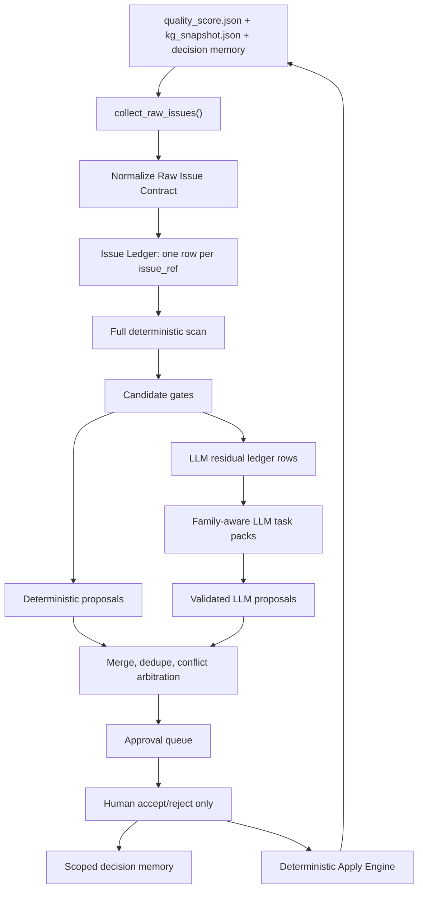

# KG Agent Proposal Funnel Quality V3 Implementation Plan

> **For agentic workers:** REQUIRED SUB-SKILL: Use superpowers:subagent-driven-development (recommended) or superpowers:executing-plans to implement this plan task-by-task. Steps use checkbox (`- [ ]`) syntax for tracking.

**Goal:** Build a medically safe, issue-accounted KG iteration proposal funnel where every raw issue is traceable, deterministic generation is no longer constrained by LLM task-pack limits, rejected actions do not reappear under new proposal IDs, and queued proposals are executable by the Apply Engine.

**Architecture:** Use V2's ledger-first architecture as the backbone: raw issues get stable identities, every stage writes a disposition, deterministic scan runs on the full issue set, and LLM subagents receive only residual issues. Keep the current repo's existing `issue_ledger.py`, `proposal_funnel.py`, and `PROPOSAL_APPLY_HANDLER_REGISTRY` as the implementation anchors instead of creating competing duplicate modules. Add scoped decision memory, triple fingerprints, stricter medical gates, and ledger-derived reports.

**Tech Stack:** Python dataclasses/functions in `lightrag/kb_iteration`, FastAPI Pydantic models in `lightrag/api/routers/kb_iteration_routes.py`, pytest regression suites under `tests/kg` and `tests/api/routes`, optional read-only React/WebUI rendering under `lightrag_webui/src/components/kg-maintenance`.

---

## Critical Merge Decision

The external V2 plan is directionally stronger than the previous plan, but it cannot be applied mechanically.

Accepted from V2:

- Full issue ledger with terminal dispositions for every raw issue.
- Deterministic scan must operate on the full normalized issue list, not on fitted LLM task packs.
- Triple fingerprints: semantic, execution, and evidence.
- Scoped decision memory instead of proposal-ID memory.
- Raw issue contract with evidence spans, qualifiers, repair options, and stable fingerprints.
- Candidate gates before queueing: schema, evidence, safety, Apply capability, decision memory, dedupe, conflict, budget.
- Apply capability must be registry-backed and checked before approval queue.
- LLM task packs are transport only; they are not the source of raw issue accounting.
- Success criteria must be conditional on safe eligible candidates, not an unconditional proposal count.

Modified from V2:

- `lightrag/kb_iteration/proposal_funnel.py` already exists, so this plan extends it instead of creating another file.
- `lightrag/kb_iteration/issue_ledger.py` already owns `collect_raw_issues()` and `scan_deterministic_candidates()`, so this plan upgrades that file first. A new `deterministic_scan.py` is deferred unless a later cleanup task extracts code with compatibility wrappers.
- `lightrag/kb_iteration/apply.py` already has `PROPOSAL_APPLY_HANDLER_REGISTRY`; this plan makes it authoritative instead of replacing it with a second registry.
- Web UI changes are read-only observability in this phase. Tuning controls wait until backend contracts are stable.
- Old decision records are not rewritten. New code reads them best-effort and writes richer fields going forward.

Rejected or deferred:

- Do not let LLM freely mutate the KG.
- Do not queue entity alias merge proposals until deterministic merge validation and Apply support exist.
- Do not implement TCM proposal generators until `medical_schema.py` has canonical TCM predicates.
- Do not classify new human decisions only from free text; add structured reason/scope fields and use text inference only for old records.
- Do not improve proposal count by weakening medical schema or evidence safety gates.

## Current Evidence Baseline

Recent real runs on `work/kb-iteration/influenza_medical_v1` show the failure pattern:

- Initial queue: `81` proposals -> `28` accepted / `53` rejected -> `28` applied / `0` blocked.
- Round 1: `55` proposals -> `8` accepted / `47` rejected -> `8` applied / `0` blocked.
- Round 2: `54` proposals -> `0` accepted / `54` rejected.
- Latest funnel: `727` raw issues, `673` LLM residual issues, only `28` residual issues packed into `8` LLM tasks, `54` proposals generated, all rejected.
- Main recurrence: rejected actions reappeared as suffix-modified proposal IDs.
- Invalid subagent outputs still appeared:
  - evidence object used unsupported structured fields;
  - `candidate_kg_expansion` edges omitted endpoint types.

The bottleneck is therefore not just the model or `max_proposals_per_run`. The funnel is missing stable issue accounting, scoped decision memory, full deterministic coverage, and precise candidate rejection feedback.

## Target Flow



Critical rule: `ProposalTaskPack` is only an LLM transport object. It must never decide which raw issues deterministic generation is allowed to see.

## File Map

Create:

- `lightrag/kb_iteration/proposal_fingerprints.py`
- `tests/kg/test_kb_iteration_proposal_fingerprints.py`
- `tests/kg/test_kb_iteration_proposal_funnel_v3.py`

Modify:

- `lightrag/kb_iteration/quality.py`
- `lightrag/kb_iteration/issue_ledger.py`
- `lightrag/kb_iteration/proposal_orchestrator.py`
- `lightrag/kb_iteration/proposal_funnel.py`
- `lightrag/kb_iteration/proposals.py`
- `lightrag/kb_iteration/apply.py`
- `lightrag/kb_iteration/agent_pipeline.py`
- `lightrag/kb_iteration/agent_outputs.py`
- `lightrag/kb_iteration/subagent_contracts.py`
- `lightrag/kb_iteration/deterministic_proposals/base.py`
- `lightrag/kb_iteration/deterministic_proposals/registry.py`
- `lightrag/kb_iteration/deterministic_proposals/clinical_modeling.py`
- `lightrag/kb_iteration/deterministic_proposals/diagnosis.py`
- `lightrag/kb_iteration/deterministic_proposals/treatment.py`
- `lightrag/kb_iteration/deterministic_proposals/risk_safety.py`
- `lightrag/kb_iteration/deterministic_proposals/prevention.py`
- `lightrag/kb_iteration/deterministic_proposals/entity_cleanup.py`
- `lightrag/api/routers/kb_iteration_routes.py`
- `lightrag_webui/src/api/lightrag.ts`
- `lightrag_webui/src/components/kg-maintenance/LLMReviewPanels.tsx`
- `docs/KBIterationAgent.md`
- `docs/KBIterationAgent-zh.md`

Do not create in this phase:

- `lightrag/kb_iteration/deterministic_scan.py`

Reason: `issue_ledger.py` already contains the deterministic scan entry point. Split only after the contract is stable and tests are green.

## Core Contracts

### Raw Issue Contract

Every issue returned by `collect_raw_issues()` must contain these normalized fields:

```python
RAW_ISSUE_REQUIRED_FIELDS = {
    "issue_ref",
    "issue_fingerprint",
    "issue_source",
    "issue_family",
    "issue_kind",
    "issue_order",
    "edge_id",
    "source",
    "source_type",
    "target",
    "target_type",
    "keywords",
    "qualifiers",
    "candidate_predicates",
    "repair_options",
    "suggested_qualifiers",
    "evidence_spans",
    "auto_fixable",
    "blocked_reason",
}
```

Compatibility fields such as `source_id`, `file_path`, and `evidence_quote` may stay, but generation must read `evidence_spans`.

Stable `issue_ref` format:

```text
<issue_source>:<issue_family>:<issue_kind>:<issue_fingerprint_12>
```

The fingerprint must be based on semantic issue fields, not list position alone.

### Ledger Dispositions

Generation dispositions:

```text
deterministic_covered
llm_residual
blocked_safety
blocked_schema
blocked_evidence
blocked_apply
blocked_decision_memory
conflict_requires_review
deferred_budget
duplicate_issue
stale_issue
unsupported_family
conversion_failed
llm_output_invalid
```

Queue dispositions:

```text
selected
dropped_duplicate
dropped_conflict
dropped_stale
dropped_decision_memory
dropped_limit
conversion_failed
not_applicable
not_reached
```

Required invariant:

```python
raw_issue_count == sum(final_generation_disposition_counts.values())
```

No raw issue may disappear through `return None`, broad `continue`, or swallowed `ValueError`.

### Fingerprints

Create `ProposalFingerprints`:

```python
@dataclass(frozen=True)
class ProposalFingerprints:
    semantic: str
    execution: str
    evidence: str
```

For `replace_relation`, semantic identity includes:

- proposal type;
- action;
- normalized new source;
- normalized new target;
- canonical new predicate;
- canonical qualifiers;
- medical relation schema version.

Execution identity also includes:

- edge id;
- expected source;
- expected target;
- current keywords;
- current-edge precondition fields.

Evidence identity includes sorted exact evidence tuples:

```text
source_id + file_path + evidence_quote
```

Only sort semantically unordered collections. Do not blindly sort all lists.

### Decision Memory

New decision records must store:

```python
{
    "proposal_id": str,
    "decision": str,
    "decision_reason_code": str,
    "semantic_rejection_class": str,
    "rejection_scope": str,
    "schema_version": str,
    "semantic_fingerprint": str,
    "execution_fingerprint": str,
    "evidence_fingerprint": str,
    "action_payload": dict,
}
```

Allowed rejection scopes:

```text
exact_action
semantic_until_schema_change
semantic_until_evidence_change
defer_only
```

Suppression rules:

- accepted/applied exact action suppresses matching execution fingerprint;
- hard semantic rejection suppresses matching semantic fingerprint while schema version is unchanged;
- insufficient-evidence rejection suppresses only when semantic and evidence fingerprints both match;
- defer-only does not permanently suppress.

## Implementation Tasks

### Task 0: RED Tests And Contract Freeze

**Files:**

- Create: `tests/kg/test_kb_iteration_proposal_funnel_v3.py`
- Modify: `tests/kg/test_kb_iteration_issue_ledger.py`
- Modify: `tests/kg/test_kb_iteration_agent_pipeline.py`
- Modify: `tests/kg/test_kb_iteration_apply.py`

- [ ] **Step 1: Add failing issue-accounting tests**

Add tests asserting:

```python
def test_every_raw_issue_has_terminal_generation_disposition(): ...
def test_raw_issue_accounting_matches_disposition_counts(): ...
def test_deterministic_scan_is_not_limited_by_max_subagent_tasks(): ...
def test_llm_residual_has_no_deterministic_covered_issue_refs(): ...
```

Use a synthetic package with at least:

- 4 diagnosis issues;
- 4 treatment issues;
- 4 risk/safety issues;
- 2 entity-cleanup issues;
- `max_subagent_tasks=1`.

Expected before implementation: at least one assertion fails because current ledger does not fully express V3 dispositions and residual selection.

- [ ] **Step 2: Add failing recurrence tests**

Add tests asserting:

```python
def test_hard_rejected_suffix_variant_is_suppressed(): ...
def test_applied_exact_execution_fingerprint_is_suppressed(): ...
def test_evidence_changed_can_reopen_evidence_scoped_rejection(): ...
def test_defer_only_rejection_does_not_block_future_candidate(): ...
```

Expected before implementation: suffix variants are not reliably suppressed by semantic/execution/evidence scope.

- [ ] **Step 3: Add failing candidate loss tests**

Add tests asserting:

```python
def test_candidate_conversion_errors_are_recorded_not_swallowed(): ...
def test_queue_contains_only_apply_supported_proposals(): ...
def test_known_bad_medical_patterns_never_enter_queue(): ...
```

Known bad patterns:

- vaccine or vaccination population modeled as `has_indication`;
- disease to death/hospitalization/severity modeled as `risk_factor_for`;
- chronic underlying disease or population modeled as `has_complication`;
- antibacterial/antibiotic modeled as direct influenza treatment indication;
- `candidate_kg_expansion` edge without endpoint types;
- evidence object instead of evidence string.

- [ ] **Step 4: Run RED suite**

Run:

```powershell
.venv\Scripts\python.exe -m pytest `
  tests/kg/test_kb_iteration_proposal_funnel_v3.py `
  tests/kg/test_kb_iteration_issue_ledger.py `
  tests/kg/test_kb_iteration_agent_pipeline.py `
  tests/kg/test_kb_iteration_apply.py `
  -q
```

Expected: new tests fail for the intended missing V3 contracts.

### Task 1: Normalize Raw Issues And Upgrade The Ledger

**Files:**

- Modify: `lightrag/kb_iteration/quality.py`
- Modify: `lightrag/kb_iteration/issue_ledger.py`
- Modify: `lightrag/kb_iteration/proposal_orchestrator.py`
- Test: `tests/kg/test_kb_iteration_issue_ledger.py`

- [ ] **Step 1: Combine all structured issue sources**

Update `collect_raw_issues()` so it reads and normalizes all available structured sources, including:

```text
medical_schema_issues
entity_cleanup_issues
evidence_issues
generic_relation_issues
hierarchy_issues
```

Do not choose between all structured issues and all fallback findings as one binary branch. Use fallback findings only for missing structured families.

- [ ] **Step 2: Normalize evidence and qualifiers**

In `issue_ledger.py`, normalize every issue into:

```python
{
    "qualifiers": normalized_qualifiers,
    "evidence_spans": [
        {
            "source_id": source_id,
            "file_path": file_path,
            "evidence_quote": evidence_quote,
        }
    ],
}
```

If no evidence exists, keep `evidence_spans=[]` and set a later `blocked_evidence` disposition instead of inventing evidence.

- [ ] **Step 3: Add stable `issue_fingerprint`**

Use fields:

```python
{
    "issue_source": issue_source,
    "issue_family": issue_family,
    "issue_kind": issue_kind,
    "edge_id": edge_id,
    "source": source,
    "source_type": source_type,
    "target": target,
    "target_type": target_type,
    "keywords": keywords,
    "candidate_predicates": sorted_candidate_predicates,
    "qualifiers": qualifiers,
}
```

The array index may appear in `issue_order`, but must not be the sole identity.

- [ ] **Step 4: Extend ledger rows**

Replace the current route-only ledger model with an entry that can record stage events:

```python
@dataclass
class ProposalIssueLedgerEntry:
    issue_ref: str
    issue_fingerprint: str
    issue_family: str
    issue_kind: str
    source_record: dict[str, Any]
    generation_disposition: str = "detected"
    queue_disposition: str = "not_reached"
    candidate_ids: list[str] = field(default_factory=list)
    proposal_ids: list[str] = field(default_factory=list)
    reason_codes: list[str] = field(default_factory=list)
    events: list[dict[str, Any]] = field(default_factory=list)
```

Keep compatibility with existing `IssueRoute` readers by exporting route-like fields into `issue_ledger.json`.

- [ ] **Step 5: Write both artifact names**

Write:

```text
issue_ledger.json
proposal_issue_ledger.json
```

`proposal_issue_ledger.json` may be an alias with the same schema. Keep `issue_ledger.json` for existing Web/API compatibility.

- [ ] **Step 6: Run tests**

Run:

```powershell
.venv\Scripts\python.exe -m pytest tests/kg/test_kb_iteration_issue_ledger.py -q
```

Expected: raw issue collection combines schema and cleanup sources, issue refs are stable under input reordering, and accounting is exact.

### Task 2: Add Triple Fingerprints And Scoped Decision Memory

**Files:**

- Create: `lightrag/kb_iteration/proposal_fingerprints.py`
- Modify: `lightrag/api/routers/kb_iteration_routes.py`
- Modify: `lightrag/kb_iteration/issue_ledger.py`
- Modify: `lightrag/kb_iteration/proposal_orchestrator.py`
- Test: `tests/kg/test_kb_iteration_proposal_fingerprints.py`
- Test: `tests/api/routes/test_kb_iteration_routes.py`

- [ ] **Step 1: Implement fingerprint functions**

Create functions:

```python
def proposal_fingerprints(proposal: Mapping[str, Any]) -> ProposalFingerprints: ...
def candidate_fingerprints(candidate: Mapping[str, Any]) -> ProposalFingerprints: ...
def decision_fingerprints(record: Mapping[str, Any]) -> ProposalFingerprints | None: ...
```

Required behavior:

- proposal ID suffix does not change fingerprints;
- changed current edge keywords changes execution fingerprint but not semantic fingerprint;
- changed qualifier changes semantic fingerprint;
- changed evidence quote changes evidence fingerprint only;
- missing old payload returns `None` instead of blocking unrelated candidates.

- [ ] **Step 2: Extend API decision request**

In `ProposalDecisionRequest`, add:

```python
decision_reason_code: str = Field(default="", max_length=120)
rejection_scope: Literal[
    "exact_action",
    "semantic_until_schema_change",
    "semantic_until_evidence_change",
    "defer_only",
] = "exact_action"
```

The Web can keep sending only accept/reject. Backend defaults must still work.

- [ ] **Step 3: Write rich decision records**

In `_build_proposal_decision_record()`, store:

```python
"schema_version": MEDICAL_RELATION_SCHEMA_VERSION,
"semantic_fingerprint": fingerprints.semantic,
"execution_fingerprint": fingerprints.execution,
"evidence_fingerprint": fingerprints.evidence,
"action_payload": proposal.get("action_payload", {}),
"decision_reason_code": request.decision_reason_code,
"rejection_scope": request.rejection_scope,
```

If `decision == "reject"` and no structured reason code is supplied, infer only a fallback `semantic_rejection_class` from text for backward readability. Do not let free text be the only suppression rule for new records.

- [ ] **Step 4: Replace proposal-ID memory checks**

Update `_rejected_action_fingerprints()` and merge filtering so they use scoped fingerprints:

```text
accepted/applied -> execution
reject exact_action -> execution
reject semantic_until_schema_change -> semantic + schema version
reject semantic_until_evidence_change -> semantic + evidence
defer_only -> no hard suppression
```

- [ ] **Step 5: Run tests**

Run:

```powershell
.venv\Scripts\python.exe -m pytest `
  tests/kg/test_kb_iteration_proposal_fingerprints.py `
  tests/kg/test_kb_iteration_issue_ledger.py `
  tests/kg/test_kb_iteration_proposal_orchestrator.py `
  tests/api/routes/test_kb_iteration_routes.py `
  -q
```

Expected: suffix variants are suppressed by action semantics, old records remain readable, and defer-only does not permanently block.

### Task 3: Make Full Deterministic Scan The Only Candidate Source

**Files:**

- Modify: `lightrag/kb_iteration/issue_ledger.py`
- Modify: `lightrag/kb_iteration/proposal_orchestrator.py`
- Modify: `lightrag/kb_iteration/agent_pipeline.py`
- Test: `tests/kg/test_kb_iteration_proposal_funnel_v3.py`
- Test: `tests/kg/test_kb_iteration_agent_pipeline.py`

- [ ] **Step 1: Explicitly separate scan from task packs**

Keep the public scan entry point:

```python
scan_deterministic_candidates(package_dir, ...)
```

Guarantee internally:

- it calls `collect_raw_issues()` once;
- it scans all normalized issues;
- it does not call `build_proposal_task_packs()` for discovery;
- it records residual issues into the ledger.

- [ ] **Step 2: Build LLM residual packs only from ledger rows**

In `agent_pipeline.py`, select residual input from:

```python
entry.generation_disposition == "llm_residual"
```

Exclude:

```text
deterministic_covered
blocked_safety
blocked_schema
blocked_evidence
blocked_apply
blocked_decision_memory
conflict_requires_review
duplicate_issue
stale_issue
deferred_budget
```

- [ ] **Step 3: Add family-aware residual selection**

Use separate knobs:

```python
max_llm_residual_tasks_per_run: int = 30
max_parallel_subagents: int = 4
max_subagent_issues_per_task: int = 4
max_llm_residual_issues_per_run: int = 120
```

Keep `max_subagent_tasks` as a compatibility alias for one release.

- [ ] **Step 4: Run tests**

Run:

```powershell
.venv\Scripts\python.exe -m pytest `
  tests/kg/test_kb_iteration_proposal_funnel_v3.py `
  tests/kg/test_kb_iteration_agent_pipeline.py `
  -q
```

Expected: a package with many safe issues still generates deterministic candidates when `max_subagent_tasks=1`, and residual packs contain no deterministic-covered issue refs.

### Task 4: Add Candidate Gates And Conflict Arbitration

**Files:**

- Modify: `lightrag/kb_iteration/issue_ledger.py`
- Modify: `lightrag/kb_iteration/proposal_orchestrator.py`
- Modify: `lightrag/kb_iteration/proposals.py`
- Modify: `lightrag/kb_iteration/proposal_funnel.py`
- Test: `tests/kg/test_kb_iteration_proposal_orchestrator.py`
- Test: `tests/kg/test_kb_iteration_proposals.py`

- [ ] **Step 1: Enforce gate order**

Use this exact order before queue selection:

```text
1. payload completeness
2. relation schema/domain/range/qualifier validation
3. evidence grounding
4. profile-independent medical safety validation
5. optional influenza-profile lexical guards
6. static Apply capability
7. decision memory
8. exact candidate dedupe
9. same-edge semantic conflict arbitration
10. family budget selection
11. proposal conversion
```

- [ ] **Step 2: Record structured gate failures**

Every rejection must include:

```python
{
    "candidate_id": str,
    "issue_ref": str,
    "issue_family": str,
    "stage": str,
    "error_code": str,
    "error": str,
}
```

- [ ] **Step 3: Add conflict groups**

Write:

```text
proposal_conflict_groups.json
```

Conflict examples:

- same edge with multiple valid replacement predicates;
- split candidate and replace candidate both claim the same edge;
- multiple candidates differ only by qualifier scope and cannot be ordered deterministically.

Conflict issues route to `conflict_requires_review` or `llm_residual`, never silent drop.

- [ ] **Step 4: Apply family caps after validation and dedupe**

`FAMILY_CAP_REACHED` becomes `deferred_budget`, not generator rejection.

- [ ] **Step 5: Run tests**

Run:

```powershell
.venv\Scripts\python.exe -m pytest `
  tests/kg/test_kb_iteration_proposal_orchestrator.py `
  tests/kg/test_kb_iteration_proposals.py `
  -q
```

Expected: duplicate candidates merge issue refs, conflicts are visible, and budget deferral is not counted as a safety/schema rejection.

### Task 5: Make Apply Capability Registry Authoritative

**Files:**

- Modify: `lightrag/kb_iteration/apply.py`
- Modify: `lightrag/kb_iteration/proposals.py`
- Modify: `lightrag/kb_iteration/issue_ledger.py`
- Test: `tests/kg/test_kb_iteration_apply.py`

- [ ] **Step 1: Extend capability result**

Update:

```python
@dataclass(frozen=True)
class ProposalApplyCapability:
    supported: bool
    action: str
    reason_code: str = ""
    reason: str = ""
```

- [ ] **Step 2: Use only `PROPOSAL_APPLY_HANDLER_REGISTRY`**

Remove or replace any second hard-coded supported-action set in `agent_pipeline.py`, `proposal_orchestrator.py`, or `proposals.py`.

- [ ] **Step 3: Keep dynamic checks at Apply time**

Static queue gate checks support. Actual Apply still checks:

- edge exists;
- expected source/target/keywords match;
- target node exists or can be created safely;
- operation is not stale.

- [ ] **Step 4: Keep entity alias merge blocked**

`entity_alias_merge` remains unsupported until there is an Apply handler, provenance merge policy, rollback behavior, and tests.

- [ ] **Step 5: Run tests**

Run:

```powershell
.venv\Scripts\python.exe -m pytest tests/kg/test_kb_iteration_apply.py -q
```

Expected: registry keys match supported capabilities, unsupported proposals never enter queue, and stale edges still block during Apply.

### Task 6: Tighten High-Yield Medical Generators

**Files:**

- Modify: `lightrag/kb_iteration/deterministic_proposals/clinical_modeling.py`
- Modify: `lightrag/kb_iteration/deterministic_proposals/diagnosis.py`
- Modify: `lightrag/kb_iteration/deterministic_proposals/treatment.py`
- Modify: `lightrag/kb_iteration/deterministic_proposals/risk_safety.py`
- Modify: `lightrag/kb_iteration/deterministic_proposals/prevention.py`
- Modify: `lightrag/kb_iteration/deterministic_proposals/entity_cleanup.py`
- Test: `tests/kg/test_kb_iteration_proposal_orchestrator.py`
- Test: `tests/kg/test_kb_iteration_proposals.py`

- [ ] **Step 1: Shared generator requirements**

Every candidate must carry:

```text
issue_ref
issue_family
source_type
target_type
schema_version
evidence_spans
```

Use `medical_schema.py` normalization and inheritance. Do not maintain competing local type systems inside generator files.

- [ ] **Step 2: Clinical modeling**

Rules:

- symptom/sign -> disease becomes disease -> `has_manifestation` -> symptom/sign;
- do not model category labels or laboratory abnormalities as ordinary manifestations;
- do not infer that a secondary bacterial pathogen causes viral influenza.

- [ ] **Step 3: Diagnosis**

Rules:

- diagnostic criterion direction repair stays deterministic;
- `orders_test` uses schema-supported qualifier `indication`, not unsupported `purpose`;
- `supports_or_refutes` requires canonical polarity;
- missing polarity routes to residual.

- [ ] **Step 4: Treatment**

Rules:

- reject broad `has_indication` when evidence contains avoid/not recommended/caution/no benefit wording;
- reject antibacterial/antibiotic direct indication for influenza unless the target is a grounded bacterial complication;
- `recommended_for` requires purpose and sufficient scope;
- `has_dosing_regimen` requires a real regimen node or grounded candidate expansion.

- [ ] **Step 5: Risk and safety**

Rules:

- never generate both `risk_factor_for` and `increases_risk_of` for one ambiguous issue;
- population -> disease/outcome uses `high_risk_for` when schema supports it;
- chronic disease, pregnancy, death, hospitalization, and severity grades are not generic complications;
- disease -> death/hospitalization/severity must not be `risk_factor_for`.

- [ ] **Step 6: Prevention**

Rules:

- vaccine -> chronic disease is not `has_indication`;
- prevention `recommended_for` must set `purpose=prevention` and carry population/condition/age scope;
- vaccine `targets_disease` cannot point to adverse event or contraindication condition.

- [ ] **Step 7: Entity cleanup**

Rules:

- support `value_node_to_qualifier` for dose, frequency, duration, route, age, population, and time window;
- choose a carrier edge only when exactly one compatible carrier exists;
- valid `DosingRegimen` or `TestResult` nodes are not disposable value nodes;
- alias merge remains visible but blocked.

- [ ] **Step 8: Run tests**

Run:

```powershell
.venv\Scripts\python.exe -m pytest `
  tests/kg/test_kb_iteration_proposal_orchestrator.py `
  tests/kg/test_kb_iteration_proposals.py `
  -q
```

Expected: known unsafe medical patterns are blocked before approval queue.

### Task 7: Eliminate Silent Proposal Conversion Loss

**Files:**

- Modify: `lightrag/kb_iteration/agent_pipeline.py`
- Modify: `lightrag/kb_iteration/proposal_orchestrator.py`
- Modify: `lightrag/kb_iteration/proposal_funnel.py`
- Test: `tests/kg/test_kb_iteration_agent_pipeline.py`
- Test: `tests/kg/test_kb_iteration_proposal_funnel_v3.py`

- [ ] **Step 1: Replace broad `except ValueError: continue`**

Use structured build result:

```python
@dataclass(frozen=True)
class ProposalBuildResult:
    proposals: list[ImprovementProposal]
    rejected: list[dict[str, Any]]
```

- [ ] **Step 2: Reconcile conversion counts**

Enforce:

```python
validated_candidate_count == converted_proposal_count + conversion_rejected_count
```

- [ ] **Step 3: Write conversion failures into ledger and funnel report**

Each failure records:

```text
candidate_id
issue_ref
issue_family
stage=proposal_conversion
error_code
error
```

- [ ] **Step 4: Run tests**

Run:

```powershell
.venv\Scripts\python.exe -m pytest `
  tests/kg/test_kb_iteration_agent_pipeline.py `
  tests/kg/test_kb_iteration_proposal_funnel_v3.py `
  -q
```

Expected: conversion loss is visible and count-balanced.

### Task 8: Tighten Subagent Output And Retry Contracts

**Files:**

- Modify: `lightrag/kb_iteration/agent_outputs.py`
- Modify: `lightrag/kb_iteration/subagent_contracts.py`
- Modify: `lightrag/kb_iteration/prompts/subagents/base_zh.md`
- Modify: `lightrag/kb_iteration/prompts/subagents/schema_repair_zh.md`
- Modify: `lightrag/kb_iteration/prompts/subagents/treatment_zh.md`
- Test: `tests/kg/test_kb_iteration_agent_outputs.py`

- [ ] **Step 1: Reject evidence objects precisely**

If `evidence` contains an object instead of a string, raise:

```text
EVIDENCE_MUST_BE_STRING
```

- [ ] **Step 2: Require endpoint types for candidate expansion**

For every `candidate_kg_expansion.action_payload.candidate_edges[]`, require:

```text
source
target
source_type
target_type
keywords
source_id
file_path
```

Missing endpoint types raise:

```text
CANDIDATE_EDGE_TYPES_REQUIRED
```

- [ ] **Step 3: Enforce exact evidence allowlist**

Allowed evidence must match exact tuples:

```text
source_id + file_path + evidence_quote
```

Do not allow cross-combined evidence or `<SEP>`-joined source/file fields.

- [ ] **Step 4: Make retry instructions structured**

Retries must quote exact error codes and missing fields. Generic retry prose is not enough.

- [ ] **Step 5: Run tests**

Run:

```powershell
.venv\Scripts\python.exe -m pytest tests/kg/test_kb_iteration_agent_outputs.py -q
```

Expected: invalid subagent output produces precise errors and does not discard unrelated valid task outputs.

### Task 9: Build Ledger-Derived Funnel Reports And Read-Only Web Visibility

**Files:**

- Modify: `lightrag/kb_iteration/proposal_funnel.py`
- Modify: `lightrag/kb_iteration/agent_pipeline.py`
- Modify: `lightrag/api/routers/kb_iteration_routes.py`
- Modify: `lightrag_webui/src/api/lightrag.ts`
- Modify: `lightrag_webui/src/components/kg-maintenance/LLMReviewPanels.tsx`
- Test: `tests/kg/test_kb_iteration_proposal_funnel_v3.py`
- Test: `lightrag_webui/src/components/kg-maintenance/LLMReviewPanels.test.tsx`

- [ ] **Step 1: Extend report artifacts**

Write:

```text
proposal_funnel_report.json
proposal_funnel_report.md
proposal_conflict_groups.json
proposal_task_packs.json
proposal_merge_report.md
subagent_outputs/index.json
```

Keep existing artifacts:

```text
issue_ledger.json
deterministic_proposal_report.json
deterministic_proposal_report.md
```

- [ ] **Step 2: Compute report from ledger only**

Report per family:

```text
raw issues
deterministic candidate issues
action candidate count
schema blocked
safety blocked
evidence blocked
Apply blocked
decision-memory blocked
conflicts
deferred by family cap
deterministic proposals
LLM residual eligible
LLM residual selected
valid LLM proposals
conversion failures
merge drops
selected approval proposals
```

- [ ] **Step 3: Add aggregate rates**

Report:

```text
issue_accounting_rate
candidate_validation_rate
candidate_to_proposal_rate
queue_apply_support_rate
hard_rejection_recurrence_count
exact_duplicate_recurrence_count
known_bad_pattern_count
```

- [ ] **Step 4: Web UI renders Chinese labels only**

Frontend labels must be Chinese, even if source artifact keys are English. Show read-only tables for:

- 按家族漏斗统计;
- 阻断原因;
- LLM residual selected/deferred;
- 冲突组;
- 复现的拒绝记忆命中数.

Do not add tuning controls in this phase.

- [ ] **Step 5: Run tests**

Run:

```powershell
.venv\Scripts\python.exe -m pytest tests/kg/test_kb_iteration_proposal_funnel_v3.py -q
cd lightrag_webui
bun test src/components/kg-maintenance/LLMReviewPanels.test.tsx
```

Expected: report is ledger-derived, Web UI handles keyed family objects and array compatibility.

### Task 10: Real Validation Sequence

**Files:**

- No source edits during measured runs.
- Artifacts under `work/kb-iteration/influenza_medical_v1/`.

- [ ] **Step 1: Run backend focused suite**

Run:

```powershell
.venv\Scripts\python.exe -m pytest `
  tests/kg/test_kb_iteration_proposal_fingerprints.py `
  tests/kg/test_kb_iteration_issue_ledger.py `
  tests/kg/test_kb_iteration_proposal_funnel_v3.py `
  tests/kg/test_kb_iteration_proposal_orchestrator.py `
  tests/kg/test_kb_iteration_proposals.py `
  tests/kg/test_kb_iteration_apply.py `
  tests/kg/test_kb_iteration_agent_outputs.py `
  tests/kg/test_kb_iteration_agent_pipeline.py `
  tests/api/routes/test_kb_iteration_routes.py `
  -q
```

Expected: all selected tests pass.

- [ ] **Step 2: Run Ruff**

Run:

```powershell
.venv\Scripts\python.exe -m ruff check `
  lightrag/kb_iteration `
  lightrag/api/routers/kb_iteration_routes.py `
  tests/kg/test_kb_iteration_proposal_fingerprints.py `
  tests/kg/test_kb_iteration_issue_ledger.py `
  tests/kg/test_kb_iteration_proposal_funnel_v3.py `
  tests/kg/test_kb_iteration_proposal_orchestrator.py `
  tests/kg/test_kb_iteration_proposals.py `
  tests/kg/test_kb_iteration_apply.py `
  tests/kg/test_kb_iteration_agent_outputs.py `
  tests/kg/test_kb_iteration_agent_pipeline.py `
  tests/api/routes/test_kb_iteration_routes.py
```

Expected: `All checks passed`.

- [ ] **Step 3: Deterministic-only dry run**

Run full deterministic scan with LLM disabled and no Apply.

Pass conditions:

```text
issue accounting rate = 100%
silent drops = 0
schema-invalid queued proposals = 0
Apply-unsupported queued proposals = 0
known unsafe medical patterns = 0
```

- [ ] **Step 4: Flash + 200 validation run**

Use current Agent LLM config:

```text
max_proposals_per_run = 200
max_parallel_subagents = 4
max_llm_residual_tasks_per_run = 30
max_subagent_issues_per_task = 4
max_llm_residual_issues_per_run = 120
```

Do not auto-apply.

Record:

```text
raw issues by family
deterministic-covered issues
blocked issues by reason
LLM residual eligible/selected/deferred
candidate count
validated candidate count
conversion failures
deterministic proposals
valid LLM proposals
conflicts
merge drops
selected proposals
invalid subagent outputs
known-bad recurrence count
```

- [ ] **Step 5: Replay/idempotency verification**

After human decisions are recorded, rerun without changing the KG.

Pass conditions:

```text
accepted/applied execution fingerprints do not requeue
hard semantic rejections do not reappear with suffix IDs
defer-only decisions may reappear only by residual policy
evidence-scoped rejections reappear only when evidence fingerprint changes
```

## Success Criteria

Hard gates:

- issue accounting rate: `100%`;
- silent issue drops: `0`;
- silent candidate-to-proposal failures: `0`;
- schema-invalid queued proposals: `0`;
- Apply-unsupported queued proposals: `0`;
- exact accepted/applied duplicates in queue: `0`;
- hard-rejected semantic duplicates in queue: `0` while scope remains active;
- known unsafe medical relation patterns in queue: `0`;
- deterministic-covered issues in LLM residual packs: `0`;
- invalid subagent outputs without structured error code: `0`.

Yield gates:

```text
candidate_validation_rate >= 0.90
candidate_to_proposal_rate >= 0.95
```

Conditional queue target:

```text
When at least 50 safe, non-conflicting, Apply-supported candidates exist,
at least 50 proposals should reach approval, subject to max_proposals_per_run.
```

Do not require 50 proposals when the ledger proves remaining issues are intentionally blocked, stale, unsupported, unsafe, duplicate, conflict-only, or evidence-insufficient.

## Subagent-Driven Ownership

Recommended execution order:

1. Core ledger agent: Tasks 0, 1, and 3.
2. Fingerprint/memory agent: Task 2.
3. Apply capability agent: Task 5.
4. Candidate gate agent: Tasks 4 and 7.
5. Generator agents: Task 6, one medical family file per agent.
6. Subagent-contract agent: Task 8.
7. Reporting/Web agent: Task 9 after backend field names freeze.
8. Validation agent: Task 10.

File ownership constraints:

- Only one active agent may edit `lightrag/kb_iteration/agent_pipeline.py`.
- Only one active agent may edit `lightrag/kb_iteration/proposal_orchestrator.py`.
- Generator files may be edited in parallel if each subagent owns a distinct file.
- API/Web work starts only after backend artifact field names are stable.
- Run focused tests after each shared-file merge.

## Rollback And Compatibility

- Keep old `accepted_changes.md`, `rejected_changes.md`, and `deferred_changes.md` readable.
- Do not rewrite historical decisions in place.
- Write new fields alongside old fields.
- Keep `issue_ledger.json` as a compatibility artifact even if `proposal_issue_ledger.json` is added.
- If ledger accounting cannot complete, fail the propose stage before changing `approval_queue.md`.
- If Web UI cannot parse a new report, it must show a read-only error state and keep old artifacts visible.

## Definition Of Done

An operator can pick any `issue_ref` and answer from artifacts, without reading logs or source:

1. Which detector produced the issue?
2. Which medical family and issue kind were assigned?
3. Which evidence spans were available?
4. Did a deterministic generator support it?
5. Which candidates were produced?
6. Which schema, evidence, safety, Apply, memory, conflict, or budget gate affected it?
7. Was it sent to an LLM subagent?
8. Did a valid proposal result?
9. Did it enter approval, and if not, why?
10. Has an equivalent action already been accepted, applied, rejected, or deferred?
11. Can the current Apply Engine execute it safely?

