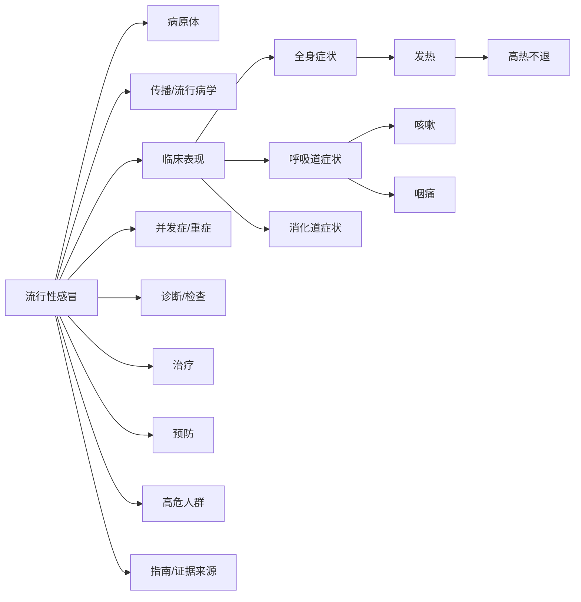

# Medical KG Graph Design

## Goal

Make the WebUI medical knowledge graph readable as a layered medical knowledge base while preserving a generic framework for future diseases and future imported documents. The first complete acceptance scenario is influenza (`流行性感冒`), built from a clean workspace and strict source-grounded facts.

## Scope

This design covers:

- Medical KG taxonomy and hierarchy rules.
- LLM/code boundary for organizing source-supported facts.
- A disease-centered medical browsing projection for graph display.
- WebUI hierarchy/collapse behavior for medical graphs.
- Relation-aware rows in the right-side properties panel.
- Rebuild behavior for a new clean workspace.
- Tests and quality gates.

This design does not cover:

- Adding unsupported medical knowledge from common sense or external guidelines that were not imported.
- Replacing the raw factual KG with a single tree.
- Making evidence snippets a first-class UI feature in the first version.
- Migrating old unused workspaces. The user confirmed old workspace data can be deleted and a new workspace should be used.

## Confirmed Standards

- Preserve the generic medical KG framework, but make influenza polished enough to prove the full pattern.
- Use strict source-grounded facts. The system may organize facts, but it must not invent leaf medical facts.
- LLM may propose category/navigation nodes from the source-supported facts. The UI should not visibly mark these nodes as generated.
- Keep internal provenance/evidence metadata where feasible, including source order, chunk/reference, and whether an edge was factual or organizational.
- Persist stable category/navigation nodes into the KG, then add a WebUI medical browsing projection on top.
- Default disease graph depth is medium-expanded: disease center, first-level categories, and second-level subgroups are visible; leaf facts are collapsed until expansion.
- Collapsed groups show counts and representative examples, for example `呼吸道症状 (6): 咳嗽、咽痛、流涕 +3`.
- Main graph canvas remains visually undirected. Relation direction appears in details, tooltips, and data records.
- The right-side panel replaces generic `邻接` rows with relation-aware text such as `临床表现：高热不退`; details show the full triple, for example `流行性感冒 - 临床表现 -> 高热不退`.
- Future documents may add structures, but new categories must normalize through a controlled extension category table.
- Representative examples prefer source/document order, with frequency, edge weight, and importance as tie-breakers.
- Old workspaces do not need migration. The implementation should document or provide a clean-start workflow.

## Architecture

Use three distinct layers:

1. Raw factual KG
   - Stores source-supported entities and relationships extracted from documents.
   - Keeps factual disease-to-symptom, disease-to-test, disease-to-treatment, pathogen, population, prevention, and guideline relationships.
   - Preserves relation keywords and direction.

2. Medical navigation layer
   - Adds stable category and subgroup nodes such as `临床表现`, `全身症状`, `呼吸道症状`, `诊断/检查`, and `治疗`.
   - Category nodes organize source-supported leaf facts but are not themselves presented as generated artifacts in the UI.
   - Code normalizes category names and rejects uncontrolled variants.

3. WebUI browsing projection
   - Produces a graph optimized for human browsing.
   - Keeps the raw KG available, but the default medical view shows a cleaner disease-centered hierarchy.
   - Collapses leaf facts behind category/subgroup nodes until the user expands them.

This keeps retrieval and data integrity separate from visualization choices.

## Taxonomy

The first-level category table for the influenza acceptance scenario is:

| Key | Display label | Purpose |
| --- | --- | --- |
| `pathogen` | `病原体` | Viruses, strains, causative organisms, pathogen hierarchy |
| `transmission_epidemiology` | `传播/流行病学` | Transmission routes, seasonality, outbreak/population spread facts |
| `clinical_manifestation` | `临床表现` | Symptoms, signs, symptom clusters, severity expressions |
| `complication_severity` | `并发症/重症` | Complications, severe disease, warning signs |
| `diagnosis_testing` | `诊断/检查` | Diagnostic criteria, tests, lab/pathogen detection, clinical judgment |
| `treatment` | `治疗` | Antiviral treatment, symptomatic treatment, timing, recommendation nodes |
| `prevention` | `预防` | Vaccination, isolation, hygiene, prophylaxis, public-health measures |
| `high_risk_population` | `高危人群` | Age groups, pregnancy, chronic disease, immune status, special populations |
| `guideline_evidence` | `指南/证据来源` | Guidelines, source documents, recommendation sources |

Controlled extension categories:

| Key | Display label | Example aliases |
| --- | --- | --- |
| `differential_diagnosis` | `鉴别诊断` | `鉴别`, `相似疾病` |
| `nursing_care` | `护理` | `照护`, `居家护理` |
| `follow_up` | `随访` | `复诊`, `随访观察` |
| `rehabilitation` | `康复` | `恢复期管理` |
| `contraindication` | `禁忌证` | `用药禁忌`, `不宜使用` |
| `adverse_reaction` | `不良反应` | `副作用`, `药物不良反应` |
| `public_health` | `公共卫生处置` | `报告`, `隔离管理`, `学校防控` |

Unknown top-level category names from LLM output must either map to the controlled table or fall back to `other_medical` with review-friendly metadata.

## Influenza Browsing Skeleton

The polished influenza view should support this shape when the imported source facts exist:

If a leaf such as `高热不退` is only a qualifier in the source rather than a reusable concept, the implementation may keep it as a description on `发热` instead of forcing it to be a node. The quality gate is that the UI displays the source-supported information in the most readable form.

## LLM and Code Boundary

LLM responsibilities:

- Extract source-supported entities and relationships.
- Propose medical category/subgroup organization when source facts support the grouped content.
- Preserve relation semantics and direction in the extracted relationship data.
- Avoid adding medical leaf facts not present in the source.

Code responsibilities:

- Normalize disease aliases, category names, relation keywords, and entity types.
- Enforce the first-level and controlled extension category tables.
- Merge synonyms and remove value-like nodes, dose/time-only nodes, and low-information fragments.
- Add deterministic hierarchy edges for known stable patterns.
- Preserve provenance fields and source order when available.
- Provide deterministic fallback grouping when LLM output is incomplete.

## Graph Projection API

The existing `medical_view=true` contract should remain non-destructive. Add a separate browsing projection mode or metadata payload for medical browsing. The recommended API shape is:

- Raw graph: existing nodes and edges remain available.
- Medical metadata: `metadata.medical_groups` remains available for side-panel grouping.
- Browsing metadata: add `metadata.medical_browse` with category hierarchy, collapsed groups, representative examples, and edge display information.
- Optional query flag: `medical_browse=true` can request a display-oriented projection without changing raw graph storage.

The projection should:

- Build disease-to-category and category-to-subgroup display paths.
- Collapse leaf nodes by default when a category/subgroup has enough children.
- Include counts, representative labels, child ids, and expansion ids.
- Carry edge direction and original relationship keyword for details.
- Avoid mutating the input graph object.

## WebUI Graph Design

Default medical graph view:

- Center the selected disease or main query node.
- Place first-level categories in a stable ring or layered layout around the disease.
- Place second-level subgroups outside their category.
- Render collapsed leaf groups as compact group nodes with counts and examples.
- Expand a collapsed group on click and preserve the user's mental map.
- Keep existing raw/generic layouts available for non-medical or debugging use.

Visual rules:

- Categories and subgroups should read as navigation structure, not as decorative cards.
- Leaf collapse should reduce hub clutter without hiding the existence of facts.
- Node sizing should not be driven only by degree in medical browse mode; category and disease roles should have stable sizes.
- Existing color/entity-type conventions may remain, but medical category roles should be distinguishable.

## Properties Panel

For selected nodes, the relationship section should use relation-aware rows:

- Main row: `<关系显示名>：<邻接节点名>`.
- Example: `临床表现：高热不退`.
- Detail/tooltip: `<源节点> - <关系显示名> -> <目标节点>`.
- If the selected node is the target, show direction clearly, for example `流感病毒 - 病原导致 -> 流行性感冒`.
- If relation metadata is missing, use a fallback such as `相关：<邻接节点名>` rather than `邻接`.

The panel should continue to group rows by medical categories, but the row label must reflect the actual relationship or normalized relation display name.

## Clean Workspace and Rebuild

Because the user confirmed old workspaces are unused:

- Do not implement compatibility migration for old medical KG workspace data.
- Provide a clear clean-start path for a new workspace.
- Document which data directories can be removed and how to rebuild from imported documents.
- If a helper is added, it should be explicit and conservative: require a workspace name or working directory, show what will be deleted, and never delete outside the configured LightRAG workspace.

## Tests and Quality Gates

Backend tests should cover:

- Category normalization and controlled extension categories.
- Influenza hierarchy paths, including first-level categories and second-level symptom groups.
- Non-mutation of raw graph projection input.
- Collapsed group metadata: counts, representative examples, source-order-first sorting.
- Relation direction and display labels in browse metadata.
- Value-like node filtering and alias merging still work.

WebUI tests should cover:

- Medical relation rows no longer display generic `邻接` when relation metadata exists.
- Full triple direction is available in tooltip/detail data.
- Collapsed group labels include count and examples.
- Medical browse graph uses stable category/subgroup node roles.
- Existing generic graph behavior remains available.

Manual/browser verification should cover:

- Influenza graph opens in medium-expanded mode.
- The graph is visibly layered, not a flat radial hub.
- Collapsed groups expand without losing context.
- The right properties panel shows relation semantics in the red-box area from the user's screenshot.

## Risks

- Over-organizing facts can make generated category nodes look like clinical claims. Mitigation: keep provenance metadata and separate factual vs organizational edge roles internally.
- Strict source-grounding may leave some expected influenza categories sparse if the imported documents do not contain those facts. Mitigation: show empty or absent categories honestly rather than filling with unsupported medical knowledge.
- Parallel implementation can conflict in shared WebUI graph files. Mitigation: split worker ownership by backend taxonomy/projection, WebUI properties panel, WebUI browse layout, and docs/rebuild flow.

