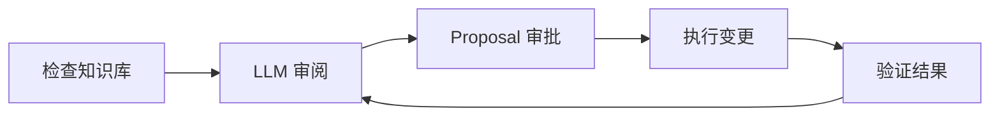
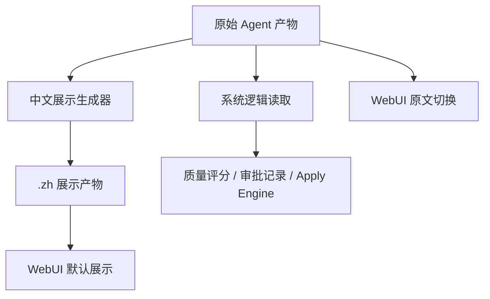

# 知识库迭代 Agent 工作台重设计方案

日期：2026-06-20

## 背景

当前知识库迭代前端把质量分、原始 Markdown、JSON、LLM 审阅材料、Proposal 审批记录、执行结果等信息放在同一套导航和面板里。对使用者来说，它更像“产物文件浏览器”，而不是“知识库迭代 Agent 工作台”。用户需要自己判断当前处于哪一步、下一步应该做什么、哪些文件只是证据材料、哪些动作会真实修改 KG。

本次重设计目标是把页面改成一个中文流程工作台：使用者按 Agent 流程推进，原始文件仍然可追溯，但不再主导界面。

## 设计目标

1. Web 界面默认中文呈现，包括页面标题、字段标签、状态、按钮、步骤名称、文件显示名、报告正文和 LLM 长文本。
2. 原始文件名保留为小字或标签，方便技术追踪。
3. 主界面按 Agent 迭代流程组织，而不是按文件组织。
4. 每一步默认显示中文摘要和可操作状态，原始文件内容折叠展示。
5. 任何真实修改 KG 的动作仍然必须经过人工接受 Proposal，并由后端确定性 Apply Engine 执行。
6. 桌面优先，只保证浅色模式体验。

## 非目标

1. 不重命名现有原始文件。
2. 不让 `.zh` 文件参与质量评分、审批判断、Proposal 解析或 Apply Engine。
3. 不在本次设计中恢复图谱可视化；图谱快照以表格方式查看。
4. 不以移动端为主要验收目标。
5. 不把顶部全局按钮做成高级操作区；业务动作必须回到流程步骤内。

## 核心信息架构

左侧导航只保留 5 个 Agent 流程步骤：

1. 检查知识库
2. LLM 审阅
3. Proposal 审批
4. 执行变更
5. 验证结果

顶部全局区只保留：

- workspace 选择
- 刷新
- 全部产物入口

每个步骤页顶部都有一个“当前状态 + 唯一推荐动作”区域。推荐动作由系统自动判断，不要求用户在多个主操作之间猜测。



## 下一步动作判断规则

推荐动作按以下优先级计算：

1. 没有最新检查结果：推荐“检查知识库”。
2. 有质量问题但还没有 LLM 审阅结果：推荐“运行 LLM 审阅”。
3. 有待审批 Proposal：推荐“审批 Proposal”。
4. 有已接受但未执行 Proposal：推荐“执行已接受变更”。
5. 刚执行过变更：推荐“验证结果”。
6. 质量已达标且没有待处理 Proposal：推荐“开始下一轮迭代”。

流程条上显示每一步的状态徽标，例如：

- 检查知识库：质量分 97
- LLM 审阅：6 阶段完成
- Proposal 审批：1 待审
- 执行变更：2 已接受未执行
- 验证结果：缺失分支 0

## 中文展示产物规则

原始文件继续作为系统逻辑来源，文件名不变。WebUI 展示时优先读取对应 `.zh` 文件。

示例：

- `kb_context.md` -> `kb_context.zh.md`
- `quality_report.md` -> `quality_report.zh.md`
- `snapshots/quality_score.json` -> `snapshots/quality_score.zh.json`
- `approval_queue.md` -> `approval_queue.zh.md`
- `llm_review_trace.json` -> `llm_review_trace.zh.json`

`.zh` 文件只用于 Web 展示。后端审批、质量评分、Proposal 解析、执行变更、日志判断全部继续读取原始文件。

如果 `.zh` 文件缺失，前端请求展示时后端先生成 `.zh` 文件，再返回中文展示内容。如果生成失败，前端显示清晰错误提示，并回退到原始文件内容。

### 需要中文展示版的产物范围

所有 WebUI 当前可见的知识库迭代 Agent 产物都需要支持 `.zh` 版本，包括：

- `kb_context.md`
- `quality_report.md`
- `snapshots/kg_snapshot.json`
- `snapshots/quality_score.json`
- `approval_queue.md`
- `improvement_backlog.md`
- `accepted_changes.md`
- `rejected_changes.md`
- `deferred_changes.md`
- `accepted_changes_apply_result.md`
- `accepted_changes_execution.md`
- `iteration_log.md`
- `entity_catalog.md`
- `relation_catalog.md`
- `kg_structure.md`
- `snapshots/entity_stats.json`
- `snapshots/relation_stats.json`
- `snapshots/hierarchy_paths.json`
- `snapshots/source_coverage.json`
- `snapshots/diff_summary.json`
- `diff_report.md`
- `quality_rules.md`
- `known_issues.md`
- `llm_review_trace.json`
- `llm_review_report.md`
- `llm_judge_report.md`
- `llm_issue_analysis.md`
- `llm_missing_branch_inference.md`
- `llm_evidence_map.md`
- `llm_repair_plan.md`
- `proposals.generated.yaml`

### JSON 中文展示格式

`.zh.json` 保留原字段，并增加 `_zh_labels`。自然语言值由 Agent 专用 LLM 翻译成中文，机器标识保持原样。

```json
{
  "overall": 97,
  "findings": [],
  "_zh_labels": {
    "overall": "总分",
    "findings": "发现的问题"
  }
}
```

不得翻译的机器标识包括：

- `proposal_id`
- `source_id`
- `doc_id`
- `file_path`
- `workspace`
- `run_id`
- JSON 原字段名
- 枚举值
- 节点 ID
- 关系 ID
- 证据 ID
- 模型名
- API 字段名

UI 可以把字段标签显示成中文。例如 `source_id` 的标签显示为“证据来源 ID”，但值保持原样。

### Markdown 中文展示格式

`.zh.md` 是原 Markdown 的中文展示版。标题、说明、LLM reason、judge reason、质量报告段落、修复方案说明等自然语言内容都应翻译成中文。

以下内容保持原样：

- Proposal ID
- source_id
- file_path
- 文档 ID
- 节点 ID
- 关系 ID
- 代码块内机器可读 JSON/YAML 的 key
- 命令、路径、模型名

## 步骤页设计

### 1. 检查知识库

用途：让用户知道当前 KG 的结构和质量基础状态。

默认展示：

- 当前 workspace
- 最近检查时间
- 总分
- 节点数 / 关系数 / 证据来源数
- 关键质量指标卡
- 当前最重要问题摘要

结构化质量数据使用中文指标卡和关键指标表，不直接堆 JSON。

`kg_snapshot.json` 不画图，改成表格工作区：

- 节点 Tab
- 关系 Tab
- 证据问题 Tab

表格要求：

- 固定高度虚拟滚动
- 关键词搜索
- 类型筛选
- 点击行后打开详情滑出面板

证据问题 Tab 聚合缺失 `source_id`、缺失 `file_path`、证据状态异常等维护问题。

### 2. LLM 审阅

用途：展示 Agent 如何理解质量问题并生成候选 Proposal。

默认按阶段折叠显示：

1. 问题解释
2. 缺失推断
3. 证据定位
4. Proposal 生成
5. 修复排序
6. Judge

每个阶段面板底部显示关联文件：

- 中文显示名
- 原始文件名
- `.zh` 文件名
- 中文展示生成状态
- 生成时间
- 生成模型

LLM 审阅页要明确提示：LLM 只生成分析、证据定位、候选 Proposal 和排序建议，不直接修改 KG。

### 3. Proposal 审批

用途：让用户用最少动作完成接受或拒绝。

默认使用行列表，不使用全部展开卡片。

每行只显示：

- 状态
- 标题或 Proposal ID
- 风险
- 接受
- 拒绝
- 展开

点击接受或拒绝后，该 Proposal 仍留在原列表，状态立即变为“已接受”或“已拒绝”，避免用户误以为按钮无效。

展开详情后显示：

- 建议变更
- 原因
- 证据列表
- Judge 结果
- 版本历史
- 原始文件入口

证据列表显示 source_id / file_path 摘要。点击证据后打开详情抽屉。

拒绝后不要求用户填写拒绝理由。系统只记录“用户拒绝”，然后允许用户点击“让 Agent 修改”。Agent 根据原 Proposal、质量报告、证据、已拒绝记忆和上下文自动生成新版本。

新 Proposal 作为同一 Proposal 的新版本展示：

```text
v1 已拒绝 -> v2 待审批 -> v3 已接受
```

列表默认显示最新版本，旧版本进入展开详情的版本历史。

### 4. 执行变更

用途：把已接受 Proposal 交给确定性 Apply Engine 执行。

页面只显示一个主按钮和执行结果摘要。

当存在已接受未执行 Proposal 时，主按钮为“执行已接受变更”。

执行后显示：

- 成功应用数量
- 被阻塞数量
- 已跳过数量
- already_present 数量
- 质量指标变化
- 执行结果文件入口

原始执行日志和 Markdown 放在本步骤底部关联文件折叠区。

### 5. 验证结果

用途：回答“这轮是否真的变好”。

默认展示前后对比：

- 总分变化，例如 `88 -> 97`
- 缺失分支变化，例如 `4 -> 0`
- 证据问题变化
- 待审批数量变化
- 已接受未执行数量变化
- 执行结果摘要

如果没有新增写入，但当前质量已达标，明确提示：

“没有新增写入，但当前质量已达标。”

## 文件折叠区

每个步骤底部都有“关联文件”折叠区。默认收起。

每个文件项显示：

- 中文文件名
- 原始文件名
- `.zh` 文件名
- 中文展示状态
- 生成时间
- 生成模型
- 来源原文件

文件项内提供：

- 中文展示 / 原始文件 切换
- 重新生成中文展示
- 复制内容

如果中文展示生成失败：

- 显示失败状态和错误摘要
- 回退展示原文件
- 保留“重新生成中文展示”按钮

## 全部产物入口

右上角提供“全部产物”入口，以抽屉或弹层打开。

全部产物按 5 步 Agent 流程分组：

1. 检查知识库
2. LLM 审阅
3. Proposal 审批
4. 执行变更
5. 验证结果

该入口用于排查，不参与日常主流程。

## 状态与错误处理

页面不使用笼统红色错误条作为主要反馈。错误和加载状态应贴合当前流程步骤。

常见状态：

- 正在生成中文展示文件
- 中文展示生成失败，已回退原文件
- LLM 审阅失败，可重试
- 后端没有返回质量分
- 没有待审批 Proposal
- 没有已接受未执行变更
- Apply Engine 没有新增写入，但当前质量已达标

每个状态都要给出明确下一步动作。

## 桌面布局

本次只支持桌面体验。

布局建议：

- 顶部：workspace、刷新、全部产物
- 左侧：5 步流程导航
- 主区域：步骤页内容
- 无常驻右侧信息栏

表格、抽屉和审批列表按桌面宽度设计。窄屏只需要不崩溃，不作为主要验收目标。

## 浅色模式

本次只保证浅色模式。界面应沿用现有 LightRAG WebUI 组件、Tailwind token 和按钮风格，避免引入新的视觉系统。

设计风格：

- 密集但清楚
- 少用大卡片
- 不嵌套卡片
- 不使用装饰性渐变和大面积插画
- 用状态、图标和文字辅助理解流程

## 数据流边界



关键约束：

- 质量评分只读原始质量产物。
- Proposal 解析只读原始 `approval_queue.md` 或结构化 Proposal 数据。
- 审批记录写入原始 `accepted_changes.md`、`rejected_changes.md` 或相关决策文件。
- Apply Engine 只读原始接受记录和原始 Proposal 定义。
- `.zh` 文件永远不作为系统判断依据。

## 验收标准

1. 用户进入 KG 维护页后，能立刻看到当前步骤和唯一推荐动作。
2. 左侧导航只显示 5 个 Agent 流程步骤。
3. 顶部只保留 workspace 选择、刷新、全部产物入口。
4. 所有主界面标题、状态、按钮、字段标签和文件显示名为中文。
5. WebUI 可见 Agent 产物支持 `.zh` 展示版本。
6. `.zh` 缺失时可以自动生成；失败时回退原文件。
7. Proposal 审批默认是行列表，接受或拒绝后状态立即显示。
8. 拒绝后可以让 Agent 基于拒绝结果生成新版本 Proposal。
9. 快照页不画图，而是节点、关系、证据问题 3 个可搜索表格。
10. 执行页只有主按钮和执行摘要。
11. 验证页显示本轮前后质量变化。
12. 原始文件和 `.zh` 文件都能在每步底部关联文件区追踪。

## 后续实施切分建议

1. 建立 `.zh` artifact 注册、生成、读取和回退机制。
2. 重构前端信息架构为 5 步流程工作台。
3. 实现下一步动作解析器和流程条徽标。
4. 重做 Proposal 审批列表和版本历史。
5. 重做快照表格、虚拟滚动和详情抽屉。
6. 重做执行页和验证页。
7. 补充测试和浏览器验收。
