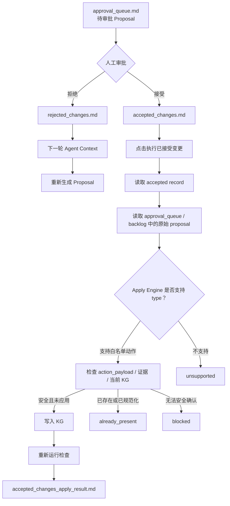

# 第二节：读懂 Proposal 和审批队列

上一节讲了知识库迭代 Agent 的总流程。这一节只讲一个核心问题：

**`approval_queue.md` 里每条 Proposal 到底是什么意思？你点“接受 / 拒绝”后，系统到底做了什么？**

## 1. 先给结论

Proposal 是 Agent 提出的“建议改动单”。

`approval_queue.md` 是待审批队列。

`accepted_changes.md` 是你点“接受”后的记录。

`rejected_changes.md` 是你点“拒绝”后的记录。

但要记住：

```text
接受 Proposal != 已经修改 KG
```

真正修改 KG 要再点：

```text
执行已接受变更
```

然后后端 `Apply Engine` 才会读取已接受记录，判断哪些能安全执行。

## 2. 一条 Proposal 长什么样

`approval_queue.md` 本质是：

```text
一个 Markdown 标题 + 一段 YAML 数据
```

示例：

```yaml
# Approval Queue

proposals:
- id: prop-add-branch-high_risk
  type: add_hierarchy_branch
  target: hierarchy:high_risk
  proposed_change: Add missing hierarchy branch high_risk.
  reason: quality_score shows hierarchy_missing_branch_count is greater than 0.
  evidence:
  - metric: hierarchy_missing_branch_count
  - metric: hierarchy_required_branch_count
  confidence: 0.86
  risk: medium
  requires_approval: true
  expected_metric_change:
    hierarchy_missing_branch_count: -1
  judge:
    decision: needs_human
    reason: Mutation proposal requires maintainer approval.
```

Web 审批面板会从这里解析 Proposal，并显示：

- Proposal ID
- 类型
- 目标
- 建议变更
- 原因
- 证据
- 风险
- 置信度
- 预期指标变化
- LLM judge 结果

## 3. 字段逐个解释

| 字段 | 直白解释 | 为什么重要 |
|---|---|---|
| `id` | Proposal 的唯一编号 | 接受、拒绝、执行时都靠它关联 |
| `type` | Proposal 类型 | 决定它是不是 mutation，能不能执行 |
| `target` | 要改哪里 | 例如某个层级分支、规则、prompt、KG 事实 |
| `proposed_change` | 建议怎么改 | 给人看的改动描述，也是 Apply Engine 判断分支 key 的来源之一 |
| `reason` | 为什么要改 | 说明质量问题或结构缺口 |
| `evidence` | 证据引用 | 必须能追到 snapshot、quality、source_id、file_path、entity、relation 或 metric |
| `confidence` | LLM 对这条建议的置信度 | 必须是 0 到 1 之间的数字 |
| `risk` | 风险等级 | 只能是 `low`、`medium`、`high` |
| `requires_approval` | 是否需要人工审批 | 会修改知识库行为的 proposal 必须是 `true` |
| `expected_metric_change` | 预期指标变化 | 用来判断这条 proposal 想改善什么 |
| `patch_candidate` | 候选 patch 文件 | 当前 KG 维护流程里通常只是供检查，不会自动应用 |
| `judge` | LLM judge 结果 | 给审批者参考，不是最终决定 |

## 4. 什么 Proposal 必须人工审批

源码里把这些类型视为 mutation proposal：

```text
prompt_edit
ontology_rule_change
hierarchy_rule_change
add_hierarchy_branch
relation_rule_change
workspace_rebuild
kg_fact_correction
web_display_change
source_evidence_repair
synonym_merge_rule
relation_keyword_mapping
```

这些都必须：

```yaml
requires_approval: true
```

原因很简单：它们可能改变 KG、规则、prompt、workspace 或 WebUI 行为，不能让 LLM 自动绕过人工门禁。

## 5. 当前哪些 Proposal 能真实执行

这是最容易误解的地方。

`approval_queue.md` 里可以有很多类型的 Proposal，但当前真实写 KG 的 Apply Engine 只执行后端白名单里的安全子集。当前重点支持：

```text
add_hierarchy_branch
medical_relation_schema_migration
value_node_to_qualifier
candidate_kg_expansion
```

也就是说：

- `add_hierarchy_branch`：新增允许的层级分支。
- `medical_relation_schema_migration`：在 `action_payload` 完整、原边匹配、关系 schema 合法时，替换、拆分或退役医学关系。
- `value_node_to_qualifier`：把孤立的剂量、频次、疗程、年龄、给药途径等值节点安全迁移成关系限定词。
- `candidate_kg_expansion`：在证据完全落地时新增候选节点/边，必要时退役被替换的错误旧边。
- 其他类型：可以审批、记录或进入 backlog，但真实执行时会被标记为 `unsupported`，除非后端后来新增了对应执行器。

即使是白名单类型，也不代表一定会写图。它还必须通过确定性校验，例如原始边还存在、`current_keywords` 没漂移、证据三元组可追溯、候选节点/边没有越界。

执行结果会写到：

```text
accepted_changes_apply_result.md
accepted_changes_apply_result.json
```

里面可能出现几种状态：

| 状态 | 意思 |
|---|---|
| `applied` | 已真实写入 KG |
| `already_present` | KG 里已经有了，不重复写 |
| `blocked` | 被阻塞，例如找不到 proposal 定义、action_payload 不完整、原始边已变化、证据不落地、graph storage 不可用 |
| `unsupported` | Proposal 类型当前 Apply Engine 不支持 |

## 6. 点“接受”后发生什么

你在 Web 上点“接受”后，前端会调用：

```text
POST /kb-iteration/{workspace}/proposals/{proposal_id}/accept
```

后端会做这些事：

1. 根据 `proposal_id` 找到原始 Proposal。
2. 检查这条 Proposal 是否已经有决策。
3. 如果没有，就写入 `accepted_changes.md`。
4. 如果已经接受过，再点同样的接受，会返回已有记录，不重复写。
5. 如果之前已经拒绝过，再点接受，会返回冲突。

写入的记录类似：

```json
{
  "proposal_id": "prop-add-branch-high_risk",
  "proposal_type": "add_hierarchy_branch",
  "proposal_target": "hierarchy:high_risk",
  "decision": "accept",
  "reviewer": "maintainer",
  "reason": "Maintainer selected a decision...",
  "impact_scope": "Scope is constrained...",
  "verification": "Use the proposal evidence...",
  "recorded_at": "2026-06-20T..."
}
```

你之前要求“不需要我填审批理由、影响范围、验证 / 回滚说明”，现在的逻辑就是这样：如果前端不传这些字段，后端会自动生成默认审计文本。

## 7. 点“拒绝”后发生什么

你点“拒绝”后，前端会调用：

```text
POST /kb-iteration/{workspace}/proposals/{proposal_id}/reject
```

后端会写入：

```text
rejected_changes.md
```

拒绝的作用不是“删除 proposal”，而是形成记忆。

下一轮 LLM 审阅时，Agent context 会读取 rejected memory，让 Agent 知道：

```text
这类方案已经被拒绝过，不要原样再提。
```

如果你希望 Agent 基于拒绝结果返工，可以走：

```text
proposal_revision_requests.md
```

Web 上对应“让 Agent 修改”。

## 8. 为什么有时没有 Proposal

常见原因：

1. **LLM 没生成有效 JSON**

   看：

   ```text
   llm_review_trace.json
   ```

2. **Proposal 缺必填字段**

   比如没有 `id`、`type`、`target`、`reason`、`risk`。

3. **证据不合规**

   非 context request 的 Proposal 必须有证据。证据不能只是 LLM 自己说“我认为”。

4. **type 不规范**

   `type` 必须是小写 snake_case。比如 `Prompt_Edit` 会被拒绝，`prompt_edit` 才合法。

5. **risk 不合法**

   只能是：

   ```text
   low / medium / high
   ```

6. **requires_approval 类型错**

   必须是布尔值：

   ```yaml
   requires_approval: true
   ```

   不能写成字符串：

   ```yaml
   requires_approval: "true"
   ```

## 9. 为什么点不了接受

常见原因：

1. 这条 Proposal 已经有决策了。

   如果已经在 `accepted_changes.md` 或 `rejected_changes.md` 里，按钮会禁用。

2. 前端没有解析到 Proposal。

   审批面板主要从 `approval_queue.md` 的源数据解析 Proposal。Markdown 翻译显示文件不能替代源 YAML。

3. `approval_queue.md` 里没有合法 `proposals:` YAML。

4. 后端认为 proposal id 不合法。

   `id` 只能匹配：

   ```text
   [A-Za-z0-9_.-]+
   ```

## 10. 为什么接受后执行没有改图

接受后执行没改图，不一定是 bug。要看 `accepted_changes_apply_result.md`。

常见结果：

### `unsupported`

说明 Proposal 类型当前 Apply Engine 不支持。

例如：

```text
prompt_edit
relation_rule_change
kg_fact_correction
```

这些可以记录，但当前不会自动写 KG。

### `blocked`

说明这条 accepted record 无法安全执行。

常见原因：

- 在 `approval_queue.md` / `improvement_backlog.md` 找不到原始 proposal 定义
- `add_hierarchy_branch` 没有识别出支持的 branch key
- `medical_relation_schema_migration` 的原始边、方向、关键词或限定词和当前 KG 对不上
- `value_node_to_qualifier` 的值节点不是孤立值节点，或找不到唯一 carrier edge
- `candidate_kg_expansion` 的 `source_id`、`file_path`、`evidence_quote` 没通过证据 allowlist
- graph storage 不可用

### `already_present`

说明 KG 里已经有该分支，系统不会重复添加。

### `applied`

说明真实写入了 KG。

## 11. 执行链路图



## 12. 审批时你应该看什么

审批一条 Proposal 时，不要只看标题。按这个顺序看：

1. `type`

   它是不是你想要的改动类型？

2. `target`

   它要改的对象是否明确？

3. `evidence`

   有没有可追溯证据？

4. `expected_metric_change`

   它声称要改善哪个指标？

5. `risk`

   高风险 proposal 不代表不能接受，但要确认范围足够小。

6. `judge`

   如果 judge 是 `needs_more_evidence`，通常先拒绝或让 Agent 修改。

## 13. 这一节的实用判断口诀

```text
没有证据，不接受。
没有 proposal 定义，执行会 blocked。
不是白名单 type，执行会 unsupported。
白名单 type 也必须通过 action_payload 和证据校验。
接受只是排队，执行才会写图。
执行后看 quality_score，不看 LLM 自夸。
```

## 14. 小练习

### 问题 1

`requires_approval: "true"` 合法吗？

答案：不合法。它是字符串，必须是布尔值 `true`。

### 问题 2

`type: prompt_edit` 被接受后，会自动改 prompt 文件吗？

答案：不会。它是 mutation proposal，但当前 Apply Engine 不支持自动执行 prompt edit，执行时会是 `unsupported` 或需要另外实现。

### 问题 3

如果 `accepted_changes.md` 里有 proposal id，但 `approval_queue.md` 和 `improvement_backlog.md` 里找不到原始 Proposal，会发生什么？

答案：执行会 `blocked`，原因是找不到 proposal definition。系统不会凭 accepted record 自己猜着改 KG。

## 15. 下一节建议

下一节可以讲：

```text
LLM 多阶段 Agent 的上下文和提示词
```

也就是拆开看：

- `agent_context/explain-context.json`
- `agent_context/propose-context.json`
- `prompts/propose_zh.md`
- `llm_review_trace.json`

这样你就能知道“LLM 为什么会生成这条 Proposal”。
