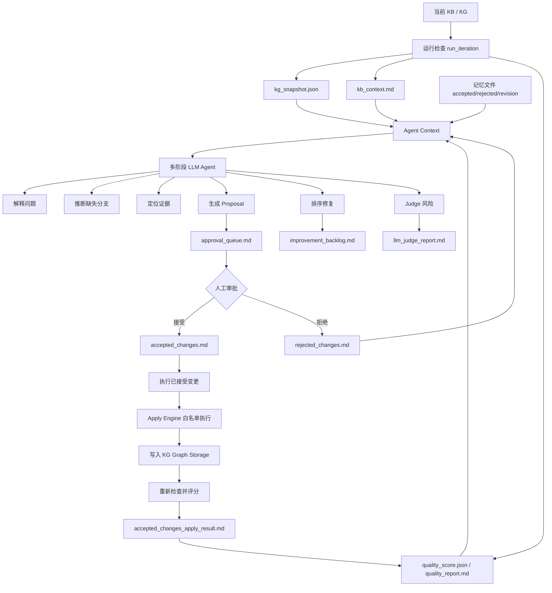

# 知识库迭代 Agent 学习教程

这份教程解释 Web 上的“知识库迭代 Agent”到底怎么工作：它读哪些文件、每个文件是什么意思、LLM 怎么参与、上下文怎么构造、提示词在哪里、记忆怎么保存、决策和执行怎么分开。

下一节：`kb-iteration-agent-proposal-approval-zh.md`，专门讲 `approval_queue.md` 和 Proposal 审批。

## 1. 一句话理解

知识库迭代 Agent 不是让 LLM 直接修改知识库。

它的流程是：

```text
检查当前 KG -> 生成质量报告 -> LLM 审阅并生成 Proposal -> 人工接受/拒绝 -> 后端白名单执行 -> 重新评分 -> 下一轮
```

LLM 负责“分析和提方案”，人负责“批准或拒绝”，真正写 KG 的是后端 `Apply Engine`。

## 2. KB、KG、Proposal 分别是什么

**KB** 是 Knowledge Base，指整个知识库。它包括原始文档、文本切片、实体、关系、知识图谱、缓存、质量报告、审批记录和迭代日志。

**KG** 是 Knowledge Graph，指知识图谱。它是 KB 里“实体 + 关系”的结构化网络，例如：

```text
流感 -> 症状 -> 发热
流感 -> 治疗 -> 奥司他韦
流感 -> 高危人群 -> 老年人
```

**Proposal** 是 Agent 提出的“建议修改单”。它说明：

- 想改什么
- 为什么改
- 证据在哪里
- 风险是什么
- 预期会改善哪个质量指标
- 是否需要人工审批

## 3. Web 上完整流程

### 第一步：运行检查

Web 上点击“运行检查”。

后端会读取当前 workspace 的 KG 文件，一般是：

```text
data/rag_storage/<workspace>/graph_chunk_entity_relation.graphml
```

然后生成检查包：

- `kb_context.md`
- `entity_catalog.md`
- `relation_catalog.md`
- `kg_structure.md`
- `snapshots/kg_snapshot.json`
- `snapshots/quality_score.json`
- `quality_report.md`
- `iteration_log.md`

这些文件代表“当前知识库长什么样、质量怎么样”。

### 第二步：运行 LLM 审阅

Web 上点击“运行 LLM 审阅”。

LLM 不会直接修改 KG。它会分阶段读取检查包，然后输出分析材料和候选 Proposal。

当前多阶段 Agent 的顺序是：

```text
explain -> infer_branches -> locate_evidence -> propose -> rank_repairs -> judge
```

直白解释：

- `explain`：解释当前质量问题
- `infer_branches`：推断缺失的医学层级分支
- `locate_evidence`：定位证据
- `propose`：生成可审批 Proposal
- `rank_repairs`：排序修复方案
- `judge`：审查 Proposal 风险和证据

### 第三步：审批 Proposal

LLM 生成的 Proposal 会进入：

```text
approval_queue.md
```

你只需要点：

- 接受
- 拒绝

接受后写入：

```text
accepted_changes.md
```

拒绝后写入：

```text
rejected_changes.md
```

注意：**接受 Proposal 不等于已经修改 KG**。

### 第四步：执行已接受变更

点击“执行已接受变更”后，后端会读取：

```text
accepted_changes.md
approval_queue.md
improvement_backlog.md
```

然后由 `Apply Engine` 判断哪些 accepted proposal 可以真实执行。

当前实现里，真实写 KG 的安全边界在：

```text
lightrag/kb_iteration/apply.py
```

它不会执行任意 LLM 文本，只执行后端明确支持的白名单动作。

### 第五步：验证

执行后系统会重新生成检查包，并写：

```text
accepted_changes_apply_result.md
accepted_changes_apply_result.json
```

判断是否成功，不要只看 LLM 的描述，要看：

- `accepted_changes_apply_result.md` 里的 applied / blocked
- `snapshots/quality_score.json` 里的指标是否改善
- `snapshots/kg_snapshot.json` 里是否真的出现了目标节点或关系

## 4. 关键文件说明

| 文件 | 作用 |
|---|---|
| `kb_context.md` | 当前 KB 摘要，给人和 LLM 快速了解知识库 |
| `entity_catalog.md` | 实体目录，按实体类型列出 KG 节点 |
| `relation_catalog.md` | 关系目录，按关系关键词列出 KG 边 |
| `kg_structure.md` | 图谱层级结构摘要 |
| `snapshots/kg_snapshot.json` | KG 的机器可读快照，记录 nodes、edges、metadata |
| `snapshots/quality_score.json` | 质量分和结构化指标，是判断是否修好的核心证据 |
| `quality_report.md` | 人看的质量报告 |
| `approval_queue.md` | 待人工审批 Proposal |
| `improvement_backlog.md` | 本轮生成的改进 backlog |
| `accepted_changes.md` | 已接受 Proposal 记忆 |
| `rejected_changes.md` | 已拒绝 Proposal 记忆 |
| `proposal_revision_requests.md` | 要求 Agent 返工的反馈 |
| `iteration_log.md` | 运行日志和当前阶段 |
| `llm_review_trace.json` | LLM 审阅轨迹，排查为什么没 Proposal 时很重要 |
| `llm_issue_analysis.md` | LLM 问题分析 |
| `llm_missing_branch_inference.md` | LLM 缺失分支推断 |
| `llm_evidence_map.md` | LLM 证据映射 |
| `llm_repair_plan.md` | LLM 修复方案排序 |
| `llm_judge_report.md` | LLM judge 报告 |
| `proposals.generated.yaml` | LLM 生成的 Proposal 原始集合 |
| `accepted_changes_apply_result.md` | 执行已接受变更后的真实结果 |

## 5. Agent 的上下文 Context

Agent 不会把整个知识库原文都塞给 LLM。

它会给每个阶段生成一个小的上下文 JSON。

源码位置：

```text
lightrag/kb_iteration/agent_context.py
```

主要函数：

- `build_agent_observation()`：第一阶段用，包含 workspace、节点数、边数、质量摘要、层级分支、artifact 状态、KB 摘要、记忆文件。
- `build_stage_context()`：后续阶段用，包含质量 findings、上一阶段输出、候选实体/关系、证据窗口和记忆。

上下文会写到：

```text
agent_context/<stage>-context.json
```

这很重要，因为你可以追踪“LLM 当时到底看到了什么”。

## 6. Agent 的提示词 Prompt

提示词放在：

```text
lightrag/kb_iteration/prompts/
```

主要文件：

- `explain_zh.md`
- `infer_branches_zh.md`
- `locate_evidence_zh.md`
- `propose_zh.md`
- `rank_repairs_zh.md`
- `judge_zh.md`

每个提示词负责约束一个阶段：

- 只能输出 JSON
- 不能编造医学事实
- Proposal 必须带确定性证据
- mutation proposal 必须 `requires_approval=true`
- LLM 的推理不能当作医学证据
- judge 必须检查证据、风险、是否需要人工

## 7. Agent 的记忆 Memory

这里的记忆不是聊天记录，而是落盘文件：

```text
accepted_changes.md
rejected_changes.md
proposal_revision_requests.md
quality_rules.md
known_issues.md
```

它们的作用：

- 让 Agent 知道哪些方案已经接受
- 让 Agent 知道哪些方案已经拒绝
- 让 Agent 根据拒绝原因重写 Proposal
- 沉淀长期质量规则和已知问题

也就是说，Agent 的记忆是“文件记忆”，不是“模型记忆”。

## 8. Agent 的决策 Decision

决策分两层：

### LLM Judge

LLM Judge 会给 Proposal 一个建议：

- `recommend_accept`
- `recommend_reject`
- `needs_human`
- `needs_more_evidence`

但它只是建议，不是最终权限。

### 人工审批

你在 Web 上点接受或拒绝，才是最终审批。

系统设计上，涉及 KG、规则、prompt、workspace、WebUI 的 mutation proposal 都必须人工审批。

## 9. Agent 的规划 Planning

规划主要体现在：

- `rank_repairs` 阶段：LLM 排序修复方案
- `improvement_backlog.md`：保存未来可以继续做的改进
- `iteration_log.md`：记录本轮执行到了哪里

所以它不是一次性“全自动修完”，而是可审阅、可回滚、可循环的迭代流程。

## 10. 易懂架构图



## 11. 源码入口

| 源码文件 | 作用 |
|---|---|
| `lightrag/kb_iteration/runner.py` | 运行检查，生成快照、摘要、质量分和日志 |
| `lightrag/kb_iteration/snapshot.py` | 从 GraphML 构造 KG snapshot |
| `lightrag/kb_iteration/quality.py` | 计算质量指标 |
| `lightrag/kb_iteration/markdown.py` | 生成 Markdown 摘要和初始化记忆文件 |
| `lightrag/kb_iteration/agent_context.py` | 构造每个 LLM 阶段的上下文 |
| `lightrag/kb_iteration/agent_pipeline.py` | 多阶段 Agent 主流程 |
| `lightrag/kb_iteration/agent_outputs.py` | 解析 LLM 输出并生成 artifact |
| `lightrag/kb_iteration/proposals.py` | 校验 Proposal 并写入审批队列 |
| `lightrag/kb_iteration/apply.py` | 执行已接受变更，真实写 KG |
| `lightrag/api/routers/kb_iteration_routes.py` | 后端 API 路由 |
| `lightrag_webui/src/features/KGMaintenanceConsole.tsx` | 前端 KG 维护页面总控 |
| `lightrag_webui/src/components/kg-maintenance/*` | 前端各个面板 |

## 12. 怎么判断一轮是否成功

一轮成功通常看三个证据：

1. `accepted_changes_apply_result.md`

   看 `Applied` 是否大于 0，`Blocked` 是否为 0。

2. `snapshots/quality_score.json`

   看目标指标是否改善，例如：

   ```text
   hierarchy_missing_branch_count: 9 -> 0
   ```

3. `snapshots/kg_snapshot.json`

   看 KG 里是否真的出现目标节点或关系。

## 13. 小练习

### 问题 1

点了“接受 Proposal”，KG 是否已经被修改？

答案：没有。接受只写入 `accepted_changes.md`，还要点“执行已接受变更”。

### 问题 2

LLM 生成 Proposal 时，最关键的硬约束是什么？

答案：必须有确定性证据，例如 source_id、file_path、entity_id、relation_id、metric。LLM 自己的推理不能当证据。

### 问题 3

被拒绝的 Proposal 有什么用？

答案：进入 `rejected_changes.md` 或 `proposal_revision_requests.md`，下一轮 Agent 会把它当记忆，避免重复或按反馈重写。
