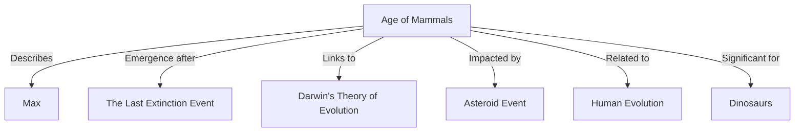

## Ways To Query The LighRAG Server

## Query 1

### LightRAG server will produce links which will bring you to the exact spot in a video where the query is addressed.

The magic which make this possible is in the way the data was prepared and indexed.  
[This library](https://github.com/johnshearing/scrape_yt_mk_transcripts) was used to prepare the data for indexing.  
 
How the query is written also matters. The following is an example. 

**Paste the following query into the LightRAG server prompt box.  
Try Naive, Local, Global, Hybrid, and Mix mode for each query**

[The source text is a transcript from the source video. The URL for the source video is found in the metadata associated with the source text. Time stamps in the source text appear between brackets at the beginning of each line as shown in the following sample text: <sample text begins here>[6.56 > 11.4] (Roger) the different years that in those that had COVID there were higher levels of oxidative stress.<sample text ends here> In the sample text, the values given between the brackets are given in seconds and decimal fractions of a second. So the first value in the timestamp sample is six seconds and 56 hundreths of a second. Only use the integer part of the value and only return the first value in the pair. So from the sample text, only use the number 6 to represent six seconds into the video when generating your answer. To say it another way, only use the whole number part of the first value given between the brackets when forming your answer. Please provide URLs in your responses for source video that incorporate the timestamps found in the source text so that the videos can be viewed at the moment which is relevant to the query response. The following is an example of how the URLs should be structured if the source text is from Ln3WszTq0uA.txt and the moment of interest has a time stamp of [6.56 > 11.68]: https://www.youtube.com/watch?v=Ln3WszTq0uA&t=6s. To build the URL always start with the URL you find in the metadata which is associated with the source text. In this case the URL associated with the source text is "https://www.youtube.com/watch?v=Ln3WszTq0uA". Append the characters &t= to the URL. So now the URL will look as follows: "https://www.youtube.com/watch?v=Ln3WszTq0uA&t=". Next, append the number 6 to the URL if the timestamp is [6.56 > 11.4] because we are only interested in the whole number part of the first value in the timestamp. So now the URL will look as follows: "https://www.youtube.com/watch?v=Ln3WszTq0uA&t=6". Finally, append the letter s to the URL to denote seconds. So the final resulting URL will look as follows: "https://www.youtube.com/watch?v=Ln3WszTq0uA&t=6s"] Please search for all instances where infrared light is discussed with regard to studies done in Brazil.

**The following was the response produced**

Infrared Light Studies in Brazil
In the context of infrared light and its potential benefits for COVID-19, there is a notable study mentioned that was conducted in Brazil. This study involved the use of a jacket for patients with mild to moderate COVID-19 who were hospitalized but not on ventilators. The findings indicated that the use of near-infrared light therapy significantly improved several pulmonary functions and reduced hospitalization time by four days. Specifically, there was a 32% improvement in maximum inspiratory pressure and a 23% improvement in maximum expiratory pressure.

The researchers highlighted the systemic effects of photobiomodulation, which suggests that near-infrared light could have broader implications for treating conditions like COVID-19. However, the study's main limitation was the small cohort size of only 30 patients, suggesting that further research with larger populations is necessary to strengthen the conclusions.

For more information on this topic, you can view the relevant section of the video discussing the Brazilian study at this timestamp: https://www.youtube.com/watch?v=Hy8G5TKxiLY&t=2102s.

### Summary
The discussion around topical sunscreen highlights a critical view of its use in preventing skin cancer, suggesting that blocking UV light with sunscreen may lead to adverse health outcomes, including an increased risk of melanoma.

---
#### The following explains the effect of the query formating in the above example

  * Query methods available are naive, local, global, hybrid, mix, and bypass.
    * naive only looks in the vector database for information but will give thoughtfull answers beyond what it finds. So it's not just searching for words. Rather it is searching for meaning and reporting on that.
    * local uses information found in the knowledge graph nodes.
    * global uses information found in knowledge graph relations.
    * hybrid combines local and global methods.
    * mix combines hybrid with naive
    * The results vary significantly based on the method used.
    * There is no telling which will give the best result so it is good to try them all. 
    * The python script _2_index_query_??.py does indeed try all the methods so it might be wise to run the query in the script first to see which method produces the best response and then run the query again in the LightRAG server to get the best formatting.

* [Time stamps in the...] 
  * Specify special instructions or formating instructions in brackets before the query. This greatly improves the quality of the response.  

## Query 2

### Metadata: LightRAG server will list data about the source material and produce links to that source material.

The magic which make this possible is in the way the data was prepared and indexed.  
[This library](https://github.com/johnshearing/scrape_yt_mk_transcripts) was used to prepare the data for indexing.  
 
How the query is written also matters. The following is an example. 

**Paste the following query into the LightRAG server prompt box.**

/naive Please list the metadata for the source material.  

**The following is was the response produced**

### Metadata for the Source Material
- **Video Title:** Dr Jack Kruse: Light, Melanin, POMC in Human Evolution & Disease
- **Video URL:** [Watch here](https://www.youtube.com/watch?v=Ln3WszTq0uA)
- **Video Platform:** YouTube
- **Video Channel:** Max Gulhane MD
- **Posted Date:** April 2, 2023
- **Language:** English

### References
- [DC] Ln3WszTq0uA_metadata.json

## Query 3

### LightRAG server will produce diagrams.

How the query is written matters. 
The query type is specified first: /naive 
Special instructions about the output go in between brackets []
Finally the query is written.
The following is an example. 

**Paste the following query into the LightRAG server prompt box.**

>/mix [Use mermaid format for diagrams] Please draw a character relationship diagram for Age of Mammals

**The following is was the response produced**

### Explanation:
- The diagram illustrates the relationships surrounding the "Age of Mammals," showing its connections to key entities such as Max, the Last Extinction Event, Darwin's Theory of Evolution, the Asteroid Event, Human Evolution, and Dinosaurs. Each relationship highlights how these entities are interconnected in the context of evolutionary history.

## Query 4

### LightRAG can find orphans in the knowledge graph.

This only works in a local or mixed mode query.  
And currently this will only work for 23 items in the list when using LR-Server.  
When this same query is use in a python query script many more list items can be used in the query.  
I am trying to discover what is making that difference.  
The query type is specified first: /local  
Special instructions about the output go in between brackets []  
Finally the query is written.  

The following is an example.   
**Paste the following query into the LightRAG server prompt box.**

>/local [Only provide the name of the entity in the response. Nothing else is required.] Please examine the Entity ID for all Entities in the following python list. Then please return only the Entities with a Rank of 0. [ "2023-04-02T06:06:17Z", "2023-04-22T23:01:27Z", "Alabama", "Albury", "Biological Compartments", "Cellular Health", "Circadian Biology", "Circadian Health", "Circadian Rhythm", "Cold Thermogenesis Protocol", "Cytochrome C Oxidase", "Delta Airlines", "Deuterium Depleted Water", "Dr Jack Kruse: Light, Melanin, POMC in Human Evolution & Disease", "Dr Jack Kruse: WATER, non-native EMFs & mitochondrial basis of disease | Regenerative Health Podcast", "Dr. Anthony Chafee", "Dr. Jack Kruse", "Dr. Max Gulhane", "Eureka Moment", "Farm Tour", "Health Optimization"]

**The following is was the response produced**

>The only Entity from your provided list with a Rank of 0 is:  
>
>Albury  
>This entity corresponds to the location in New South Wales where Dr. Max Gulhane is based.  

## Query 5

### LightRAG can find Type, Description, Rank, and File Path in the knowledge graph. In the previous example we searched from Entity to Entity ID to Rank in order to find orphans. In the following example we go through Entity to Entity ID to Type in order to return categories.

This only works in a mixed mode query.  
The query type is specified first: /mixed  
Special instructions about the output go in between brackets []  
Finally the query is written.  

The following is an example.   
**Paste the following query into the LightRAG server prompt box.**

>/mix [Only provide the name of the entity in the response. Nothing else is required.] Please examine the Entity ID for all Entities in the following python list. Then please return only the Entities with a Type of Person. [ "2023-04-02T06:06:17Z", "2023-04-22T23:01:27Z", "Alabama", "Albury", "Biological Compartments", "Cellular Health", "Circadian Biology", "Circadian Health", "Circadian Rhythm", "Cold Thermogenesis Protocol", "Cytochrome C Oxidase", "Delta Airlines", "Deuterium Depleted Water", "Dr Jack Kruse: Light, Melanin, POMC in Human Evolution & Disease", "Dr Jack Kruse: WATER, non-native EMFs & mitochondrial basis of disease | Regenerative Health Podcast", "Dr. Anthony Chafee", "Dr. Jack Kruse", "Dr. Max Gulhane", "Eureka Moment", "Farm Tour", "Health Optimization"]

**The following is was the response produced**

>Dr. Anthony Chafee  
Dr. Jack Kruse  
Dr. Max Gulhane    
