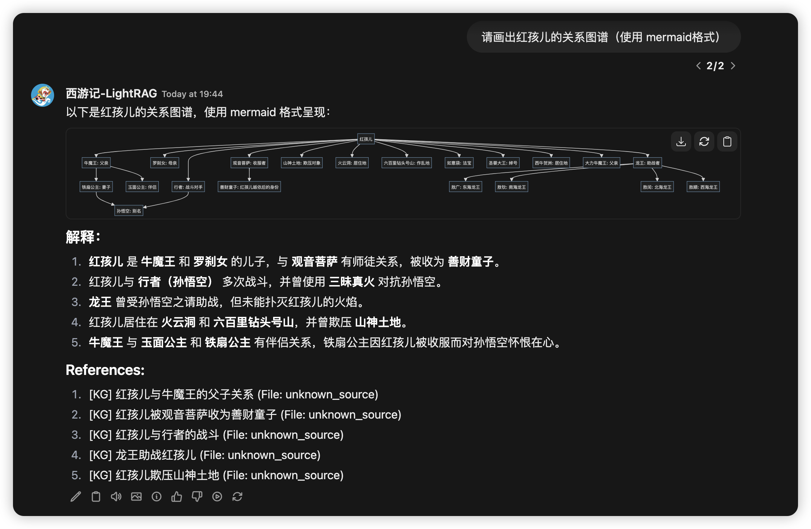

# LightRAG 服务器和 WebUI

LightRAG 服务器旨在提供 Web 界面和 API 支持。Web 界面便于文档索引、知识图谱探索和简单的 RAG 查询界面。LightRAG 服务器还提供了与 Ollama 兼容的接口，旨在将 LightRAG 模拟为 Ollama 聊天模型。这使得 AI 聊天机器人（如 Open WebUI）可以轻松访问 LightRAG。


## 入门指南

### 安装

* 从 PyPI 安装

```bash
pip install "lightrag-hku[api]"
```

* 从源代码安装

```bash
# Clone the repository
git clone https://github.com/HKUDS/lightrag.git

# Change to the repository directory
cd lightrag

# Create a Python virtual environment
uv venv --seed --python 3.12
source .venv/bin/acivate

# Install in editable mode with API support
pip install -e ".[api]"

# Build front-end artifacts
cd lightrag_webui
bun install --frozen-lockfile --production
bun run build
cd ..
```

### 启动 LightRAG 服务器前的准备

LightRAG 需要同时集成 LLM（大型语言模型）和嵌入模型以有效执行文档索引和查询操作。在首次部署 LightRAG 服务器之前，必须配置 LLM 和嵌入模型的设置。LightRAG 支持绑定到各种 LLM/嵌入后端：

* ollama
* lollms
* openai 或 openai 兼容
* azure_openai
* aws_bedrock

建议使用环境变量来配置 LightRAG 服务器。项目根目录中有一个名为 `env.example` 的示例环境变量文件。请将此文件复制到启动目录并重命名为 `.env`。之后，您可以在 `.env` 文件中修改与 LLM 和嵌入模型相关的参数。需要注意的是，LightRAG 服务器每次启动时都会将 `.env` 中的环境变量加载到系统环境变量中。**LightRAG 服务器会优先使用系统环境变量中的设置**。

> 由于安装了 Python 扩展的 VS Code 可能会在集成终端中自动加载 .env 文件，请在每次修改 .env 文件后打开新的终端会话。

以下是 LLM 和嵌入模型的一些常见设置示例：

* OpenAI LLM + Ollama 嵌入

```
LLM_BINDING=openai
LLM_MODEL=gpt-4o
LLM_BINDING_HOST=https://api.openai.com/v1
LLM_BINDING_API_KEY=your_api_key

EMBEDDING_BINDING=ollama
EMBEDDING_BINDING_HOST=http://localhost:11434
EMBEDDING_MODEL=bge-m3:latest
EMBEDDING_DIM=1024
# EMBEDDING_BINDING_API_KEY=your_api_key
```

* Ollama LLM + Ollama 嵌入

```
LLM_BINDING=ollama
LLM_MODEL=mistral-nemo:latest
LLM_BINDING_HOST=http://localhost:11434
# LLM_BINDING_API_KEY=your_api_key
###  Ollama 服务器上下文 token 数（必须大于 MAX_TOTAL_TOKENS+2000）
OLLAMA_LLM_NUM_CTX=8192

EMBEDDING_BINDING=ollama
EMBEDDING_BINDING_HOST=http://localhost:11434
EMBEDDING_MODEL=bge-m3:latest
EMBEDDING_DIM=1024
# EMBEDDING_BINDING_API_KEY=your_api_key
```

> **重要提示**：在文档索引前必须确定使用的Embedding模型，且在文档查询阶段必须沿用与索引阶段相同的模型。有些存储（例如PostgreSQL）在首次建立数表的时候需要确定向量维度，因此更换Embedding模型后需要删除向量相关库表，以便让LightRAG重建新的库表。

### 启动 LightRAG 服务器

LightRAG 服务器支持两种运行模式：
* 简单高效的 Uvicorn 模式

```
lightrag-server
```
* 多进程 Gunicorn + Uvicorn 模式（生产模式，不支持 Windows 环境）

```
lightrag-gunicorn --workers 4
```
启动LightRAG的时候，当前工作目录必须含有`.env`配置文件。**要求将.env文件置于启动目录中是经过特意设计的**。 这样做的目的是支持用户同时启动多个LightRAG实例，并为不同实例配置不同的.env文件。**修改.env文件后，您需要重新打开终端以使新设置生效**。 这是因为每次启动时，LightRAG Server会将.env文件中的环境变量加载至系统环境变量，且系统环境变量的设置具有更高优先级。

启动时可以通过命令行参数覆盖`.env`文件中的配置。常用的命令行参数包括：

- `--host`：服务器监听地址（默认：0.0.0.0）
- `--port`：服务器监听端口（默认：9621）
- `--timeout`：LLM 请求超时时间（默认：150 秒）
- `--log-level`：日志级别（默认：INFO）
- `--working-dir`：数据库持久化目录（默认：./rag_storage）
- `--input-dir`：上传文件存放目录（默认：./inputs）
- `--workspace`: 工作空间名称，用于逻辑上隔离多个LightRAG实例之间的数据（默认：空）

### 使用 Docker 启动 LightRAG 服务器

* 配置 .env 文件：
    通过复制示例文件 [`env.example`](env.example) 创建个性化的 .env 文件，并根据实际需求设置 LLM 及 Embedding 参数。
* 创建一个名为 docker-compose.yml 的文件：

```yaml
services:
  lightrag:
    container_name: lightrag
    image: ghcr.io/hkuds/lightrag:latest
    build:
      context: .
      dockerfile: Dockerfile
      tags:
        - ghcr.io/hkuds/lightrag:latest
    ports:
      - "${PORT:-9621}:9621"
    volumes:
      - ./data/rag_storage:/app/data/rag_storage
      - ./data/inputs:/app/data/inputs
      - ./data/tiktoken:/app/data/tiktoken
      - ./config.ini:/app/config.ini
      - ./.env:/app/.env
    env_file:
      - .env
    environment:
      - TIKTOKEN_CACHE_DIR=/app/data/tiktoken
    restart: unless-stopped
    extra_hosts:
      - "host.docker.internal:host-gateway"
```

* 通过以下命令启动 LightRAG 服务器：

```shell
docker compose up
# 如果希望启动后让程序退到后台运行，需要在命令的最后添加 -d 参数
```
> 可以通过以下链接获取官方的docker compose文件：[docker-compose.yml]( https://raw.githubusercontent.com/HKUDS/LightRAG/refs/heads/main/docker-compose.yml) 。如需获取LightRAG的历史版本镜像，可以访问以下链接: [LightRAG Docker Images]( https://github.com/HKUDS/LightRAG/pkgs/container/lightrag)

### 离线部署

对于离线或隔离环境，请参阅[离线部署指南](./../../docs/OfflineDeployment.md)，了解如何预先安装所有依赖项和缓存文件。

### 启动多个LightRAG实例

有两种方式可以启动多个LightRAG实例。第一种方式是为每个实例配置一个完全独立的工作环境。此时需要为每个实例创建一个独立的工作目录，然后在这个工作目录上放置一个当前实例专用的`.env`配置文件。不同实例的配置文件中的服务器监听端口不能重复，然后在工作目录上执行 lightrag-server 启动服务即可。

第二种方式是所有实例共享一套相同的`.env`配置文件，然后通过命令行参数来为每个实例指定不同的服务器监听端口和工作空间。你可以在同一个工作目录中通过不同的命令行参数启动多个LightRAG实例。例如：

```
# 启动实例1
lightrag-server --port 9621 --workspace space1

# 启动实例2
lightrag-server --port 9622 --workspace space2
```

工作空间的作用是实现不同实例之间的数据隔离。因此不同实例之间的`workspace`参数必须不同，否则会导致数据混乱，数据将会被破坏。

通过 Docker Compose 启动多个 LightRAG 实例时，只需在 `docker-compose.yml` 中为每个容器指定不同的 `WORKSPACE` 和 `PORT` 环境变量即可。即使所有实例共享同一个 `.env` 文件，Compose 中定义的容器环境变量也会优先覆盖 `.env` 文件中的同名设置，从而确保每个实例拥有独立的配置。

### LightRAG实例间的数据隔离

每个实例配置一个独立的工作目录和专用`.env`配置文件通常能够保证内存数据库中的本地持久化文件保存在各自的工作目录，实现数据的相互隔离。LightRAG默认存储全部都是内存数据库，通过这种方式进行数据隔离是没有问题的。但是如果使用的是外部数据库，如果不同实例访问的是同一个数据库实例，就需要通过配置工作空间来实现数据隔离，否则不同实例的数据将会出现冲突并被破坏。

命令行的 workspace 参数和`.env`文件中的环境变量`WORKSPACE` 都可以用于指定当前实例的工作空间名字，命令行参数的优先级别更高。下面是不同类型的存储实现工作空间的方式：

- **对于本地基于文件的数据库，数据隔离通过工作空间子目录实现：** JsonKVStorage, JsonDocStatusStorage, NetworkXStorage, NanoVectorDBStorage, FaissVectorDBStorage。
- **对于将数据存储在集合（collection）中的数据库，通过在集合名称前添加工作空间前缀来实现：** RedisKVStorage, RedisDocStatusStorage, MilvusVectorDBStorage, QdrantVectorDBStorage, MongoKVStorage, MongoDocStatusStorage, MongoVectorDBStorage, MongoGraphStorage, PGGraphStorage。
- **对于关系型数据库，数据隔离通过向表中添加 `workspace` 字段进行数据的逻辑隔离：** PGKVStorage, PGVectorStorage, PGDocStatusStorage。

* **对于Neo4j图数据库，通过label来实现数据的逻辑隔离**：Neo4JStorage

为了保持对遗留数据的兼容，在未配置工作空间时PostgreSQL的默认工作空间为`default`，Neo4j的默认工作空间为`base`。对于所有的外部存储，系统都提供了专用的工作空间环境变量，用于覆盖公共的 `WORKSPACE`环境变量配置。这些适用于指定存储类型的工作空间环境变量为：`REDIS_WORKSPACE`, `MILVUS_WORKSPACE`, `QDRANT_WORKSPACE`, `MONGODB_WORKSPACE`, `POSTGRES_WORKSPACE`, `NEO4J_WORKSPACE`。

### Gunicorn + Uvicorn 的多工作进程

LightRAG 服务器可以在 `Gunicorn + Uvicorn` 预加载模式下运行。Gunicorn 的多工作进程（多进程）功能可以防止文档索引任务阻塞 RAG 查询。使用 CPU 密集型文档提取工具（如 docling）在纯 Uvicorn 模式下可能会导致整个系统被阻塞。

虽然 LightRAG 服务器使用一个工作进程来处理文档索引流程，但通过 Uvicorn 的异步任务支持，可以并行处理多个文件。文档索引速度的瓶颈主要在于 LLM。如果您的 LLM 支持高并发，您可以通过增加 LLM 的并发级别来加速文档索引。以下是几个与并发处理相关的环境变量及其默认值：

```
### 工作进程数，数字不大于 (2 x 核心数) + 1
WORKERS=2
### 一批中并行处理的文件数
MAX_PARALLEL_INSERT=2
# LLM 的最大并发请求数
MAX_ASYNC=4
```

### 将 Lightrag 安装为 Linux 服务

从示例文件 `lightrag.service.example` 创建您的服务文件 `lightrag.service`。修改服务文件中的 WorkingDirectory 和 ExecStart：

```text
Description=LightRAG Ollama Service
WorkingDirectory=<lightrag 安装目录>
ExecStart=<lightrag 安装目录>/lightrag/api/lightrag-api
```

修改您的服务启动脚本：`lightrag-api`。根据需要更改 python 虚拟环境激活命令：

```shell
#!/bin/bash

# 您的 python 虚拟环境激活命令
source /home/netman/lightrag-xyj/venv/bin/activate
# 启动 lightrag api 服务器
lightrag-server
```

安装 LightRAG 服务。如果您的系统是 Ubuntu，以下命令将生效：

```shell
sudo cp lightrag.service /etc/systemd/system/
sudo systemctl daemon-reload
sudo systemctl start lightrag.service
sudo systemctl status lightrag.service
sudo systemctl enable lightrag.service
```

## Ollama 模拟

我们为 LightRAG 提供了 Ollama 兼容接口，旨在将 LightRAG 模拟为 Ollama 聊天模型。这使得支持 Ollama 的 AI 聊天前端（如 Open WebUI）可以轻松访问 LightRAG。

### 将 Open WebUI 连接到 LightRAG

启动 lightrag-server 后，您可以在 Open WebUI 管理面板中添加 Ollama 类型的连接。然后，一个名为 `lightrag:latest` 的模型将出现在 Open WebUI 的模型管理界面中。用户随后可以通过聊天界面向 LightRAG 发送查询。对于这种用例，最好将 LightRAG 安装为服务。

Open WebUI 使用 LLM 来执行会话标题和会话关键词生成任务。因此，Ollama 聊天补全 API 会检测并将 OpenWebUI 会话相关请求直接转发给底层 LLM。Open WebUI 的截图：



### 在聊天中选择查询模式

如果您从 LightRAG 的 Ollama 接口发送消息（查询），默认查询模式是 `hybrid`。您可以通过发送带有查询前缀的消息来选择查询模式。

查询字符串中的查询前缀可以决定使用哪种 LightRAG 查询模式来生成响应。支持的前缀包括：

```
/local
/global
/hybrid
/naive
/mix

/bypass
/context
/localcontext
/globalcontext
/hybridcontext
/naivecontext
/mixcontext
```

例如，聊天消息 "/mix 唐僧有几个徒弟" 将触发 LightRAG 的混合模式查询。没有查询前缀的聊天消息默认会触发混合模式查询。

"/bypass" 不是 LightRAG 查询模式，它会告诉 API 服务器将查询连同聊天历史直接传递给底层 LLM。因此用户可以使用 LLM 基于聊天历史回答问题。如果您使用 Open WebUI 作为前端，您可以直接切换到普通 LLM 模型，而不是使用 /bypass 前缀。

"/context" 也不是 LightRAG 查询模式，它会告诉 LightRAG 只返回为 LLM 准备的上下文信息。您可以检查上下文是否符合您的需求，或者自行处理上下文。

### 在聊天中添加用户提示词

使用LightRAG进行内容查询时，应避免将搜索过程与无关的输出处理相结合，这会显著影响查询效果。用户提示（user prompt）正是为解决这一问题而设计 -- 它不参与RAG检索阶段，而是在查询完成后指导大语言模型（LLM）如何处理检索结果。我们可以在查询前缀末尾添加方括号，从而向LLM传递用户提示词：

```
/[使用mermaid格式画图] 请画出 Scrooge 的人物关系图谱
/mix[使用mermaid格式画图] 请画出 Scrooge 的人物关系图谱
```

## API 密钥和认证

默认情况下，LightRAG 服务器可以在没有任何认证的情况下访问。我们可以使用 API 密钥或账户凭证配置服务器以确保其安全。

* API 密钥

```
LIGHTRAG_API_KEY=your-secure-api-key-here
WHITELIST_PATHS=/health,/api/*
```

> 健康检查和 Ollama 模拟端点默认不进行 API 密钥检查。为了安全原因，如果不需要提供Ollama服务，应该把`/api/*`从WHITELIST_PATHS中移除。

API Key使用的请求头是 `X-API-Key` 。以下是使用API访问LightRAG Server的一个例子：

```
curl -X 'POST' \
  'http://localhost:9621/documents/scan' \
  -H 'accept: application/json' \
  -H 'X-API-Key: your-secure-api-key-here-123' \
  -d ''
```

* 账户凭证（Web 界面需要登录后才能访问）

LightRAG API 服务器使用基于 HS256 算法的 JWT 认证。要启用安全访问控制，需要以下环境变量：

```bash
# JWT 认证
AUTH_ACCOUNTS='admin:admin123,user1:pass456'
TOKEN_SECRET='your-key'
TOKEN_EXPIRE_HOURS=4
```

> 目前仅支持配置一个管理员账户和密码。尚未开发和实现完整的账户系统。

如果未配置账户凭证，Web 界面将以访客身份访问系统。因此，即使仅配置了 API 密钥，所有 API 仍然可以通过访客账户访问，这仍然不安全。因此，要保护 API，需要同时配置这两种认证方法。

## Azure OpenAI 后端配置

可以使用以下 Azure CLI 命令创建 Azure OpenAI API（您需要先从 [https://docs.microsoft.com/en-us/cli/azure/install-azure-cli](https://docs.microsoft.com/en-us/cli/azure/install-azure-cli) 安装 Azure CLI）：

```bash
# 根据需要更改资源组名称、位置和 OpenAI 资源名称
RESOURCE_GROUP_NAME=LightRAG
LOCATION=swedencentral
RESOURCE_NAME=LightRAG-OpenAI

az login
az group create --name $RESOURCE_GROUP_NAME --location $LOCATION
az cognitiveservices account create --name $RESOURCE_NAME --resource-group $RESOURCE_GROUP_NAME  --kind OpenAI --sku S0 --location swedencentral
az cognitiveservices account deployment create --resource-group $RESOURCE_GROUP_NAME  --model-format OpenAI --name $RESOURCE_NAME --deployment-name gpt-4o --model-name gpt-4o --model-version "2024-08-06"  --sku-capacity 100 --sku-name "Standard"
az cognitiveservices account deployment create --resource-group $RESOURCE_GROUP_NAME  --model-format OpenAI --name $RESOURCE_NAME --deployment-name text-embedding-3-large --model-name text-embedding-3-large --model-version "1"  --sku-capacity 80 --sku-name "Standard"
az cognitiveservices account show --name $RESOURCE_NAME --resource-group $RESOURCE_GROUP_NAME --query "properties.endpoint"
az cognitiveservices account keys list --name $RESOURCE_NAME -g $RESOURCE_GROUP_NAME
```

最后一个命令的输出将提供 OpenAI API 的端点和密钥。您可以使用这些值在 `.env` 文件中设置环境变量。

```
# .env 中的 Azure OpenAI 配置
LLM_BINDING=azure_openai
LLM_BINDING_HOST=your-azure-endpoint
LLM_MODEL=your-model-deployment-name
LLM_BINDING_API_KEY=your-azure-api-key
### API Version可选，默认为最新版本
AZURE_OPENAI_API_VERSION=2024-08-01-preview

### 如果使用 Azure OpenAI 进行嵌入
EMBEDDING_BINDING=azure_openai
EMBEDDING_MODEL=your-embedding-deployment-name
```

## LightRAG 服务器详细配置

API 服务器可以通过三种方式配置（优先级从高到低）：

* 命令行参数
* 环境变量或 .env 文件
* Config.ini（仅用于存储配置）

大多数配置都有默认设置，详细信息请查看示例文件：`.env.example`。数据存储配置也可以通过 config.ini 设置。为方便起见，提供了示例文件 `config.ini.example`。

### 支持的 LLM 和嵌入后端

LightRAG 支持绑定到各种 LLM/嵌入后端：

* ollama
* openai (含openai 兼容)
* azure_openai
* lollms
* aws_bedrock

使用环境变量 `LLM_BINDING` 或 CLI 参数 `--llm-binding` 选择 LLM 后端类型。使用环境变量 `EMBEDDING_BINDING` 或 CLI 参数 `--embedding-binding` 选择嵌入后端类型。

LLM和Embedding配置例子请查看项目根目录的 env.example 文件。OpenAI和Ollama兼容LLM接口的支持的完整配置选型可以通过一下命令查看：

```
lightrag-server --llm-binding openai --help
lightrag-server --llm-binding ollama --help
lightrag-server --embedding-binding ollama --help
```

> 请使用openai兼容方式访问OpenRouter、vLLM或SLang部署的LLM。可以通过 `OPENAI_LLM_EXTRA_BODY` 环境变量给OpenRouter、vLLM或SGLang推理框架传递额外的参数，实现推理模式的关闭或者其它个性化控制。

设置 `max_tokens` 参数旨在**防止在实体关系提取阶段出现LLM 响应输出过长或无休止的循环输出的问题**。设置 `max_tokens` 参数的目的是在超时发生之前截断 LLM 输出，从而防止文档提取失败。这解决了某些包含大量实体和关系的文本块（例如表格或引文）可能导致 LLM 产生过长甚至无限循环输出的问题。此设置对于本地部署的小参数模型尤为重要。`max_tokens` 值可以通过以下公式计算：

```
# For vLLM/SGLang doployed models, or most of OpenAI compatible API provider
OPENAI_LLM_MAX_TOKENS=9000

# For Ollama Deployed Modeles
OLLAMA_LLM_NUM_PREDICT=9000

# For OpenAI o1-mini or newer modles
OPENAI_LLM_MAX_COMPLETION_TOKENS=9000
```

### 实体提取配置

* ENABLE_LLM_CACHE_FOR_EXTRACT：为实体提取启用 LLM 缓存（默认：true）

在测试环境中将 `ENABLE_LLM_CACHE_FOR_EXTRACT` 设置为 true 以减少 LLM 调用成本是很常见的做法。

### 支持的存储类型

LightRAG 使用 4 种类型的存储用于不同目的：

* KV_STORAGE：llm 响应缓存、文本块、文档信息
* VECTOR_STORAGE：实体向量、关系向量、块向量
* GRAPH_STORAGE：实体关系图
* DOC_STATUS_STORAGE：文档索引状态

每种存储类型都有多种存储实现方式。LightRAG Server默认的存储实现为内存数据库，数据通过文件持久化保存到WORKING_DIR目录。LightRAG还支持PostgreSQL、MongoDB、FAISS、Milvus、Qdrant、Neo4j、Memgraph和Redis等存储实现方式。详细的存储支持方式请参考根目录下的`README.md`文件中关于存储的相关内容。

您可以通过环境变量选择存储实现。例如，在首次启动 API 服务器之前，您可以将以下环境变量设置为特定的存储实现名称：

```
LIGHTRAG_KV_STORAGE=PGKVStorage
LIGHTRAG_VECTOR_STORAGE=PGVectorStorage
LIGHTRAG_GRAPH_STORAGE=PGGraphStorage
LIGHTRAG_DOC_STATUS_STORAGE=PGDocStatusStorage
```

在向 LightRAG 添加文档后，您不能更改存储实现选择。目前尚不支持从一个存储实现迁移到另一个存储实现。更多配置信息请阅读示例 `env.exampl`e文件。

### LightRag API 服务器命令行选项

| 参数 | 默认值 | 描述 |
|-----------|---------|-------------|
| --host | 0.0.0.0 | 服务器主机 |
| --port | 9621 | 服务器端口 |
| --working-dir | ./rag_storage | RAG 存储的工作目录 |
| --input-dir | ./inputs | 包含输入文档的目录 |
| --max-async | 4 | 最大异步操作数 |
| --log-level | INFO | 日志级别（DEBUG、INFO、WARNING、ERROR、CRITICAL） |
| --verbose | - | 详细调试输出（True、False） |
| --key | None | 用于认证的 API 密钥。保护 lightrag 服务器免受未授权访问 |
| --ssl | False | 启用 HTTPS |
| --ssl-certfile | None | SSL 证书文件路径（如果启用 --ssl 则必需） |
| --ssl-keyfile | None | SSL 私钥文件路径（如果启用 --ssl 则必需） |
| --llm-binding | ollama | LLM 绑定类型（lollms、ollama、openai、openai-ollama、azure_openai、aws_bedrock） |
| --embedding-binding | ollama | 嵌入绑定类型（lollms、ollama、openai、azure_openai、aws_bedrock） |

### Reranking 配置

Reranking 查询召回的块可以显著提高检索质量，它通过基于优化的相关性评分模型对文档重新排序。LightRAG 目前支持以下 rerank 提供商：

- **Cohere / vLLM**：提供与 Cohere AI 的 `v2/rerank` 端点的完整 API 集成。由于 vLLM 提供了与 Cohere 兼容的 reranker API，因此也支持所有通过 vLLM 部署的 reranker 模型。
- **Jina AI**：提供与所有 Jina rerank 模型的完全实现兼容性。
- **阿里云**：具有旨在支持阿里云 rerank API 格式的自定义实现。

Rerank 提供商通过 `.env` 文件进行配置。以下是使用 vLLM 本地部署的 rerank 模型的示例配置：

```
RERANK_BINDING=cohere
RERANK_MODEL=BAAI/bge-reranker-v2-m3
RERANK_BINDING_HOST=http://localhost:8000/v1/rerank
RERANK_BINDING_API_KEY=your_rerank_api_key_here
```

以下是使用阿里云提供的 Reranker 服务的示例配置：

```
RERANK_BINDING=aliyun
RERANK_MODEL=gte-rerank-v2
RERANK_BINDING_HOST=https://dashscope.aliyuncs.com/api/v1/services/rerank/text-rerank/text-rerank
RERANK_BINDING_API_KEY=your_rerank_api_key_here
```

有关完整的 reranker 配置示例，请参阅 `env.example` 文件。

### 启用 Reranking

可以按查询启用或禁用 Reranking。

`/query` 和 `/query/stream` API 端点包含一个 `enable_rerank` 参数，默认设置为 `true`，用于控制当前查询是否激活 reranking。要将 `enable_rerank` 参数的默认值更改为 `false`，请设置以下环境变量：

```
RERANK_BY_DEFAULT=False
```

### .env 文件示例

```bash
### Server Configuration
# HOST=0.0.0.0
PORT=9621
WORKERS=2

### Settings for document indexing
ENABLE_LLM_CACHE_FOR_EXTRACT=true
SUMMARY_LANGUAGE=Chinese
MAX_PARALLEL_INSERT=2

### LLM Configuration (Use valid host. For local services installed with docker, you can use host.docker.internal)
TIMEOUT=150
MAX_ASYNC=4

LLM_BINDING=openai
LLM_MODEL=gpt-4o-mini
LLM_BINDING_HOST=https://api.openai.com/v1
LLM_BINDING_API_KEY=your-api-key

### Embedding Configuration (Use valid host. For local services installed with docker, you can use host.docker.internal)
EMBEDDING_MODEL=bge-m3:latest
EMBEDDING_DIM=1024
EMBEDDING_BINDING=ollama
EMBEDDING_BINDING_HOST=http://localhost:11434

### For JWT Auth
# AUTH_ACCOUNTS='admin:admin123,user1:pass456'
# TOKEN_SECRET=your-key-for-LightRAG-API-Server-xxx
# TOKEN_EXPIRE_HOURS=48

# LIGHTRAG_API_KEY=your-secure-api-key-here-123
# WHITELIST_PATHS=/api/*
# WHITELIST_PATHS=/health,/api/*
```

#### 使用 ollama 默认本地服务器作为 llm 和嵌入后端运行 Lightrag 服务器

Ollama 是 llm 和嵌入的默认后端，因此默认情况下您可以不带参数运行 lightrag-server，将使用默认值。确保已安装 ollama 并且正在运行，且默认模型已安装在 ollama 上。

```bash
# 使用 ollama 运行 lightrag，llm 使用 mistral-nemo:latest，嵌入使用 bge-m3:latest
lightrag-server

# 使用认证密钥
lightrag-server --key my-key
```

#### 使用 lollms 默认本地服务器作为 llm 和嵌入后端运行 Lightrag 服务器

```bash
# 使用 lollms 运行 lightrag，llm 使用 mistral-nemo:latest，嵌入使用 bge-m3:latest
# 在 .env 或 config.ini 中配置 LLM_BINDING=lollms 和 EMBEDDING_BINDING=lollms
lightrag-server

# 使用认证密钥
lightrag-server --key my-key
```

#### 使用 openai 服务器作为 llm 和嵌入后端运行 Lightrag 服务器

```bash
# 使用 openai 运行 lightrag，llm 使用 GPT-4o-mini，嵌入使用 text-embedding-3-small
# 在 .env 或 config.ini 中配置：
# LLM_BINDING=openai
# LLM_MODEL=GPT-4o-mini
# EMBEDDING_BINDING=openai
# EMBEDDING_MODEL=text-embedding-3-small
lightrag-server

# 使用认证密钥
lightrag-server --key my-key
```

#### 使用 azure openai 服务器作为 llm 和嵌入后端运行 Lightrag 服务器

```bash
# 使用 azure_openai 运行 lightrag
# 在 .env 或 config.ini 中配置：
# LLM_BINDING=azure_openai
# LLM_MODEL=your-model
# EMBEDDING_BINDING=azure_openai
# EMBEDDING_MODEL=your-embedding-model
lightrag-server

# 使用认证密钥
lightrag-server --key my-key
```

**重要说明：**
- 对于 LoLLMs：确保指定的模型已安装在您的 LoLLMs 实例中
- 对于 Ollama：确保指定的模型已安装在您的 Ollama 实例中
- 对于 OpenAI：确保您已设置 OPENAI_API_KEY 环境变量
- 对于 Azure OpenAI：按照先决条件部分所述构建和配置您的服务器

要获取任何服务器的帮助，使用 --help 标志：
```bash
lightrag-server --help
```

注意：如果您不需要 API 功能，可以使用以下命令安装不带 API 支持的基本包：
```bash
pip install lightrag-hku
```

## 文档和块处理逻辑说明

LightRAG 中的文档处理流程有些复杂，分为两个主要阶段：提取阶段（实体和关系提取）和合并阶段（实体和关系合并）。有两个关键参数控制流程并发性：并行处理的最大文件数（`MAX_PARALLEL_INSERT`）和最大并发 LLM 请求数（`MAX_ASYNC`）。工作流程描述如下：

1. `MAX_ASYNC` 限制系统中并发 LLM 请求的总数，包括查询、提取和合并的请求。LLM 请求具有不同的优先级：查询操作优先级最高，其次是合并，然后是提取。
2. `MAX_PARALLEL_INSERT` 控制提取阶段并行处理的文件数量。`MAX_PARALLEL_INSERT`建议设置为2～10之间，通常设置为 `MAX_ASYNC/3`，设置太大会导致合并阶段不同文档之间实体和关系重名的机会增大，降低合并阶段的效率。
3. 在单个文件中，来自不同文本块的实体和关系提取是并发处理的，并发度由 `MAX_ASYNC` 设置。只有在处理完 `MAX_ASYNC` 个文本块后，系统才会继续处理同一文件中的下一批文本块。
4. 当一个文件完成实体和关系提后，将进入实体和关系合并阶段。这一阶段也会并发处理多个实体和关系，其并发度同样是由 `MAX_ASYNC` 控制。
5. 合并阶段的 LLM 请求的优先级别高于提取阶段，目的是让进入合并阶段的文件尽快完成处理，并让处理结果尽快更新到向量数据库中。
6. 为防止竞争条件，合并阶段会避免并发处理同一个实体或关系，当多个文件中都涉及同一个实体或关系需要合并的时候他们会串行执行。
7. 每个文件在流程中被视为一个原子处理单元。只有当其所有文本块都完成提取和合并后，文件才会被标记为成功处理。如果在处理过程中发生任何错误，整个文件将被标记为失败，并且必须重新处理。
8. 当由于错误而重新处理文件时，由于 LLM 缓存，先前处理的文本块可以快速跳过。尽管 LLM 缓存在合并阶段也会被利用，但合并顺序的不一致可能会限制其在此阶段的有效性。
9. 如果在提取过程中发生错误，系统不会保留任何中间结果。如果在合并过程中发生错误，已合并的实体和关系可能会被保留；当重新处理同一文件时，重新提取的实体和关系将与现有实体和关系合并，而不会影响查询结果。
10. 在合并阶段结束时，所有实体和关系数据都会在向量数据库中更新。如果此时发生错误，某些更新可能会被保留。但是，下一次处理尝试将覆盖先前结果，确保成功重新处理的文件不会影响未来查询结果的完整性。

大型文件应分割成较小的片段以启用增量处理。可以通过在 Web UI 上按“扫描”按钮来启动失败文件的重新处理。

## API 端点

所有服务器（LoLLMs、Ollama、OpenAI 和 Azure OpenAI）都为 RAG 功能提供相同的 REST API 端点。当 API 服务器运行时，访问：

- Swagger UI：http://localhost:9621/docs
- ReDoc：http://localhost:9621/redoc

您可以使用提供的 curl 命令或通过 Swagger UI 界面测试 API 端点。确保：

1. 启动适当的后端服务（LoLLMs、Ollama 或 OpenAI）
2. 启动 RAG 服务器
3. 使用文档管理端点上传一些文档
4. 使用查询端点查询系统
5. 如果在输入目录中放入新文件，触发文档扫描

## 异步文档索引与进度跟踪

LightRAG采用异步文档索引机制，便于前端监控和查询文档处理进度。用户通过指定端点上传文件或插入文本时，系统将返回唯一的跟踪ID，以便实时监控处理进度。

**支持生成跟踪ID的API端点：**
* `/documents/upload`
* `/documents/text`
* `/documents/texts`

**文档处理状态查询端点：**
* `/track_status/{track_id}`

该端点提供全面的状态信息，包括：
* 文档处理状态（待处理/处理中/已处理/失败）
* 内容摘要和元数据
* 处理失败时的错误信息
* 创建和更新时间戳
