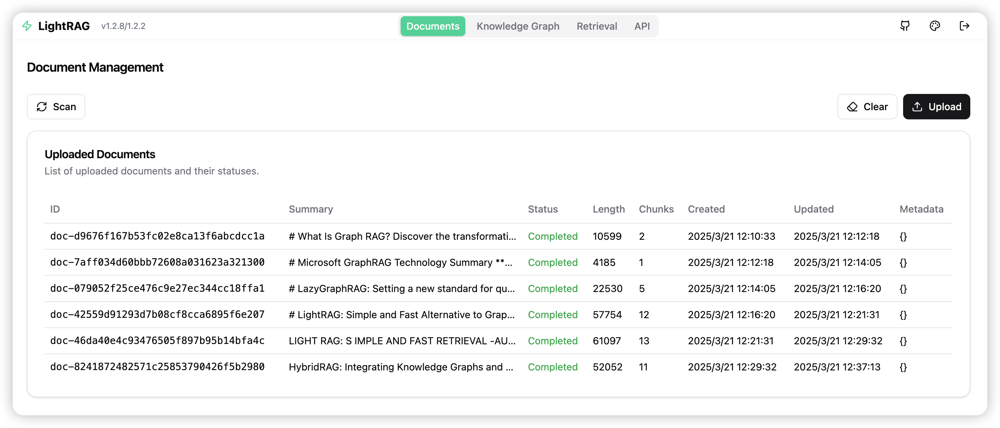

# LightRAG Server and WebUI

The LightRAG Server is designed to provide a Web UI and API support. The Web UI facilitates document indexing, knowledge graph exploration, and a simple RAG query interface. LightRAG Server also provides an Ollama-compatible interface, aiming to emulate LightRAG as an Ollama chat model. This allows AI chat bots, such as Open WebUI, to access LightRAG easily.




## Getting Started

### Installation

* Install from PyPI

```bash
pip install "lightrag-hku[api]"
```

* Installation from Source

```bash
# Clone the repository
git clone https://github.com/HKUDS/lightrag.git

# Change to the repository directory
cd lightrag

# Create a Python virtual environment
uv venv --seed --python 3.12
source .venv/bin/activate

# Install in editable mode with API support
pip install -e ".[api]"

# Build front-end artifacts
cd lightrag_webui
bun install --frozen-lockfile
bun run build
cd ..
```

### Before Starting LightRAG Server

LightRAG necessitates the integration of both an LLM (Large Language Model) and an Embedding Model to effectively execute document indexing and querying operations. Prior to the initial deployment of the LightRAG server, it is essential to configure the settings for both the LLM and the Embedding Model. LightRAG supports binding to various LLM/Embedding backends:

* ollama
* lollms
* openai or openai compatible
* azure_openai
* aws_bedrock

It is recommended to use environment variables to configure the LightRAG Server. There is an example environment variable file named `env.example` in the root directory of the project. Please copy this file to the startup directory and rename it to `.env`. After that, you can modify the parameters related to the LLM and Embedding models in the `.env` file. It is important to note that the LightRAG Server will load the environment variables from `.env` into the system environment variables each time it starts. **LightRAG Server will prioritize the settings in the system environment variables to .env file**.

> Since VS Code with the Python extension may automatically load the .env file in the integrated terminal, please open a new terminal session after each modification to the .env file.

Here are some examples of common settings for LLM and Embedding models:

* OpenAI LLM + Ollama Embedding:

```
LLM_BINDING=openai
LLM_MODEL=gpt-4o
LLM_BINDING_HOST=https://api.openai.com/v1
LLM_BINDING_API_KEY=your_api_key

EMBEDDING_BINDING=ollama
EMBEDDING_BINDING_HOST=http://localhost:11434
EMBEDDING_MODEL=bge-m3:latest
EMBEDDING_DIM=1024
# EMBEDDING_BINDING_API_KEY=your_api_key
```

* Ollama LLM + Ollama Embedding:

```
LLM_BINDING=ollama
LLM_MODEL=mistral-nemo:latest
LLM_BINDING_HOST=http://localhost:11434
# LLM_BINDING_API_KEY=your_api_key
###  Ollama Server context length (Must be larger than MAX_TOTAL_TOKENS+2000)
OLLAMA_LLM_NUM_CTX=16384

EMBEDDING_BINDING=ollama
EMBEDDING_BINDING_HOST=http://localhost:11434
EMBEDDING_MODEL=bge-m3:latest
EMBEDDING_DIM=1024
# EMBEDDING_BINDING_API_KEY=your_api_key
```

> **Important Note**: The Embedding model must be determined before document indexing, and the same model must be used during the document query phase. For certain storage solutions (e.g., PostgreSQL), the vector dimension must be defined upon initial table creation. Therefore, when changing embedding models, it is necessary to delete the existing vector-related tables and allow LightRAG to recreate them with the new dimensions.

### Starting LightRAG Server

The LightRAG Server supports two operational modes:
* The simple and efficient Uvicorn mode:

```
lightrag-server
```
* The multiprocess Gunicorn + Uvicorn mode (production mode, not supported on Windows environments):

```
lightrag-gunicorn --workers 4
```

When starting LightRAG, the current working directory must contain the `.env` configuration file. **It is intentionally designed that the `.env` file must be placed in the startup directory**. The purpose of this is to allow users to launch multiple LightRAG instances simultaneously and configure different `.env` files for different instances. **After modifying the `.env` file, you need to reopen the terminal for the new settings to take effect.** This is because each time LightRAG Server starts, it loads the environment variables from the `.env` file into the system environment variables, and system environment variables have higher precedence.

During startup, configurations in the `.env` file can be overridden by command-line parameters. Common command-line parameters include:

- `--host`: Server listening address (default: 0.0.0.0)
- `--port`: Server listening port (default: 9621)
- `--timeout`: LLM request timeout (default: 150 seconds)
- `--log-level`: Log level (default: INFO)
- `--working-dir`: Database persistence directory (default: ./rag_storage)
- `--input-dir`: Directory for uploaded files (default: ./inputs)
- `--workspace`: Workspace name, used to logically isolate data between multiple LightRAG instances (default: empty)

### Launching LightRAG Server with Docker

Using Docker Compose is the most convenient way to deploy and run the LightRAG Server.

* Create a project directory.

* Copy the `docker-compose.yml` file from the LightRAG repository into your project directory.

* Prepare the `.env` file: Duplicate the sample file [`env.example`](https://ai.znipower.com:5013/c/env.example)to create a customized `.env` file, and configure the LLM and embedding parameters according to your specific requirements.

* Start the LightRAG Server with the following command:

```shell
docker compose up
# If you want the program to run in the background after startup, add the -d parameter at the end of the command.
```

You can get the official docker compose file from here: [docker-compose.yml](https://raw.githubusercontent.com/HKUDS/LightRAG/refs/heads/main/docker-compose.yml). For historical versions of LightRAG docker images, visit this link: [LightRAG Docker Images](https://github.com/HKUDS/LightRAG/pkgs/container/lightrag). For more details about docker deployment, please refer to [DockerDeployment.md](./../../docs/DockerDeployment.md).

### Offline Deployment

Official LightRAG Docker images are fully compatible with offline or air-gapped environments. If you want to build up you own  offline enviroment, please refer to [Offline Deployment Guide](./../../docs/OfflineDeployment.md).

### Starting Multiple LightRAG Instances

There are two ways to start multiple LightRAG instances. The first way is to configure a completely independent working environment for each instance. This requires creating a separate working directory for each instance and placing a dedicated `.env` configuration file in that directory. The server listening ports in the configuration files of different instances cannot be the same. Then, you can start the service by running `lightrag-server` in the working directory.

The second way is for all instances to share the same set of `.env` configuration files, and then use command-line arguments to specify different server listening ports and workspaces for each instance. You can start multiple LightRAG instances in the same working directory with different command-line arguments. For example:

```
# Start instance 1
lightrag-server --port 9621 --workspace space1

# Start instance 2
lightrag-server --port 9622 --workspace space2
```

The purpose of a workspace is to achieve data isolation between different instances. Therefore, the `workspace` parameter must be different for different instances; otherwise, it will lead to data confusion and corruption.

When launching multiple LightRAG instances via Docker Compose, simply specify unique `WORKSPACE` and `PORT` environment variables for each container within your `docker-compose.yml`. Even if all instances share a common `.env` file, the container-specific environment variables defined in Compose will take precedence, ensuring independent configurations for each instance.

### Data Isolation Between LightRAG Instances

Configuring an independent working directory and a dedicated `.env` configuration file for each instance can generally ensure that locally persisted files in the in-memory database are saved in their respective working directories, achieving data isolation. By default, LightRAG uses all in-memory databases, and this method of data isolation is sufficient. However, if you are using an external database, and different instances access the same database instance, you need to use workspaces to achieve data isolation; otherwise, the data of different instances will conflict and be destroyed.

The command-line `workspace` argument and the `WORKSPACE` environment variable in the `.env` file can both be used to specify the workspace name for the current instance, with the command-line argument having higher priority. Here is how workspaces are implemented for different types of storage:

- **For local file-based databases, data isolation is achieved through workspace subdirectories:** `JsonKVStorage`, `JsonDocStatusStorage`, `NetworkXStorage`, `NanoVectorDBStorage`, `FaissVectorDBStorage`.
- **For databases that store data in collections, it's done by adding a workspace prefix to the collection name:** `RedisKVStorage`, `RedisDocStatusStorage`, `MilvusVectorDBStorage`, `QdrantVectorDBStorage`, `MongoKVStorage`, `MongoDocStatusStorage`, `MongoVectorDBStorage`, `MongoGraphStorage`, `PGGraphStorage`.
- **For relational databases, data isolation is achieved by adding a `workspace` field to the tables for logical data separation:** `PGKVStorage`, `PGVectorStorage`, `PGDocStatusStorage`.
- **For graph databases, logical data isolation is achieved through labels:** `Neo4JStorage`, `MemgraphStorage`

To maintain compatibility with legacy data, the default workspace for PostgreSQL is `default` and for Neo4j is `base` when no workspace is configured. For all external storages, the system provides dedicated workspace environment variables to override the common `WORKSPACE` environment variable configuration. These storage-specific workspace environment variables are: `REDIS_WORKSPACE`, `MILVUS_WORKSPACE`, `QDRANT_WORKSPACE`, `MONGODB_WORKSPACE`, `POSTGRES_WORKSPACE`, `NEO4J_WORKSPACE`, `MEMGRAPH_WORKSPACE`.

### Multiple workers for Gunicorn + Uvicorn

The LightRAG Server can operate in the `Gunicorn + Uvicorn` preload mode. Gunicorn's multiple worker (multiprocess) capability prevents document indexing tasks from blocking RAG queries. Using CPU-exhaustive document extraction tools, such as docling, can lead to the entire system being blocked in pure Uvicorn mode.

Though LightRAG Server uses one worker to process the document indexing pipeline, with the async task support of Uvicorn, multiple files can be processed in parallel. The bottleneck of document indexing speed mainly lies with the LLM. If your LLM supports high concurrency, you can accelerate document indexing by increasing the concurrency level of the LLM. Below are several environment variables related to concurrent processing, along with their default values:

```
### Number of worker processes, not greater than (2 x number_of_cores) + 1
WORKERS=2
### Number of parallel files to process in one batch
MAX_PARALLEL_INSERT=2
### Max concurrent requests to the LLM
MAX_ASYNC=4
```

### Install LightRAG as a Linux Service

Create your service file `lightrag.service` from the sample file: `lightrag.service.example`. Modify the `WorkingDirectory` and `ExecStart` in the service file:

```text
Description=LightRAG Ollama Service
WorkingDirectory=<lightrag installed directory>
ExecStart=<lightrag installed directory>/lightrag/api/lightrag-api
```

Modify your service startup script: `lightrag-api`. Change your Python virtual environment activation command as needed:

```shell
#!/bin/bash

# your python virtual environment activation
source /home/netman/lightrag-xyj/venv/bin/activate
# start lightrag api server
lightrag-server
```

Install LightRAG service. If your system is Ubuntu, the following commands will work:

```shell
sudo cp lightrag.service /etc/systemd/system/
sudo systemctl daemon-reload
sudo systemctl start lightrag.service
sudo systemctl status lightrag.service
sudo systemctl enable lightrag.service
```

## Ollama Emulation

We provide Ollama-compatible interfaces for LightRAG, aiming to emulate LightRAG as an Ollama chat model. This allows AI chat frontends supporting Ollama, such as Open WebUI, to access LightRAG easily.

### Connect Open WebUI to LightRAG

After starting the lightrag-server, you can add an Ollama-type connection in the Open WebUI admin panel. And then a model named `lightrag:latest` will appear in Open WebUI's model management interface. Users can then send queries to LightRAG through the chat interface. You should install LightRAG as a service for this use case.

Open WebUI uses an LLM to do the session title and session keyword generation task. So the Ollama chat completion API detects and forwards OpenWebUI session-related requests directly to the underlying LLM. Screenshot from Open WebUI:


### Choose Query mode in chat

The default query mode is `hybrid` if you send a message (query) from the Ollama interface of LightRAG. You can select query mode by sending a message with a query prefix.

A query prefix in the query string can determine which LightRAG query mode is used to generate the response for the query. The supported prefixes include:

```
/local
/global
/hybrid
/naive
/mix

/bypass
/context
/localcontext
/globalcontext
/hybridcontext
/naivecontext
/mixcontext
```

For example, the chat message `/mix What's LightRAG?` will trigger a mix mode query for LightRAG. A chat message without a query prefix will trigger a hybrid mode query by default.

`/bypass` is not a LightRAG query mode; it will tell the API Server to pass the query directly to the underlying LLM, including the chat history. So the user can use the LLM to answer questions based on the chat history. If you are using Open WebUI as a front end, you can just switch the model to a normal LLM instead of using the `/bypass` prefix.

`/context` is also not a LightRAG query mode; it will tell LightRAG to return only the context information prepared for the LLM. You can check the context if it's what you want, or process the context by yourself.

### Add user prompt in chat

When using LightRAG for content queries, avoid combining the search process with unrelated output processing, as this significantly impacts query effectiveness. User prompt is specifically designed to address this issue — it does not participate in the RAG retrieval phase, but rather guides the LLM on how to process the retrieved results after the query is completed. We can append square brackets to the query prefix to provide the LLM with the user prompt:

```
/[Use mermaid format for diagrams] Please draw a character relationship diagram for Scrooge
/mix[Use mermaid format for diagrams] Please draw a character relationship diagram for Scrooge
```

## API Key and Authentication

By default, the LightRAG Server can be accessed without any authentication. We can configure the server with an API Key or account credentials to secure it.

* API Key:

```
LIGHTRAG_API_KEY=your-secure-api-key-here
WHITELIST_PATHS=/health,/api/*
```

> Health check and Ollama emulation endpoints are excluded from API Key check by default. For security reasons, remove `/api/*` from `WHITELIST_PATHS` if the Ollama service is not required.

The API key is passed using the request header `X-API-Key`. Below is an example of accessing the LightRAG Server via API:

```
curl -X 'POST' \
  'http://localhost:9621/documents/scan' \
  -H 'accept: application/json' \
  -H 'X-API-Key: your-secure-api-key-here-123' \
  -d ''
```

* Account credentials (the Web UI requires login before access can be granted):

LightRAG API Server implements JWT-based authentication using the HS256 algorithm. To enable secure access control, the following environment variables are required:

```bash
# For jwt auth
AUTH_ACCOUNTS='admin:admin123,user1:pass456'
TOKEN_SECRET='your-key'
TOKEN_EXPIRE_HOURS=4
```

> Currently, only the configuration of an administrator account and password is supported. A comprehensive account system is yet to be developed and implemented.

If Account credentials are not configured, the Web UI will access the system as a Guest. Therefore, even if only an API Key is configured, all APIs can still be accessed through the Guest account, which remains insecure. Hence, to safeguard the API, it is necessary to configure both authentication methods simultaneously.

## For Azure OpenAI Backend

Azure OpenAI API can be created using the following commands in Azure CLI (you need to install Azure CLI first from [https://docs.microsoft.com/en-us/cli/azure/install-azure-cli](https://docs.microsoft.com/en-us/cli/azure/install-azure-cli)):

```bash
# Change the resource group name, location, and OpenAI resource name as needed
RESOURCE_GROUP_NAME=LightRAG
LOCATION=swedencentral
RESOURCE_NAME=LightRAG-OpenAI

az login
az group create --name $RESOURCE_GROUP_NAME --location $LOCATION
az cognitiveservices account create --name $RESOURCE_NAME --resource-group $RESOURCE_GROUP_NAME  --kind OpenAI --sku S0 --location swedencentral
az cognitiveservices account deployment create --resource-group $RESOURCE_GROUP_NAME  --model-format OpenAI --name $RESOURCE_NAME --deployment-name gpt-4o --model-name gpt-4o --model-version "2024-08-06"  --sku-capacity 100 --sku-name "Standard"
az cognitiveservices account deployment create --resource-group $RESOURCE_GROUP_NAME  --model-format OpenAI --name $RESOURCE_NAME --deployment-name text-embedding-3-large --model-name text-embedding-3-large --model-version "1"  --sku-capacity 80 --sku-name "Standard"
az cognitiveservices account show --name $RESOURCE_NAME --resource-group $RESOURCE_GROUP_NAME --query "properties.endpoint"
az cognitiveservices account keys list --name $RESOURCE_NAME -g $RESOURCE_GROUP_NAME

```

The output of the last command will give you the endpoint and the key for the OpenAI API. You can use these values to set the environment variables in the `.env` file.

```
# Azure OpenAI Configuration in .env:
LLM_BINDING=azure_openai
LLM_BINDING_HOST=your-azure-endpoint
LLM_MODEL=your-model-deployment-name
LLM_BINDING_API_KEY=your-azure-api-key
### API version is optional, defaults to latest version
AZURE_OPENAI_API_VERSION=2024-08-01-preview

### If using Azure OpenAI for embeddings
EMBEDDING_BINDING=azure_openai
EMBEDDING_MODEL=your-embedding-deployment-name
```

## LightRAG Server Configuration in Detail

The API Server can be configured in three ways (highest priority first):

* Command line arguments
* Environment variables or .env file
* Config.ini (Only for storage configuration)

Most of the configurations come with default settings; check out the details in the sample file: `.env.example`. Data storage configuration can also be set by config.ini. A sample file `config.ini.example` is provided for your convenience.

### LLM and Embedding Backend Supported

LightRAG supports binding to various LLM/Embedding backends:

* ollama
* openai (including openai compatible)
* azure_openai
* lollms
* aws_bedrock

Use environment variables `LLM_BINDING` or CLI argument `--llm-binding` to select the LLM backend type. Use environment variables `EMBEDDING_BINDING` or CLI argument `--embedding-binding` to select the Embedding backend type.

For LLM and embedding configuration examples, please refer to the `env.example` file in the project's root directory. To view the complete list of configurable options for OpenAI and Ollama-compatible LLM interfaces, use the following commands:
```
lightrag-server --llm-binding openai --help
lightrag-server --llm-binding ollama --help
lightrag-server --embedding-binding ollama --help
```

> Please use OpenAI-compatible method to access LLMs deployed by OpenRouter or vLLM/SGLang. You can pass additional parameters to OpenRouter or vLLM/SGLang through the `OPENAI_LLM_EXTRA_BODY` environment variable to disable reasoning mode or achieve other personalized controls.

Set the max_tokens to **prevent excessively long or endless output loop** during the entity relationship extraction phase for Large Language Model (LLM) responses.  The purpose of setting max_tokens parameter is to truncate LLM output before timeouts occur, thereby preventing document extraction failures. This addresses issues where certain text blocks (e.g., tables or citations) containing numerous entities and relationships can lead to overly long or even endless loop outputs from LLMs. This setting is particularly crucial for locally deployed, smaller-parameter models. Max tokens value can be calculated by this formula: `LLM_TIMEOUT * llm_output_tokens/second` (i.e. `180s * 50 tokens/s = 9000`)

```
# For vLLM/SGLang doployed models, or most of OpenAI compatible API provider
OPENAI_LLM_MAX_TOKENS=9000

# For Ollama Deployed Modeles
OLLAMA_LLM_NUM_PREDICT=9000

# For OpenAI o1-mini or newer modles
OPENAI_LLM_MAX_COMPLETION_TOKENS=9000
```

### Entity Extraction Configuration

* ENABLE_LLM_CACHE_FOR_EXTRACT: Enable LLM cache for entity extraction (default: true)

It's very common to set `ENABLE_LLM_CACHE_FOR_EXTRACT` to true for a test environment to reduce the cost of LLM calls.

### Storage Types Supported

LightRAG uses 4 types of storage for different purposes:

* KV_STORAGE: llm response cache, text chunks, document information
* VECTOR_STORAGE: entities vectors, relation vectors, chunks vectors
* GRAPH_STORAGE: entity relation graph
* DOC_STATUS_STORAGE: document indexing status

LightRAG Server offers various storage implementations, with the default being an in-memory database that persists data to the WORKING_DIR directory. Additionally, LightRAG supports a wide range of storage solutions including PostgreSQL, MongoDB, FAISS, Milvus, Qdrant, Neo4j, Memgraph, and Redis. For detailed information on supported storage options, please refer to the storage section in the README.md file located in the root directory.

You can select the storage implementation by configuring environment variables. For instance, prior to the initial launch of the API server, you can set the following environment variable to specify your desired storage implementation:

```
LIGHTRAG_KV_STORAGE=PGKVStorage
LIGHTRAG_VECTOR_STORAGE=PGVectorStorage
LIGHTRAG_GRAPH_STORAGE=PGGraphStorage
LIGHTRAG_DOC_STATUS_STORAGE=PGDocStatusStorage
```

You cannot change storage implementation selection after adding documents to LightRAG. Data migration from one storage implementation to another is not supported yet. For further information, please read the sample env file or config.ini file.

### LLM Cache Migration Between Storage Types

When switching the storage implementation in LightRAG, the LLM cache can be migrated from the existing storage to the new one. Subsequently, when re-uploading files to the new storage, the pre-existing LLM cache will significantly accelerate file processing. For detailed instructions on using the LLM cache migration tool, please refer to[README_MIGRATE_LLM_CACHE.md](../tools/README_MIGRATE_LLM_CACHE.md)

### LightRAG API Server Command Line Options

| Parameter             | Default       | Description                                                                                                                     |
| --------------------- | ------------- | ------------------------------------------------------------------------------------------------------------------------------- |
| --host                | 0.0.0.0       | Server host                                                                                                                     |
| --port                | 9621          | Server port                                                                                                                     |
| --working-dir         | ./rag_storage | Working directory for RAG storage                                                                                               |
| --input-dir           | ./inputs      | Directory containing input documents                                                                                            |
| --max-async           | 4             | Maximum number of async operations                                                                                              |
| --log-level           | INFO          | Logging level (DEBUG, INFO, WARNING, ERROR, CRITICAL)                                                                           |
| --verbose             | -             | Verbose debug output (True, False)                                                                                              |
| --key                 | None          | API key for authentication. Protects the LightRAG server against unauthorized access                                            |
| --ssl                 | False         | Enable HTTPS                                                                                                                    |
| --ssl-certfile        | None          | Path to SSL certificate file (required if --ssl is enabled)                                                                     |
| --ssl-keyfile         | None          | Path to SSL private key file (required if --ssl is enabled)                                                                     |
| --llm-binding         | ollama        | LLM binding type (lollms, ollama, openai, openai-ollama, azure_openai, aws_bedrock)                                                          |
| --embedding-binding   | ollama        | Embedding binding type (lollms, ollama, openai, azure_openai, aws_bedrock)                                                                   |

### Reranking Configuration

Reranking query-recalled chunks can significantly enhance retrieval quality by re-ordering documents based on an optimized relevance scoring model. LightRAG currently supports the following rerank providers:

- **Cohere / vLLM**: Offers full API integration with Cohere AI's `v2/rerank` endpoint. As vLLM provides a Cohere-compatible reranker API, all reranker models deployed via vLLM are also supported.
- **Jina AI**: Provides complete implementation compatibility with all Jina rerank models.
- **Aliyun**: Features a custom implementation designed to support Aliyun's rerank API format.

The rerank provider is configured via the `.env` file. Below is an example configuration for a rerank model deployed locally using vLLM:

```
RERANK_BINDING=cohere
RERANK_MODEL=BAAI/bge-reranker-v2-m3
RERANK_BINDING_HOST=http://localhost:8000/v1/rerank
RERANK_BINDING_API_KEY=your_rerank_api_key_here
```

Here is an example configuration for utilizing the Reranker service provided by Aliyun:

```
RERANK_BINDING=aliyun
RERANK_MODEL=gte-rerank-v2
RERANK_BINDING_HOST=https://dashscope.aliyuncs.com/api/v1/services/rerank/text-rerank/text-rerank
RERANK_BINDING_API_KEY=your_rerank_api_key_here
```

For comprehensive reranker configuration examples, please refer to the `env.example` file.

### Enable Reranking

Reranking can be enabled or disabled on a per-query basis.

The `/query` and `/query/stream` API endpoints include an `enable_rerank` parameter, which is set to `true` by default, controlling whether reranking is active for the current query. To change the default value of the `enable_rerank` parameter to `false`, set the following environment variable:

```
RERANK_BY_DEFAULT=False
```

### Include Chunk Content in References

By default, the `/query` and `/query/stream` endpoints return references with only `reference_id` and `file_path`. For evaluation, debugging, or citation purposes, you can request the actual retrieved chunk content to be included in references.

The `include_chunk_content` parameter (default: `false`) controls whether the actual text content of retrieved chunks is included in the response references. This is particularly useful for:

- **RAG Evaluation**: Testing systems like RAGAS that need access to retrieved contexts
- **Debugging**: Verifying what content was actually used to generate the answer
- **Citation Display**: Showing users the exact text passages that support the response
- **Transparency**: Providing full visibility into the RAG retrieval process

**Example API Request:**

```json
{
  "query": "What is LightRAG?",
  "mode": "mix",
  "include_references": true,
  "include_chunk_content": true
}
```

**Example Response (with chunk content):**

```json
{
  "response": "LightRAG is a graph-based RAG system...",
  "references": [
    {
      "reference_id": "1",
      "file_path": "/documents/intro.md",
      "content": "LightRAG is a retrieval-augmented generation system that combines knowledge graphs with vector similarity search..."
    },
    {
      "reference_id": "2",
      "file_path": "/documents/features.md",
      "content": "The system provides multiple query modes including local, global, hybrid, and mix modes..."
    }
  ]
}
```

**Note**: This parameter only works when `include_references=true`. Setting `include_chunk_content=true` without including references has no effect.

### .env Examples

```bash
### Server Configuration
# HOST=0.0.0.0
PORT=9621
WORKERS=2

### Settings for document indexing
ENABLE_LLM_CACHE_FOR_EXTRACT=true
SUMMARY_LANGUAGE=Chinese
MAX_PARALLEL_INSERT=2

### LLM Configuration (Use valid host. For local services installed with docker, you can use host.docker.internal)
TIMEOUT=150
MAX_ASYNC=4

LLM_BINDING=openai
LLM_MODEL=gpt-4o-mini
LLM_BINDING_HOST=https://api.openai.com/v1
LLM_BINDING_API_KEY=your-api-key

### Embedding Configuration (Use valid host. For local services installed with docker, you can use host.docker.internal)
# see also env.ollama-binding-options.example for fine tuning ollama
EMBEDDING_MODEL=bge-m3:latest
EMBEDDING_DIM=1024
EMBEDDING_BINDING=ollama
EMBEDDING_BINDING_HOST=http://localhost:11434

### For JWT Auth
# AUTH_ACCOUNTS='admin:admin123,user1:pass456'
# TOKEN_SECRET=your-key-for-LightRAG-API-Server-xxx
# TOKEN_EXPIRE_HOURS=48

# LIGHTRAG_API_KEY=your-secure-api-key-here-123
# WHITELIST_PATHS=/api/*
# WHITELIST_PATHS=/health,/api/*

```

## Document and Chunk  Processing Login Clarification

The document processing pipeline in LightRAG is somewhat complex and is divided into two primary stages: the Extraction stage (entity and relationship extraction) and the Merging stage (entity and relationship merging). There are two key parameters that control pipeline concurrency: the maximum number of files processed in parallel (MAX_PARALLEL_INSERT) and the maximum number of concurrent LLM requests (MAX_ASYNC). The workflow is described as follows:

1. MAX_ASYNC limits the total number of concurrent LLM requests in the system, including those for querying, extraction, and merging. LLM requests have different priorities: query operations have the highest priority, followed by merging, and then extraction.
2. MAX_PARALLEL_INSERT controls the number of files processed in parallel during the extraction stage. For optimal performance, MAX_PARALLEL_INSERT is recommended to be set between 2 and 10, typically MAX_ASYNC/3. Setting this value too high can increase the likelihood of naming conflicts among entities and relationships across different documents during the merge phase, thereby reducing its overall efficiency.
3. Within a single file, entity and relationship extractions from different text blocks are processed concurrently, with the degree of concurrency set by MAX_ASYNC. Only after MAX_ASYNC text blocks are processed will the system proceed to the next batch within the same file.
4. When a file completes entity and relationship extraction, it enters the entity and relationship merging stage. This stage also processes multiple entities and relationships concurrently, with the concurrency level also controlled by `MAX_ASYNC`.
5. LLM requests for the merging stage are prioritized over the extraction stage to ensure that files in the merging phase are processed quickly and their results are promptly updated in the vector database.
6. To prevent race conditions, the merging stage avoids concurrent processing of the same entity or relationship. When multiple files involve the same entity or relationship that needs to be merged, they are processed serially.
7. Each file is treated as an atomic processing unit in the pipeline. A file is marked as successfully processed only after all its text blocks have completed extraction and merging. If any error occurs during processing, the entire file is marked as failed and must be reprocessed.
8. When a file is reprocessed due to errors, previously processed text blocks can be quickly skipped thanks to LLM caching. Although LLM cache is also utilized during the merging stage, inconsistencies in merging order may limit its effectiveness in this stage.
9. If an error occurs during extraction, the system does not retain any intermediate results. If an error occurs during merging, already merged entities and relationships might be preserved; when the same file is reprocessed, re-extracted entities and relationships will be merged with the existing ones, without impacting the query results.
10. At the end of the merging stage, all entity and relationship data are updated in the vector database. Should an error occur at this point, some updates may be retained. However, the next processing attempt will overwrite previous results, ensuring that successfully reprocessed files do not affect the integrity of future query results.

Large files should be divided into smaller segments to enable incremental processing. Reprocessing of failed files can be initiated by pressing the "Scan" button on the web UI.

## API Endpoints

All servers (LoLLMs, Ollama, OpenAI and Azure OpenAI) provide the same REST API endpoints for RAG functionality. When the API Server is running, visit:

- Swagger UI: http://localhost:9621/docs
- ReDoc: http://localhost:9621/redoc

You can test the API endpoints using the provided curl commands or through the Swagger UI interface. Make sure to:

1. Start the appropriate backend service (LoLLMs, Ollama, or OpenAI)
2. Start the RAG server
3. Upload some documents using the document management endpoints
4. Query the system using the query endpoints
5. Trigger document scan if new files are put into the inputs directory

### Graph Manipulation Endpoints

LightRAG provides REST API endpoints for direct knowledge graph manipulation:

#### Create Entity

Create a new entity in the knowledge graph:

```bash
curl -X POST "http://localhost:9621/graph/entity/create" \
  -H "Content-Type: application/json" \
  -d '{
    "entity_name": "Tesla",
    "entity_data": {
      "description": "Electric vehicle manufacturer",
      "entity_type": "ORGANIZATION"
    }
  }'
```

#### Create Relationship

Create a new relationship between two existing entities:

```bash
curl -X POST "http://localhost:9621/graph/relation/create" \
  -H "Content-Type: application/json" \
  -d '{
    "source_entity": "Elon Musk",
    "target_entity": "Tesla",
    "relation_data": {
      "description": "Elon Musk is the CEO of Tesla",
      "keywords": "CEO, founder",
      "weight": 1.0
    }
  }'
```

#### Merge Entities

Consolidate duplicate or misspelled entities while preserving all relationships:

```bash
curl -X POST "http://localhost:9621/graph/entities/merge" \
  -H "Content-Type: application/json" \
  -d '{
    "entities_to_change": ["Elon Msk", "Ellon Musk"],
    "entity_to_change_into": "Elon Musk"
  }'
```

**What the merge operation does:**
- Deletes the specified source entities
- Transfers all relationships from source entities to the target entity
- Intelligently merges duplicate relationships
- Updates vector embeddings for accurate retrieval
- Preserves the entire graph structure

This is particularly useful for:
- Fixing spelling errors in entity names
- Consolidating duplicate entities discovered after document processing
- Cleaning up the knowledge graph for better query performance

## Asynchronous Document Indexing with Progress Tracking

LightRAG implements asynchronous document indexing to enable frontend monitoring and querying of document processing progress. Upon uploading files or inserting text through designated endpoints, a unique Track ID is returned to facilitate real-time progress monitoring.

**API Endpoints Supporting Track ID Generation:**

* `/documents/upload`
* `/documents/text`
* `/documents/texts`

**Document Processing Status Query Endpoint:**
* `/track_status/{track_id}`

This endpoint provides comprehensive status information including:
* Document processing status (pending/processing/processed/failed)
* Content summary and metadata
* Error messages if processing failed
* Timestamps for creation and updates
