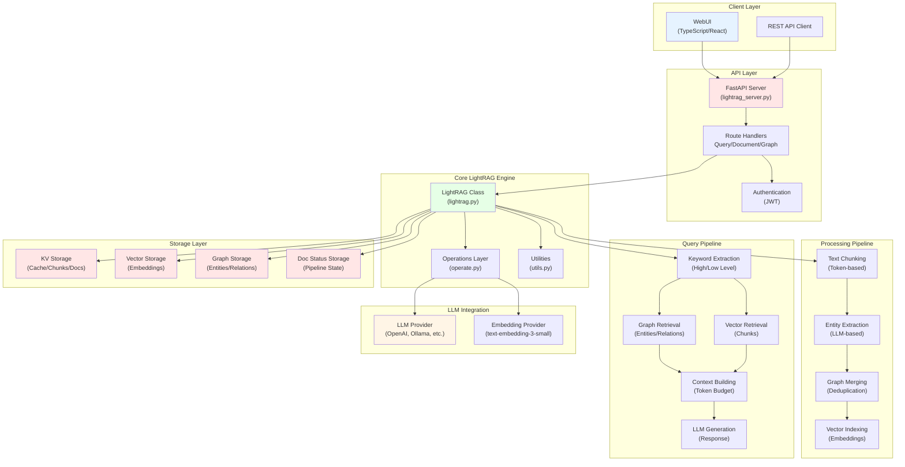

# Executive Summary: LightRAG TypeScript Migration

## Overview

LightRAG (Light Retrieval-Augmented Generation) is a sophisticated, graph-based RAG system implemented in Python that combines knowledge graph construction with vector retrieval to deliver contextually rich question-answering capabilities. This document provides comprehensive technical analysis to enable a production-ready TypeScript/Node.js reimplementation.

**Repository**: [HKUDS/LightRAG](https://github.com/HKUDS/LightRAG)  
**Paper**: EMNLP 2025 - "LightRAG: Simple and Fast Retrieval-Augmented Generation"  
**Current Implementation**: Python 3.10+, ~58 Python files, ~500KB of core code  
**License**: MIT

## System Capabilities

LightRAG delivers a comprehensive RAG solution with the following core capabilities:

### Document Processing Pipeline
The system implements a multi-stage document processing pipeline that transforms raw documents into a queryable knowledge graph. Documents are ingested, split into semantic chunks, processed through LLM-based entity and relationship extraction, and merged into a unified knowledge graph with vector embeddings for retrieval. The pipeline supports multiple file formats (PDF, DOCX, PPTX, CSV, TXT) and handles batch processing with status tracking and error recovery.

### Knowledge Graph Construction
At the heart of LightRAG is an automated knowledge graph construction system that extracts entities and relationships from text using large language models. The system identifies entity types (Person, Organization, Location, Event, Concept, etc.), establishes relationships between entities, and maintains entity descriptions and relationship metadata. Graph merging algorithms consolidate duplicate entities and relationships, while maintaining source attribution and citation tracking.

### Multi-Modal Retrieval Strategies
LightRAG implements six distinct query modes to balance between specificity and coverage:
- **Local Mode**: Focuses on entity-centric retrieval using low-level keywords to find specific, context-dependent information
- **Global Mode**: Emphasizes relationship-centric retrieval using high-level keywords for broader, interconnected insights
- **Hybrid Mode**: Combines local and global results using round-robin merging for balanced coverage
- **Mix Mode**: Integrates knowledge graph data with vector-retrieved document chunks for comprehensive context
- **Naive Mode**: Pure vector retrieval without knowledge graph integration for simple similarity search
- **Bypass Mode**: Direct LLM query without retrieval for general questions

### Flexible Storage Architecture
The system supports multiple storage backends through a pluggable architecture:
- **Key-Value Storage**: JSON files, PostgreSQL, MongoDB, Redis (for LLM cache, chunks, and documents)
- **Vector Storage**: NanoVectorDB, FAISS, Milvus, Qdrant, PostgreSQL with pgvector (for embeddings)
- **Graph Storage**: NetworkX, Neo4j, Memgraph, PostgreSQL (for entity-relationship graphs)
- **Document Status Storage**: JSON files, PostgreSQL, MongoDB (for pipeline tracking)

### Production Features
The system includes enterprise-ready features for production deployment:
- RESTful API with FastAPI and OpenAPI documentation
- WebUI for document management, graph visualization, and querying
- Authentication and authorization (JWT-based)
- Streaming responses for real-time user feedback
- Ollama-compatible API for integration with AI chatbots
- Workspace isolation for multi-tenant deployments
- Pipeline status tracking and monitoring
- Configurable rate limiting and concurrency control
- Error handling and retry mechanisms
- Citation and source attribution support

## Architecture at a Glance

## Key Technical Characteristics

### Async-First Architecture
The entire system is built on Python's asyncio, with extensive use of async/await patterns, semaphores for rate limiting, and task queues for concurrent processing. This design enables efficient handling of I/O-bound operations and supports high concurrency for embedding generation and LLM calls.

### Storage Abstraction Pattern
LightRAG implements a clean abstraction layer over storage backends through base classes (BaseKVStorage, BaseVectorStorage, BaseGraphStorage, DocStatusStorage). This pattern enables seamless switching between different storage implementations without modifying core logic, supporting everything from in-memory JSON files to enterprise databases like PostgreSQL and Neo4j.

### Pipeline-Based Processing
Document ingestion follows a multi-stage pipeline pattern: enqueue → validate → chunk → extract → merge → index. Each stage is idempotent and resumable, with comprehensive status tracking enabling fault tolerance and progress monitoring. Documents flow through the pipeline with track IDs for monitoring and debugging.

### Token Budget Management
The system implements sophisticated token budget management for query contexts, allocating tokens across entities, relationships, and chunks while respecting LLM context window limits. This unified token control system ensures optimal use of available context space and prevents token overflow errors.

### Modular LLM Integration
LLM and embedding providers are abstracted behind function interfaces, supporting multiple providers (OpenAI, Ollama, Anthropic, AWS Bedrock, Azure OpenAI, Hugging Face, and more) with consistent error handling, retry logic, and rate limiting across all providers.

## Key Migration Challenges

### Challenge 1: Monolithic File Structure
**Issue**: Core logic is concentrated in large files (lightrag.py: 141KB, operate.py: 164KB, utils.py: 106KB) with high cyclomatic complexity.  
**Impact**: Direct translation would create unmaintainable TypeScript code.  
**Strategy**: Refactor into smaller, focused modules following single responsibility principle. Break down large classes into composition patterns. Leverage TypeScript's module system for better organization.

### Challenge 2: Python-Specific Language Features
**Issue**: Heavy use of Python dataclasses, decorators (@final, @dataclass), type hints (TypedDict, Literal, overload), and metaprogramming patterns.  
**Impact**: These features don't have direct TypeScript equivalents.  
**Strategy**: Use TypeScript classes with decorators from libraries like class-validator and class-transformer. Leverage TypeScript's type system for Literal types and union types. Replace overload decorators with function overloading syntax.

### Challenge 3: Async/Await Pattern Differences
**Issue**: Python's asyncio model differs from Node.js event loop, particularly in semaphore usage, task cancellation, and exception handling in concurrent operations.  
**Impact**: Concurrency patterns require redesign for Node.js runtime.  
**Strategy**: Use p-limit for semaphore-like behavior, AbortController for cancellation, and Promise.allSettled for concurrent operations with individual error handling. Leverage async iterators for streaming.

### Challenge 4: Storage Driver Ecosystem
**Issue**: Python has mature drivers for PostgreSQL (asyncpg), MongoDB (motor), Neo4j (neo4j-driver), Redis (redis-py), while Node.js alternatives have different APIs and capabilities.  
**Impact**: Storage layer requires careful driver selection and adapter implementation.  
**Strategy**: Use node-postgres for PostgreSQL, mongodb driver for MongoDB, neo4j-driver-lite for Neo4j, ioredis for Redis. Create consistent adapter layer to abstract driver differences.

### Challenge 5: Embedding and Tokenization Libraries
**Issue**: tiktoken (OpenAI's tokenizer) and sentence-transformers have limited or no Node.js support.  
**Impact**: Need alternative approaches for tokenization and local embeddings.  
**Strategy**: Use @dqbd/tiktoken (WASM port) for tokenization, or js-tiktoken as alternative. For embeddings, use OpenAI API, Hugging Face Inference API, or ONNX Runtime for local model inference.

### Challenge 6: Complex State Management
**Issue**: Python uses global dictionaries and namespace-based state management (global_config, pipeline_status, keyed locks) with multiprocessing considerations.  
**Impact**: State management in Node.js requires different patterns.  
**Strategy**: Use class-based state management with dependency injection. Implement singleton pattern for shared state. Use Redis or similar for distributed state in multi-process deployments.

## Recommended TypeScript Technology Stack

### Runtime and Core
- **Runtime**: Bun 1.1+ (ultra-fast JavaScript runtime with native TypeScript support, 3x faster than Node.js)
- **Language**: TypeScript 5.3+ (for latest type system features)
- **Build Tool**: Bun's built-in bundler (no additional build tools needed)
- **Package Manager**: Bun's built-in package manager (faster than pnpm/npm)
- **Alternative Runtime**: Node.js 20 LTS (for environments where Bun is not available)

### Web Framework
- **API Framework**: Hono (ultrafast web framework, 3-4x faster than Express, works on any runtime)
- **Validation**: Zod (type-safe validation, perfect with TypeScript)
- **OpenAPI**: @hono/zod-openapi (Hono middleware for OpenAPI generation)
- **Alternative**: Fastify (if Node.js-specific features are needed)

### Database and ORM
- **ORM**: Drizzle ORM (type-safe, lightweight, SQL-like query builder)
- **PostgreSQL**: postgres.js or pg (connection driver for Drizzle)
- **MongoDB**: mongodb driver with TypeScript support
- **Neo4j**: neo4j-driver with TypeScript bindings
- **Redis**: ioredis (best TypeScript support)
- **Vector**: @pinecone-database/pinecone, @qdrant/js-client-rest, or Drizzle with pgvector extension

### LLM and Embeddings
- **OpenAI**: openai (official SDK)
- **Anthropic**: @anthropic-ai/sdk
- **Generic LLM**: langchain or custom adapters
- **Tokenization**: @dqbd/tiktoken or js-tiktoken
- **Embeddings**: OpenAI API, or @xenova/transformers for local

### Utilities
- **Async Control**: p-limit, p-queue, bottleneck
- **Logging**: pino (fast, structured logging, Bun-compatible)
- **Configuration**: Bun's built-in environment handling or dotenv
- **Testing**: Bun's built-in test runner (faster than vitest) or vitest
- **Hashing**: Bun's built-in crypto (native performance)
- **JSON Repair**: json-repair

### Why Bun + Drizzle + Hono?

**Bun Benefits:**
- 🚀 **3x faster** runtime than Node.js for I/O operations
- 📦 **Built-in** TypeScript, JSX, bundler, and test runner
- ⚡ **Fast startup** time (important for serverless/edge deployment)
- 🔋 **Lower memory** usage
- 🛠️ **Node.js compatible** - can run most Node.js packages
- 💰 **Reduced infrastructure** costs due to better performance

**Drizzle ORM Benefits:**
- 🎯 **Type-safe** queries with full TypeScript inference
- 🪶 **Lightweight** - only 40KB gzipped
- 📝 **SQL-like** syntax - easy to learn and debug
- 🔄 **Auto-generated** migrations
- ⚡ **Fast** - no overhead, direct SQL generation
- 🔌 **Multi-database** support (PostgreSQL, MySQL, SQLite)
- 🧩 **Composable** queries for complex graph operations

**Hono Benefits:**
- ⚡ **Fastest** web framework for JavaScript (faster than Express, Fastify, Koa)
- 🎯 **TypeScript-first** design
- 🌐 **Runtime agnostic** - works on Bun, Node.js, Deno, Cloudflare Workers
- 🪶 **Ultra-light** - only 14KB
- 🔧 **Middleware ecosystem** for authentication, CORS, validation
- 📊 **Built-in** Zod integration for type-safe APIs
- 🚀 **Perfect** for edge deployment and serverless functions

## Migration Approach Recommendation

### Phase 1: Core Abstractions (Weeks 1-2)
Establish foundational abstractions: storage interfaces, base classes, type definitions, and configuration management. Set up Bun project with TypeScript and Drizzle ORM. Create schema definitions and migrations for PostgreSQL. This creates the contract layer that all other components will depend on. Implement basic in-memory storage to enable early testing.

### Phase 2: Storage Layer with Drizzle (Weeks 3-5)
Implement storage adapters using Drizzle ORM for PostgreSQL (primary), graphology for graph storage, and in-memory vector storage. Define Drizzle schemas for KV storage, document status, and relational data. Implement vector storage using Drizzle with pgvector extension. Create connection pooling and transaction management. Each storage type should pass identical test suites regardless of backend.

### Phase 3: LLM Integration (Weeks 4-6, parallel)
Build LLM and embedding provider adapters, starting with OpenAI as reference implementation. Implement retry logic using p-retry, rate limiting with p-limit, and error handling with custom error classes. Create abstract interfaces that other providers (Anthropic, Ollama, Bedrock) can implement. Add streaming support for responses using async iterators. Leverage Bun's fast HTTP client for API calls.

### Phase 4: Core Engine (Weeks 6-8)
Implement the LightRAG core engine: chunking, entity extraction, graph merging, and indexing pipeline. This requires integrating storage, LLM, and utility layers. Focus on making the pipeline idempotent and resumable with comprehensive state tracking using Drizzle transactions. Leverage Bun's performance for concurrent operations.

### Phase 5: Query Pipeline (Weeks 8-10)
Build the query engine with all six retrieval modes (local, global, hybrid, mix, naive, bypass). Implement keyword extraction, graph retrieval with Drizzle joins, vector retrieval with pgvector, context building with token budgets, and response generation. Add support for conversation history and streaming responses. Optimize queries for performance.

### Phase 6: API Layer with Hono (Weeks 10-11)
Develop RESTful API with Hono framework, implementing all endpoints from the Python version. Add JWT authentication middleware, Zod validation schemas, CORS middleware, and OpenAPI documentation using @hono/zod-openapi. Ensure API compatibility with existing WebUI. Leverage Hono's performance for high-throughput scenarios. Add rate limiting and request logging.

### Phase 7: Testing and Optimization (Weeks 11-13)
Comprehensive testing using Bun's built-in test runner or Vitest. Unit tests for all core functions, integration tests for storage and LLM layers, and end-to-end tests for API endpoints. Performance testing and optimization, particularly for concurrent operations. Load testing for production readiness with tools like autocannon or k6. Documentation updates.

### Phase 8: Production Hardening (Weeks 13-14)
Add monitoring with pino logging, error tracking with custom error handlers, health checks for all dependencies, and deployment configurations. Implement graceful shutdown, Drizzle connection pooling, and resource cleanup. Create Docker images optimized for Bun runtime. Add Kubernetes configurations for horizontal scaling. Set up CI/CD pipelines with GitHub Actions.

## Success Metrics

A successful TypeScript implementation should achieve:

1. **Functional Parity**: All query modes, storage backends, and LLM providers working identically to Python version
2. **API Compatibility**: Existing WebUI works without modification against TypeScript API
3. **Performance**: Comparable or better throughput and latency for document ingestion and query operations
4. **Type Safety**: Full TypeScript type coverage with no 'any' types in core logic
5. **Test Coverage**: >80% code coverage with unit and integration tests
6. **Production Ready**: Handles errors gracefully, provides observability, scales horizontally
7. **Documentation**: Complete API documentation, deployment guides, and migration notes

## Next Steps

This executive summary provides the foundation for detailed technical documentation. The following documents dive deeper into:

- **Architecture Documentation**: Detailed system design with comprehensive diagrams
- **Data Models and Schemas**: Complete type definitions for all data structures
- **Storage Layer Specification**: In-depth analysis of each storage implementation
- **LLM Integration Guide**: Provider-specific integration patterns
- **API Reference**: Complete endpoint documentation with TypeScript types
- **Implementation Roadmap**: Detailed phase-by-phase migration guide

Each subsequent document builds on this foundation, providing the specific technical details needed to implement a production-ready TypeScript version of LightRAG.
