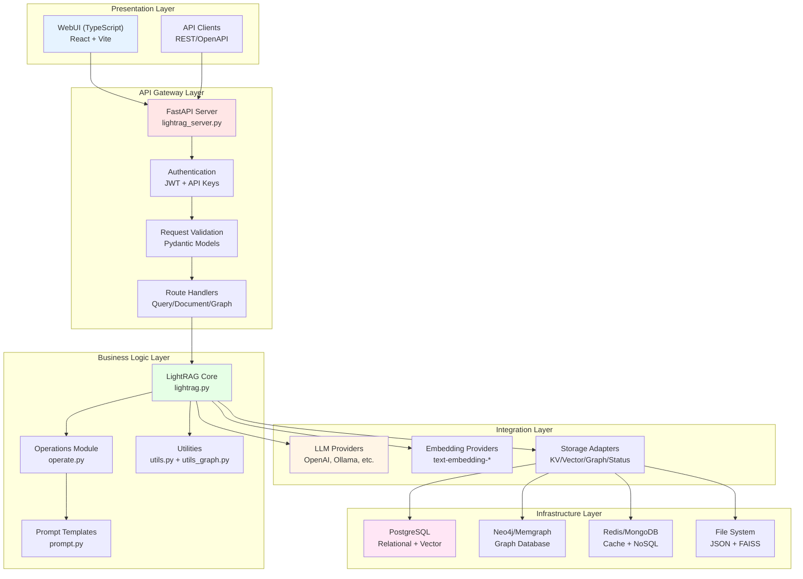
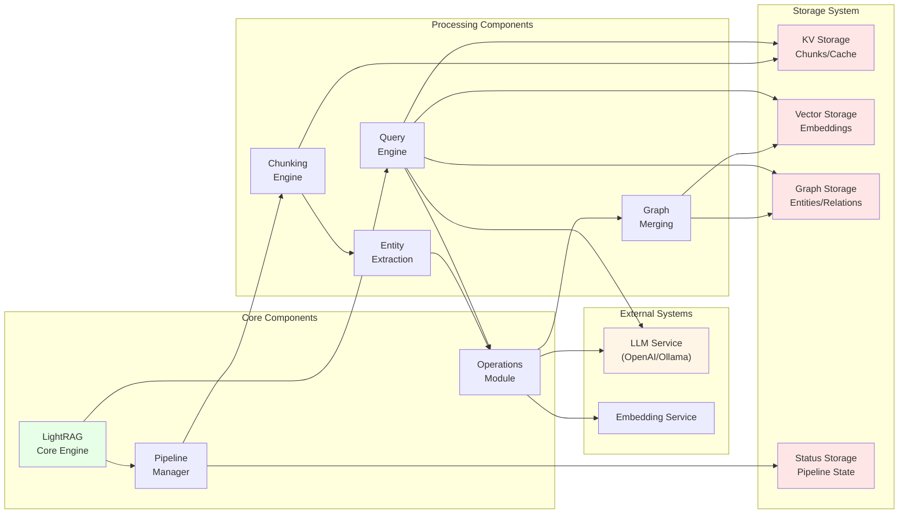
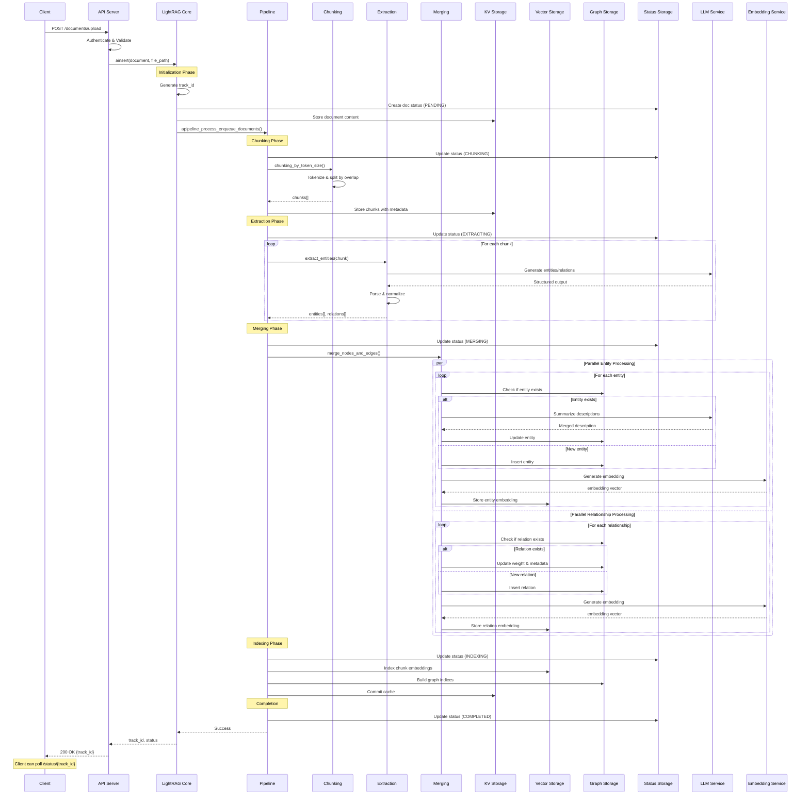
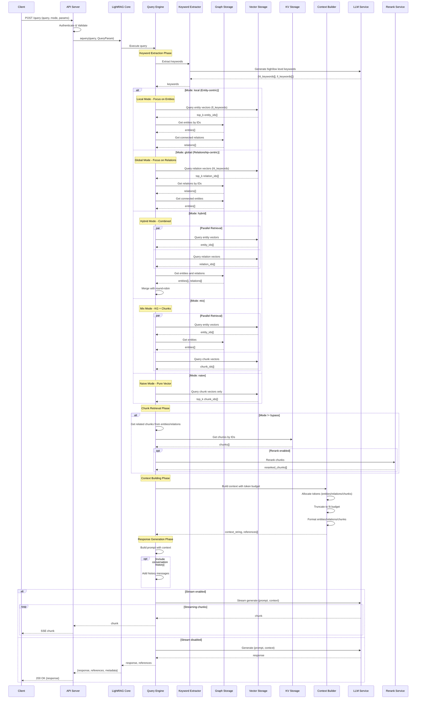
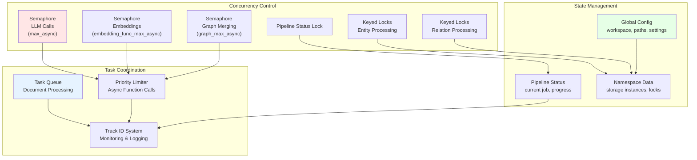

# Architecture Documentation: LightRAG System Design

## Table of Contents
1. [System Architecture Overview](#system-architecture-overview)
2. [Component Interaction Architecture](#component-interaction-architecture)
3. [Document Indexing Data Flow](#document-indexing-data-flow)
4. [Query Processing Data Flow](#query-processing-data-flow)
5. [Storage Layer Architecture](#storage-layer-architecture)
6. [Concurrency and State Management](#concurrency-and-state-management)

## System Architecture Overview

LightRAG follows a layered architecture pattern with clear separation of concerns. The system is structured into five primary layers, each with specific responsibilities and well-defined interfaces.

### Layer Responsibilities

**Presentation Layer**: Handles user interactions through a React-based WebUI and provides REST API client capabilities. Responsible for rendering data, handling user input, and managing client-side state. Written in TypeScript with React, this layer communicates with the API Gateway exclusively through HTTP/HTTPS.

**API Gateway Layer**: Manages all external communication with the system. Implements authentication and authorization using JWT tokens and API keys, validates incoming requests using Pydantic models, handles rate limiting, and routes requests to appropriate handlers. Built with FastAPI, it provides automatic OpenAPI documentation and request/response validation.

**Business Logic Layer**: Contains the core intelligence of LightRAG. The LightRAG class orchestrates all operations, managing document processing pipelines, query execution, and storage coordination. The Operations module handles entity extraction, graph merging, and retrieval algorithms. Utilities provide helper functions for text processing, tokenization, hashing, and caching. Prompt templates define structured prompts for LLM interactions.

**Integration Layer**: Abstracts external dependencies through consistent interfaces. LLM provider adapters normalize different API formats (OpenAI, Anthropic, Ollama, etc.) into a common interface. Embedding provider adapters handle various embedding services. Storage adapters implement the abstract storage interfaces (BaseKVStorage, BaseVectorStorage, BaseGraphStorage, DocStatusStorage) for different backends.

**Infrastructure Layer**: Provides the foundational data persistence and retrieval capabilities. Supports multiple database systems including PostgreSQL (with pgvector for vector storage), Neo4j and Memgraph (for graph storage), Redis and MongoDB (for caching and document storage), and file-based storage (JSON files, FAISS indexes) for development and small deployments.

## Component Interaction Architecture

This diagram illustrates how major components interact during typical operations, showing both document indexing and query execution flows.

### Component Interaction Patterns

**Document Ingestion Pattern**: Client submits documents to the API Gateway, which authenticates and validates the request before passing it to the LightRAG core. The core initializes a pipeline instance with a unique track ID, stores the document in KV storage, and updates its status in Status storage. The Pipeline Manager coordinates the chunking, extraction, merging, and indexing stages, maintaining progress information throughout.

**Entity Extraction Pattern**: The Operations module receives text chunks from the Pipeline Manager and constructs prompts using templates from prompt.py. These prompts are sent to the configured LLM service, which returns structured entity and relationship data. The Operations module parses the response, normalizes entity names, and prepares data for graph merging.

**Graph Merging Pattern**: When new entities and relationships are extracted, the Merge component compares them against existing graph data. For matching entities (based on name similarity), it consolidates descriptions, merges metadata, and updates source references. For relationships, it deduplicates based on source-target pairs and aggregates weights. The merged data is then stored in Graph storage and vector representations are computed and stored in Vector storage.

**Query Execution Pattern**: The Query Engine receives a user query and determines the appropriate retrieval strategy based on the query mode. It extracts high-level and low-level keywords using the LLM, retrieves relevant entities and relationships from Graph storage, fetches related chunks from Vector storage, builds a context respecting token budgets, and finally generates a response using the LLM with the assembled context.

## Document Indexing Data Flow

This sequence diagram details the complete flow of document processing from ingestion to indexing.

### Indexing Phase Details

**Document Reception and Validation**: The API server receives the document, validates the file format and size, authenticates the request, and generates a unique track ID for monitoring. The document content is immediately stored in KV storage with metadata including file path, upload timestamp, and original filename.

**Chunking Strategy**: Documents are split into overlapping chunks using a token-based approach. The system tokenizes the entire document using tiktoken, creates chunks of configurable size (default 1200 tokens), adds overlap between consecutive chunks (default 100 tokens) to preserve context, and stores each chunk with position metadata and references to the source document.

**Entity and Relationship Extraction**: For each chunk, the system constructs a specialized prompt that instructs the LLM to identify entities with specific types and relationships between them. The LLM returns structured output in a specific format (entity|name|type|description for entities, relation|source|target|keywords|description for relationships). The system parses this output, normalizes entity names using case-insensitive matching, and validates the structure before proceeding.

**Graph Construction and Merging**: New entities are compared against existing entities in the graph using fuzzy matching. When duplicates are found, descriptions are merged using either LLM-based summarization (for complex cases) or simple concatenation (for simple cases). Relationships are deduplicated based on source-target pairs, with weights aggregated when duplicates are found. All graph modifications are protected by keyed locks to ensure consistency in concurrent operations.

**Vector Embedding Generation**: Entity descriptions, relationship descriptions, and chunk content are sent to the embedding service in batches for efficient processing. Embeddings are generated using the configured model (e.g., text-embedding-3-small for OpenAI), and vectors are stored in Vector storage with metadata linking back to their source entities, relationships, or chunks. The system uses semaphores to limit concurrent embedding requests and prevent rate limit errors.

**Status Tracking Throughout**: Every stage updates the document status in Status storage, recording the current phase, progress percentage, error messages if any, and timing information. This enables clients to poll for progress and provides diagnostic information for debugging failed indexing operations.

## Query Processing Data Flow

This sequence diagram illustrates the retrieval and response generation process for different query modes.

### Query Processing Phase Details

**Keyword Extraction Phase**: The system sends the user query to the LLM with a specialized prompt that asks for high-level keywords (abstract concepts and themes) and low-level keywords (specific entities and terms). The LLM returns structured JSON with both keyword types, which guide the subsequent retrieval strategy. This two-level keyword approach enables the system to retrieve both broad contextual information and specific detailed facts.

**Mode-Specific Retrieval Strategies**: 

*Local Mode* focuses on entity-centric retrieval by querying the vector storage using low-level keywords to find the most relevant entities, retrieving full entity details including descriptions and metadata, and then fetching all relationships connected to those entities. This mode is optimal for questions about specific entities or localized information.

*Global Mode* emphasizes relationship-centric retrieval by querying vector storage using high-level keywords to find relevant relationships, retrieving relationship details including keywords and descriptions, and then fetching the entities connected by those relationships. This mode excels at questions about connections, patterns, and higher-level concepts.

*Hybrid Mode* combines both approaches by running local and global retrieval in parallel and then merging results using a round-robin strategy to balance entity and relationship information. This provides comprehensive coverage for complex queries that require both types of information.

*Mix Mode* integrates knowledge graph retrieval with direct chunk retrieval by querying entity vectors to get graph-based context, simultaneously querying chunk vectors for relevant document sections, and combining both types of results. This mode provides the most complete context by including both structured knowledge and raw document content.

*Naive Mode* performs pure vector similarity search without using the knowledge graph, simply retrieving the most similar chunks based on embedding distance. This mode is fastest and works well for simple similarity-based retrieval without needing entity or relationship context.

*Bypass Mode* skips retrieval entirely and sends the query directly to the LLM, useful for general questions that don't require specific document context or when testing the LLM's base knowledge.

**Context Building with Token Budgets**: The system implements a sophisticated token budget management system that allocates a maximum number of tokens across different context components. It allocates tokens to entity descriptions (default 6000 tokens), relationship descriptions (default 8000 tokens), and chunk content (remaining budget, with a cap defined by chunk_top_k). The system truncates each component to fit within its budget using the tokenizer, prioritizing higher-ranked items when truncation is necessary, and ensures the total context doesn't exceed the max_total_tokens limit (default 30000 tokens).

**Reranking for Improved Relevance**: When enabled, the reranking phase takes retrieved chunks and reranks them using a specialized reranking model (like Cohere rerank or Jina rerank). This cross-encoder approach provides more accurate relevance scoring than pure vector similarity, especially for semantic matching. Chunks below the minimum rerank score threshold are filtered out, and only the top-k chunks after reranking are included in the final context.

**Response Generation with Streaming**: For streaming responses, the system establishes a connection to the LLM with stream=True, receives response tokens incrementally, and immediately forwards them to the client via Server-Sent Events (SSE). This provides real-time feedback to users and reduces perceived latency. For non-streaming responses, the system waits for the complete LLM response before returning it to the client along with metadata about entities, relationships, and chunks used in the context.

## Storage Layer Architecture

The storage layer implements a plugin architecture with abstract base classes defining the contract for each storage type.

```mermaid
graph TB
    subgraph "Abstract Interfaces"
        BASE["StorageNameSpace<br/>(Base Class)"]
        KV_BASE["BaseKVStorage"]
        VEC_BASE["BaseVectorStorage"]
        GRAPH_BASE["BaseGraphStorage"]
        STATUS_BASE["DocStatusStorage"]
    end
    
    subgraph "KV Storage Implementations"
        JSON_KV["JsonKVStorage<br/>(File-based)"]
        PG_KV["PGKVStorage<br/>(PostgreSQL)"]
        MONGO_KV["MongoKVStorage<br/>(MongoDB)"]
        REDIS_KV["RedisKVStorage<br/>(Redis)"]
    end
    
    subgraph "Vector Storage Implementations"
        NANO["NanoVectorDBStorage<br/>(In-memory)"]
        FAISS["FaissVectorDBStorage<br/>(FAISS)"]
        PG_VEC["PGVectorStorage<br/>(pgvector)"]
        MILVUS["MilvusVectorStorage<br/>(Milvus)"]
        QDRANT["QdrantVectorStorage<br/>(Qdrant)"]
    end
    
    subgraph "Graph Storage Implementations"
        NX["NetworkXStorage<br/>(NetworkX)"]
        NEO4J["Neo4jStorage<br/>(Neo4j)"]
        MEMGRAPH["MemgraphStorage<br/>(Memgraph)"]
        PG_GRAPH["PGGraphStorage<br/>(PostgreSQL)"]
    end
    
    subgraph "Doc Status Implementations"
        JSON_STATUS["JsonDocStatusStorage<br/>(File-based)"]
        PG_STATUS["PGDocStatusStorage<br/>(PostgreSQL)"]
        MONGO_STATUS["MongoDocStatusStorage<br/>(MongoDB)"]
    end
    
    BASE --> KV_BASE
    BASE --> VEC_BASE
    BASE --> GRAPH_BASE
    BASE --> STATUS_BASE
    
    KV_BASE --> JSON_KV
    KV_BASE --> PG_KV
    KV_BASE --> MONGO_KV
    KV_BASE --> REDIS_KV
    
    VEC_BASE --> NANO
    VEC_BASE --> FAISS
    VEC_BASE --> PG_VEC
    VEC_BASE --> MILVUS
    VEC_BASE --> QDRANT
    
    GRAPH_BASE --> NX
    GRAPH_BASE --> NEO4J
    GRAPH_BASE --> MEMGRAPH
    GRAPH_BASE --> PG_GRAPH
    
    STATUS_BASE --> JSON_STATUS
    STATUS_BASE --> PG_STATUS
    STATUS_BASE --> MONGO_STATUS
    
    style BASE fill:#E6FFE6
    style JSON_KV fill:#E6F3FF
    style NANO fill:#FFE6E6
    style NX fill:#FFF5E6
    style JSON_STATUS fill:#FFE6F5
```

### Storage Interface Contracts

**BaseKVStorage Interface**: Key-value storage manages cached data, text chunks, and full documents. Core methods include get_by_id(id) for retrieving a single value, get_by_ids(ids) for batch retrieval, filter_keys(keys) to check which keys don't exist, upsert(data) for inserting or updating entries, delete(ids) for removing entries, and index_done_callback() for persisting changes to disk. This interface supports both in-memory implementations with persistence and direct database implementations.

**BaseVectorStorage Interface**: Vector storage handles embeddings for entities, relationships, and chunks. Core methods include query(query, top_k, query_embedding) for similarity search, upsert(data) for storing vectors with metadata, delete(ids) for removing vectors, delete_entity(entity_name) for removing entity-related vectors, delete_entity_relation(entity_name) for removing relationship vectors, get_by_id(id) and get_by_ids(ids) for retrieving full vector data, and get_vectors_by_ids(ids) for efficient vector-only retrieval. All implementations must support cosine similarity search and metadata filtering.

**BaseGraphStorage Interface**: Graph storage maintains the entity-relationship graph structure. Core methods include has_node(node_id) and has_edge(source, target) for existence checks, node_degree(node_id) and edge_degree(src, tgt) for connectivity metrics, get_node(node_id) and upsert_node(node_id, data) for node operations, upsert_edge(source, target, data) for relationship operations, get_knowledge_graph(node_label, max_depth, max_nodes) for graph traversal and export, and delete operations for nodes and edges. The interface treats all relationships as undirected unless explicitly specified.

**DocStatusStorage Interface**: Document status storage tracks processing pipeline state for each document. Core methods include upsert(status) for updating document status, get_by_id(doc_id) for retrieving status, get_by_ids(doc_ids) for batch retrieval, filter_ids(doc_ids) for checking existence, delete(doc_ids) for cleanup, get_by_status(status) for finding documents in a specific state, and count_by_status() for pipeline metrics. This enables comprehensive monitoring and recovery of document processing operations.

### Storage Implementation Patterns

**File-Based Storage (JSON)**: Simple implementations store data in JSON files with in-memory caching for performance. All modifications are held in memory until index_done_callback() triggers a write to disk. These implementations are suitable for development, small deployments, and single-process scenarios. They provide atomic writes using temporary files and rename operations, handle concurrent access through file locking, and support workspace isolation through directory structure.

**PostgreSQL Storage**: Comprehensive implementations that leverage PostgreSQL's capabilities including JSON columns for flexible metadata, pgvector extension for vector similarity search, advisory locks for distributed coordination, connection pooling for performance, and transaction support for consistency. PostgreSQL implementations can handle all four storage types in a single database, simplifying deployment and backup. They support multi-tenant deployments through schema-based isolation and provide excellent performance for mixed workloads.

**Specialized Vector Databases**: Dedicated vector storage implementations like FAISS, Milvus, and Qdrant provide optimized vector similarity search with features like approximate nearest neighbor (ANN) search, GPU acceleration for large-scale similarity search, advanced indexing strategies (IVF, HNSW), and high-performance batch operations. These are recommended for deployments with large document sets (>1M chunks) or high query throughput requirements.

**Graph Databases (Neo4j/Memgraph)**: Specialized graph implementations optimize graph traversal and pattern matching with native graph storage and indexing, Cypher query language for complex graph queries, visualization capabilities for knowledge graph exploration, and optimized algorithms for shortest path, centrality, and community detection. These are ideal for use cases requiring complex graph analytics and when graph visualization is a primary feature.

## Concurrency and State Management

LightRAG implements sophisticated concurrency control to handle parallel document processing and query execution.

### Concurrency Patterns

**Semaphore-Based Rate Limiting**: The system uses asyncio semaphores to limit concurrent operations and prevent overwhelming external services or exhausting resources. Different semaphores control different types of operations: LLM calls are limited by max_async (default 4), embedding function calls by embedding_func_max_async (default 8), and graph merging operations by graph_max_async (calculated as llm_model_max_async * 2). These semaphores ensure respectful API usage and prevent rate limit errors.

**Keyed Locks for Data Consistency**: When processing entities and relationships concurrently, the system uses keyed locks to ensure that multiple processes don't modify the same entity or relationship simultaneously. Each entity or relationship gets a unique lock based on its identifier, preventing race conditions during graph merging while still allowing parallel processing of different entities. This pattern enables high concurrency without sacrificing data consistency.

**Pipeline Status Tracking**: A shared pipeline status object tracks the current state of document processing including the active job name, number of documents being processed, current batch number, latest status message, and history of messages for debugging. This status is protected by an async lock and can be queried by clients to monitor progress. The status persists across the entire pipeline and provides visibility into long-running operations.

**Workspace Isolation**: The workspace concept provides multi-tenant isolation by prefixing all storage namespaces with a workspace identifier. Different workspaces maintain completely separate data including separate storage instances, independent configuration, isolated locks and semaphores, and separate pipeline status. This enables running multiple LightRAG instances in the same infrastructure without interference.

### TypeScript Migration Considerations for Concurrency

**Semaphore Implementation**: Node.js doesn't have built-in semaphores, but the pattern can be implemented using the p-limit library, which provides similar functionality with a cleaner API. Example: `const limiter = pLimit(4); await limiter(() => callLLM())`.

**Keyed Locks**: For single-process deployments, a Map<string, Promise> can implement keyed locks. For multi-process deployments, consider using Redis with the Redlock algorithm or a dedicated lock service. The key insight is ensuring that operations on the same entity/relationship are serialized while different entities can be processed in parallel.

**Shared State Management**: Python's global dictionaries need to be replaced with class-based state management in TypeScript. For multi-process deployments, shared state should be externalized to Redis or a similar store. For single-process deployments, singleton classes can manage state with proper TypeScript visibility controls.

**Pipeline Status Updates**: Real-time status updates can be implemented using EventEmitter in Node.js for in-process communication, or Redis Pub/Sub for multi-process scenarios. WebSocket connections can provide real-time updates to clients without polling.

## Summary

This architecture documentation provides a comprehensive view of LightRAG's design, from high-level layer organization to detailed component interactions and concurrency patterns. The system's modular design, with clear interfaces and abstractions, makes it well-suited for migration to TypeScript. The key architectural principles—layered separation of concerns, plugin-based storage abstraction, async-first concurrency, and comprehensive state tracking—translate well to TypeScript and Node.js idioms.

The subsequent documentation sections build on this architectural foundation, providing detailed specifications for data models, storage implementations, LLM integrations, and API contracts. Together, these documents form a complete blueprint for implementing a production-ready TypeScript version of LightRAG.
